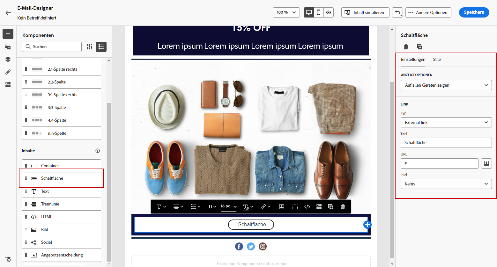
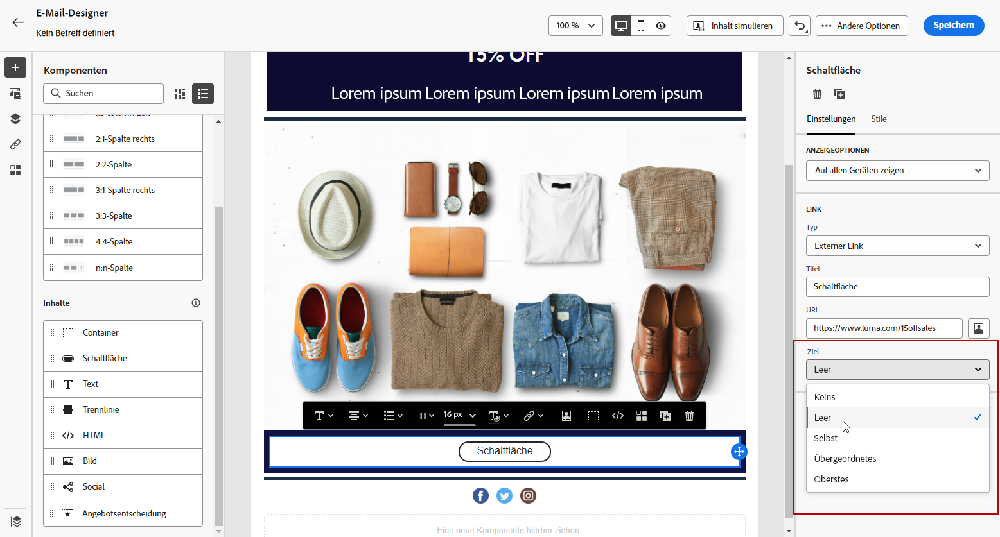
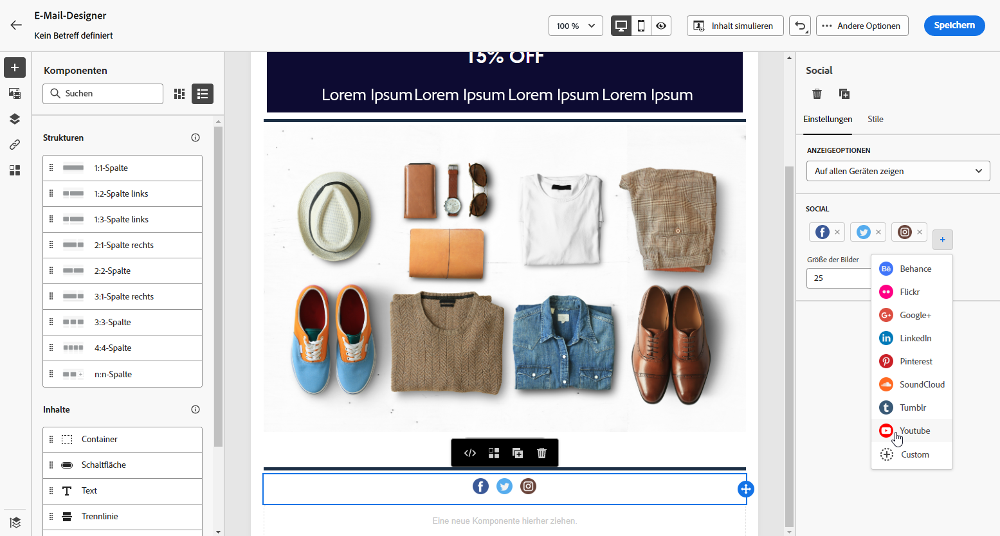

# Verwenden der Inhaltskomponenten des E-Mail-Designers {#content-components}

>[!CONTEXTUALHELP]
>id="ac_content_components_email"
>title="Über Inhaltskomponenten"
>abstract="Inhaltskomponenten sind leere Platzhalter für Inhalt, die Sie zum Erstellen des E-Mail-Layouts verwenden können."

>[!CONTEXTUALHELP]
>id="ac_content_components_landing_page"
>title="Über Inhaltskomponenten"
>abstract="Inhaltskomponenten sind leere Platzhalter für Inhalte, mit denen Sie das Layout einer Landingpage erstellen können."

>[!CONTEXTUALHELP]
>id="ac_content_components_fragment"
>title="Über Inhaltskomponenten"
>abstract="Inhaltskomponenten sind leere Platzhalter für Inhalte, die Sie zum Erstellen eines Fragment-Layouts verwenden können."

>[!CONTEXTUALHELP]
>id="ac_content_components_template"
>title="Über Inhaltskomponenten"
>abstract="Inhaltskomponenten sind leere Platzhalter für Inhalte, die Sie zum Erstellen eines Vorlagen-Layouts verwenden können."

Bei der Erstellung von E-Mail-Inhalt ermöglichen **[!UICONTROL Inhaltskomponenten]** die Personalisierung Ihrer E-Mail mit unbearbeiteten Komponenten. Diese können nach dem Einfügen in eine E-Mail bearbeitet werden.

Sie können beliebig viele Strukturkomponenten zu einer oder mehreren Strukturkomponenten hinzufügen. Diese definieren das Layout Ihrer E-Mail.

## Hinzufügen von Inhaltskomponenten {#add-content-components}

Um zu Ihrer E-Mail Inhaltskomponenten hinzuzufügen und sie an Ihre Anforderungen anzupassen, führen Sie die folgenden Schritte aus.

1. Verwenden Sie zum Definieren des Layouts Ihrer E-Mail einen vorhandenen Inhalt im E-Mail-Designer oder platzieren Sie per Drag-and-Drop **[!UICONTROL Strukturkomponenten]** in leerem Inhalt.
[Weitere Informationen](content-from-scratch.md)

1. Um auf den Abschnitt **[!UICONTROL Inhaltskomponenten]** zuzugreifen, wählen Sie die entsprechende Schaltfläche im linken Fensterbereich des E-Mail-Designers aus.

   

1. Platzieren Sie die Inhaltskomponenten Ihrer Wahl mittels Drag-and-Drop in den relevanten Strukturkomponenten.

   

   >[!NOTE]
   >
   >Sie können zu einer einzelnen Strukturkomponente und zu jeder Spalte einer Strukturkomponente mehrere Komponenten hinzufügen.

1. Passen Sie die Attribute und Stile für jede Komponente mit den Registerkarten **[!UICONTROL Einstellungen]** und **[!UICONTROL Stil]** auf der rechten Seite an. Beispielsweise können Sie den Textstil, den Abstand oder den Rand jeder Komponente ändern. [Erfahren Sie mehr über Ausrichtung und Abstand](alignment-and-padding.md)

   

1. Im erweiterten Menü Ihrer **[!UICONTROL Inhaltskomponente]** können Sie bei Bedarf mühelos alle Inhaltskomponenten löschen oder duplizieren.

   

## Container {#container}

Um bestimmte Stile auf eine Gruppe von Inhaltskomponenten anzuwenden, können Sie einen **[!UICONTROL Container]** und dann darin Ihre gewünschten Inhaltskomponenten hinzufügen. Auf diese Weise können Sie einen eigenen Stil auf den Container anwenden, der sich vom Stil unterscheidet, der auf die Inhaltskomponenten in diesem Container angewendet wird.

Fügen Sie beispielsweise die Komponente **[!UICONTROL Container]** hinzu, und fügen Sie anschließend die Komponente [Schaltfläche](#button) innerhalb dieses Containers hinzu. Sie können einen bestimmten Hintergrund für den Container und einen anderen für die Schaltfläche verwenden.

## Schaltfläche {#button}

Verwenden Sie die Komponente **[!UICONTROL Schaltfläche]**, um eine oder mehrere Schaltflächen in Ihre E-Mail einzufügen und Ihre E-Mail-Audience auf eine andere Seite weiterzuleiten.

1. Platzieren Sie in **[!UICONTROL Inhaltskomponenten]** die Komponente **[!UICONTROL Schaltfläche]** per Drag-and-Drop in eine **[!UICONTROL Strukturkomponente]**.

1. Klicken Sie auf die neu hinzugefügte Schaltfläche, um den Text anzupassen und auf die Registerkarten **[!UICONTROL Einstellungen]** und **[!UICONTROL Stile]** im rechten Bereich des E-Mail-Designers zugreifen zu können.

   

1. Fügen Sie aus dem Feld **[!UICONTROL Link]** die URL hinzu, zu der Sie beim Anklicken der Schaltfläche weiterleiten möchten.

1. Wählen Sie mit der Dropdown-Liste **[!UICONTROL Zielgruppe]** aus, wie Ihre Audience umgeleitet werden soll:

   * **[!UICONTROL None]**: öffnet den Link in demselben Frame, in dem er angeklickt wurde (Standardwert).
   * **[!UICONTROL Blank]**: öffnet den Link in einem neuen Fenster oder auf einer neuen Registerkarte.
   * **[!UICONTROL Self]**: öffnet den Link in demselben Frame, in dem er angeklickt wurde.
   * **[!UICONTROL Parent]**: öffnet den Link im übergeordneten Frame.
   * **[!UICONTROL Top]**: öffnet den Link im gesamten Fenster.

   

1. Sie können Ihre Schaltfläche weiter personalisieren, indem Sie Stilattribute wie etwa **[!UICONTROL Rahmen]**, **[!UICONTROL Größe]** und **[!UICONTROL Rand]** im Bereich **[!UICONTROL Komponenteneinstellungen]** ändern.

## Text {#text}

Verwenden Sie die Komponente **[!UICONTROL Text]**, um Text in Ihre E-Mail einzufügen und den Stil (Rahmen, Größe, Abstand usw.) mithilfe der Registerkarte **[!UICONTROL Stile]**.

1. Platzieren Sie die Komponente **[!UICONTROL Text]** in **[!UICONTROL Inhaltskomponenten]** per Drag-and-Drop in eine **[!UICONTROL Strukturkomponente]**.

1. Klicken Sie auf die neu hinzugefügte Komponente, um den Text zu personalisieren und um Zugriff auf die Registerkarten **[!UICONTROL Einstellungen]** und **[!UICONTROL Stile]** im rechten Bereich des E-Mail-Designers zu erhalten.

1. Ändern Sie den Text mit folgenden Optionen in der Symbolleiste:

   

   * **[!UICONTROL Textstil ändern]**: Anwendung von Fett, Kursiv, Unterstrichen oder Durchgestrichen auf den Text.
   * **Ausrichtung ändern**: Auswahl von linker, rechter, zentrierter oder Blocksatz-Ausrichtung für Ihren Text.
   * **[!UICONTROL Liste erstellen]**: Einfügen einer Liste mit Aufzählungszeichen oder Nummerierung.
   * **[!UICONTROL Überschrift festlegen]**: Definition von bis zu sechs Überschriftsebenen in Ihrem Text.
   * **Schriftgröße**: Auswahl der Schriftgröße des Textes in Pixel.
   * **[!UICONTROL Textfarbe ändern]**: Wählen Sie die Schriftfarbe aus.
   * **[!UICONTROL Link einfügen]**: Fügen Sie Links jeder Art zu Ihrem Inhalt hinzu.
   * **[!UICONTROL Bild bearbeiten]**: Einfügen eines Bildes oder Assets in Ihre Textkomponente. [Weitere Informationen über das Asset-Management](../content-management/assets-essentials.md)
   * **[!UICONTROL Textfarbe ändern]**: Wählen Sie die Schriftfarbe aus.
   * **[!UICONTROL Personalisierung hinzufügen]**: Einfügen von Personalisierungsfeldern zur Inhaltsanpassung auf der Basis von Profildaten. [Weitere Informationen über die Personalisierung von Inhalten](../personalization/personalize.md)
   * **[!UICONTROL Quellcode anzeigen]**: Anzeigen des Quell-Codes Ihres Textes (keine Änderungen möglich).
   * **[!UICONTROL Bedingten Inhalt aktivieren]**: Fügen Sie bedingte Inhalte hinzu, um den Inhalt der Komponente an die Zielprofile anzupassen. [Erfahren Sie mehr über dynamische Inhalte](../personalization/get-started-dynamic-content.md)
   * **[!UICONTROL Duplizieren]**: Hinzufügen einer Kopie Ihrer Textkomponente.
   * **[!UICONTROL Löschen]**: Entfernen einer ausgewählten Textkomponente aus Ihrer E-Mail.

1. Passen Sie die anderen Stilattribute wie Textfarbe, Schriftfamilie, Rahmen, Abstand, Rand usw. auf der Registerkarte **[!UICONTROL Stile]** an.

   

## Trennlinie {#divider}

Verwenden Sie die Komponente **[!UICONTROL Trennlinie]**, um das Layout und den Inhalt Ihrer E-Mail durch eine Trennlinie zu strukturieren.

Sie können Stilattribute wie Linienfarbe, Stil und Höhe auf den Registerkarten **[!UICONTROL Einstellungen]** und **[!UICONTROL Stile]** ändern.

## HTML {#HTML}

Verwenden Sie die **[!UICONTROL HTML]**-Komponente, um die unterschiedlichen Teile Ihres vorhandenen HTML-Inhalts zu kopieren und einzufügen. Damit können Sie kostenlose modulare HTML-Komponenten erstellen, um externe Inhalte wiederzuverwenden.

1. Ziehen Sie die **[!UICONTROL HTML]**-Komponente in den **[!UICONTROL Inhaltskomponenten]** per Drag-and-Drop in eine **[!UICONTROL Strukturkomponente]**.

1. Klicken Sie auf die neu hinzugefügte Komponente und dann auf **[!UICONTROL Quellcode anzeigen]** in der kontextuellen Symbolleiste, um Ihren HTML-Code hinzuzufügen.

   

1. Kopieren Sie den HTML-Code, den Sie Ihrer E-Mail hinzufügen möchten, und fügen Sie ihn ein, und klicken Sie auf **[!UICONTROL Speichern]**.

   

>[!NOTE]
>
>Um die Kompatibilität von externem Inhalt mit dem E-Mail-Designer zu gewährleisten, empfiehlt Adobe, eine neue Nachricht zu erstellen und den Inhalt aus der existierenden E-Mail in Komponenten einzufügen.

## Bild {#image}

Verwenden Sie die Komponente **[!UICONTROL Bild]**, um eine Bilddatei von Ihrem Computer in Ihre E-Mail einzufügen.

1. Ziehen Sie die Komponente **[!UICONTROL Bild]** in den **[!UICONTROL Inhaltskomponenten]** per Drag-and-Drop in eine **[!UICONTROL Strukturkomponente]**.

   

1. Klicken Sie auf **[!UICONTROL Durchsuchen]**, um eine in Ihren Assets gespeicherte Bilddatei auszuwählen.

   Weitere Informationen zu [!DNL Assets Essentials] finden Sie in der [Dokumentation zu Adobe Experience Manager Assets Essentials](https://experienceleague.adobe.com/docs/experience-manager-assets-essentials/help/introduction.html?lang=de){target="_blank"}.

1. Klicken Sie auf die neu hinzugefügte Komponente und richten Sie Ihre Bildeigenschaften auf der Registerkarte **[!UICONTROL Einstellungen]** ein:

   * **[!UICONTROL Bildtitel]** erlaubt Ihnen, den Titel für das Bild zu definieren.
   * Mit **[!UICONTROL Alt-Text]** legen Sie die Bildunterschrift fest. Dies entspricht dem HTML-Attribut „alt“.

   

1. Sie können auch **[!UICONTROL Nach ähnlichen Stockfotos suchen]**. [Weitere Informationen](../content-management/stock.md)

1. Passen Sie auf der Registerkarte **[!UICONTROL Stile]** die anderen Stilattribute wie Rand, Rahmen usw. an oder fügen Sie einen Link hinzu, um Ihre Audience zu einem anderen Inhalt über das Bedienfeld **[!UICONTROL Komponenteneinstellungen]** weiterzuleiten.

## Social Media {#social}

Verwenden Sie die Komponente **[!UICONTROL Social]**, um Links zu Social-Media-Seiten in Ihre E-Mail einzufügen.

1. Ziehen Sie die Komponente **[!UICONTROL Social]** von den **[!UICONTROL Inhaltskomponenten]** in eine **[!UICONTROL Strukturkomponente]**.

1. Klicken Sie auf die neu hinzugefügte Komponente.

1. Im Feld **[!UICONTROL Social]** der Registerkarte **[!UICONTROL Einstellungen]** können Sie auswählen, welche sozialen Medien Sie hinzufügen oder entfernen möchten.

   

1. Wählen Sie die Größe Ihrer Symbole im entsprechenden Feld aus.

1. Klicken Sie auf jedes Ihrer Social-Media-Symbole, um die **[!UICONTROL URL]** zu konfigurieren, zu der Ihre Audience weitergeleitet wird.

   

1. Bei Bedarf können Sie auch die Symbole der einzelnen sozialen Medien über Ihre Assets ändern. 

1. Passen Sie die anderen Stilattribute wie Stil, Rand, Rahmen usw. auf der Registerkarte **[!UICONTROL Stile]** an.

## Angebotsentscheidung {#offer-decision}

Verwenden Sie die Komponente **[!UICONTROL Angebotsentscheidung]**, um Angebote in Ihre Nachrichten einzufügen. Die [Entscheidungs-Management](../offers/get-started/starting-offer-decisioning.md)-Engine wählt das beste Angebot aus, das Sie Ihren Kunden unterbreiten können.

1. Ziehen Sie aus den **[!UICONTROL Inhaltskomponenten]** die Komponente **[!UICONTROL Angebotsentscheidung]** per Drag-and-Drop in eine **[!UICONTROL Strukturkomponente]**.

1. Klicken Sie auf **[!UICONTROL Hinzufügen]**, um Ihre **[!UICONTROL Angebotsentscheidung]** auszuwählen.

   

1. Wählen Sie aus der Dropdown-Liste Ihre **[!UICONTROL Platzierungen]** aus.  Wählen Sie anschließend die **[!UICONTROL Angebotsentscheidung]** aus, zu der Sie Inhalte hinzufügen möchten, und klicken Sie auf **[!UICONTROL Hinzufügen]**.

   

1. Auf der Registerkarte **[!UICONTROL Angebotsentscheidung]** können Sie das eingefügte Angebot in der Vorschau anzeigen oder ändern.

Weitere Informationen dazu, wie Sie einer E-Mail personalisierte Angebote hinzufügen können, finden Sie in [diesem Abschnitt](add-offers-email.md).

>[!IMPORTANT]
>
>Wenn Änderungen an einer Angebotsentscheidung vorgenommen werden, die in einer Journey-Nachricht verwendet wird, müssen Sie die Veröffentlichung der Journey aufheben und sie dann erneut veröffentlichen.  Dadurch wird sichergestellt, dass die Änderungen in die Journey aufgenommen werden und die Nachricht den neuesten Aktualisierungen entspricht.
