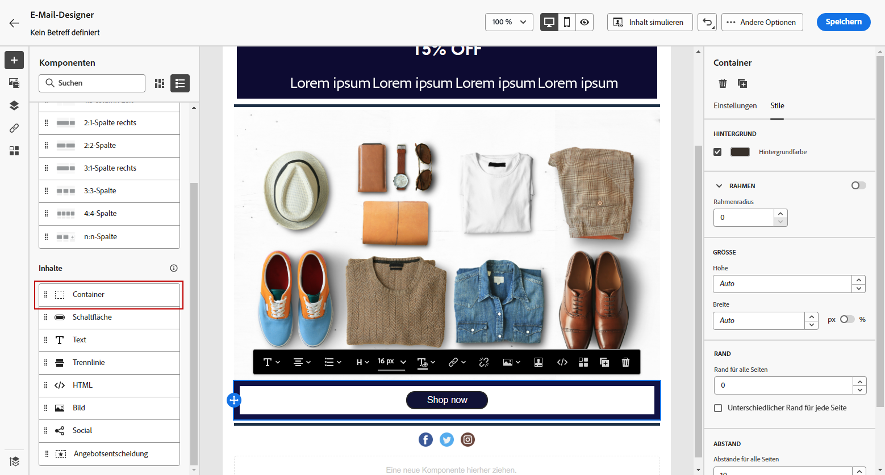
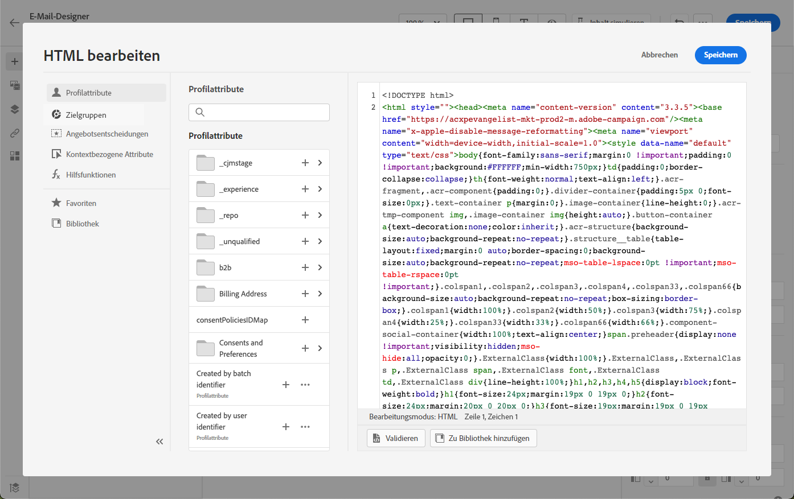
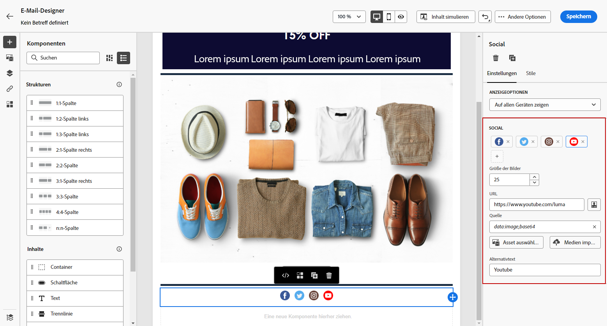

# Verwenden der Inhaltskomponenten von Email Designer {#content-components}

>[!CONTEXTUALHELP]
>id="ac_content_components_email"
>title="Über Inhaltskomponenten"
>abstract="Inhaltskomponenten sind leere Platzhalter für Inhalte, mit denen Sie das Layout einer E-Mail erstellen können."

>[!CONTEXTUALHELP]
>id="ac_content_components_landing_page"
>title="Über Inhaltskomponenten"
>abstract="Inhaltskomponenten sind leere Platzhalter für Inhalte, mit denen Sie das Layout einer Landingpage erstellen können."

>[!CONTEXTUALHELP]
>id="ac_content_components_fragment"
>title="Über Inhaltskomponenten"
>abstract="Inhaltskomponenten sind leere Platzhalter für Inhalte, mit denen Sie das Layout eines Fragments erstellen können."

>[!CONTEXTUALHELP]
>id="ac_content_components_template"
>title="Über Inhaltskomponenten"
>abstract="Inhaltskomponenten sind leere Platzhalter für Inhalte, mit denen Sie das Layout einer Vorlage erstellen können."

Wenn Sie E-Mail-Inhalt erstellen, **[!UICONTROL Content components]** ermöglicht Ihnen die weitere Personalisierung Ihrer E-Mail mit Rohkomponenten, die Sie bearbeiten können, sobald sie in einer E-Mail platziert wurden.

Sie können innerhalb einer oder mehrerer Strukturkomponenten beliebig viele Inhaltskomponenten hinzufügen, die das Layout Ihrer E-Mail definieren.

## Inhaltskomponenten hinzufügen {#add-content-components}

Gehen Sie wie folgt vor, um Ihrer E-Mail Inhaltskomponenten hinzuzufügen und sie an Ihre Anforderungen anzupassen.

1. Verwenden Sie in Email Designer einen vorhandenen Inhalt oder ziehen Sie ihn per Drag-and-Drop **[!UICONTROL Structure components]** in Ihren leeren Inhalt, um das Layout Ihrer E-Mail zu definieren. [Erfahren Sie mehr](content-from-scratch.md)

1. So greifen Sie auf die **[!UICONTROL Content components]** Wählen Sie die entsprechende Schaltfläche im linken Bereich von Email Designer aus.

   

1. Ziehen Sie die Inhaltskomponenten Ihrer Wahl in die relevanten Strukturkomponenten.

   

   >[!NOTE]
   >
   >Sie können mehrere Komponenten zu einer einzelnen Strukturkomponente und zu jeder Spalte einer Strukturkomponente hinzufügen.

1. Passen Sie die Stilattribute für jede Komponente mithilfe der **[!UICONTROL Component settings]** rechts. Sie können beispielsweise den Textstil, den Abstand oder den Rand jeder Komponente ändern. [Weitere Informationen zur Ausrichtung und zum Abstand](alignment-and-padding.md)

   

## Container {#container}

Sie können einen einfachen Container hinzufügen, in dem Sie eine weitere Inhaltskomponente hinzufügen können. Auf diese Weise können Sie einen bestimmten Stil auf den Container anwenden, der sich von der darin verwendeten Komponente unterscheidet.

Fügen Sie beispielsweise eine **[!UICONTROL Container]** und fügen Sie dann eine [Schaltfläche](#button) -Komponente innerhalb dieses Containers. Sie können einen bestimmten Hintergrund für den Container und einen weiteren für die Schaltfläche verwenden.

## Schaltfläche {#button}

Verwenden Sie die **[!UICONTROL Button]** -Komponente verwenden, um eine oder mehrere Schaltflächen in Ihre E-Mail einzufügen und Ihre E-Mail-Audience auf eine andere Seite umzuleiten.

1. Von **[!UICONTROL Content components]**, ziehen Sie die **[!UICONTROL Button]** in eine **[!UICONTROL Structure component]**.

1. Klicken Sie auf die neu hinzugefügte Schaltfläche, um den Text zu personalisieren und Zugriff auf die **[!UICONTROL Components settings]** im rechten Bereich von Email Designer.

   

1. Im **[!UICONTROL Link]** Fügen Sie die URL hinzu, zu der Sie umleiten möchten, wenn Sie auf die Schaltfläche klicken.

1. Wählen Sie aus, wie Ihre Zielgruppe mit der **[!UICONTROL Target]** Dropdown-Liste:

   * **[!UICONTROL None]**: öffnet den Link im selben Frame, in dem er angeklickt wurde (Standard).
   * **[!UICONTROL Blank]**: öffnet den Link in einem neuen Fenster oder auf einer neuen Registerkarte.
   * **[!UICONTROL Self]**: öffnet den Link im selben Frame, in dem er angeklickt wurde.
   * **[!UICONTROL Parent]**: öffnet den Link im übergeordneten Frame.
   * **[!UICONTROL Top]**: öffnet den Link im vollständigen Textkörper des Fensters.

   

1. Sie können Ihre Schaltfläche weiter personalisieren, indem Sie Stilattribute ändern, z. B. **[!UICONTROL Border]**, **[!UICONTROL Size]**, **[!UICONTROL Margin]**, usw. von **[!UICONTROL Component settings]** -Bereich.

## Text {#text}

Verwenden Sie die **[!UICONTROL Text]** -Komponente, um Text in Ihre E-Mail einzufügen und den Stil anzupassen (Rahmen, Größe, Abstand usw.) mithilfe der **[!UICONTROL Component settings]** -Bereich.

1. Von **[!UICONTROL Content components]**, ziehen Sie die **[!UICONTROL Text]** in eine **[!UICONTROL Structure component]**.

1. Klicken Sie auf die neu hinzugefügte Komponente, um den Text zu personalisieren und Zugriff auf die **[!UICONTROL Components Settings]** im rechten Bereich von Email Designer.

1. Ändern Sie den Text mit den folgenden in der Symbolleiste verfügbaren Optionen:

   

   * **[!UICONTROL Change text style]**: fett, kursiv, unterstrichen oder durchgestrichen auf Ihren Text anwenden.
   * **Ausrichtung ändern**: Wählen Sie für Ihren Text eine linke, rechte, mittlere oder ausgehende Ausrichtung.
   * **[!UICONTROL Create list]**: Fügen Sie Ihrem Text eine Aufzählungs- oder Zahlenliste hinzu.
   * **[!UICONTROL Set heading]**: Fügen Sie Ihrem Text bis zu sechs Überschriftenebenen hinzu.
   * **Schriftgröße**: Wählen Sie die Schriftgröße Ihres Textes in Pixel aus.
   * **[!UICONTROL Edit image]**: Fügen Sie Ihrer Textkomponente ein Bild oder ein Asset hinzu. [Weitere Informationen zur Asset-Verwaltung](assets-essentials.md)
   * **[!UICONTROL Show the source code]**: den Quellcode Ihres Textes anzeigen. Sie kann nicht geändert werden.
   * **[!UICONTROL Duplicate]**: Fügen Sie eine Kopie Ihrer Textkomponente hinzu.
   * **[!UICONTROL Delete]**: Löschen Sie die ausgewählte Textkomponente aus Ihrer E-Mail.
   * **[!UICONTROL Add personalization]**: Fügen Sie Personalisierungsfelder hinzu, um den Inhalt aus Ihren Profildaten anzupassen. [Weitere Informationen zur Personalisierung von Inhalten](../personalization/personalize.md)
   * **[!UICONTROL Enable conditional content]**: Fügen Sie bedingte Inhalte hinzu, um den Inhalt der Komponente an die Zielprofile anzupassen. [Erfahren Sie mehr über dynamische Inhalte](../personalization/get-started-dynamic-content.md)

1. Passen Sie die anderen Stilattribute wie Textfarbe, Schriftfamilie, Rahmen, Abstand, Rand usw. an. von **[!UICONTROL Component settings]** -Bereich.

## Trennlinie {#divider}

Verwenden Sie die **[!UICONTROL Divider]** -Komponente, um eine Trennlinie einzufügen, um das Layout und den Inhalt Ihrer E-Mail zu organisieren.

Sie können Stilattribute wie Zeilenfarbe, Stil und Höhe von **[!UICONTROL Component settings]** -Bereich.

## HTML {#HTML}

Verwenden Sie die **[!UICONTROL HTML]** -Komponente verwenden, um die verschiedenen Teile der vorhandenen HTML-Datei zu kopieren und einzufügen. Auf diese Weise können Sie kostenlose modulare HTML-Komponenten erstellen, um externe Inhalte wiederzuverwenden.

1. Von **[!UICONTROL Content Components]**, ziehen Sie die **[!UICONTROL HTML]** in eine **[!UICONTROL Structure component]**.

1. Klicken Sie auf die neu hinzugefügte Komponente und wählen Sie **[!UICONTROL Show the source code]** aus der dedizierten Symbolleiste, um Ihren HTML-Code hinzuzufügen.

   

1. Kopieren Sie den HTML-Code, den Sie Ihrer E-Mail hinzufügen möchten, und klicken Sie auf **[!UICONTROL Save]**.

   

>[!NOTE]
>
>Um einen externen Inhalt einfach mit Email Designer kompatibel zu machen, empfiehlt Adobe, eine Nachricht von Grund auf neu zu erstellen und den Inhalt aus Ihrer vorhandenen E-Mail in Komponenten zu kopieren.

## Bild {#image}

Verwenden Sie die **[!UICONTROL Image]** -Komponente, um eine Bilddatei von Ihrem Computer in Ihren E-Mail-Inhalt einzufügen.

1. Von **[!UICONTROL Content components]**, ziehen Sie die **[!UICONTROL Image]** in eine **[!UICONTROL Structure component]**.

1. Klicken **[!UICONTROL Browse]** , um eine Bilddatei aus Ihren Assets auszuwählen.

   Weitere Informationen finden Sie unter [!DNL Assets Essentials], siehe [Dokumentation zu Adobe Experience Manager Assets Essentials](https://experienceleague.adobe.com/docs/experience-manager-assets-essentials/help/introduction.html){target=&quot;_blank&quot;}.

1. Klicken Sie auf die neu hinzugefügte Komponente und richten Sie Ihre Bildeigenschaften mithilfe der **[!UICONTROL Components settings]** -Bereich:

   * **[!UICONTROL Image title]** ermöglicht die Definition eines Titels für das Bild.
   * **[!UICONTROL Alt text]** ermöglicht die Definition der Ihrem Bild zugeordneten Beschriftung. Dies entspricht dem alt-HTML-Attribut.

   

1. Passen Sie die anderen Stilattribute wie Rand, Rahmen usw. an. oder durch Hinzufügen eines Links zur Umleitung Ihrer Audience zu einem anderen Inhalt aus der **[!UICONTROL Component settings]** -Bereich.

## Video {#Video}

>[!CONTEXTUALHELP]
>id="ac_edition_video_email"
>title="Videoeinstellungen"
>abstract="Verwenden Sie diese Komponente, um ein Video in Ihre E-Mail einzufügen. Beachten Sie, dass Videos nicht in allen E-Mail-Clients funktionieren. Wir empfehlen, ein Fallback-Bild festzulegen."

>[!CONTEXTUALHELP]
>id="ac_edition_video_landing_page"
>title="Videoeinstellungen"
>abstract="Verwenden Sie diese Komponente, um ein Video in Ihre Landingpage einzufügen. Beachten Sie, dass Videos nicht in allen Nachrichten-Clients funktionieren. Wir empfehlen, ein Fallback-Bild festzulegen."

>[!CONTEXTUALHELP]
>id="ac_edition_video_fragment"
>title="Videoeinstellungen"
>abstract="Verwenden Sie diese Komponente, um ein Video in Ihr Fragment einzufügen. Beachten Sie, dass Videos nicht in allen Nachrichten-Clients funktionieren. Wir empfehlen, ein Fallback-Bild festzulegen."

>[!CONTEXTUALHELP]
>id="ac_edition_video_template"
>title="Videoeinstellungen"
>abstract="Verwenden Sie diese Komponente, um ein Video in Ihre Vorlage einzufügen. Beachten Sie, dass Videos nicht in allen Nachrichten-Clients funktionieren. Wir empfehlen, ein Fallback-Bild festzulegen."

Verwenden Sie die **[!UICONTROL Video]** -Komponente, um über einen URL-Link ein Video in Ihren E-Mail-Inhalt einzufügen.

1. Von **[!UICONTROL Content Components]**, ziehen Sie die **[!UICONTROL Video]** in eine **[!UICONTROL Structure component]**.

   

1. Klicken Sie auf die neu hinzugefügte Komponente.

1. Im **[!UICONTROL Video link]** des **[!UICONTROL Components settings]** hinzufügen, fügen Sie Ihre Video-URL hinzu.

   

1. Sie können eine **[!UICONTROL Poster image]** in Ihr Video ein, um ein Bild anzugeben, das angezeigt werden soll, bis Ihre Audience auf die Wiedergabeschaltfläche klickt.

1. Passen Sie die anderen Stilattribute wie Stil, Rand, Rahmen usw. an. von **[!UICONTROL Component settings]** -Bereich.

## Social {#social}

Verwenden Sie die **[!UICONTROL Social]** -Komponente, um Links zu Social-Media-Seiten in Ihren E-Mail-Inhalt einzufügen.

1. Von **[!UICONTROL Content Components]**, ziehen Sie die **[!UICONTROL Social]** in eine **[!UICONTROL Structure component]**.

1. Klicken Sie auf die neu hinzugefügte Komponente.

1. Im **[!UICONTROL Social]** des **[!UICONTROL Components settings]** auswählen, welche sozialen Medien Sie hinzufügen oder entfernen möchten.

   

1. Wählen Sie die Größe Ihrer Symbole im dedizierten Feld aus.

1. Klicken Sie auf jedes Ihrer Social-Media-Symbole, um die **[!UICONTROL URL]** an die Ihre Zielgruppe umgeleitet wird.

   

1. Sie können bei Bedarf auch die Symbole der einzelnen sozialen Medien im **[!UICONTROL Image]** -Feld.

1. Passen Sie die anderen Stilattribute wie Stil, Rand, Rahmen usw. an. von **[!UICONTROL Component settings]** -Bereich.

## Angebotsentscheidung {#offer-decision}

Verwenden Sie die **[!UICONTROL Offer decision]** -Komponente, um Angebote in Ihre Nachrichten einzufügen. Die [Entscheidungsmanagement](../offers/get-started/starting-offer-decisioning.md) Das Modul wählt das beste Angebot aus, das Sie Ihren Kunden unterbreiten können.

Erfahren Sie, wie Sie einer E-Mail personalisierte Angebote hinzufügen können in [diesem Abschnitt](add-offers-email.md).

