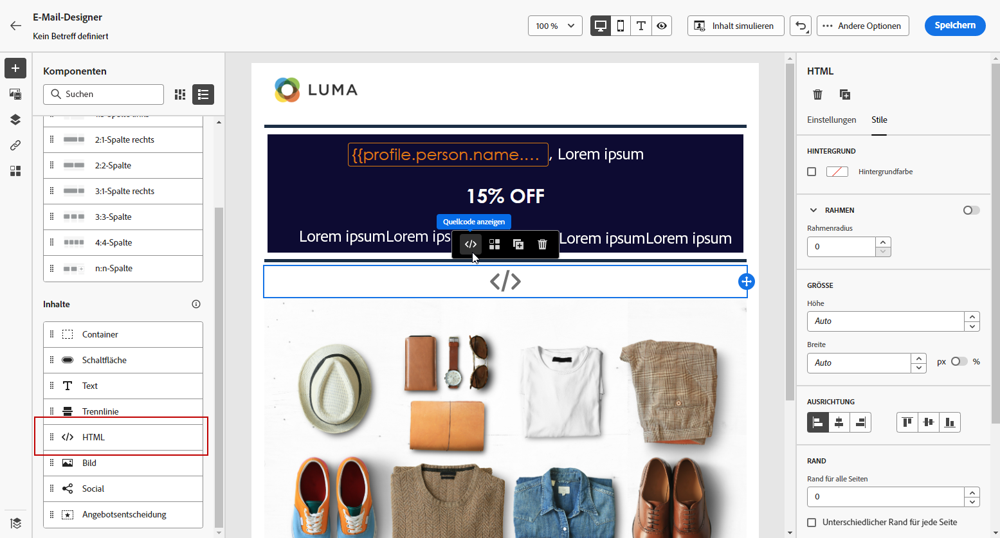

# Verwenden der Inhaltskomponenten von Email Designer {#content-components}

>[!CONTEXTUALHELP]
>id="ac_content_components_email"
>title="Über Inhaltskomponenten"
>abstract="Inhaltskomponenten sind leere Platzhalter für Inhalt, die Sie zum Erstellen des E-Mail-Layouts verwenden können."

>[!CONTEXTUALHELP]
>id="ac_content_components_landing_page"
>title="Über Inhaltskomponenten"
>abstract="Inhaltskomponenten sind leere Platzhalter für Inhalte, mit denen Sie das Layout einer Landingpage erstellen können."

>[!CONTEXTUALHELP]
>id="ac_content_components_fragment"
>title="Über Inhaltskomponenten"
>abstract="Inhaltskomponenten sind leere Platzhalter für Inhalte, die Sie zum Erstellen eines Fragment-Layouts verwenden können."

>[!CONTEXTUALHELP]
>id="ac_content_components_template"
>title="Über Inhaltskomponenten"
>abstract="Inhaltskomponenten sind leere Platzhalter für Inhalte, die Sie zum Erstellen eines Vorlagen-Layouts verwenden können."

Wenn Sie E-Mail-Inhalt erstellen, **[!UICONTROL Inhaltskomponenten]** ermöglicht Ihnen die weitere Personalisierung Ihrer E-Mail mit Rohkomponenten, die Sie bearbeiten können, sobald sie in einer E-Mail platziert wurden.

Sie können innerhalb einer oder mehrerer Strukturkomponenten beliebig viele Inhaltskomponenten hinzufügen, die das Layout Ihrer E-Mail definieren.

## Inhaltskomponenten hinzufügen {#add-content-components}

Gehen Sie wie folgt vor, um Ihrer E-Mail Inhaltskomponenten hinzuzufügen und sie an Ihre Anforderungen anzupassen.

1. Verwenden Sie in Email Designer einen vorhandenen Inhalt oder ziehen Sie ihn per Drag-and-Drop **[!UICONTROL Strukturkomponenten]** in Ihren leeren Inhalt, um das Layout Ihrer E-Mail zu definieren. [Weitere Informationen dazu](content-from-scratch.md)

1. So greifen Sie auf die **[!UICONTROL Inhaltskomponenten]** Wählen Sie die entsprechende Schaltfläche im linken Bereich von Email Designer aus.

   

1. Ziehen Sie die Inhaltskomponenten Ihrer Wahl in die relevanten Strukturkomponenten.

   

   >[!NOTE]
   >
   >Sie können mehrere Komponenten zu einer einzelnen Strukturkomponente und zu jeder Spalte einer Strukturkomponente hinzufügen.

1. Passen Sie die Stilattribute für jede Komponente mithilfe der **[!UICONTROL Komponenteneinstellungen]** rechts. Sie können beispielsweise den Textstil, den Abstand oder den Rand jeder Komponente ändern. [Erfahren Sie mehr über Ausrichtung und Abstand](alignment-and-padding.md)

   

## Container {#container}

Sie können einen einfachen Container hinzufügen, in dem Sie eine weitere Inhaltskomponente hinzufügen können. Auf diese Weise können Sie einen bestimmten Stil auf den Container anwenden, der sich von der darin verwendeten Komponente unterscheidet.

Fügen Sie beispielsweise eine **[!UICONTROL Container]** und fügen Sie dann eine [Schaltfläche](#button) -Komponente innerhalb dieses Containers. Sie können einen bestimmten Hintergrund für den Container und einen weiteren für die Schaltfläche verwenden.

## Schaltfläche {#button}

Verwenden Sie die **[!UICONTROL Schaltfläche]** -Komponente verwenden, um eine oder mehrere Schaltflächen in Ihre E-Mail einzufügen und Ihre E-Mail-Audience auf eine andere Seite umzuleiten.

1. Von **[!UICONTROL Inhaltskomponenten]**, ziehen Sie die **[!UICONTROL Schaltfläche]** in eine **[!UICONTROL Strukturkomponente]**.

1. Klicken Sie auf die neu hinzugefügte Schaltfläche, um den Text zu personalisieren und Zugriff auf die **[!UICONTROL Komponenteneinstellungen]** im rechten Bereich von Email Designer.

   

1. Im **[!UICONTROL Link]** Fügen Sie die URL hinzu, zu der Sie umleiten möchten, wenn Sie auf die Schaltfläche klicken.

1. Wählen Sie aus, wie Ihre Zielgruppe mit der **[!UICONTROL Target]** Dropdown-Liste:

   * **[!UICONTROL None]**: öffnet den Link in demselben Frame, in dem er angeklickt wurde (Standardwert).
   * **[!UICONTROL Blank]**: öffnet den Link in einem neuen Fenster oder auf einer neuen Registerkarte.
   * **[!UICONTROL Self]**: öffnet den Link in demselben Frame, in dem er angeklickt wurde.
   * **[!UICONTROL Parent]**: öffnet den Link im übergeordneten Frame.
   * **[!UICONTROL Top]**: öffnet den Link im gesamten Fenster.

   

1. Sie können Ihre Schaltfläche weiter personalisieren, indem Sie Stilattribute ändern, z. B. **[!UICONTROL Rahmen]**, **[!UICONTROL Größe]**, **[!UICONTROL Marge]**, usw. von **[!UICONTROL Komponenteneinstellungen]** -Bereich.

## Text {#text}

Verwenden Sie die **[!UICONTROL Text]** -Komponente, um Text in Ihre E-Mail einzufügen und den Stil anzupassen (Rahmen, Größe, Abstand usw.) mithilfe der **[!UICONTROL Komponenteneinstellungen]** -Bereich.

1. Von **[!UICONTROL Inhaltskomponenten]**, ziehen Sie die **[!UICONTROL Text]** in eine **[!UICONTROL Strukturkomponente]**.

1. Klicken Sie auf die neu hinzugefügte Komponente, um den Text zu personalisieren und Zugriff auf die **[!UICONTROL Komponenteneinstellungen]** im rechten Bereich von Email Designer.

1. Ändern Sie den Text mit folgenden Optionen in der Symbolleiste:

   

   * **[!UICONTROL Textstil ändern]**: Anwendung von Fett, Kursiv, Unterstrichen oder Durchgestrichen auf den Text.
   * **Ausrichtung ändern**: Auswahl von linker, rechter, zentrierter oder Blocksatz-Ausrichtung für Ihren Text.
   * **[!UICONTROL Liste erstellen]**: Einfügen einer Liste mit Aufzählungszeichen oder Nummerierung.
   * **[!UICONTROL Überschrift festlegen]**: Definition von bis zu sechs Überschriftsebenen in Ihrem Text.
   * **Schriftgröße**: Auswahl der Schriftgröße des Textes in Pixel.
   * **[!UICONTROL Bild bearbeiten]**: Einfügen eines Bildes oder Assets in Ihre Textkomponente. [Weitere Informationen über Asset-Management](assets-essentials.md)
   * **[!UICONTROL Quellcode anzeigen]**: Anzeigen des Quell-Codes Ihres Textes (keine Änderungen möglich).
   * **[!UICONTROL Duplizieren]**: Hinzufügen einer Kopie Ihrer Textkomponente.
   * **[!UICONTROL Löschen]**: Entfernen einer ausgewählten Textkomponente aus Ihrer E-Mail.
   * **[!UICONTROL Personalisierung hinzufügen]**: Einfügen von Personalisierungsfeldern zur Inhaltsanpassung auf der Basis von Profildaten. [Weitere Informationen über die Personalisierung von Inhalt](../personalization/personalize.md)
   * **[!UICONTROL Bedingten Inhalt aktivieren]**: Hinzufügen bedingter Inhalte, um den Inhalt der Komponente an die Zielprofile anzupassen. [Erfahren Sie mehr über dynamische Inhalte](../personalization/get-started-dynamic-content.md)

1. Passen Sie die anderen Stilattribute wie Textfarbe, Schriftfamilie, Rahmen, Abstand, Rand usw. an. von **[!UICONTROL Komponenteneinstellungen]** -Bereich.

## Trennlinie {#divider}

Verwenden Sie die Komponente **[!UICONTROL Trennlinie]**, um das Layout und den Inhalt Ihrer E-Mail durch eine Trennlinie zu strukturieren.

Sie können Stilattribute wie Zeilenfarbe, Stil und Höhe von **[!UICONTROL Komponenteneinstellungen]** -Bereich.

## HTML {#HTML}

Verwenden Sie die **[!UICONTROL HTML]** -Komponente verwenden, um die verschiedenen Teile Ihrer bestehenden HTML zu kopieren und einzufügen. Dadurch können Sie kostenlose modulare HTML-Komponenten erstellen, um externe Inhalte wiederzuverwenden.

1. Von **[!UICONTROL Inhaltskomponenten]**, ziehen Sie die **[!UICONTROL HTML]** in eine **[!UICONTROL Strukturkomponente]**.

1. Klicken Sie auf die neu hinzugefügte Komponente und wählen Sie **[!UICONTROL Quellcode anzeigen]** aus der dedizierten Symbolleiste, um Ihre HTML hinzuzufügen.

   

1. Kopieren Sie den HTML-Code, den Sie Ihrer E-Mail hinzufügen möchten, und klicken Sie auf **[!UICONTROL Speichern]**.

   

>[!NOTE]
>
>Um die Kompatibilität von externem Inhalt mit Email Designer zu gewährleisten, empfiehlt Adobe, eine neue Nachricht zu erstellen und den Inhalt aus der existierenden E-Mail in Komponenten einzufügen.

## Bild {#image}

Verwenden Sie die **[!UICONTROL Bild]** -Komponente, um eine Bilddatei von Ihrem Computer in Ihren E-Mail-Inhalt einzufügen.

1. Von **[!UICONTROL Inhaltskomponenten]**, ziehen Sie die **[!UICONTROL Bild]** in eine **[!UICONTROL Strukturkomponente]**.

1. Klicken Sie auf **[!UICONTROL Durchsuchen]**, um eine in Ihren Assets gespeicherte Bilddatei auszuwählen.

   Weitere Informationen zu [!DNL Assets Essentials] finden Sie in der [Dokumentation zu Adobe Experience Manager Assets Essentials](https://experienceleague.adobe.com/docs/experience-manager-assets-essentials/help/introduction.html?lang=de){target=&quot;_blank&quot;}.

1. Klicken Sie auf die neu hinzugefügte Komponente und richten Sie Ihre Bildeigenschaften mithilfe der **[!UICONTROL Komponenteneinstellungen]** -Bereich:

   * **[!UICONTROL Bildtitel]** ermöglicht die Definition eines Titels für das Bild.
   * Mit **[!UICONTROL Alt-Text]** legen Sie die Bildunterschrift fest. Dies entspricht dem HTML-Attribut „alt“.

   

1. Passen Sie die anderen Stilattribute wie Rand, Rahmen usw. an. oder durch Hinzufügen eines Links zur Umleitung Ihrer Audience zu einem anderen Inhalt aus der **[!UICONTROL Komponenteneinstellungen]** -Bereich.

## Video {#Video}

>[!CONTEXTUALHELP]
>id="ac_edition_video_email"
>title="Videoeinstellungen"
>abstract="Verwenden Sie diese Komponente, um ein Video in Ihre E-Mail einzufügen. Beachten Sie, dass Videos nicht auf allen E-Mail-Clients funktionieren. Wir empfehlen, ein Reservebild festzulegen."

>[!CONTEXTUALHELP]
>id="ac_edition_video_landing_page"
>title="Videoeinstellungen"
>abstract="Verwenden Sie diese Komponente, um zu Ihrer Landingpage ein Video hinzuzufügen. Beachten Sie, dass Videos nicht auf allen Nachrichten-Clients funktionieren. Wir empfehlen, ein Reservebild festzulegen."

>[!CONTEXTUALHELP]
>id="ac_edition_video_fragment"
>title="Videoeinstellungen"
>abstract="Verwenden Sie diese Komponente, um ein Video in Ihr Fragment einzufügen. Beachten Sie, dass Videos nicht auf allen Nachrichten-Clients funktionieren. Wir empfehlen, ein Reservebild festzulegen."

>[!CONTEXTUALHELP]
>id="ac_edition_video_template"
>title="Videoeinstellungen"
>abstract="Verwenden Sie diese Komponente, um ein Video in Ihre Vorlage einzufügen. Beachten Sie, dass Videos nicht auf allen Nachrichten-Clients funktionieren. Wir empfehlen, ein Reservebild festzulegen."

Verwenden Sie die **[!UICONTROL Video]** -Komponente, um über einen URL-Link ein Video in Ihren E-Mail-Inhalt einzufügen.

1. Von **[!UICONTROL Inhaltskomponenten]**, ziehen Sie die **[!UICONTROL Video]** in eine **[!UICONTROL Strukturkomponente]**.

   

1. Klicken Sie auf die neu hinzugefügte Komponente.

1. Im **[!UICONTROL Video-Link]** des **[!UICONTROL Komponenteneinstellungen]** hinzufügen, fügen Sie Ihre Video-URL hinzu.

   

1. Sie können eine **[!UICONTROL Posterbild]** in Ihr Video ein, um ein Bild anzugeben, das angezeigt werden soll, bis Ihre Audience auf die Wiedergabeschaltfläche klickt.

1. Passen Sie die anderen Stilattribute wie Stil, Rand, Rahmen usw. an. von **[!UICONTROL Komponenteneinstellungen]** -Bereich.

## Social {#social}

Verwenden Sie die **[!UICONTROL Social]** -Komponente, um Links zu Social-Media-Seiten in Ihren E-Mail-Inhalt einzufügen.

1. Von **[!UICONTROL Inhaltskomponenten]**, ziehen Sie die **[!UICONTROL Social]** in eine **[!UICONTROL Strukturkomponente]**.

1. Klicken Sie auf die neu hinzugefügte Komponente.

1. Im **[!UICONTROL Social]** des **[!UICONTROL Komponenteneinstellungen]** auswählen, welche sozialen Medien Sie hinzufügen oder entfernen möchten.

   

1. Wählen Sie die Größe Ihrer Symbole im dedizierten Feld aus.

1. Klicken Sie auf jedes Ihrer Social-Media-Symbole, um die **[!UICONTROL URL]** an die Ihre Zielgruppe umgeleitet wird.

   

1. Bei Bedarf können Sie auch die Symbole der einzelnen Social Media im Feld **[!UICONTROL Bild]** ändern.

1. Passen Sie die anderen Stilattribute wie Stil, Rand, Rahmen usw. an. von **[!UICONTROL Komponenteneinstellungen]** -Bereich.

## Angebotsentscheidung {#offer-decision}

Verwenden Sie die **[!UICONTROL Angebotsentscheidung]** -Komponente, um Angebote in Ihre Nachrichten einzufügen. Die [Entscheidungsmanagement](../offers/get-started/starting-offer-decisioning.md) Das Modul wählt das beste Angebot aus, das Sie Ihren Kunden unterbreiten können.

Erfahren Sie, wie Sie einer E-Mail personalisierte Angebote hinzufügen können in [diesem Abschnitt](add-offers-email.md).

