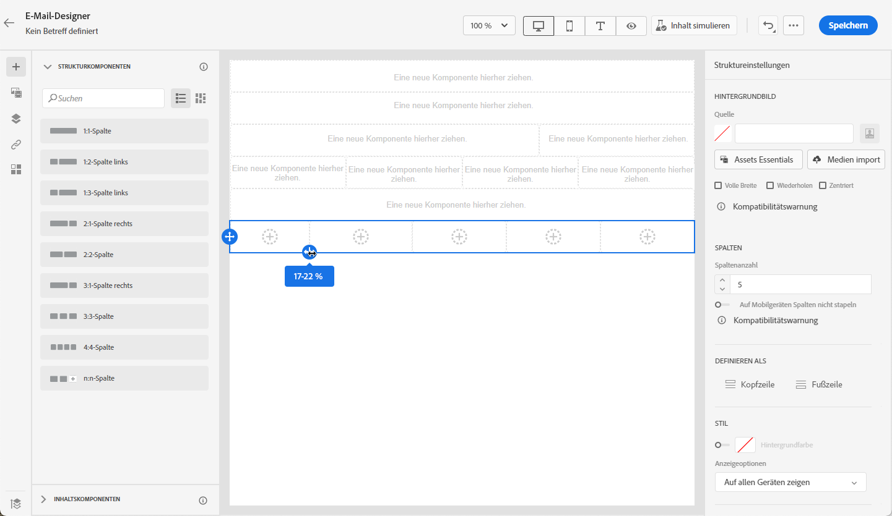
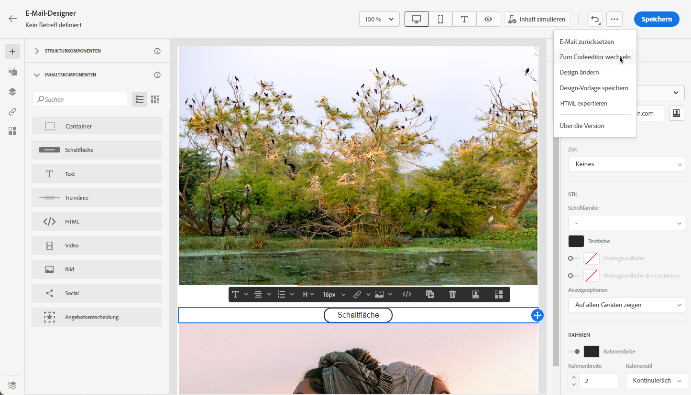

# Von Grund auf neu beginnen {#content-from-scratch}

>[!CONTEXTUALHELP]
>id="ac_structure_components_email"
>title="Über Strukturkomponenten"
>abstract="Strukturkomponenten definieren das Layout der E-Mail."

>[!CONTEXTUALHELP]
>id="ac_structure_components_landing_page"
>title="Über Strukturkomponenten"
>abstract="Strukturkomponenten definieren das Layout der Landingpage."

>[!CONTEXTUALHELP]
>id="ac_structure_components_fragment"
>title="Über Strukturkomponenten"
>abstract="Strukturkomponenten definieren das Layout des Fragments."

>[!CONTEXTUALHELP]
>id="ac_structure_components_template"
>title="Über Strukturkomponenten"
>abstract="Strukturkomponenten definieren das Layout der Vorlage."

>[!CONTEXTUALHELP]
>id="ac_edition_columns_email"
>title="Definieren von E-Mail-Spalten"
>abstract="Mit Email Designer können Sie das Layout Ihrer E-Mail einfach definieren, indem Sie die Spaltenstruktur definieren."

>[!CONTEXTUALHELP]
>id="ac_edition_columns_landing_page"
>title="Definieren der Spalten für die Landingpage"
>abstract="Mit dem E-Mail-Designer können Sie das Layout Ihrer Landingpage einfach definieren, indem Sie die Spaltenstruktur definieren."

>[!CONTEXTUALHELP]
>id="ac_edition_columns_fragment"
>title="Definieren der Fragmentspalten"
>abstract="Mit dem E-Mail-Designer können Sie das Layout Ihres Fragments einfach definieren, indem Sie die Spaltenstruktur definieren."

>[!CONTEXTUALHELP]
>id="ac_edition_columns_template"
>title="Definieren der Vorlagenspalten"
>abstract="Mit dem E-Mail-Designer können Sie das Layout Ihrer Vorlage einfach definieren, indem Sie die Spaltenstruktur definieren."

Email Designer bietet eine einfache Möglichkeit, die Struktur Ihrer E-Mail zu bestimmen. Durch das Hinzufügen und Verschieben von strukturellen Elementen durch einfaches Drag &amp; Drop können Sie Ihrer E-Mail in Sekundenschnelle die gewünschte Form verleihen.

Gehen Sie wie folgt vor, um mit der Erstellung des Inhalts Ihrer E-Mail zu beginnen:

1. Wählen Sie auf der Startseite des E-Mail-Designers die Option **[!UICONTROL Erstellen von neuen Inhalten]** aus.

   

1. Beginnen Sie mit der Gestaltung Ihres E-Mail-Inhalts, indem Sie **[!UICONTROL Strukturkomponenten]** per Drag-and-Drop auf die Arbeitsfläche ziehen, um das Layout Ihrer E-Mail zu definieren.

   >[!NOTE]
   >
   >Die Stapelung von Spalten ist nicht mit allen E-Mail-Programmen kompatibel. Wenn dies nicht unterstützt wird, werden Spalten nicht gestapelt.

   <!--Once placed in the email, you cannot move nor remove your components unless there is already a content component or a fragment placed inside. This is not true in AJO - TBC?-->

1. Fügen Sie so viele **[!UICONTROL Strukturkomponenten]** wie nötig hinzu und bearbeiten Sie deren Einstellungen im entsprechenden Bereich auf der rechten Seite.

   

   Wählen Sie die Komponente **[!UICONTROL n:n Spalte]** aus, um die Anzahl der Spalten zu definieren (3 bis 10). Sie können auch die Breite jeder Spalte ändern, indem Sie den Pfeil am unteren Rand einer jeden Spalte verschieben.

   

   >[!NOTE]
   >
   >Die Größe einer Spalte muss immer mindestens 10 % der Gesamtbreite der Strukturkomponente betragen. Sie können nur leere Spalten entfernen.

1. Erweitern Sie die **[!UICONTROL Inhaltskomponenten]** und fügen Sie beliebig viele Elemente zu einer oder mehreren Strukturkomponenten hinzu. [Weitere Informationen zu Inhaltskomponenten](content-components.md)

1. Jede Komponente kann mithilfe der **[!UICONTROL Komponenteneinstellungen]** auf der rechten Seite weiter angepasst werden. Beispielsweise können Sie den Textstil, den Abstand oder den Rand jeder Komponente ändern. [Erfahren Sie mehr über Ausrichtung und Abstand](alignment-and-padding.md)

   

1. Über die **[!UICONTROL Asset-Auswahl]** können Sie direkt Assets auswählen, die in der **[!UICONTROL Asset-Bibliothek]** gespeichert sind. [Weitere Informationen über Asset-Management](assets-essentials.md)

   Klicken Sie doppelt auf den Ordner, der Ihre Assets enthält. Ziehen Sie sie per Drag-and-Drop in eine Strukturkomponente.

   

1. Fügen Sie Personalisierungsfelder ein, um den Inhalt Ihrer E-Mail mit Profildaten anzupassen. [Weitere Informationen über die Personalisierung von Inhalten](../personalization/personalize.md)

   

1. Fügen Sie dynamische Inhalte hinzu, um den Inhalt auf der Grundlage von bedingten Regeln an die Zielprofile anzupassen. [Erste Schritte mit dynamischen Inhalten](../personalization/get-started-dynamic-content.md)

   

1. Klicken Sie auf die Registerkarte **[!UICONTROL Links]** im linken Bereich, um die Liste aller zu verfolgenden URLs Ihres Inhalts anzuzeigen. Sie können bei Bedarf deren **[!UICONTROL Tracking-Typ]** oder **[!UICONTROL Beschriftung]** ändern und **[!UICONTROL Tags]** hinzufügen. [Erfahren Sie mehr über Links und Nachrichten-Tracking](message-tracking.md)

   

1. Bei Bedarf können Sie Ihre E-Mail weiter personalisieren, indem Sie im erweiterten Menü auf **[!UICONTROL Zum Code-Editor wechseln]** klicken. [Erfahren Sie mehr über den Code-Editor](code-content.md)

   

   >[!CAUTION]
   >
   >Nach dem Wechsel zum Code-Editor können Sie für diese E-Mail nicht mehr zum visuellen Designer zurückgehen.

1. Sobald Ihr Inhalt bereit ist, klicken Sie auf **[!UICONTROL Inhalt simulieren]**, um das E-Mail-Rendering zu überprüfen. Sie können zwischen der Desktop- oder der mobilen Ansicht wählen. [Erfahren Sie mehr über die Vorschau Ihrer E-Mail](preview.md)

   

1. Wenn Ihre E-Mail bereit ist, klicken Sie auf **[!UICONTROL Speichern]**.

