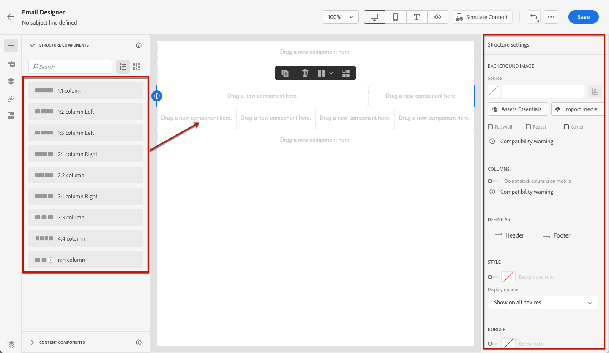
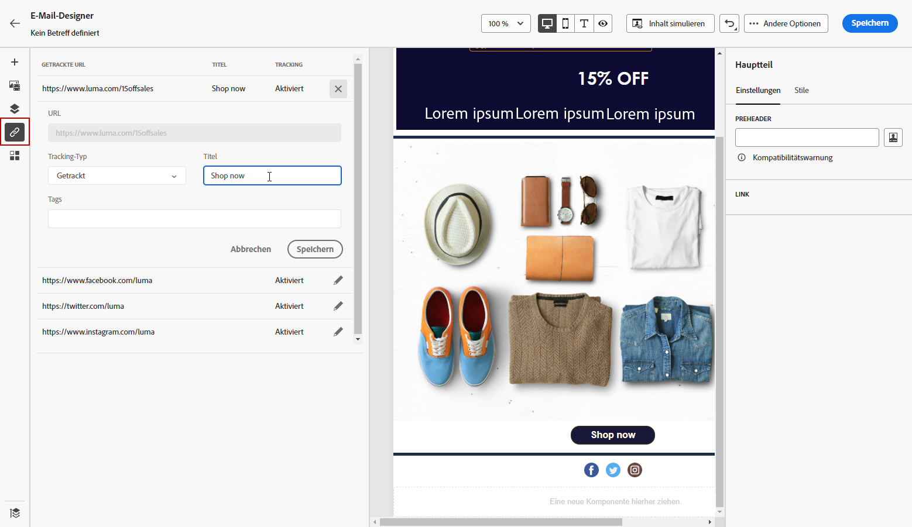
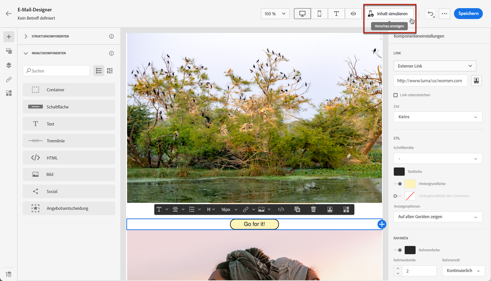

# Inhalte mit der E-Mail-Designer von Grund auf gestalten {#content-from-scratch}

>[!CONTEXTUALHELP]
>id="ac_structure_components_email"
>title="Hinzufügen von Strukturkomponenten"
>abstract="Strukturkomponenten definieren das Layout der E-Mail. Ziehen Sie per Drag-and **Drop eine Komponente** Struktur“ auf die Arbeitsfläche, um mit der Gestaltung Ihres E-Mail-Inhalts zu beginnen."

>[!CONTEXTUALHELP]
>id="ac_structure_components_landing_page"
>title="Hinzufügen von Strukturkomponenten"
>abstract="Strukturkomponenten definieren das Layout der Landingpage. Ziehen Sie eine **Struktur**-Komponente per Drag-and-Drop auf die Arbeitsfläche, um mit der Gestaltung Ihres Landingpage-Inhalts zu beginnen."

>[!CONTEXTUALHELP]
>id="ac_structure_components_fragment"
>title="Hinzufügen von Strukturkomponenten"
>abstract="Strukturkomponenten definieren das Layout des Fragments. Ziehen Sie eine **Struktur**-Komponente per Drag-and-Drop auf die Arbeitsfläche, um mit der Gestaltung Ihres Fragmentinhalts zu beginnen."

>[!CONTEXTUALHELP]
>id="ac_structure_components_template"
>title="Hinzufügen von Strukturkomponenten"
>abstract="Strukturkomponenten definieren das Layout der Vorlage. Ziehen Sie eine **Struktur**-Komponente per Drag-and-Drop auf die Arbeitsfläche, um mit der Gestaltung Ihres Vorlageninhalts zu beginnen."

>[!CONTEXTUALHELP]
>id="ac_edition_columns_email"
>title="Definieren von E-Mail-Spalten"
>abstract="Mit der E-Mail-Designer können Sie das Layout Ihrer E-Mail einfach definieren, indem Sie die Spaltenstruktur auswählen."

>[!CONTEXTUALHELP]
>id="ac_edition_columns_landing_page"
>title="Definieren der Spalten für die Landingpage"
>abstract="Mit der Designer können Sie das Layout Ihrer Landingpage einfach definieren, indem Sie die Spaltenstruktur auswählen."

>[!CONTEXTUALHELP]
>id="ac_edition_columns_fragment"
>title="Definieren von Fragmentspalten"
>abstract="Mit der Designer können Sie das Layout Ihres Fragments einfach definieren, indem Sie die Spaltenstruktur auswählen."

>[!CONTEXTUALHELP]
>id="ac_edition_columns_template"
>title="Definieren von Vorlagenspalten"
>abstract="Mit der Designer können Sie das Layout Ihrer Vorlage einfach definieren, indem Sie die Spaltenstruktur auswählen."

Verwenden Sie die [!DNL Adobe Journey Optimizer] E-Mail-Designer , um die Struktur Ihrer Inhalte einfach zu definieren. Durch das Hinzufügen und Verschieben von strukturellen Elementen mit einfachem Drag-and-Drop können Sie die Form Ihrer Inhalte innerhalb von Sekunden entwerfen.

>[!NOTE]
>
>Der [European Accessibility Act](https://eur-lex.europa.eu/legal-content/EN/TXT/?uri=CELEX%3A32019L0882){target="_blank"} legt fest, dass alle digitalen Kommunikationen zugänglich sein sollten. Achten Sie beim Entwerfen von Inhalten in [!DNL Journey Optimizer] auf [dieser Seite](accessible-content.md) die spezifischen Richtlinien.

Gehen Sie wie folgt vor, um mit der Erstellung Ihres Inhalts zu beginnen:

1. Wählen Sie auf der Designer-Startseite die Option **[!UICONTROL Erstellen von neuen]**) aus.

   

1. Beschleunigen Sie die E-Mail-Erstellung mit dem KI-Assistenten und generieren Sie vollständige E-Mail-Inhalte mit Text und Bildern mit [KI-Assistenten für die vollständige Inhaltserstellung](../content-management/generative-full-content.md).

1. Beginnen Sie mit der Gestaltung Ihres Inhalts, indem Sie **[!UICONTROL Strukturen]** per Drag-and-Drop auf die Arbeitsfläche ziehen, um das Layout Ihrer E-Mail zu definieren.

   >[!NOTE]
   >
   >Das Stapeln von Spalten ist nicht mit allen E-Mail-Programmen kompatibel. Wenn dies nicht unterstützt wird, werden Spalten nicht gestapelt.

   <!--Once placed in the email, you cannot move nor remove your components unless there is already a content component or a fragment placed inside. This is not true in AJO - TBC?-->

1. Fügen Sie so viele **[!UICONTROL Strukturen]** wie nötig hinzu und bearbeiten Sie deren Einstellungen im entsprechenden Bereich auf der rechten Seite.

   

   Wählen Sie die Komponente **[!UICONTROL n:n Column]** aus, um die Anzahl der Spalten zu definieren (3 bis 10). Sie können auch die Breite jeder Spalte definieren, indem Sie die Pfeile am unteren Rand jeder Spalte verschieben.

   >[!NOTE]
   >
   >Die Größe einer Spalte darf nicht kleiner als 10 % der Gesamtbreite der Strukturkomponente sein. Nicht leere Spalten können nicht entfernt werden.

1. Erweitern Sie **[!UICONTROL Abschnitt]** Inhalte“ und fügen Sie beliebig viele Elemente zu einer oder mehreren Strukturkomponenten hinzu. [Erfahren Sie mehr über Inhaltskomponenten](content-components.md)

1. Jede Komponente kann mithilfe der Registerkarten **[!UICONTROL Einstellungen]** oder **[!UICONTROL Stil]** im rechten Menü angepasst werden. Sie können beispielsweise den Textstil, den Abstand oder den Rand jeder Komponente ändern. [Weitere Informationen über Ausrichtung und Abstand](alignment-and-padding.md)

   

1. Über die **[!UICONTROL Asset-Auswahl]** können Sie direkt Assets auswählen, die in der **[!UICONTROL Assets-Bibliothek gespeichert]**. [Erfahren Sie mehr über Asset-Management](../integrations/assets.md)

   Doppelklicken Sie auf den Ordner, der Ihre Assets enthält. Ziehen Sie sie per Drag-and-Drop in eine Strukturkomponente .

   

1. Fügen Sie Personalisierungsfelder ein, um Ihren Inhalt aus Profilattributen, Zielgruppenzugehörigkeiten, kontextuellen Attributen und mehr anzupassen. [Erfahren Sie mehr über die Personalisierung von Inhalten](../personalization/personalize.md)

   

1. Klicken Sie **[!UICONTROL Bedingten Inhalt aktivieren]**, um dynamischen Inhalt hinzuzufügen und den Inhalt auf der Grundlage von bedingten Regeln an die Zielprofile anzupassen. [Erste Schritte mit dynamischen Inhalten](../personalization/get-started-dynamic-content.md)

   

1. Klicken Sie auf **[!UICONTROL Links]** im linken Bereich, um alle URLs Ihres Inhalts anzuzeigen, die verfolgt werden sollen. Sie können bei Bedarf deren **[!UICONTROL Tracking-Typ]** oder **[!UICONTROL Label]** ändern und **[!UICONTROL Tags]** hinzufügen. [Erfahren Sie mehr über Links und Tracking](message-tracking.md)

   

1. Bei Bedarf können Sie Ihre E-Mail weiter personalisieren, indem Sie **[!UICONTROL erweiterten Menü auf]** Zum Code-Editor wechseln“ klicken. Auf diese Weise können Sie den E-Mail-Quell-Code bearbeiten, z. B. um Tracking- oder benutzerdefinierte HTML-Tags hinzuzufügen. [Erfahren Sie mehr über den Code-Editor](code-content.md)

   >[!CAUTION]
   >
   >Nach dem Wechsel zum Code-Editor können Sie für diese E-Mail nicht mehr zum visuellen Designer zurückkehren.

1. Sobald Ihr Inhalt fertig ist, klicken Sie auf die Schaltfläche **[!UICONTROL Inhalt simulieren]**, um das Rendering zu überprüfen. Sie können zwischen der Desktop- oder der mobilen Ansicht wählen. Ausführliche Informationen zur Auswahl von Testprofilen und zur Vorschau Ihres Inhalts finden Sie im Abschnitt [Content-Management](../content-management/preview-test.md).

   

1. Sie können auch die Qualität Ihrer Inhalte überprüfen, um Lesbarkeit, Effektivität und Inhaltskohärenz zu bewerten. [Erfahren Sie mehr über die Validierung der Inhaltsqualität](../content-management/brands-score.md#validate-quality)

1. Wenn Ihr Inhalt fertig ist, klicken Sie auf **[!UICONTROL Speichern]**.
