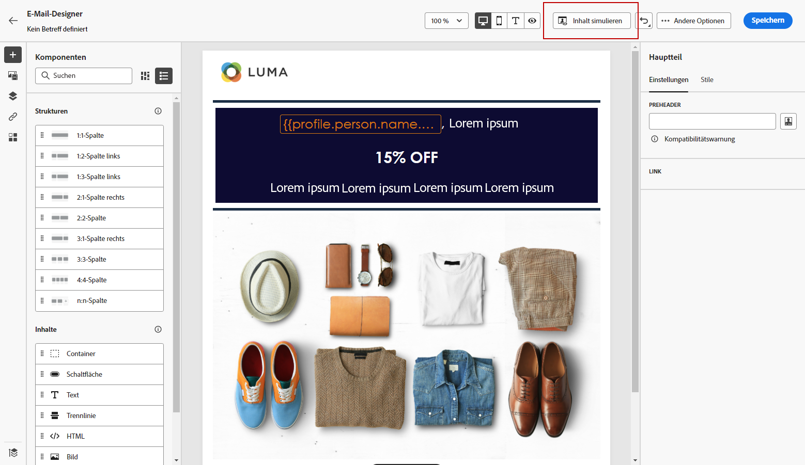

# Neu beginnen {#content-from-scratch}

>[!CONTEXTUALHELP]
>id="ac_structure_components_email"
>title="Über Strukturkomponenten"
>abstract="Strukturkomponenten definieren das Layout der E-Mail."

>[!CONTEXTUALHELP]
>id="ac_structure_components_landing_page"
>title="Über Strukturkomponenten"
>abstract="Strukturkomponenten definieren das Layout der Landingpage."

>[!CONTEXTUALHELP]
>id="ac_structure_components_fragment"
>title="Über Strukturkomponenten"
>abstract="Strukturkomponenten definieren das Layout des Fragments."

>[!CONTEXTUALHELP]
>id="ac_structure_components_template"
>title="Über Strukturkomponenten"
>abstract="Strukturkomponenten definieren das Layout der Vorlage."

>[!CONTEXTUALHELP]
>id="ac_edition_columns_email"
>title="E-Mail-Spalten definieren"
>abstract="Mit Email Designer können Sie das Layout Ihrer E-Mail einfach definieren, indem Sie die Spaltenstruktur definieren."

>[!CONTEXTUALHELP]
>id="ac_edition_columns_landing_page"
>title="Landingpage-Spalten definieren"
>abstract="Mit Email Designer können Sie das Layout Ihrer Landingpage einfach definieren, indem Sie die Spaltenstruktur definieren."

>[!CONTEXTUALHELP]
>id="ac_edition_columns_fragment"
>title="Fragmentspalten definieren"
>abstract="Mit Email Designer können Sie das Layout Ihres Fragments einfach definieren, indem Sie die Spaltenstruktur definieren."

>[!CONTEXTUALHELP]
>id="ac_edition_columns_template"
>title="Vorlagenspalten definieren"
>abstract="Mit Email Designer können Sie das Layout Ihrer Vorlage einfach definieren, indem Sie die Spaltenstruktur definieren."

Mit Email Designer können Sie die Struktur Ihrer E-Mail einfach definieren. Durch das Hinzufügen und Verschieben von Strukturelementen mit einfachen Drag &amp; Drop-Aktionen können Sie die Form Ihrer E-Mail innerhalb von Sekunden gestalten.

Gehen Sie wie folgt vor, um mit der Erstellung Ihres E-Mail-Inhalts zu beginnen:

1. Wählen Sie auf der Startseite von Email Designer die **[!UICONTROL Design from scratch]** -Option.

   

1. Beginnen Sie mit der Erstellung Ihres E-Mail-Inhalts durch Drag &amp; Drop **[!UICONTROL Structure components]** in die Arbeitsfläche, um das Layout Ihrer E-Mail zu definieren.

   >[!NOTE]
   >
   >Die Stapelung von Spalten ist nicht mit allen E-Mail-Programmen kompatibel. Wenn sie nicht unterstützt werden, werden Spalten nicht gestapelt.

   <!--Once placed in the email, you cannot move nor remove your components unless there is already a content component or a fragment placed inside. This is not true in AJO - TBC?-->

1. Fügen Sie so viele hinzu wie **[!UICONTROL Structure components]** nach Bedarf und bearbeiten Sie die Einstellungen im dedizierten Bereich auf der rechten Seite.

   

   Wählen Sie die **[!UICONTROL n:n column]** -Komponente, um die Anzahl der Spalten Ihrer Wahl zu definieren (zwischen 3 und 10). Sie können auch die Breite jeder Spalte definieren, indem Sie die Pfeile am unteren Rand jeder Spalte verschieben.

   

   >[!NOTE]
   >
   >Die Spaltengröße darf nicht unter 10 % der Gesamtbreite der Strukturkomponente liegen. Eine nicht leere Spalte kann nicht entfernt werden.

1. Erweitern Sie die **[!UICONTROL Content components]** und fügen Sie beliebig viele Elemente zu einer oder mehreren Strukturkomponenten hinzu. [Weitere Informationen zu Inhaltskomponenten](content-components.md)

1. Jede Komponente kann mithilfe der **[!UICONTROL Component settings]** rechts. Sie können beispielsweise den Textstil, den Abstand oder den Rand jeder Komponente ändern. [Weitere Informationen zur Ausrichtung und zum Abstand](alignment-and-padding.md)

   

1. Aus dem **[!UICONTROL Asset picker]** können Sie direkt Assets auswählen, die in der **[!UICONTROL Assets library]**. [Weitere Informationen zur Asset-Verwaltung](assets-essentials.md)

   Doppelklicken Sie auf den Ordner, der Ihre Assets enthält. Ziehen Sie sie per Drag-and-Drop in eine Strukturkomponente.

   

1. Fügen Sie Personalisierungsfelder ein, um Ihren E-Mail-Inhalt aus Profildaten anzupassen. [Weitere Informationen zur Personalisierung von Inhalten](../personalization/personalize.md)

   

1. Fügen Sie dynamische Inhalte hinzu, um den Inhalt auf der Grundlage von bedingten Regeln an die Zielprofile anzupassen. [Erste Schritte mit dynamischen Inhalten](../personalization/get-started-dynamic-content.md)

   

1. Klicken Sie auf **[!UICONTROL Links]** im linken Bereich, um alle getrackten URLs Ihres Inhalts anzuzeigen. Sie können die **[!UICONTROL Tracking Type]** oder **[!UICONTROL Label]** und hinzufügen **[!UICONTROL Tags]** bei Bedarf. [Erfahren Sie mehr über Links und Nachrichten-Tracking](message-tracking.md)

   

1. Bei Bedarf können Sie Ihre E-Mail weiter personalisieren, indem Sie auf **[!UICONTROL Switch to code editor]** aus dem erweiterten Menü. [Erfahren Sie mehr über den Code-Editor](code-content.md)

   

   >[!CAUTION]
   >
   >Sie können nach dem Wechsel zum Code-Editor nicht zum Visual Designer für diese E-Mail zurückkehren.

1. Sobald Ihr Inhalt fertig ist, klicken Sie auf **[!UICONTROL Simulate content]** , um Ihr E-Mail-Rendering zu überprüfen. Sie können die Desktop- oder Mobilansicht auswählen. [Erfahren Sie mehr über die Vorschau Ihrer E-Mail](preview.md)

   

1. Wenn Ihre E-Mail fertig ist, klicken Sie auf **[!UICONTROL Save]**.

