# Arbeiten mit Inhaltsvorlagen {#content-templates}

Für einen beschleunigten und verbesserten Design-Prozess können Sie eigenständige Vorlagen erstellen, um benutzerdefinierte Inhalte einfach in allen [!DNL Journey Optimizer] Kampagnen und Journey.

Diese Funktion ermöglicht inhaltsorientierten Benutzern die Arbeit an Vorlagen außerhalb von Kampagnen oder Journey. Marketing-Benutzer können diese eigenständigen Inhaltsvorlagen dann in ihren eigenen Journey oder Kampagnen wiederverwenden und anpassen.

Beispielsweise ist ein Benutzer in Ihrem Unternehmen nur für Inhalte zuständig und hat daher keinen Zugriff auf Kampagnen oder Journey. Dieser Benutzer kann jedoch eine E-Mail-Vorlage erstellen, die die Marketing-Experten Ihrer Organisation für die Verwendung in allen E-Mails als Ausgangspunkt auswählen können.

➡️ [In diesem Video erfahren Sie, wie Sie Vorlagen erstellen und verwenden.](#video-templates)

>[!CAUTION]
>
>Zum Erstellen, Bearbeiten und Löschen von Inhaltsvorlagen benötigen Sie die **[!DNL Manage Library Items]** in der **[!DNL Content Library Manager]** Produktprofil. [Weitere Informationen](../administration/ootb-product-profiles.md#content-library-manager)

## Zugreifen auf und Verwalten von Vorlagen {#access-manage-templates}

Um auf die Liste der Inhaltsvorlagen zuzugreifen, wählen Sie **[!UICONTROL Content Management]** > **[!UICONTROL Inhaltsvorlagen]** über das Menü links.

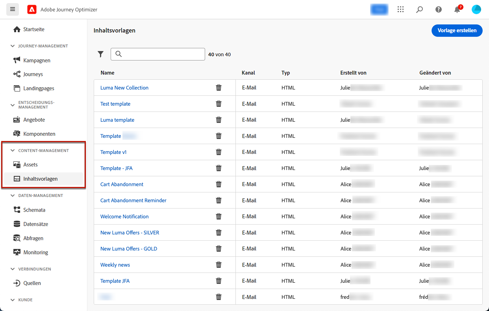

Alle Vorlagen, die in der aktuellen Sandbox erstellt wurden - entweder von einer Journey oder aus einer Kampagne, die die [Als Vorlage speichern](#save-as-template) entweder über die **[!UICONTROL Inhaltsvorlagen]** Menü - angezeigt.

Sie können Inhaltsvorlagen nach Erstellungs- oder Änderungsdatum sortieren. Sie können auch festlegen, dass nur die von Ihnen erstellten oder geänderten Elemente angezeigt werden.

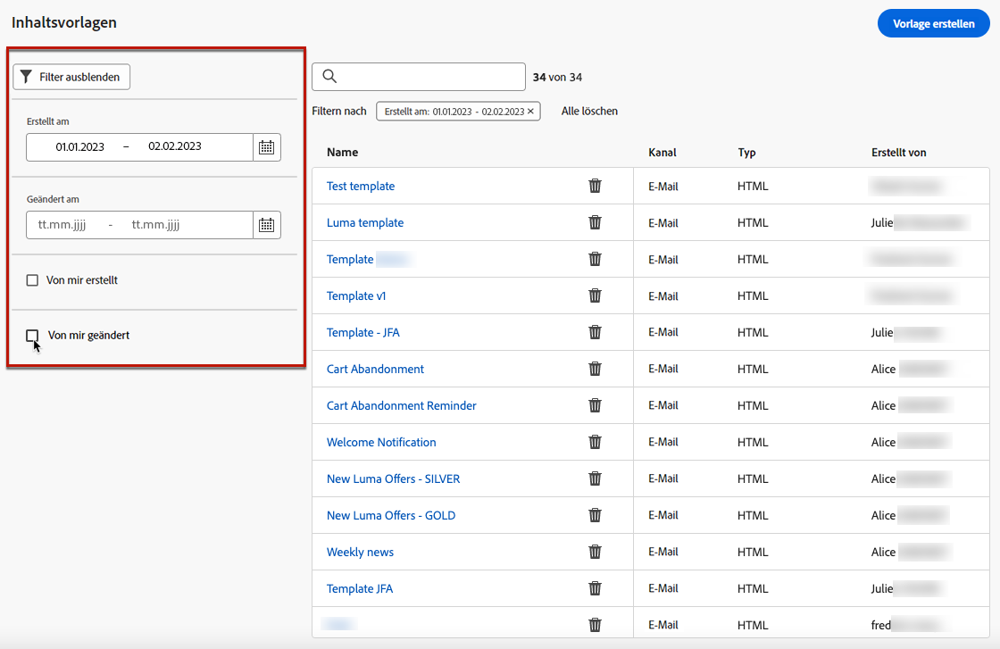

Um einen Vorlageninhalt zu bearbeiten, klicken Sie in der Liste auf das gewünschte Element und wählen Sie **[!UICONTROL Inhalt bearbeiten]**.

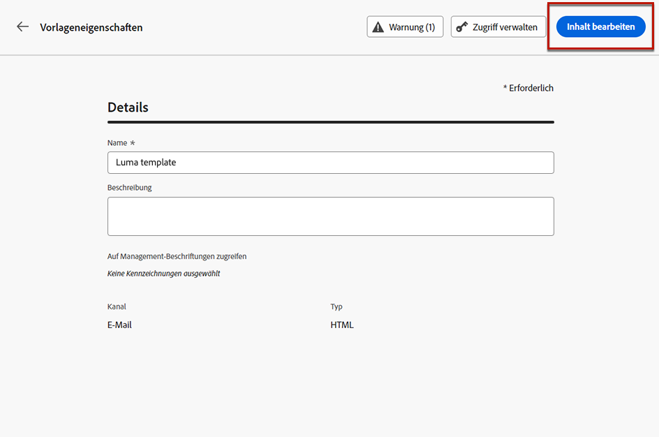

Um eine Vorlage zu löschen, wählen Sie das Papierkorbsymbol neben der gewünschten Vorlage aus.

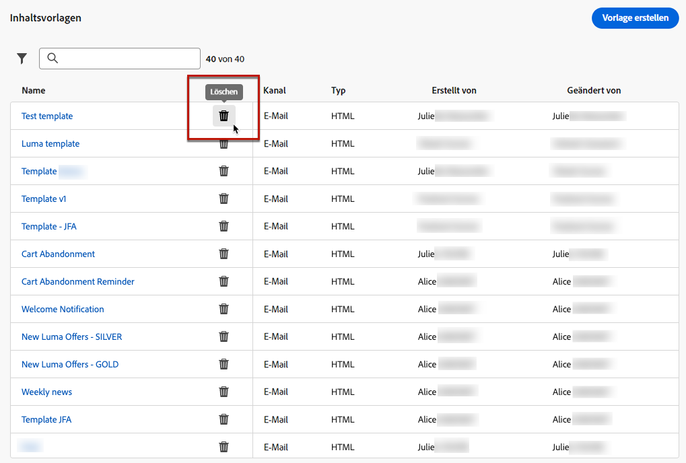

>[!NOTE]
>
>Wenn eine Vorlage bearbeitet oder gelöscht wird, sind Kampagnen oder Journey, einschließlich mit dieser Vorlage erstellter E-Mails, nicht betroffen.

## Erstellen von Inhaltsvorlagen {#create-content-templates}

>[!CONTEXTUALHELP]
>id="ajo_create_template"
>title="Eigene Inhaltsvorlage definieren"
>abstract="Erstellen Sie eine eigenständige benutzerdefinierte Vorlage von Grund auf, damit Ihre Inhalte über mehrere Journey und Kampagnen hinweg wiederverwendet werden können."

Es gibt zwei Möglichkeiten, Inhaltsvorlagen zu erstellen:

* Erstellen Sie eine neue Inhaltsvorlage mithilfe der linken Leiste **[!UICONTROL Inhaltsvorlagen]** Menü. [Weitere Informationen](#create-template-from-scratch)

* Speichern Sie beim Entwerfen einer E-Mail innerhalb einer Kampagne oder Journey Ihren E-Mail-Inhalt als Vorlage. [Weitere Informationen](#save-as-template)

Nach der Speicherung ist Ihre Inhaltsvorlage für Kampagnen oder Journey verfügbar. Unabhängig davon, ob sie von Grund auf neu oder von einer vorherigen E-Mail erstellt wurden, können Sie diese Vorlage jetzt beim Erstellen von [email](get-started-email-design.md) Innerhalb [!DNL Journey Optimizer]. [Weitere Informationen](email-templates.md)

>[!NOTE]
>
>* Änderungen an Inhaltsvorlagen werden nicht an Kampagnen oder Journey weitergegeben, unabhängig davon, ob sie live oder als Entwurf vorliegen.
>
>* Wenn Vorlagen in einer Kampagne oder einer Journey verwendet werden, wirken sich Änderungen an der Kampagne und dem Journey-Inhalt auch nicht auf die zuvor verwendete Inhaltsvorlage aus.

### Vorlage von Grund auf neu erstellen {#create-template-from-scratch}

Gehen Sie wie folgt vor, um eine neue Inhaltsvorlage zu erstellen.

1. Greifen Sie über die **[!UICONTROL Content Management]** > **[!UICONTROL Inhaltsvorlagen]** Menü links.

   

1. Auswählen **[!UICONTROL Vorlage erstellen]**.

1. Füllen Sie die Vorlagendetails aus.

   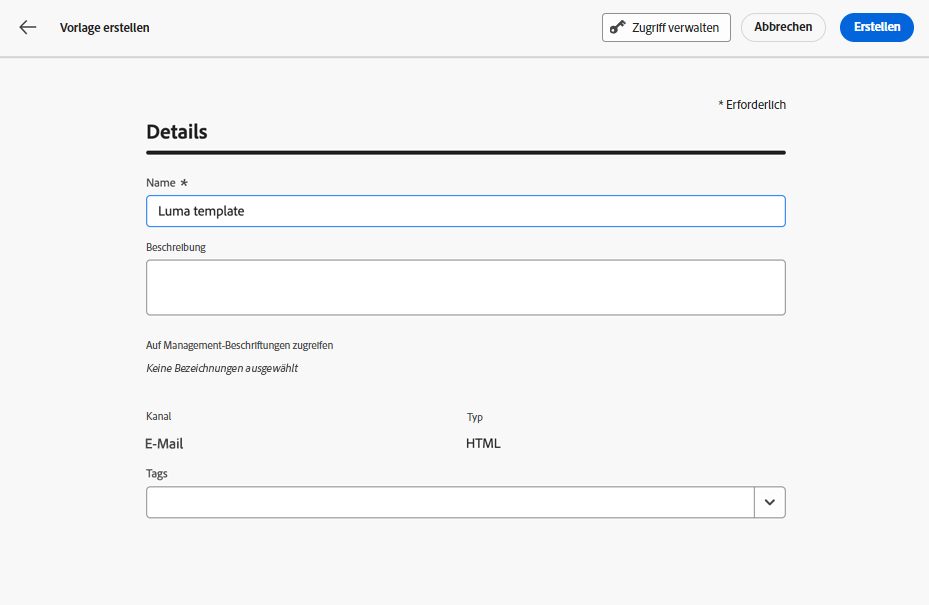

   >[!NOTE]
   >
   >Derzeit ist nur der **Email** Kanal und **HTML** -Typen werden unterstützt.

1. Um der Vorlage benutzerdefinierte oder zentrale Datennutzungsbezeichnungen zuzuweisen, wählen Sie **[!UICONTROL Zugriff verwalten]**. [Weitere Informationen zur Zugriffssteuerung auf Objektebene (OLAC)](../administration/object-based-access.md).

1. Klicken **[!UICONTROL Erstellen]** und wählen Sie aus den verschiedenen Optionen aus, wie Sie Ihre E-Mail gestalten möchten:

   * [E-Mail von Grund auf neu erstellen](content-from-scratch.md) über die Benutzeroberfläche von Email Designer.

   * [Rohes HTML kopieren oder kopieren und einfügen](code-content.md) direkt in Email Designer.

   * [Importieren Sie vorhandenen HTML-Inhalt](existing-content.md) aus einer Datei oder einem .zip-Ordner.

   * Verwenden Sie vorhandenen Inhalt aus einer Liste integrierter oder benutzerdefinierter Vorlagen. Die Schritte zur Verwendung einer Inhaltsvorlage in einer E-Mail werden im Abschnitt [diesem Abschnitt](email-templates.md).

   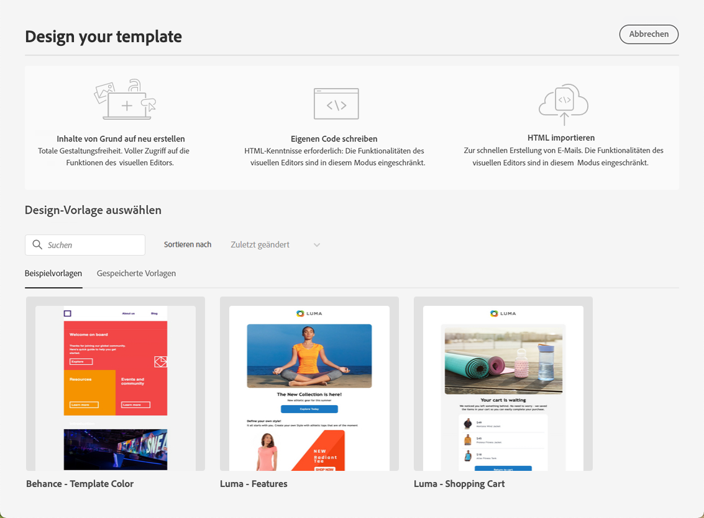

1. Die [Email Designer](get-started-email-design.md) angezeigt. Bearbeiten Sie den Inhalt nach Bedarf auf die gleiche Weise wie für jede E-Mail innerhalb einer Journey oder Kampagne, je nach ausgewählter Option.

   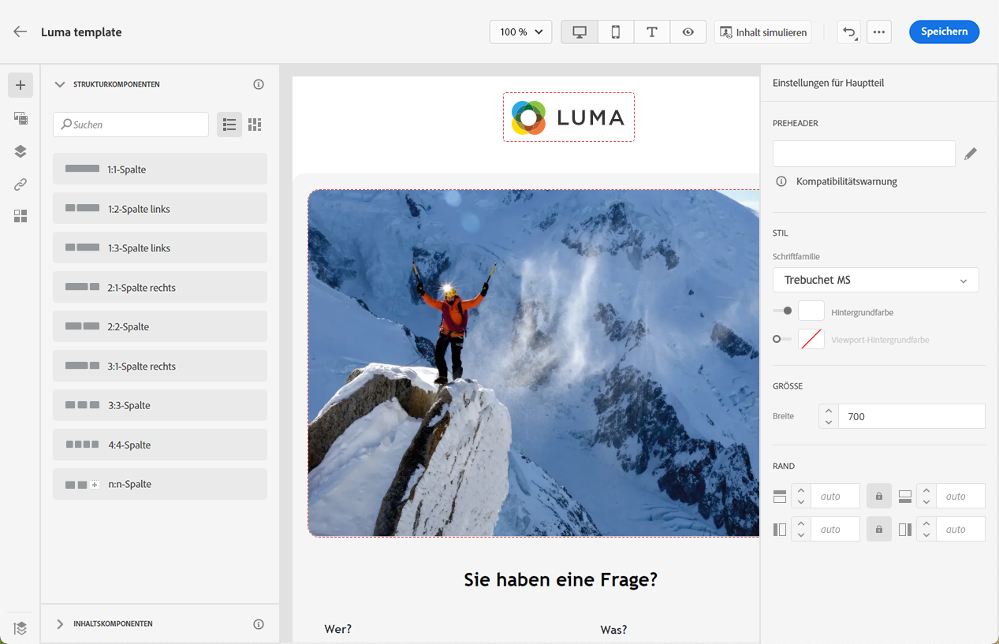

1. Bei Bedarf können Sie Ihren Inhalt testen. [Weitere Informationen](#test-template)

1. Sobald Ihre Vorlage fertig ist, klicken Sie auf **[!UICONTROL Speichern]**.

1. Klicken Sie bei Bedarf auf den Pfeil neben dem Vorlagennamen, um zum **[!UICONTROL Details]** und bearbeiten Sie die Vorlage.

   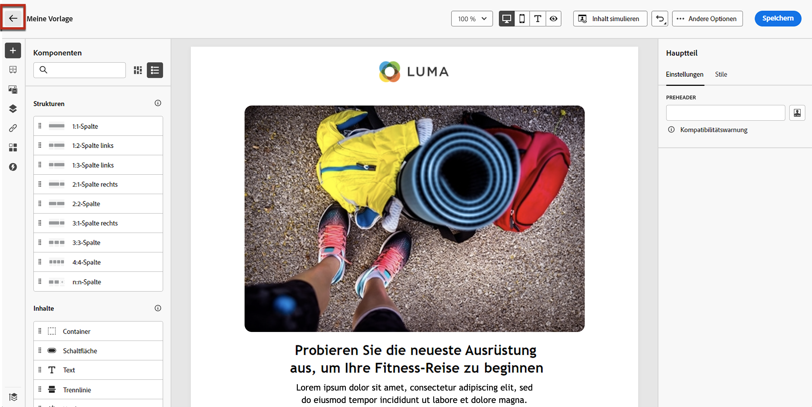

Diese Vorlage kann jetzt beim Erstellen von E-Mails in verwendet werden [!DNL Journey Optimizer]. [Weitere Informationen](email-templates.md)

### Als Vorlage speichern {#save-as-template}

>[!CONTEXTUALHELP]
>id="ajo_messages_depecrated_inventory"
>title="Hier erfahren Sie, wie Sie Ihre Nachrichten migrieren können"
>abstract="Seit dem 25. Juli 2022 wird das Nachrichtenmenü nicht mehr angezeigt. Nachrichten werden nun direkt von einer Journey aus verfasst. Wenn Sie Ihre alten Nachrichten in Journeys wiederverwenden möchten, müssen Sie sie als Vorlagen speichern."

Beim Entwerfen eines [email](get-started-email-design.md) in einer Kampagne oder einer Journey speichern Sie Ihren E-Mail-Inhalt für die spätere Wiederverwendung. Gehen Sie dazu wie folgt vor.

1. Klicken Sie in Email Designer oben rechts im Bildschirm auf das Auslassungszeichen.

1. Auswählen **[!UICONTROL Als Inhaltsvorlage speichern]** aus dem Dropdown-Menü.

   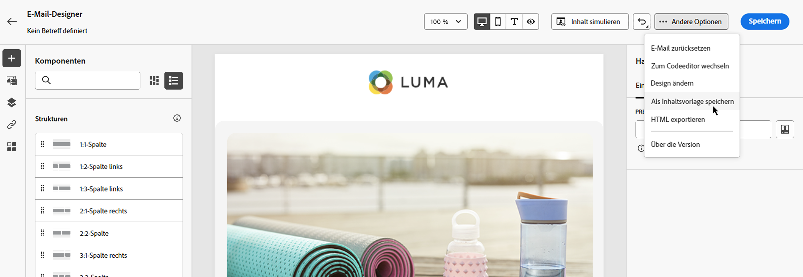

1. Fügen Sie einen Namen und eine Beschreibung für diese Vorlage hinzu.

   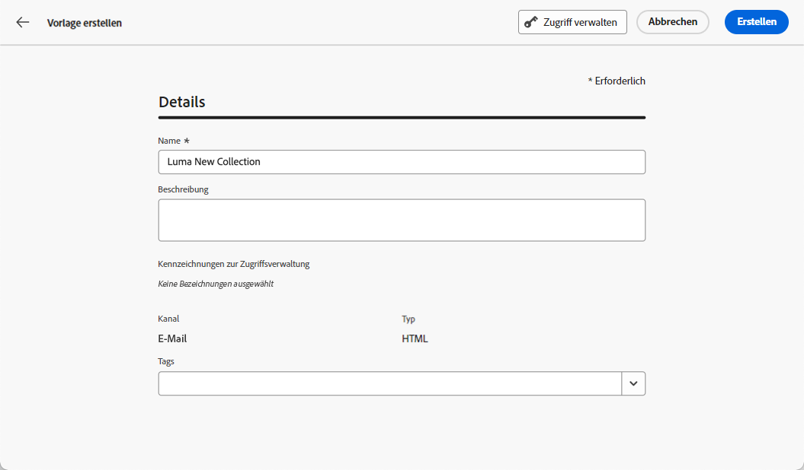

1. Klicken Sie auf **[!UICONTROL Speichern]**.

1. Die Vorlage wird im **[!UICONTROL Inhaltsvorlagen]** Liste, auf die über die [!DNL Journey Optimizer] dediziertes Menü. Es wird zu einer eigenständigen Inhaltsvorlage, auf die wie jedes andere Element in der Liste zugegriffen, bearbeitet und gelöscht werden kann. [Weitere Informationen](#access-manage-templates)

Sie können diese Vorlage jetzt beim Erstellen von [email](get-started-email-design.md) Innerhalb [!DNL Journey Optimizer]. [Weitere Informationen](email-templates.md)

>[!NOTE]
>
>Änderungen an dieser neuen Vorlage werden nicht an die E-Mail weitergeleitet, aus der sie stammen. Wenn der ursprüngliche Inhalt in dieser E-Mail bearbeitet wird, wird die neue Vorlage ebenfalls nicht geändert.

## Testen der Inhaltsvorlage {#test-template}

Sie können das Rendering einer beliebigen E-Mail-Inhaltsvorlage testen, unabhängig davon, ob sie von Grund auf neu oder von einer E-Mail erstellt wurde. Gehen Sie dazu wie folgt vor.

>[!CAUTION]
>
>Um Inhalte zu simulieren, müssen Sie über die **[!DNL Manage Simulate Content]** in der **[!DNL Content Library Manager]** Produktprofil. [Weitere Informationen](../administration/ootb-product-profiles.md#content-library-manager)

1. Greifen Sie über die **[!UICONTROL Content Management]** > **[!UICONTROL Inhaltsvorlagen]** und wählen Sie eine beliebige Vorlage aus.

1. Klicken **[!UICONTROL Inhalt bearbeiten]** von **[!UICONTROL Vorlageneigenschaften]**.

1. Klicken **[!UICONTROL Inhalt simulieren]** und wählen Sie ein Testprofil aus, um Ihr E-Mail-Rendering zu überprüfen. Sie können zwischen der Desktop- oder der mobilen Ansicht wählen. [Weitere Informationen](preview.md)

   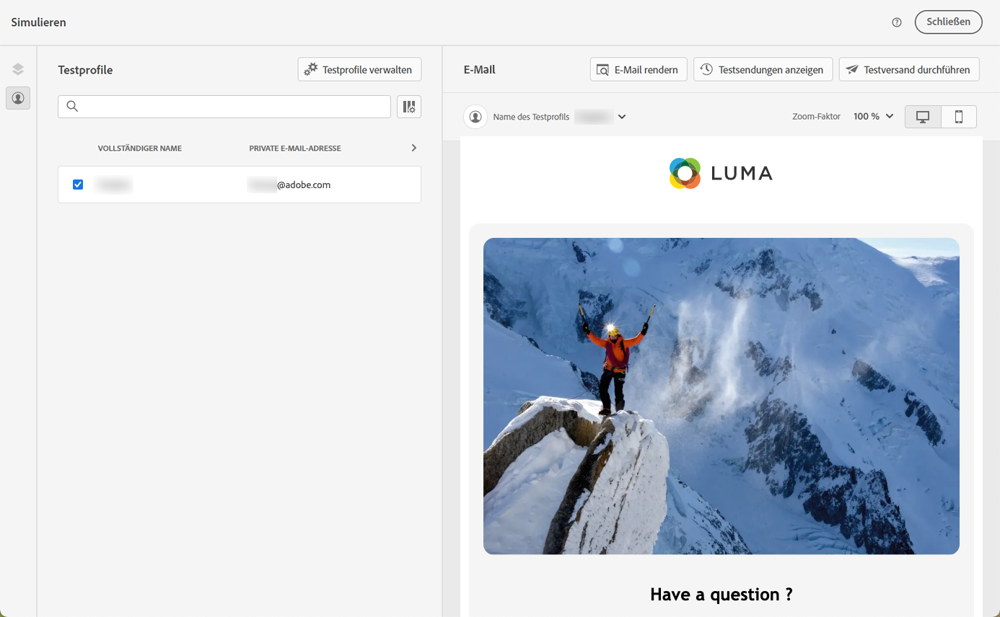

1. Sie können einen Testversand durchführen, um Ihren Inhalt zu testen und ihn von einigen internen Benutzern validieren zu lassen, bevor Sie ihn in einer Journey oder Kampagne verwenden.

   * Klicken Sie dazu auf die Schaltfläche **[!UICONTROL Testversand durchführen]** und folgen Sie den Schritten unter [diesem Abschnitt](preview.md#send-proofs).

   * Vor dem Testversand müssen Sie die [E-Mail-Oberfläche](../configuration/channel-surfaces.md) wird zum Testen Ihres Inhalts verwendet.

      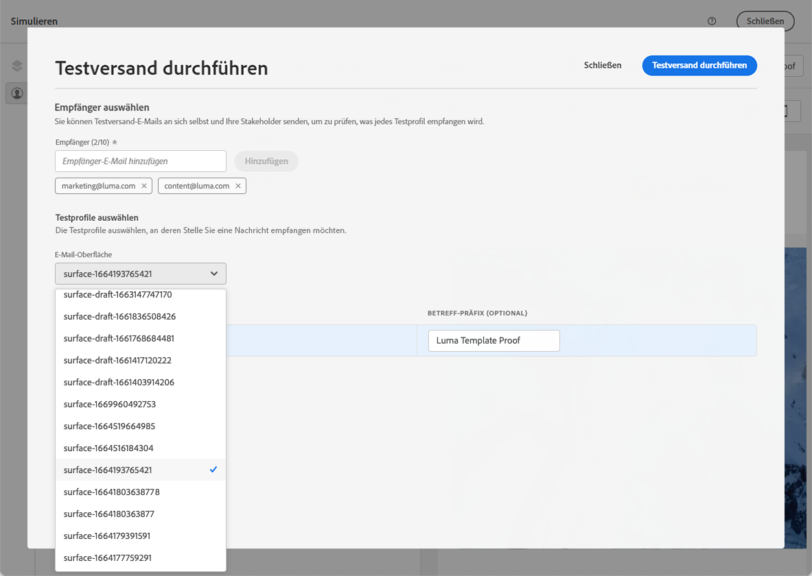

## Anleitungsvideo {#video-templates}

Erfahren Sie, wie Sie Inhaltsvorlagen erstellen, bearbeiten und verwenden in [!DNL Journey Optimizer].

>[!VIDEO](https://video.tv.adobe.com/v/3413743/?quality=12)