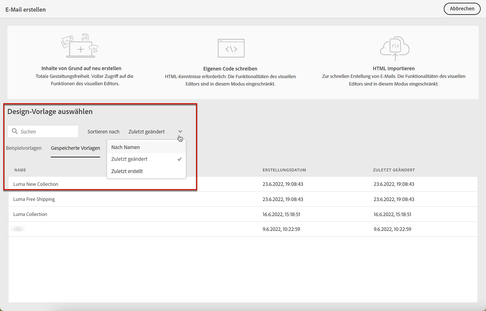

# Erstellen von Inhaltsvorlagen {#content-templates}

>[!CONTEXTUALHELP]
>id="ajo_content_templates"
>title="Erstellen von Inhaltsvorlagen"
>abstract="Erstellen Sie eigenständige Vorlagen, um Inhalte über Journey und Kampagnen hinweg neu zu verwenden."

Für einen optimierten und verbesserten Designprozess können Sie eigenständige Vorlagen erstellen, um benutzerdefinierte Inhalte einfach über [!DNL Journey Optimizer] Kampagnen und Journey.

Diese Funktion ermöglicht inhaltsorientierten Benutzern die Arbeit an Vorlagen außerhalb von Kampagnen oder Journey. Marketing-Benutzer können diese eigenständigen Inhaltsvorlagen dann in ihren eigenen Journey oder Kampagnen wiederverwenden und anpassen.

>[!CAUTION]
>
>Zum Erstellen, Bearbeiten und Löschen von Inhaltsvorlagen benötigen Sie die **[!DNL Manage Library Items]** in der **[!DNL Content Library Manager]** Produktprofil. [Weitere Informationen](../administration/ootb-product-profiles.md#content-library-manager)

Beispielsweise ist ein Benutzer in Ihrem Unternehmen nur für Inhalte zuständig und hat daher keinen Zugriff auf Kampagnen oder Journey. Dieser Benutzer kann jedoch eine E-Mail-Vorlage erstellen, die die Marketing-Experten Ihrer Organisation für die Verwendung in allen E-Mails als Ausgangspunkt auswählen können.

>[!NOTE]
>
>* Änderungen an Inhaltsvorlagen werden nicht an Kampagnen oder Journey weitergegeben, unabhängig davon, ob sie live oder als Entwurf vorliegen.
>
>* Wenn Vorlagen in einer Kampagne oder einer Journey verwendet werden, wirken sich Änderungen an der Kampagne und dem Journey-Inhalt ebenfalls nicht auf die zuvor verwendete Inhaltsvorlage aus.

➡️ [In diesem Video erfahren Sie, wie Sie Vorlagen erstellen und verwenden.](#video-templates)

Gehen Sie wie folgt vor, um eine Inhaltsvorlage zu erstellen.

1. Um auf die Liste der Inhaltsvorlagen zuzugreifen, wählen Sie **[!UICONTROL Content Management]** > **[!UICONTROL Inhaltsvorlagen]** über das Menü links.

   

1. Alle Vorlagen, die in der aktuellen Sandbox erstellt wurden - entweder von einer Journey, einer Kampagne oder aus dem **[!UICONTROL Inhaltsvorlagen]** Menü - angezeigt.

   >[!NOTE]
   >
   >Sie können Inhaltsvorlagen nach Erstellungs- oder Änderungsdatum sortieren.

1. Auswählen **[!UICONTROL Vorlage erstellen]**.

1. Füllen Sie die Vorlagendetails aus.

   

   >[!NOTE]
   >
   >Derzeit ist nur der **Email** Kanal und **HTML** -Typen werden unterstützt.

1. Um der Vorlage benutzerdefinierte oder zentrale Datennutzungsbezeichnungen zuzuweisen, wählen Sie **[!UICONTROL Zugriff verwalten]**. [Weitere Informationen zur Zugriffssteuerung auf Objektebene (OLAC)](../administration/object-based-access.md).

1. Klicken **[!UICONTROL Erstellen]** und wählen Sie aus den folgenden Optionen aus, wie Sie Ihre E-Mail erstellen möchten:

   * **[!UICONTROL Von Grund auf gestalten]**
   * **[!UICONTROL Erstellen des eigenen Codes]**
   * **[!UICONTROL Importieren von HTML]**
   * **[!UICONTROL Designvorlage auswählen]**

   

   >[!NOTE]
   >
   >Wenn Sie eine Vorlage auswählen, können Sie zwischen **[!UICONTROL Beispielvorlagen]**, bei denen es sich um vordefinierte E-Mail-Vorlagen handelt, und **[!UICONTROL Gespeicherte Vorlagen]**, die entweder von einer Journey, einer Kampagne oder von der **[!UICONTROL Inhaltsvorlagen]** Menü. [Weitere Informationen](email-templates.md#save-as-template)

1. Email Designer wird angezeigt. Bearbeiten Sie den Inhalt nach Bedarf auf die gleiche Weise wie für jede E-Mail innerhalb einer Journey oder Kampagne, je nach ausgewählter Option:

   * [Entwerfen Sie Ihre von Grund auf](content-from-scratch.md) über die Benutzeroberfläche des E-Mail-Designers und nutzen Sie Bilder aus [Adobe Experience Manager Assets Essentials](assets-essentials.md).

   * [Rohes HTML kopieren oder kopieren und einfügen](code-content.md) direkt in Email Designer.

   * [Importieren Sie vorhandenen HTML-Inhalt](existing-content.md) aus einer Datei oder einem .zip-Ordner.

   * [Vorhandenen Inhalt verwenden](email-templates.md) aus einer Liste integrierter oder benutzerdefinierter Vorlagen.

   

1. Klicken **[!UICONTROL Inhalt simulieren]** , um Ihr E-Mail-Rendering zu überprüfen. Sie können zwischen der Desktop- oder der mobilen Ansicht wählen. [Weitere Informationen](preview.md)

   >[!CAUTION]
   >
   >Um Inhalte zu simulieren, müssen Sie über die **[!DNL Manage Simulate Content]** in der **[!DNL Content Library Manager]** Produktprofil. [Weitere Informationen](../administration/ootb-product-profiles.md#content-library-manager)

   

1. Sie können einen Testversand durchführen, um Ihren Inhalt zu testen und ihn von einigen internen Benutzern validieren zu lassen, bevor Sie ihn in einer Journey oder Kampagne verwenden.

   * Klicken Sie dazu auf die Schaltfläche **[!UICONTROL Testversand durchführen]** und folgen Sie den Schritten unter [diesem Abschnitt](preview.md#send-proofs).

   * Vor dem Testversand müssen Sie die [E-Mail-Oberfläche](../configuration/channel-surfaces.md) wird zum Testen Ihres Inhalts verwendet.

      

1. Sobald Ihre Vorlage fertig ist, klicken Sie auf **[!UICONTROL Speichern]**.

1. Klicken Sie bei Bedarf auf den Pfeil neben dem Vorlagennamen, um zum **[!UICONTROL Details]** und bearbeiten Sie die Vorlage.

   

1. Sie können diese Inhaltsvorlage jetzt beim Erstellen von [email](get-started-email-design.md) Innerhalb [!DNL Journey Optimizer]. Weitere Informationen finden Sie unter [mit einer gespeicherten Vorlage](email-templates.md#use-saved-template).

   

## Anleitungsvideo{#video-templates}

Erfahren Sie, wie Sie Inhaltsvorlagen erstellen, bearbeiten und verwenden in [!DNL Journey Optimizer].

>[!VIDEO](https://video.tv.adobe.com/v/3413743/?quality=12)