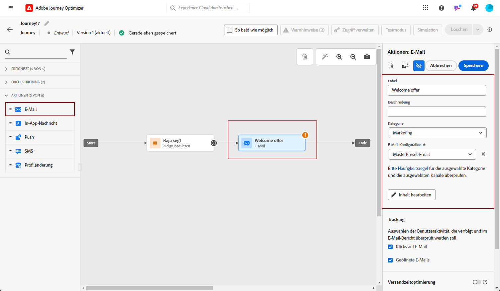
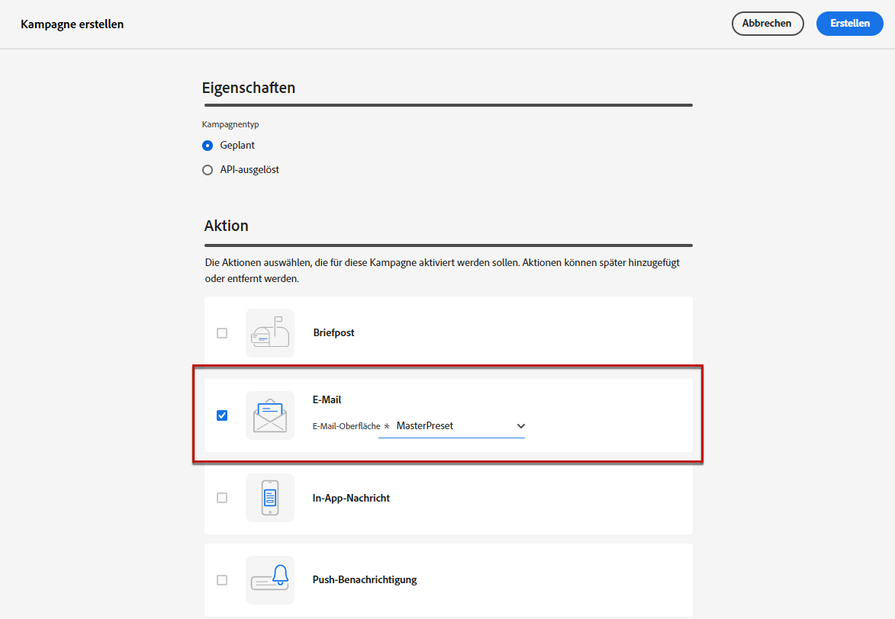
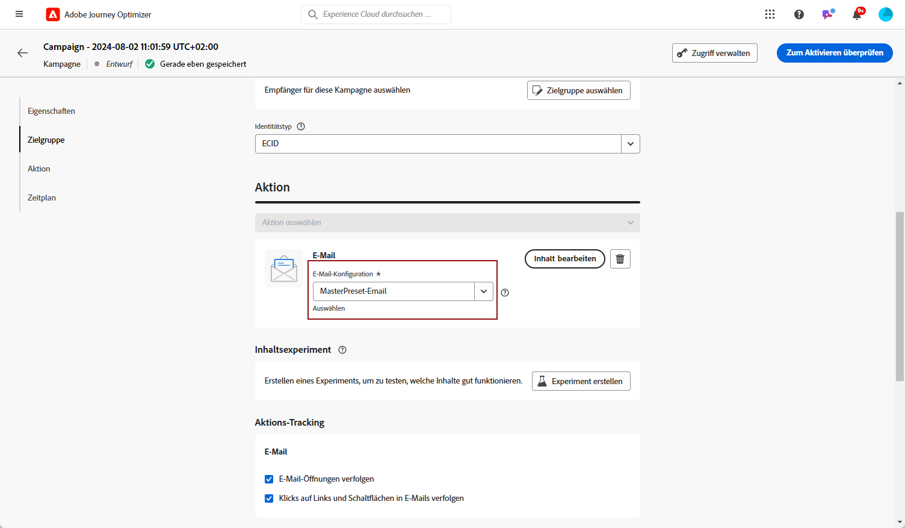
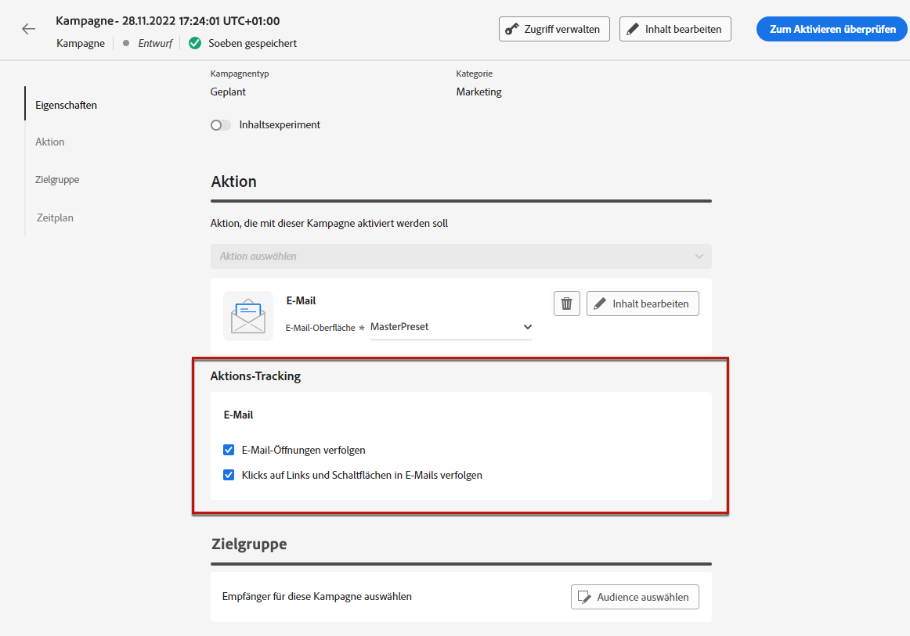
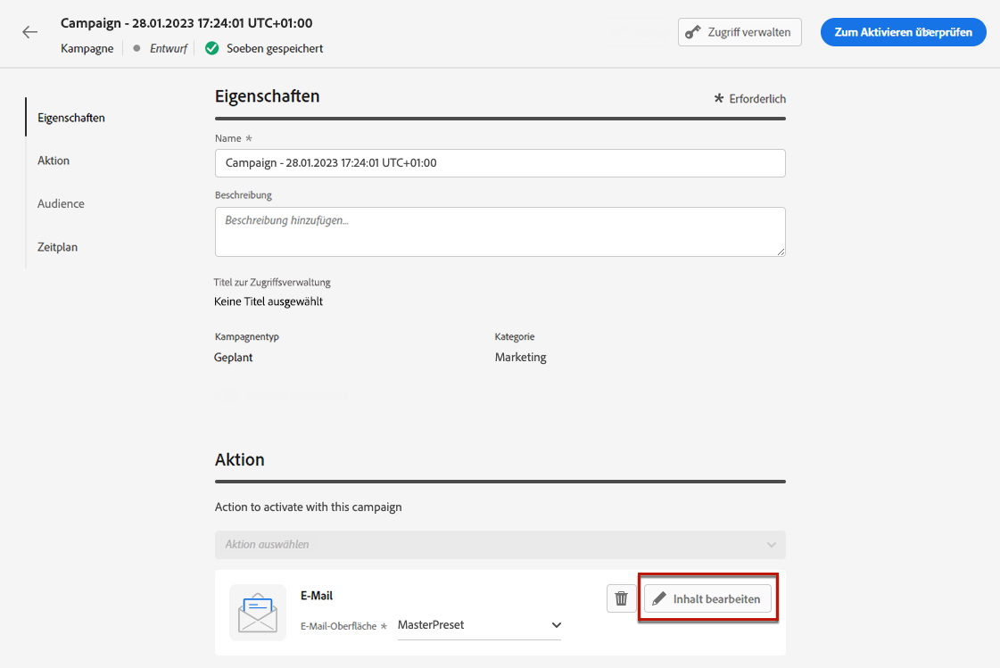
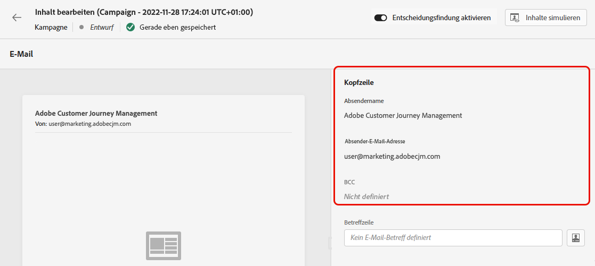
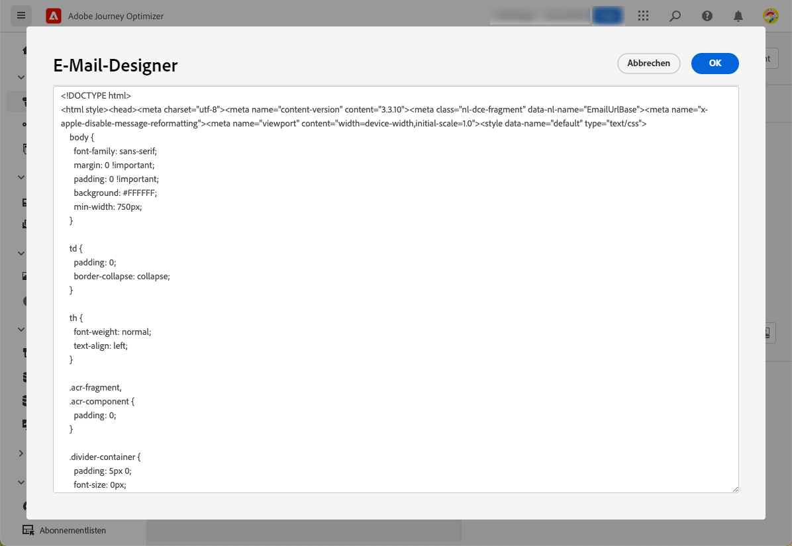
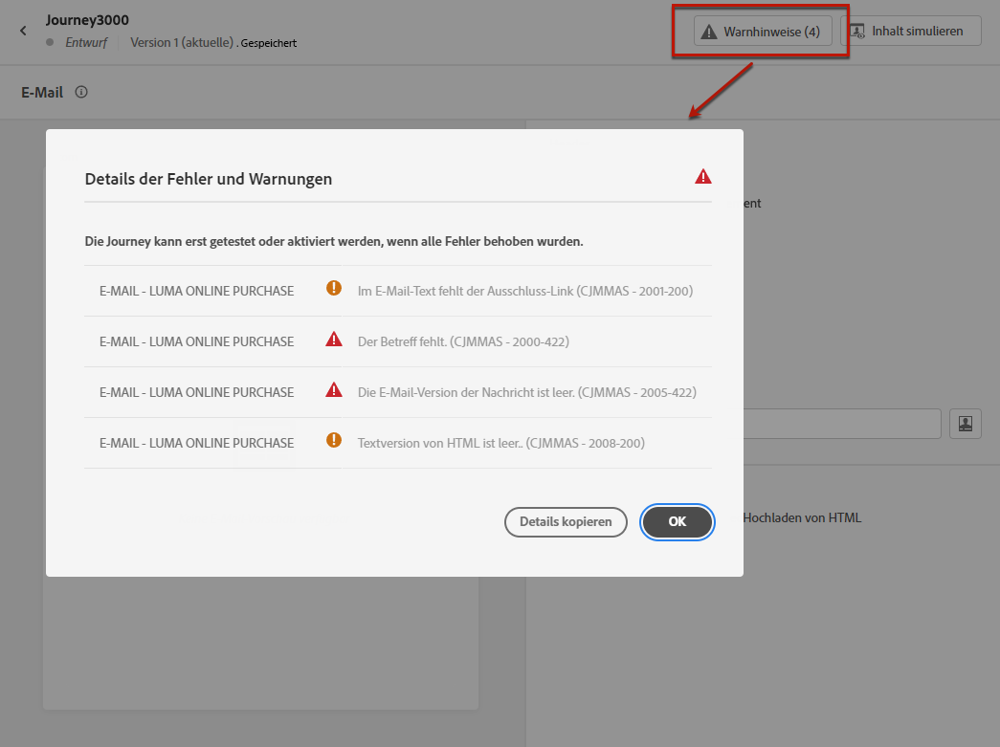
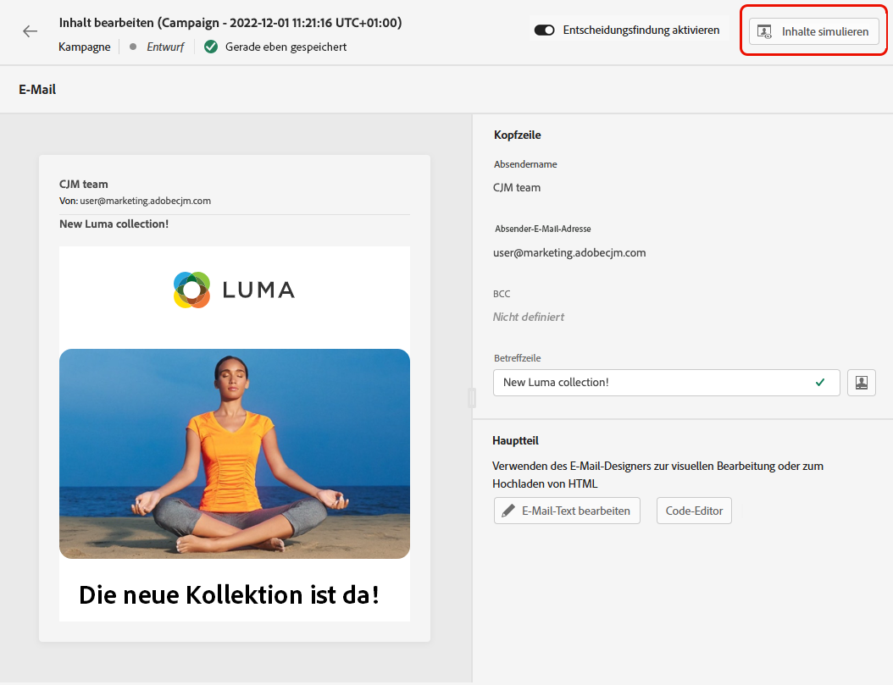
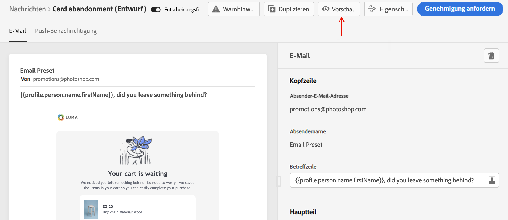

# Erstellen einer E-Mail {#create-email}

>[!CONTEXTUALHELP]
>id="ajo_message_email"
>title="E-Mail-Erstellung"
>abstract="Definieren Sie Ihre E-Mail-Parameter in drei einfachen Schritten."

So erstellen Sie eine E-Mail in [!DNL Journey Optimizer]führen Sie die folgenden Schritte aus.

## Erstellen einer E-Mail in einer Journey oder Kampagne {#create-email-journey-campaign}

Hinzufügen einer **[!UICONTROL Email]** Aktionen auf eine Journey oder Kampagne anwenden und entsprechend Ihrem Fall die folgenden Schritte ausführen.

>[!BEGINTABS]

>[!TAB E-Mail zu einer Journey hinzufügen]

1. Öffnen Sie Ihre Journey und ziehen Sie eine **[!UICONTROL Email]** -Aktivität aus **[!UICONTROL Aktionen]** in der Palette.

1. Geben Sie grundlegende Informationen zu Ihrer Nachricht an (Titel, Beschreibung, Kategorie).

1. Wählen Sie die [E-Mail-Oberfläche](email-settings.md) verwendet werden.

   

>[!NOTE]
>
>Wenn Sie eine E-Mail von einer Journey senden, können Sie die Sendezeitoptimierungsfunktion von Adobe Journey Optimizer nutzen, um die beste Sendezeit für die Nachricht vorherzusagen und so die Interaktion basierend auf historischen Öffnungs- und Klickraten zu maximieren. [Erfahren Sie, wie Sie mit der Sendezeitoptimierung arbeiten.](../building-journeys/journeys-message.md#send-time-optimization)

Weitere Informationen zum Konfigurieren einer Journey finden Sie unter [diese Seite](../building-journeys/journey-gs.md).

>[!TAB Hinzufügen einer E-Mail zu einer Kampagne]

1. Erstellen Sie eine neue geplante oder API-gesteuerte Kampagne und wählen Sie **[!UICONTROL Email]** als Aktion.

1. Wählen Sie die [E-Mail-Oberfläche](email-settings.md) verwendet werden.

   

1. Klicken Sie auf **[!UICONTROL Erstellen]**.

1. Führen Sie die Schritte zur Erstellung einer E-Mail-Kampagne aus, z. B. die Kampagneneigenschaften, [audience](../segment/about-segments.md)und [Zeitplan](../campaigns/create-campaign.md#schedule).

   

<!--
From the **[!UICONTROL Action]** section, specify if you want to track how your recipients react to your delivery: you can track email opens, and/or clicks on links and buttons in your email.

-->

Weitere Informationen zur Konfiguration einer Kampagne finden Sie unter [diese Seite](../campaigns/get-started-with-campaigns.md).

>[!ENDTABS]

## Definieren des E-Mail-Inhalts {#define-email-content}

1. Klicken Sie auf dem Journey- oder Kampagnenkonfigurationsbildschirm auf die Schaltfläche **[!UICONTROL Inhalt bearbeiten]** zum Konfigurieren des E-Mail-Inhalts. [Weitere Informationen](get-started-email-design.md)

   

1. Im **[!UICONTROL Kopfzeile]** Abschnitt **[!UICONTROL Inhalt bearbeiten]** -Bildschirm, die **[!UICONTROL Name des Empfängers]**, **[!UICONTROL Aus E-Mail]** und **[!UICONTROL BCC]** -Feld von der von Ihnen ausgewählten E-Mail-Oberfläche stammen. [Weitere Informationen](email-settings.md) <!--check if same for journey-->

   

1. Sie können eine Betreffzeile hinzufügen. Geben Sie Text direkt in das entsprechende Feld ein oder verwenden Sie die [Ausdruckseditor](../personalization/personalization-build-expressions.md) um die Betreffzeile zu personalisieren.

1. Klicken Sie auf **[!UICONTROL Bearbeiten des E-Mail-Hauptteils]** Schaltfläche zum Erstellen Ihres Inhalts mithilfe der [!DNL Journey Optimizer] Email Designer. [Weitere Informationen](get-started-email-design.md)

   

1. Wenn Sie sich in einer Kampagne befinden, können Sie auch auf die **[!UICONTROL Code-Editor]** -Schaltfläche, um Ihren eigenen Inhalt im einfachen HTML zu kodieren, indem Sie das angezeigte Popup-Fenster verwenden.

   

   >[!NOTE]
   >
   >Wenn Sie Inhalte bereits über Email Designer erstellt oder importiert haben, wird dieser Inhalt auf HTML angezeigt.

## Prüfen von Warnhinweisen {#check-email-alerts}

Während Sie Ihre Nachrichten entwerfen, werden Warnhinweise in der Benutzeroberfläche (oben rechts auf dem Bildschirm) angezeigt, wenn wichtige Einstellungen fehlen.

>[!NOTE]
>
>Wenn diese Schaltfläche nicht angezeigt wird, wurde kein Warnhinweis erkannt.

Die vom System geprüften Einstellungen und Elemente sind unten aufgeführt. Sie finden hier auch Informationen zur Anpassung Ihrer Konfiguration, um die entsprechenden Probleme zu lösen.

Es können zwei Arten von Warnhinweisen auftreten:

* **Warnungen** Empfehlungen und Best Practices, z. B.:

   * **[!UICONTROL Der Ausschluss-Link ist nicht im E-Mail-Text vorhanden]**: Es empfiehlt sich, einen Link zur Abmeldung in Ihren E-Mail-Textkörper einzufügen. In [diesem Abschnitt](../privacy/opt-out.md#opt-out-management) erfahren Sie, wie Sie diesen konfigurieren.

      >[!NOTE]
      >
      >E-Mail-Nachrichten vom Typ Marketing müssen einen Ausschluss-Link enthalten, der für Transaktionsnachrichten nicht erforderlich ist. Die Kategorie der Nachricht (**[!UICONTROL Marketing]** oder **[!UICONTROL Transactional]**) definiert wird unter [Kanaloberfläche](email-settings.md#email-type) Ebene und Zeitpunkt [Nachricht erstellen](#create-email-journey-campaign) von einer Journey oder einer Kampagne.

   * **[!UICONTROL Textversion von HTML ist leer]**: Vergessen Sie nicht, eine Textversion Ihres E-Mail-Textkörpers zu definieren, da diese verwendet wird, wenn HTML-Inhalte nicht angezeigt werden können. In [diesem Abschnitt](text-version-email.md) erfahren Sie, wie Sie die Textversion erstellen.

   * **[!UICONTROL Leerer Link ist im E-Mail-Text vorhanden]**: Überprüfen Sie, ob alle Links in Ihrer E-Mail korrekt sind. In [diesem Abschnitt](content-from-scratch.md) erfahren Sie, wie Sie Inhalte und Links verwalten.

   * **[!UICONTROL Die E-Mail-Größe überschreitet den Grenzwert von 100 KB]**: Stellen Sie sicher, dass die Größe Ihrer E-Mail 100 KB nicht überschreitet, um einen optimalen Versand zu erzielen. In [diesem Abschnitt](content-from-scratch.md) erfahren Sie, wie Sie E-Mail-Inhalte bearbeiten.

* **Fehler** verhindern, dass Sie die Journey/Kampagne testen oder aktivieren, solange sie nicht aufgelöst sind, z. B.:

   * **[!UICONTROL Die Betreffzeile fehlt]**: Die E-Mail-Betreffzeile ist obligatorisch. In [diesem Abschnitt](create-email.md) erfahren Sie, wie Sie sie definieren und personalisieren.

   <!--HTML is empty when Amp HTML is present-->

   * **[!UICONTROL Die E-Mail-Version der Nachricht ist leer]**: Dieser Fehler wird angezeigt, wenn der E-Mail-Inhalt nicht konfiguriert wurde. In [diesem Abschnitt](get-started-email-design.md) erfahren Sie, wie Sie E-Mail-Inhalte entwerfen.

   * **[!UICONTROL Oberfläche existiert nicht]**: Sie können Ihre Nachricht nicht verwenden, wenn die ausgewählte Oberfläche nach der Nachrichtenerstellung gelöscht wird. Wenn dieser Fehler auftritt, wählen Sie in den **[!UICONTROL Eigenschaften]** der Nachricht eine andere Oberfläche aus. Weitere Informationen zu Kanaloberflächen finden Sie in [diesem Abschnitt](../configuration/channel-surfaces.md).

>[!CAUTION]
>
>Um die Journey/Kampagne mithilfe der E-Mail testen oder aktivieren zu können, müssen Sie alle **error** Warnhinweise.

## Vorschau erstellen und E-Mail senden

Nachdem der Nachrichteninhalt definiert wurde, können Sie eine Vorschau davon anzeigen, um das Rendering Ihrer E-Mail zu steuern, und die Personalisierungseinstellungen mit Testprofilen überprüfen. [Weitere Informationen](preview.md)

Wenn Ihre E-Mail fertig ist, konfigurieren Sie Ihre [Journey](../building-journeys/journey-gs.md) oder [Kampagne](../campaigns/create-campaign.md)und aktivieren Sie sie, um die Nachricht zu senden.

>[!NOTE]
>
>Um das Verhalten Ihrer Empfänger über E-Mail-Öffnungen und/oder Interaktionen zu verfolgen, stellen Sie sicher, dass die entsprechenden Optionen in der **[!UICONTROL Tracking]** -Abschnitt im Journey aktiviert werden. [E-Mail-Aktivität](../building-journeys/journeys-message.md) oder in der E-Mail [Kampagne](../campaigns/create-campaign.md).<!--to move?-->

<!--

## Define your email content {#email-content}

Use [!DNL Journey Optimizer] Email Designer to [design your email from scratch](../email/content-from-scratch.md). If you have an existing content, you can [import it in the Email Designer](../email/existing-content.md), or [code your own content](../email/code-content.md) in [!DNL Journey Optimizer]. 

[!DNL Journey Optimizer] comes with a set of [built-in templates](email-templates.md) to help you start. Any email can also be saved as a template.

Use [!DNL Journey Optimizer] Expression editor to personalize your messages with profiles' data. For more on personalization, refer to [this section](../personalization/personalize.md).

Adapt the content of your messages to the targeted profiles by using [!DNL Journey Optimizer] dynamic content capabilities. [Get started with dynamic content](../personalization/get-started-dynamic-content.md)

## Email tracking {#email-tracking}

If you want to track the behavior of your recipients through openings and/or clicks on links, enable the following options: **[!UICONTROL Email opens]** and **[!UICONTROL Click on email]**. 

Learn more about tracking in [this section](message-tracking.md).

## Validate your email content {#email-content-validate}

Control the rendering of your email, and check personalization settings with test profiles, using the preview section on the left-hand side. For more on this, refer to [this section](preview.md).

You must also check alerts in the upper section of the editor.  Some of them are simple warnings, but others can prevent you from using the message. 

-->

