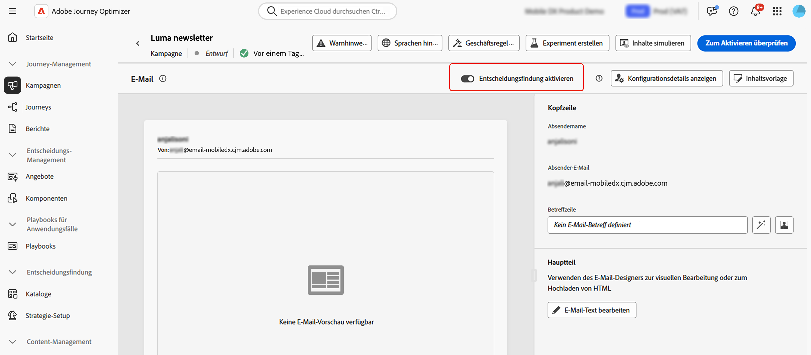

# Erstellen einer E-Mail {#create-email}

>[!CONTEXTUALHELP]
>id="ajo_message_email"
>title="E-Mail-Erstellung"
>abstract="Die Betreffzeile der E-Mail erstellen und den E-Mail-Designer öffnen, um den Inhalt der E-Mail zu erstellen."

## Hinzufügen einer E-Mail-Aktion {#email-action}

Um eine E-Mail in [!DNL Journey Optimizer] zu erstellen, fügen Sie eine **[!UICONTROL E-Mail-Aktion]** auf eine Journey oder eine Kampagne. Führen Sie dann je nach Fall die folgenden Schritte aus.

>[!BEGINTABS]

>[!TAB Hinzufügen einer E-Mail zu einer Journey]

1. Öffnen Sie Ihre Journey und ziehen Sie eine **[!UICONTROL E-Mail]**-Aktivität per Drag-and-Drop aus dem Bereich **[!UICONTROL Aktionen]** der Palette.

1. Geben Sie allgemeine Informationen zu Ihrer Nachricht an (Label, Beschreibung, Kategorie).

1. Wählen oder erstellen Sie die [E-Mail-Konfiguration](email-settings.md).

   

   Das Feld wird standardmäßig mit der letzten Konfiguration ausgefüllt, die die Benutzenden für diesen Kanal verwendet haben.

>[!NOTE]
>
>Sie können die Option „Optimierung des Versandzeitpunkt“ verwenden, um die beste Sendezeit für die Nachricht vorherzusagen und so die Interaktion basierend auf historischen Öffnungs- und Klickraten zu maximieren. [Erfahren Sie, wie Sie die Sendezeitoptimierung verwenden.](../building-journeys/send-time-optimization.md)

Weitere Informationen zur Konfiguration einer Journey finden Sie auf [dieser Seite](../building-journeys/journey-gs.md).

>[!TAB Hinzufügen einer E-Mail zu einer Kampagne]

1. [Erstellen Sie eine Kampagne](../campaigns/create-campaign.md) und wählen Sie **[!UICONTROL E-Mail]** als Aktion aus.

1. Führen Sie die Schritte zur Erstellung einer E-Mail-Kampagne aus, z. B. die Kampagneneigenschaften, [Zielgruppe](../audience/about-audiences.md) und [Zeitplan](../campaigns/campaign-schedule.md).

   

1. Wählen Sie die Aktion **[!UICONTROL E-Mail]** aus.

1. Wählen Sie die E-Mail-Konfiguration aus oder erstellen Sie sie. [Weitere Informationen](email-settings.md)

   

<!--
From the **[!UICONTROL Action]** section, specify if you want to track how your recipients react to your delivery: you can track email opens, and/or clicks on links and buttons in your email.

-->

Weitere Informationen zur Konfiguration Ihrer Kampagne finden Sie auf [dieser Seite](../campaigns/get-started-with-campaigns.md).

>[!ENDTABS]

## Definieren des E-Mail-Inhalts {#define-email-content}

<!-- update the quarry component with right ID value-->

>[!CONTEXTUALHELP]
>id="test_id"
>title="Konfigurieren von E-Mail-Inhalten"
>abstract="Erstellen Sie den Inhalt Ihrer E-Mail. Definieren Sie den Betreff und verwenden Sie dann den E-Mail-Designer, um den Text der E-Mail zu erstellen und zu personalisieren."

Nachdem Sie die E-Mail-Aktion zu Ihrer Journey oder Kampagne hinzugefügt haben, müssen Sie den E-Mail-Inhalt einschließlich Betreffzeile, Absenderinformationen und E-Mail-Textkörper mit dem E-Mail-Designer definieren. Führen Sie folgende Schritte aus:

1. Klicken Sie auf dem Konfigurationsbildschirm der Journey oder Kampagne auf die Schaltfläche **[!UICONTROL Inhalt bearbeiten]**, um den Inhalt der E-Mail zu konfigurieren. [Weitere Informationen](get-started-email-design.md)

   

1. Schalten Sie **[!UICONTROL Entscheidungsfindung aktivieren]** ein, wenn Sie Ihrer E-Mail Entscheidungsrichtlinien hinzufügen möchten.

   Entscheidungsrichtlinien sind Container für Ihre Angebote, die die Entscheidungs-Engine nutzen, um dynamisch die besten Inhalte für jedes Zielgruppenmitglied zurückzugeben. [Infomationen zum Hinzufügen einer Entscheidungsrichtlinie in einer E-Mail](../experience-decisioning/create-decision.md#create-decision)

   

   >[!AVAILABILITY]
   >
   >Derzeit ist die Erstellung von Entscheidungsrichtlinien in E-Mails nur eingeschränkt verfügbar. Wenden Sie sich an den Adobe-Support, um Zugriff zu erhalten.

1. Überprüfen Sie im Abschnitt **[!UICONTROL Header]** die Felder **[!UICONTROL Name der Absenderin bzw. des Absenders]**, **[!UICONTROL Von E-Mail]** und **[!UICONTROL BCC]**. Sie werden in der von Ihnen ausgewählten E-Mail-Konfiguration konfiguriert. [Weitere Informationen](email-settings.md) <!--check if same for journey-->

   

1. Fügen Sie eine Betreffzeile für Ihre Nachricht hinzu. Um die Betreffzeile mit dem Personalisierungseditor zu konfigurieren und zu personalisieren, klicken Sie auf das Symbol **[!UICONTROL Personalisierungsdialog öffnen]**. [Weitere Informationen](../personalization/personalization-build-expressions.md)

   >[!NOTE]
   >
   >Die Betreffzeile ist obligatorisch. Sie darf keine Zeilenumbrüche enthalten.

1. Klicken Sie auf **[!UICONTROL E-Mail-Text bearbeiten]**, um auf den E-Mail-Designer zugreifen und mit der Erstellung Ihres Inhalts zu beginnen. [Weitere Informationen](get-started-email-design.md)

   

1. Wenn Sie sich in einer Kampagne befinden, können Sie auch auf die Schaltfläche **[!UICONTROL Code-Editor]** klicken, um Ihren eigenen Inhalt über das angezeigte Popup-Fenster in HTML zu schreiben.

   

   >[!NOTE]
   >
   >Wenn Sie bereits über den E-Mail-Designer Inhalt erstellt oder importiert haben, wird dieser Inhalt in HTML angezeigt.

## Prüfen von Warnhinweisen {#check-email-alerts}

Während Sie Ihre Nachrichten entwerfen, werden Warnhinweise in der Benutzeroberfläche (oben rechts auf dem Bildschirm) angezeigt, wenn wichtige Einstellungen fehlen.

>[!NOTE]
>
>Wenn diese Schaltfläche nicht angezeigt wird, wurde kein Warnhinweis erkannt.

Die vom System geprüften Einstellungen und Elemente sind unten aufgeführt. Sie finden hier auch Informationen zur Anpassung Ihrer Konfiguration, um die entsprechenden Probleme zu lösen.

Es können zwei Arten von Warnhinweisen auftreten:

* **Warnhinweise** geben Hinweise auf Empfehlungen und zeigen Best Practices, wie etwa:

   * **[!UICONTROL Der Ausschluss-Link ist nicht im E-Mail-Text vorhanden]**: Es empfiehlt sich, einen Link zur Abmeldung in Ihren E-Mail-Textkörper einzufügen. In [diesem Abschnitt](../privacy/opt-out.md#opt-out-decision-management) erfahren Sie, wie Sie diesen konfigurieren.

     >[!NOTE]
     >
     >E-Mail-Nachrichten vom Typ Marketing müssen einen Ausschluss-Link enthalten, der für Transaktionsnachrichten nicht erforderlich ist. Die Nachrichtenkategorie (**[!UICONTROL Marketing]** oder **[!UICONTROL Transaktion]**) wird auf der Ebene der [Kanalkonfiguration](email-settings.md#email-type) und beim [Erstellen der Nachricht](#create-email-journey-campaign) über eine Journey oder Kampagne definiert.

   * **[!UICONTROL Textversion von HTML ist leer]**: Vergessen Sie nicht, eine Textversion Ihres E-Mail-Textkörpers zu definieren, da diese verwendet wird, wenn HTML-Inhalte nicht angezeigt werden können. In [diesem Abschnitt](text-version-email.md) erfahren Sie, wie Sie die Textversion erstellen.

   * **[!UICONTROL Leerer Link ist im E-Mail-Text vorhanden]**: Überprüfen Sie, ob alle Links in Ihrer E-Mail korrekt sind. In [diesem Abschnitt](content-from-scratch.md) erfahren Sie, wie Sie Inhalte und Links verwalten.

   * **[!UICONTROL Die E-Mail-Größe überschreitet den Grenzwert von 100 KB]**: Stellen Sie sicher, dass die Größe Ihrer E-Mail 100 KB nicht überschreitet, um einen optimalen Versand zu erzielen. In [diesem Abschnitt](content-from-scratch.md) erfahren Sie, wie Sie E-Mail-Inhalte bearbeiten.

* **Fehler** verhindern, dass Sie die Journey bzw. Kampagne testen oder aktivieren, solange nicht alle Fehler behoben sind. Beispiele sind:

   * **[!UICONTROL Die Betreffzeile fehlt]**: Die E-Mail-Betreffzeile ist obligatorisch. In [diesem Abschnitt](create-email.md) erfahren Sie, wie Sie sie definieren und personalisieren.

  <!--HTML is empty when Amp HTML is present-->

   * **[!UICONTROL Die E-Mail-Version der Nachricht ist leer]**: Dieser Fehler wird angezeigt, wenn der E-Mail-Inhalt nicht konfiguriert wurde. In [diesem Abschnitt](get-started-email-design.md) erfahren Sie, wie Sie E-Mail-Inhalte entwerfen.

   * **[!UICONTROL Konfiguration ist nicht vorhanden]**: Sie können Ihre Nachricht nicht veröffentlichen, wenn die gewählte Konfiguration nach der Erstellung der Nachricht gelöscht wurde. Wenn dieser Fehler auftritt, wählen Sie in den **[!UICONTROL Eigenschaften]** der Nachricht eine andere Konfiguration aus. Weitere Informationen zu Kanalkonfigurationen finden Sie in [diesem Abschnitt](../configuration/channel-surfaces.md).

>[!CAUTION]
>
>Um die Journey bzw. Kampagne mithilfe der E-Mail testen oder aktivieren zu können, müssen Sie zunächst alle **Fehler-Warnungen** beheben.

## Überprüfen und Senden der E-Mail

Sobald Ihr Nachrichteninhalt definiert wurde, können Sie mithilfe von Testprofilen die Vorschau anzeigen, Testsendungen durchführen und das Rendering in beliebten Desktop-, Mobile- und Web-basierten Clients steuern. Wenn Sie personalisierte Inhalte eingefügt haben, können Sie mithilfe von Testprofildaten überprüfen, wie diese Inhalte in der Nachricht angezeigt werden.

Sie können auch die Qualität Ihrer Inhalte überprüfen, um Lesbarkeit, Effektivität und Inhaltskohärenz zu bewerten. [Erfahren Sie mehr über die Validierung der Inhaltsqualität](../content-management/brands-score.md#validate-quality)

>[!NOTE]
>
>Zusätzlich zu Testprofilen, können Sie mit [!DNL Journey optimizer] auch verschiedene Varianten Ihrer Inhalte testen, indem Sie sie in der Vorschau anzeigen und einen Testversand mit Beispieleingabedaten durchführen, die aus einer CSV- oder JSON-Datei hochgeladen oder manuell hinzugefügt wurden. [Informationen zum Simulieren von Inhaltsvarianten](../test-approve/simulate-sample-input.md)

Klicken Sie dazu auf **[!UICONTROL Inhalt simulieren]** und fügen Sie dann ein Testprofil hinzu, um Ihre Nachricht mithilfe der Testprofildaten zu überprüfen.

Detaillierte Informationen zur Auswahl von Testprofilen und zur Vorschau Ihres Inhalts finden Sie im Abschnitt [Content-Management](../content-management/preview-test.md).

Wenn Ihre E-Mail bereit ist, schließen Sie die Konfiguration Ihrer [Journey](../building-journeys/journey-gs.md) oder [Kampagne](../campaigns/create-campaign.md) ab und aktivieren Sie diese, um die Nachricht zu senden.

>[!NOTE]
>
>Um das Verhalten Ihrer Empfänger und Empfängerinnen durch E-Mail-Öffnungen und/oder Interaktionen nachzuverfolgen, stellen Sie sicher, dass die entsprechenden Optionen im Abschnitt **[!UICONTROL Tracking]** in der [E-Mail-Aktivität](../building-journeys/journeys-message.md) der Journey oder in der E-Mail-[Kampagne](../campaigns/create-campaign.md) aktiviert sind.<!--to move?-->

<!--

## Define your email content {#email-content}

Use [!DNL Journey Optimizer] Email Designer to [design your email from scratch](../email/content-from-scratch.md). If you have an existing content, you can [import it in the Email Designer](../email/existing-content.md), or [code your own content](../email/code-content.md) in [!DNL Journey Optimizer]. 

[!DNL Journey Optimizer] comes with a set of [built-in templates](email-templates.md) to help you start. Any email can also be saved as a template.

Use [!DNL Journey Optimizer] personalization editor to personalize your messages with profiles' data. For more on personalization, refer to [this section](../personalization/personalize.md).

Adapt the content of your messages to the targeted profiles by using [!DNL Journey Optimizer] dynamic content capabilities. [Get started with dynamic content](../personalization/get-started-dynamic-content.md)

## Email tracking {#email-tracking}

If you want to track the behavior of your recipients through openings and/or clicks on links, enable the following options: **[!UICONTROL Email opens]** and **[!UICONTROL Click on email]**. 

Learn more about tracking in [this section](message-tracking.md).

## Validate your email content {#email-content-validate}

Control the rendering of your email, and check personalization settings with test profiles, using the preview section on the left-hand side. For more on this, refer to [this section](preview.md).

You must also check alerts in the upper section of the editor.  Some of them are simple warnings, but others can prevent you from using the message. 

-->

