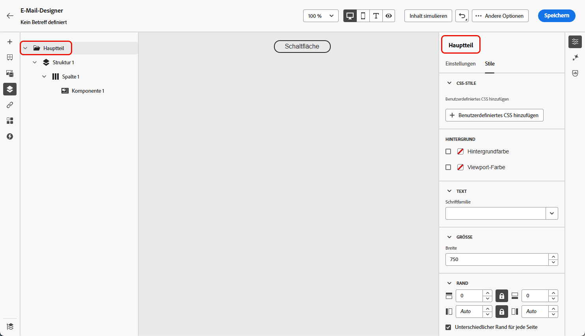
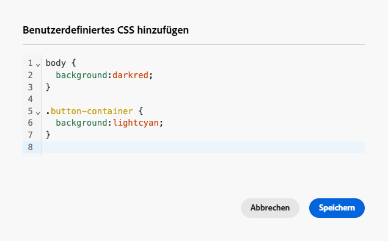
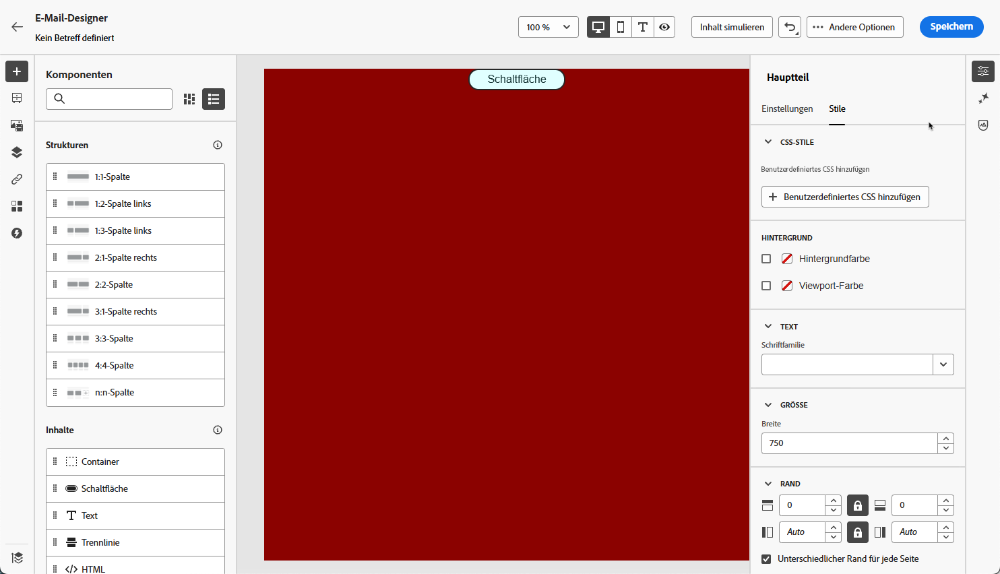

# Hinzufügen von benutzerdefiniertem CSS zu Ihrem E-Mail-Inhalt {#email-metadata}

>[!CONTEXTUALHELP]
>id="ac_edition_css"
>title="Eigenes CSS eingeben"
>abstract="Für mehr Flexibilität und Kontrolle über das Erscheinungsbild Ihrer Inhalte können Sie benutzerdefiniertes CSS direkt in der E-Mail-Designer hinzufügen, um erweiterte und spezifische Stile anzuwenden."

Beim Entwerfen Ihrer E-Mails können Sie Ihr eigenes benutzerdefiniertes CSS direkt in der [!DNL Journey Optimizer]E-[-Designer](get-started-email-design.md) hinzufügen. Mit dieser Funktion können Sie erweiterte und spezifische Stile anwenden, um die Flexibilität und Kontrolle über das Erscheinungsbild Ihrer Inhalte zu erhöhen.

## Benutzerdefiniertes CSS definieren {#define-custom-css}

Gehen Sie wie folgt vor, um benutzerdefinierten CSS-Code zu Ihrem E-Mail-Inhalt hinzuzufügen.

1. Stellen Sie sicher, dass in der E-Mail-Designer ein Inhalt definiert ist, indem Sie mindestens eine [Komponente](content-components.md) hinzufügen.

1. Wählen **[!UICONTROL Textkörper]** entweder über den **[!UICONTROL Navigationsbaum]** links oder oben im rechten Bereich aus. Der Abschnitt **[!UICONTROL CSS]** Stile“ wird auf der rechten Seite angezeigt.

   {width="85%"}

   >[!NOTE]
   >
   >Der Abschnitt **[!UICONTROL CSS]** Stile“ ist nur verfügbar, wenn der Inhalt bereits im Editor vorhanden ist.

1. Geben Sie Ihren CSS-Code in den entsprechenden Textbereich ein, der angezeigt wird. Stellen Sie sicher, dass das benutzerdefinierte CSS gültig ist und der richtigen Syntax folgt. [Weitere Informationen](#use-valid-css)

   {width="65%"}

   >[!NOTE]
   >
   >Die Schaltfläche **[!UICONTROL Benutzerdefiniertes CSS hinzufügen]** ist nur verfügbar, wenn **[!UICONTROL Body]** ausgewählt ist. Sie können jedoch benutzerdefinierte CSS-Stile auf alle Komponenten in Ihrem Inhalt anwenden.

1. Speichern Sie das benutzerdefinierte CSS und überprüfen Sie, ob das benutzerdefinierte CSS korrekt auf Ihren Inhalt angewendet wird. Ist dies nicht der Fall, lesen Sie den Abschnitt [Fehlerbehebung](#troubleshooting).

   {width="85%"}

1. Wenn Sie den gesamten Inhalt entfernen, wird der Abschnitt ausgeblendet und das zuvor definierte benutzerdefinierte CSS wird nicht mehr angewendet.

1. Fügen Sie dem Editor wieder Inhalte hinzu, damit der Abschnitt **[!UICONTROL CSS-Stile]** wieder angezeigt wird. Das benutzerdefinierte CSS wird erneut angewendet.

## Sicherstellen, dass gültiges CSS verwendet wird {#use-valid-css}

Sie können eine beliebige gültige CSS-Zeichenfolge im Textbereich **[!UICONTROL Benutzerdefiniertes CSS hinzufügen]** eingeben. Richtig formatiertes CSS wird sofort auf den Inhalt angewendet.

>[!CAUTION]
>
>Benutzer sind für die Sicherheit ihres benutzerdefinierten CSS verantwortlich. Stellen Sie sicher, dass Ihr CSS keine Sicherheitslücken enthält oder mit den vorhandenen Inhalten in Konflikt steht.
>
>Vermeiden Sie die Verwendung von CSS, das unbeabsichtigt das Layout oder die Funktionalität des Inhalts beeinträchtigen könnte.

### Gültiges CSS

Im Folgenden finden Sie Beispiele für gültiges CSS.

```css
.acr-component[data-component-id="form"] {
  display: flex;
  justify-content: center;
  background: none;
}

.acr-Form {
  width: 100%;
  padding: 20px 100px;
  border-spacing: 0px 8px;
  box-sizing: border-box;
  margin: 0;
}

.acr-Form .spectrum-FieldLabel {
  width: 20%;
}

.acr-Form.spectrum-Form--labelsAbove .spectrum-FieldLabel,
.acr-Form [data-form-item="checkbox"] .spectrum-FieldLabel {
  width: auto;
}

.acr-Form .spectrum-Textfield {
  width: 100%;
}

#acr-form-error,
#acr-form-confirmation {
  width: 100%;
  padding: var(--spectrum-global-dimension-static-size-500);
  display: flex;
  align-items: center;
  flex-direction: column;
  justify-content: center;
  gap: var(--spectrum-global-dimension-static-size-200);
}

.spectrum-Form-item.is-required .spectrum-FieldLabel:after{
  content: '*';
  font-size: 1.25rem;
  margin-left: 5px;
  position: absolute;
}

/* Error field placeholder */
.spectrum-HelpText {
  display: none !important;
}

.spectrum-HelpText.is-invalid,
.is-invalid ~ .spectrum-HelpText {
  display: flex !important;
}
```

```css
@media only screen and (min-width: 600px) {
  .acr-paragraph-1 {
    width: 100% !important;
  }
}
```

### Ungültiges CSS

Wenn ungültiges CSS eingegeben wird, wird eine Fehlermeldung angezeigt, die darauf hinweist, dass das CSS nicht gespeichert werden kann. Im Folgenden finden Sie Beispiele für ungültiges CSS.

Die Verwendung von `<style>`-Tags wird nicht akzeptiert:

```html
<style type="text/css">
  .acr-Form {
    width: 100%;
    padding: 20px 100px;
    border-spacing: 0px 8px;
    box-sizing: border-box;
    margin: 0;
  }
</style>
```

Ungültige Syntax wie fehlende Klammern wird nicht akzeptiert:

```css
body {
  background: red;
```

## Technische Implementierung {#implementation}

Ihr benutzerdefiniertes CSS wird am Ende des `<head>` Abschnitts als Teil eines `<style>`-Tags mit dem Attribut `data-name="global-custom"` hinzugefügt, wie im folgenden Beispiel dargestellt. Dadurch wird sichergestellt, dass die benutzerdefinierten Stile global auf die Inhalte angewendet werden.

```html
<!DOCTYPE html>
<html>
  <head>
    <meta charset="utf-8">
    <meta name="content-version" content="3.3.31">
    <meta name="x-apple-disable-message-reformatting">
    <meta name="viewport" content="width=device-width,initial-scale=1.0">
    <style data-name="default" type="text/css">
      td { padding: 0; }
      th { font-weight: normal; }
    </style>
    <style data-name="grid" type="text/css">
      .acr-grid-table { width: 100%; }
    </style>
    <style data-name="acr-theme" type="text/css" data-theme="default" data-variant="0">
      body { margin: 0; font-family: Arial; }
    </style>
    <style data-name="media-default-max-width-500px" type="text/css">
      @media screen and (max-width: 500px) {
        body { width: 100% !important; }
      }
    </style>
    <style data-name="global-custom" type="text/css">
      /* Add you custom CSS here */
    </style>
  </head>
  <body>
    <!-- Minimal content -->
  </body>
</html>
```

Das benutzerdefinierte CSS wird vom Bereich „Einstellungen“ der E-Mail-**[!UICONTROL -Designer]** interpretiert oder überprüft. Sie ist völlig unabhängig und kann nur über die Option **[!UICONTROL Benutzerdefiniertes CSS hinzufügen]** geändert werden.

Wenn für das `global-custom`-Stil-Tag das Attribut `data-disabled` auf `true` festgelegt ist, wird das benutzerdefinierte CSS nicht angewendet. z. B.:

```html
<style data-name="global-custom" type="text/css" data-disabled="true"> body: { color: red; } </style>
```

### Importierter Inhalt

Wenn Sie benutzerdefiniertes CSS mit Inhalten verwenden möchten, die in die E-Mail-Designer importiert wurden, sollten Sie Folgendes beachten:

* Wenn Sie externe HTML-Inhalte einschließlich CSS importieren, werden diese Inhalte - sofern sie nicht konvertiert werden - im **[!UICONTROL Kompatibilitätsmodus]** gespeichert, wo der Abschnitt **[!UICONTROL CSS-]**) nicht verfügbar ist. [Weitere Informationen zum Importieren vorhandener Inhalte](existing-content.md)

* Beim Importieren von Inhalten, die mit E-Mail-Designer erstellt wurden, einschließlich CSS, das über die Option **[!UICONTROL Benutzerdefiniertes CSS hinzufügen]** angewendet wurde, ist das zuvor angewendete CSS über dieselbe Option sichtbar und bearbeitbar.

<!--
* If importing content created with the Email Designer with CSS applied externally, the CSS code previously applied cannot be accessed within the **[!UICONTROL Add custom CSS]** pop-up window, but you can still override it with new custom CSS.-->

## Fehlerbehebung {#troubleshooting}

Wenn Ihr benutzerdefiniertes CSS nicht angewendet wird, sollten Sie die folgenden Optionen berücksichtigen.

* Stellen Sie sicher, dass Ihr CSS gültig und frei von Syntaxfehlern (z. B. fehlende Klammern, falsche Eigenschaftsnamen) ist. [Weitere Informationen](#use-valid-css)

* Stellen Sie sicher, dass Ihr CSS zum `<style>`-Tag mit dem `data-name="global-custom"`-Attribut hinzugefügt wird und dass `data-disabled` nicht auf `global-custom` angewendet wird. [Weitere Informationen](#implementation)

* Stellen Sie sicher, dass Ihr CSS nicht durch andere CSS-Regeln überschrieben wird, einschließlich [Designs](apply-email-themes.md), die auf Ihren Inhalt angewendet werden.

   * Verwenden Sie Ihre Browser-Entwickler-Tools, um den Inhalt zu überprüfen und sicherzustellen, dass Ihr CSS auf die richtigen Selektoren abzielt.

   * Erwägen Sie, Ihren Deklarationen `!important` hinzuzufügen, um sicherzustellen, dass sie Vorrang haben. z. B.:

     ```css
     .acr-Form {
       background: red !important;
     }
     ```
