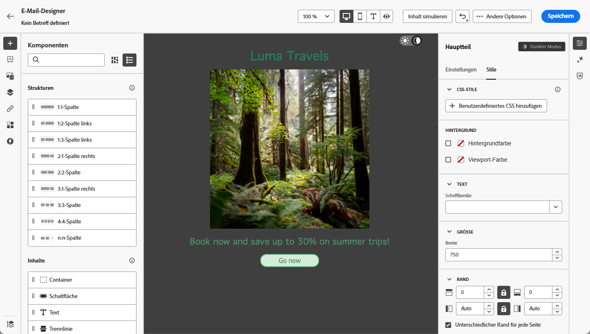
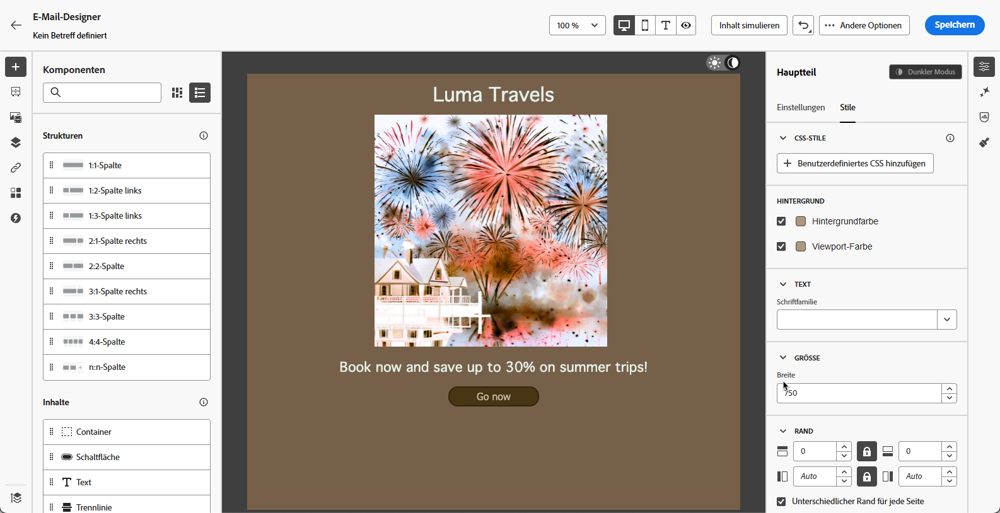
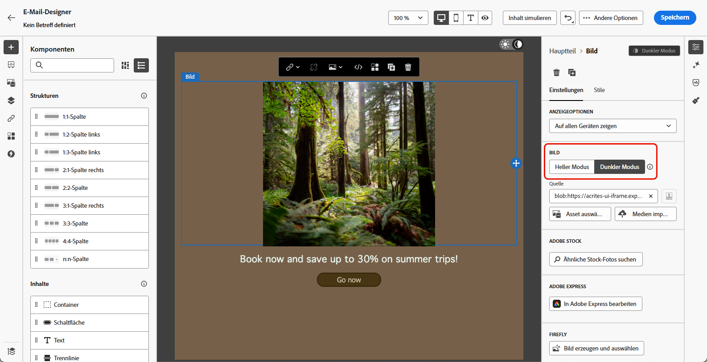
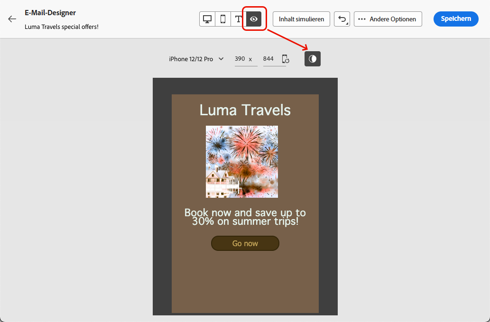
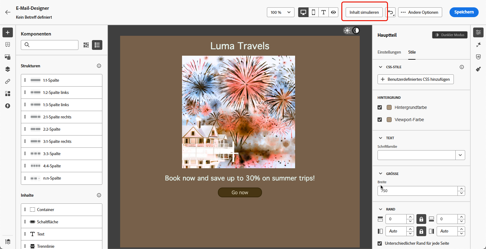

# Verwalten von Inhalten für den dunklen Modus {#dark-mode}

>[!CONTEXTUALHELP]
>id="ac_edition_darkmode"
>title="Wechseln zum dunklen Modus"
>abstract="Wechseln Sie in den dunklen Modus, um eine Vorschau des Renderings zu erhalten und spezifische benutzerdefinierte Einstellungen festzulegen.  Das endgültige Rendering hängt vom E-Mail-Client der Empfangenden ab. Beachten Sie, dass nicht alle E-Mail-Clients den benutzerdefinierten dunklen Modus unterstützen."

>[!CONTEXTUALHELP]
>id="ac_edition_darkmode_preview"
>title="Wechseln zum dunklen Modus"
>abstract="Wechseln Sie zum dunklen Modus, um eine Vorschau des Renderings auf unterstützenden E-Mail-Clients anzuzeigen.  Das endgültige Rendering hängt vom E-Mail-Client der Empfangenden ab. Beachten Sie, dass nicht alle E-Mail-Clients den dunklen Modus unterstützen."

Beim Gestalten Ihrer E-Mails können Sie mit dem [!DNL Journey Optimizer] [E-Mail-Designer](get-started-email-design.md) zur Ansicht **[!UICONTROL Dunkler Modus]** wechseln.

In der Ansicht „Dunkler Modus“ von <!--Email Designer --> können Sie auch spezifische benutzerdefinierte Einstellungen definieren, die von den unterstützenden E-Mail-Clients angezeigt werden, wenn ihr dunkler Modus aktiviert ist.

<!--When designing your emails, the Journey Optimizer Email Designer allows you to switch to Dark mode where you can define specific custom settings. When dark mode is on, the supporting email clients will display the settings that you defined for this mode.-->

## Was ist der dunkle Modus? {#what-is-dark-mode}

Das Rendering des dunklen Modus in den verschiedenen E-Mail-Clients ist komplex. Definieren wir zunächst den dunklen Modus.

Der dunkle Modus ermöglicht es unterstützenden E-Mail-Clients und Anwendungen, E-Mails mit dunkleren Hintergründen und helleren Farben für Text, Schaltflächen und andere UI-Elemente anzuzeigen. Dadurch werden die Augen entlastet, die Akkulaufzeit verlängert und die Lesbarkeit in schwach beleuchteten Umgebungen verbessert – für ein angenehmeres Seherlebnis.

<!--Dark Mode uses a dark color palette with light text and UI elements to reduce eye strain, save battery life, and improve readability in low-light environments.-->

Da der dunkle Modus zunehmend von führenden Betriebssystemen und Anwendungen<!-- (Apple Mail, Gmail, Outlook, Twitter, Slack)--> unterstützt wird, ist er zu einem wichtigen Bestandteil des modernen E-Mail-Designs geworden, um sicherzustellen, dass Inhalte für alle Nutzenden lesbar und visuell ansprechend bleiben.

## Leitlinien {#guardrails}

Die Erwartungen hinsichtlich des Renderings im dunklen Modus sollten unter Vorbehalt betrachtet werden, da die Umsetzung je nach E-Mail-Client stark variieren kann.

<!--The dark mode final rendering depends on the recipient's email client. It is not possible to guarantee that your email will look the same in dark mode across all devices.-->

Bevor Sie den dunklen Modus im E-Mail-Designer von [!DNL Journey Optimizer] verwenden, müssen Sie wissen, wie die wichtigsten E-Mail-Clients damit umgehen. Es sind drei Fälle zu unterscheiden:

<!--
* Check out the list of [email clients supporting dark mode](https://www.caniemail.com/search/?s=dark){target="_blank"}

* Learn more on Dark mode in this [Litmus blog post](https://www.litmus.com/blog/the-ultimate-guide-to-dark-mode-for-email-marketers){target="_blank"}
-->

### Clients, die keinen dunklen Modus unterstützen {#not-supporting}

Einige E-Mail-Clients unterstützen diese Funktion überhaupt nicht, z. B.:

* Yahoo!Mail
* AOL

Unabhängig davon, ob Sie im E-Mail-Designer benutzerdefinierte Einstellungen für den dunklen Modus festlegen oder nicht, zeigen diese E-Mail-Clients niemals ein Rendering im dunklen Modus an. <!--Regardless of whether the interface is in light or dark mode, your email will render the same.-->

### Clients, die ihren eigenen dunklen Modus anwenden {#default-support}

Einige E-Mail-Clients wenden systematisch ihren eigenen standardmäßigen dunklen Modus auf alle empfangenen E-Mails an. Farben, Hintergründe, Bilder usw. werden automatisch mit den für den E-Mail-Client spezifischen Einstellungen für den dunklen Modus angepasst, was bedeutet, dass keine externe Änderung möglich ist.

<!--It is important to note that less than 25% of email clients offer customization options for dark mode. Clients such as Gmail implement their own dark mode rendering, which is not subject to external modification.-->

Zu diesen Clients gehören zum Beispiel:

* Gmail (Desktop-Webmail, iOS, Android, Mobile-Webmail)
* Outlook Windows
* Outlook Windows Mail

In diesem Fall werden benutzerdefinierte Einstellungen, die Sie im E-Mail-Designer für den dunklen Modus festlegen, durch die Einstellungen des E-Mail-Clients überschrieben.

Es ist wichtig zu verstehen, dass diese E-Mail-Clients zwar den dunklen Modus unterstützen, Ihr spezifisches Design für den dunklen Modus jedoch nicht gerendert wird.

<!--In this case, the custom settings that you defined in the Email Designer cannot be rendered.-->

<!--Some visual changes may also be caused by the email app or device overriding the original design.-->

### Clients, die den benutzerdefinierten dunklen Modus unterstützen {#custom-support}

Andere E-Mail-Clients bieten die Option, den benutzerdefinierten dunklen Modus mit der Abfrage `@media (prefers-color-scheme: dark)` zu rendern. Diese Methode wird auch vom E-Mail-Designer von [!DNL Journey Optimizer] verwendet.

Im Folgenden finden Sie eine Liste der wichtigsten Clients, die diese Option unterstützen:

* Apple Mail für macOS
* Apple Mail für iOS
* Outlook für macOS
* Outlook.com
* Outlook für iOS
* Outlook für Android

In diesem Fall sollten die spezifischen Einstellungen angezeigt werden, die im E-Mail-Designer festgelegt wurden.

>[!NOTE]
>
>In [diesem Abschnitt](#define-custom-dark-mode) erfahren Sie, wie Sie mit dem E-Mail-Designer benutzerdefinierte Einstellungen für den dunklen Modus festlegen können.

Je nach E-Mail-Client können jedoch einige Einschränkungen gelten. Beispielsweise erzeugen einige Clients wie Apple Mail 16 (macOS 13) keinen dunklen Modus, wenn im E-Mail-Content Bilder vorhanden sind.

Um optimale Ergebnisse zu erzielen, testen Sie Ihre Inhalte mit den beabsichtigten E-Mail-Clients. Um eine Simulation anzuzeigen, die dem Endergebnis für jeden Client so nahe wie möglich kommt, verwenden Sie die Option [E-Mail-Rendering](../content-management/rendering.md) im E-Mail-Designer.

## Dunkler Modus im E-Mail-Designer {#dark-mode-email-designer}

Beim dunklen Modus im E-Mail-Designer sind zwei Aspekte zu berücksichtigen:

* Sie können eine Vorschau anzeigen, wie der standardmäßige dunkle Modus in den meisten unterstützenden E-Mail-Clients gerendert wird. [Weitere Informationen](#preview-dark-mode)

<!--
    >[!CAUTION]
    >
    >The final rendering may vary according to the recipient's email client. To see the exact rendering for each email client, use the [Email rendering](../content-management/rendering.md) option.-->

* Wenn Sie die Standardeinstellungen unterstützender E-Mail-Clients überschreiben möchten, können Sie benutzerdefinierte Einstellungen für den dunklen Modus definieren, die auf die E-Mail angewendet werden, die Sie bearbeiten. [Weitere Informationen](#define-custom-dark-mode)

<!--
    >[!WARNING]
    >
    >Not all email clients support custom dark mode. Some email clients only apply their own default dark mode for all emails that are received. In this case, the custom settings that you defined in the Email Designer cannot be rendered. [Learn more](#guardrails)-->

### Vorschau des standardmäßigen dunklen Modus {#preview-dark-mode}

Gehen Sie wie folgt vor, um auf den dunklen Modus im E-Mail-Designer zuzugreifen und eine Vorschau der Einstellungen für den standardmäßigen dunklen Modus zu erhalten.

1. Wählen Sie auf der Startseite des E-Mail-Designers die Option **[!UICONTROL Inhalte von Grund auf neu erstellen]** aus. [Weitere Informationen](content-from-scratch.md)

<!--Should work with templates and themes, NOT for LP and fragments - but TBC with eng.
    >[!NOTE]
    >
    >Currently you may not be able to switch to dark mode if you select an [email template](use-email-templates.md) or if you apply a [theme](apply-email-themes.md).-->

1. Fügen Sie Ihrem Inhalt [Strukturen](content-from-scratch.md) und [Inhaltskomponenten](content-components.md) hinzu.

1. Schalten Sie oben rechts auf der zentralen Arbeitsfläche den Umschalter in den **[!UICONTROL dunklen Modus]**.

   

1. Die Vorschau des standardmäßigen dunklen Modus wird angezeigt.

   

Standardmäßig wendet die Vorschau des dunklen Modus im E-Mail-Designer das Farbschema „Vollfarbinvertierung“ auf alle Elemente außer auf Bilder und Symbole an. 

Das bedeutet, dass Bereiche mit hellen und dunklen Elementen erkannt und invertiert werden, sodass helle Hintergründe dunkel und dunkler Text hell werden, während dunkle Hintergründe hell und heller Text dunkel werden.

>[!CAUTION]
>
>Das endgültige Rendering kann je nach E-Mail-Client der Empfängerinnen und Empfänger variieren. Um für jeden E-Mail-Client eine Simulation anzuzeigen, die dem Endergebnis möglichst nahe kommt, verwenden Sie die Option [E-Mail-Rendering](../content-management/rendering.md).

<!--This is custom dark mode:

  

Here you can see that we have applied a different background, defined another image and change the color of the text and button.-->

### Definieren des benutzerdefinierten dunklen Modus {#define-custom-dark-mode}

>[!CONTEXTUALHELP]
>id="ac_edition_darkmode_image"
>title="Verwenden eines bestimmten Bildes für den dunklen Modus"
>abstract="Es kann ein anderes Bild ausgewählt werden, das angezeigt wird, wenn der dunkle Modus aktiviert ist.  Das Hinzufügen eines bestimmten Bildes für den dunklen Modus garantiert nicht, dass es in allen E-Mail-Clients ordnungsgemäß gerendert wird. Beachten Sie, dass nicht alle E-Mail-Clients den benutzerdefinierten dunklen Modus unterstützen."

Nach dem Wechsel in den **[!UICONTROL dunklen Modus]** können Sie bestimmte Stilelemente Ihres Inhalts bearbeiten, die nur angezeigt werden, wenn der dunkle Modus im E-Mail-Client der Empfängerin bzw. des Empfängers aktiviert ist, sofern diese Funktion unterstützt wird.

>[!WARNING]
>
>Das endgültige Rendering im dunklen Modus hängt vom individuellen E-Mail-Client ab, die Ergebnisse können daher variieren. [Weitere Informationen](#guardrails)

<!--
>[!WARNING]
>
>Not all email clients support dark mode. Moreover, some email clients only apply their own default dark mode for all emails that are received. In both cases, the custom settings that you defined in the Email Designer cannot be rendered.-->

Um den Stil des E-Mail-Designers für den benutzerdefinierten dunklen Modus zu nutzen, verwendet Journey Optimizer die CSS-Abfrage <!-- `@media (prefers-color-scheme: dark)` method--> `@media (prefers-color-scheme: dark)`, die erkennt, ob der E-Mail-Client der Benutzerin oder des Benutzers auf den dunklen Modus eingestellt ist, und wendet das in Ihrer E-Mail definierte dunkle Design an.

Gehen Sie wie folgt vor, um die Einstellungen für den benutzerdefinierten dunklen Modus zu definieren.

1. Stellen Sie sicher, dass Sie im E-Mail-Designer in den **[!UICONTROL Dunklen Modus]** wechseln. [Weitere Informationen](#preview-dark-mode)

1. Bearbeiten Sie alle Stilattribute wie Text, Hintergrund, Schaltflächen usw.

1. Sie können die Farben von Bildern und Symbolen nicht ändern, Sie können jedoch bestimmte Assets nur für den dunklen Modus definieren. Wählen Sie dazu ein Bild aus. Wechseln Sie über den entsprechenden Umschalter im Bereich **[!UICONTROL Einstellungen]** zu **[!UICONTROL Dunkler Modus]** und wählen Sie ein anderes Asset aus.

   

   <!---->

1. Sie können jederzeit die Option **[!UICONTROL Zur Live-Ansicht wechseln]** wählen, um zu überprüfen, wie Ihre Inhalte auf verschiedenen Gerätegrößen gerendert werden. Wählen Sie in dieser Ansicht den Umschalter für den dunklen Modus oben auf dem Bildschirm aus, um eine Vorschau der Version Ihres Inhalts im dunklen Modus auf den verschiedenen Geräten anzuzeigen.

   {width="80%" align="center"}

   >[!CAUTION]
   >
   >Die Live-Ansicht ist eine allgemeine Vorschau, die vergleicht, wie das Rendering über verschiedene Gerätegrößen hinweg aussehen könnte. Das endgültige Rendering kann je nach E-Mail-Client der Empfängerinnen und Empfänger variieren.

1. Wenn Sie mit den Änderungen für den dunklen Modus zufrieden sind, klicken Sie auf **[!UICONTROL Inhalt simulieren]**.

   

1. Wählen Sie **[!UICONTROL E-Mail rendern]** und verbinden Sie sich mit Ihrem Litmus-Konto. Sie können das endgültige Rendering des dunklen Modus für verschiedene E-Mail-Clients sehen. Erfahren Sie mehr zum [E-Mail-Rendering](../content-management/rendering.md).

   >[!WARNING]
   >
   >Auch wenn die Simulation dem Aussehen von E-Mails im dunklen Modus sehr nahe kommt, kann das tatsächliche Rendering aufgrund von Variationen bei E-Mail-Service-Anbietern oder Einstellungen auf Geräteebene unterschiedlich sein.

## Best Practices {#best-practices}

Da der dunkle Modus in den wichtigsten E-Mail-Clients immer beliebter wird, müssen Sie berücksichtigen, wie Ihre E-Mails in hellen und dunklen Umgebungen gerendert werden – unabhängig davon, ob Sie einen [benutzerdefinierten dunklen Modus](#define-custom-dark-mode) verwenden oder nicht.

Der dunkle Modus kann Farben, Hintergründe und Bilder verändern – und manchmal bestimmte Design-Entscheidungen überschreiben. Befolgen Sie die unten aufgeführten Best Practices, um visuelle Konsistenz, Barrierefreiheit und Markenintegrität sicherzustellen.

**Optimieren Ihrer Bilder und Logos**

* Speichern Sie Logos und Symbole als PNGs mit transparentem Hintergrund, um sichtbare weiße Felder im dunklen Modus zu vermeiden.

* Vermeiden Sie Bilder mit hartcodierten weißen oder hellen Hintergründen.

* Wenn Transparenz nicht möglich ist, platzieren Sie Bilder in Ihrem Design auf einem einfarbigen Hintergrund, um unangenehme Farbinversionen zu verhindern.

**Beachten Ihrer Hintergründe**

* Stellen Sie einen ausreichenden Kontrast zwischen Text- und Hintergrundfarben sicher, damit die Lesbarkeit sowohl im hellen als auch im dunklen Modus gewahrt bleibt.

* Vermeiden Sie es, sich bei kritischen Inhalten allein auf Hintergrundfarben zu verlassen. Einige Clients überschreiben Hintergrundfarben im dunklen Modus, sodass Sie sicherstellen müssen, dass wichtige Informationen weiterhin sichtbar sind.

<!--**Inline critical styles**

Inline CSS helps maintain more control over styling, as some clients strip external styles in dark mode.-->

**Entwerfen barrierefreier Inhalte im dunklen Modus**

<!--KEEP dark mode accessibility best practices IN ONE SINGLE LOCATION - for now listed on this page.
If needed, it can be moved to the Design accessible content page:
The best practices for designing accesible content in dark mode are listed in [this section](accessible-content.md#dark-mode).-->

* Verwenden Sie Farbkombinationen, die für Menschen mit Farbenblindheit leicht zu unterscheiden sind.

* Verwenden Sie eine Mitteltonpalette, um sowohl vor hellen als auch vor dunklen Hintergründen einen Kontrast sicherzustellen.

* Verwenden Sie barrierefreie Farbkombinationen mit hohem Kontrast, um die Lesbarkeit zu verbessern und die WCAG-Standards (Web Content Accessibility Guidelines) zu erfüllen. Verwenden Sie Tools wie die Kontrastprüfung von WebAIM, um den Farbkontrast zu überprüfen.

* Vermeiden Sie dünne Schriftarten, da sie die Lesbarkeit beeinträchtigen können. Wenn für Ihre Marke eine dünne Schriftart erforderlich ist, verwenden Sie sie für den dunklen Modus eine Fettformatierung.

* Vermeiden Sie reines Weiß auf reinem Schwarz, da dies die Augen belasten kann und von einigen E-Mail-Clients möglicherweise automatisch invertiert wird.

* Wenn der dunkle Modus nicht unterstützt wird, können Sie barrierefreie Fallback-Stile bereitstellen.

**Testen Ihrer E-Mails in einer Umgebung im dunklen Modus**

* Nutzen Sie die [Vorschau des dunklen Modus](#preview-dark-mode) im E-Mail-Designer. Diese verwendet invertierte Farbschemata, sodass Sie Probleme frühzeitig erkennen.

* Verwenden Sie die Option [E-Mail-Rendering](../content-management/rendering.md), die Litmus zur Simulation Ihrer Designs in wichtigen E-Mail-Clients (Apple Mail, Gmail, Outlook) nutzt, damit Sie sehen, wie sich Farben und Bilder im dunklen Modus verhalten.

<!--

## Email clients supporting dark mode {#supporting-email-clients}

Below is a list of the main email clients supporting dark mode using the with the `@media (prefers-color-scheme: dark)` query.

>[!NOTE]
>
>Some versions of these email clients do not support dark mode, so they are also presented in this table for the sake of clarity.

| Email clients supporting custom dark mode| Compatible versions | *Unsupported versions* |
|---------|----------|---------|
| Apple Mail macOS| 12.4, 16.0 | *10.3* |
| Apple Mail iOS | 13.0, 16.1 | *12.2* |
| Outloook macOS | 2019, 16.70, 16.80 | NA |
| Outlook.com | 2019-07, 2022-12 | NA |
| Outloook iOS | 2020-01, 2022-12 | NA |
| Outloook Android | 2023-03 | *2020-01, 2022-12* |

| Other email clients supporting custom dark mode| Compatible versions | *Unsupported versions* |
|---------|----------|---------|
| Samsung Email (Android) | 6.1 | *6.0* |
| Mozilla Thunderbird (macOS) | 68.4 | *60.8, 78.5, 91.13* |
| Fastmail (Desktop Webmail)| 2022-12 | *2021-07* |
| HEY (Desktop Webmail)| 2020-06 | *2022-12* |
| Orange Desktop Webmail| 2019-08, 2021-03, 2022-12, 2024-04 | NA |
| Orange iOS | 2022-12, 2024-04 | *2020-01* |
| Orange Android | 2024-04 | *2020-01, 2022-12* |
| LaPoste.net | 2021-08, 2022-12 | NA |
| SFR  Desktop Webmail | 2019-08, 2022-12 | NA |
| GMX (iOs and Android) | 2022-06 | NA |
| 1&1 (Desktop Webmail and Android) | 2022-06 | NA |
| WEB.DE (iOs and Android) | 2022-06 | NA |
| Free.fr | 2022-12 | NA |

>[!WARNING]
>
>The dark mode final rendering depends on each email client, so results can vary from one to another.

## Email clients not supporting dark mode {#non-supporting-email-clients}

Some email clients allow users to switch their interface to dark mode, but this setting does not affect how HTML emails are displayed.  Here is a list of those clients:

| Main email clients with their own dark mode| 
|---------|
| Gmail (Desktop Webmail, iOS, Android, Mobile Webmail) | 
| Outloook Windows |
| Outlook Windows Mail |

Other email clients do not support dark mode at all:

| Main email clients not supporting dark mode| 
|---------|
| Yahoo!Mail | 
| AOL | 

| Other mail clients not supporting dark mode| 
|---------|
| ProtonMail |
| SFR iOS |
| SFR Android | 
| GMX Desktop Webmail | 
| Mail.ru | 
| WEB.DE Desktop Webmail | 
| T-online.de |

-->