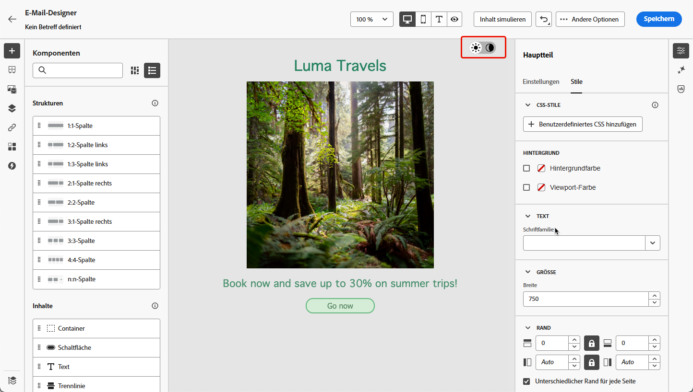

# Definieren von Inhalten für den Dunkelmodus {#dark-mode}

>[!CONTEXTUALHELP]
>id="ac_edition_darkmode"
>title="In den Dunkelmodus wechseln"
>abstract="Wechseln Sie in den Dunkelmodus, in dem Sie eine Vorschau des Renderings anzeigen und bestimmte benutzerdefinierte Einstellungen definieren können.  Achtung : Das endgültige Rendering hängt vom E-Mail-Client des Empfängers ab. Nicht alle E-Mail-Clients unterstützen den benutzerdefinierten Dunkelmodus."

>[!CONTEXTUALHELP]
>id="ac_edition_darkmode_image"
>title="Verwenden eines bestimmten Bildes für den Dunkelmodus"
>abstract="Sie können ein anderes Bild auswählen, das angezeigt wird, wenn der Dunkelmodus aktiviert ist.  Achtung : Das Hinzufügen eines bestimmten Bildes für den Dunkelmodus garantiert nicht, dass es in allen E-Mail-Clients korrekt gerendert wird. Nicht alle E-Mail-Clients unterstützen den benutzerdefinierten Dunkelmodus."

>[!CONTEXTUALHELP]
>id="ac_edition_darkmode_preview"
>title="In den Dunkelmodus wechseln"
>abstract="Wechseln Sie in den Dunklen Modus, um eine Vorschau des Renderings auf unterstützenden E-Mail-Clients anzuzeigen.  Achtung : Das endgültige Rendering hängt vom E-Mail-Client des Empfängers ab. Nicht alle E-Mail-Clients unterstützen den benutzerdefinierten Dunkelmodus."

Designer Beim Entwerfen Ihrer E-Mails können Sie mit [!DNL Journey Optimizer] [E-Mail-](get-started-email-design.md)) in den **[!UICONTROL Dunkelmodus“ wechseln]** in dem Sie bestimmte benutzerdefinierte Einstellungen definieren können. Wenn der Dunkelmodus aktiviert ist, zeigen die unterstützenden E-Mail-Clients die Einstellungen an, die Sie für diesen Modus definiert haben.

>[!WARNING]
>
>Das endgültige Rendering im Dunkelmodus hängt vom E-Mail-Client des Empfängers ab.
>
>Nicht alle E-Mail-Clients unterstützen den benutzerdefinierten Dunkelmodus. <!--[See the list](#non-supporting-email-clients)-->Darüber hinaus wenden einige E-Mail-Clients nur ihren eigenen standardmäßigen Dunkelmodus für alle empfangenen E-Mails an. In diesem Fall können die benutzerdefinierten Einstellungen, die Sie in der E-Mail-Designer definiert haben, nicht gerendert werden.

Eine Liste der E-Mail-Clients, die den Dunkelmodus unterstützen, finden Sie [ (diesem Abschnitt](#supporting-email-clients).

## Was ist der Dunkelmodus? {#what-is-dark-mode}

Der Dunkelmodus ermöglicht es unterstützten E-Mail-Clients und Apps, E-Mails mit dunkleren Hintergründen und helleren Farben für Text, Schaltflächen und andere Benutzeroberflächenelemente anzuzeigen. Dadurch werden die Augen entlastet, die Akkulaufzeit verkürzt und die Lesbarkeit in schwach beleuchteten Umgebungen verbessert, sodass das Betrachten angenehmer wird.

<!--Dark Mode uses a dark color palette with light text and UI elements to reduce eye strain, save battery life, and improve readability in low-light environments.-->

Aufgrund des wachsenden Trends bei den wichtigsten Betriebssystemen und Apps (Apple Mail, Gmail, Outlook, Twitter, Slack) ist es im modernen E-Mail-Design zu einer wichtigen Überlegung geworden, sicherzustellen, dass Inhalte für alle Benutzer lesbar und visuell ansprechend bleiben.

Es ist jedoch nicht möglich zu garantieren, dass Ihre E-Mail auf allen Geräten im Dunkelmodus genau gleich aussieht. Einige visuelle Änderungen können auch dadurch verursacht werden, dass die E-Mail-App oder das Gerät das ursprüngliche Design überschreibt.

Tatsächlich kann die Art und Weise, wie der Dunkelmodus von E-Mail-Clients angewendet wird, wie folgt variieren<!--between different devices and apps-->:

* Nicht alle E-Mail-Clients unterstützen diese Funktion.

  >[!NOTE]
  >
  >Eine Liste der E-Mail-Clients, die den Dunkelmodus nicht unterstützen, finden Sie [ (diesem Abschnitt](#non-supporting-email-clients).

* Einige E-Mail-Clients passen Farben, Hintergründe und Bilder automatisch an. Wenn Sie in diesem Fall benutzerdefinierte Einstellungen in der E-Mail-Designer definieren, werden diese Einstellungen wahrscheinlich nicht gerendert.

* Andere E-Mail-Clients bieten die Möglichkeit, den benutzerdefinierten Dunkelmodus zu rendern (z. B. mit der `@media (prefers-color-scheme: dark)`-Methode). In diesem Fall sollten die spezifischen Einstellungen angezeigt werden, die Sie in der E-Mail-Designer definieren. In diesem Abschnitt erfahren Sie, wie Sie benutzerdefinierte Einstellungen für den Dunkelmodus in der E-Mail[Designer ](#define-custom-dark-mode).

## Dunkler Modus in der E-Mail-Designer {#dark-mode-email-designer}

Beim Dunkelmodus in der E-Mail-Designer sind zwei Aspekte zu berücksichtigen:

* Sie können eine Vorschau davon erhalten, wie der standardmäßige Dunkelmodus in den meisten unterstützenden E-Mail-Clients gerendert wird. [Weitere Informationen](#preview-dark-mode)

<!--
    >[!CAUTION]
    >
    >The final rendering may vary according to the recipient's email client. To see the exact rendering for each email client, use the [Email rendering](../content-management/rendering.md) option.-->

* Wenn Sie die Standardeinstellungen unterstützender E-Mail-Clients überschreiben möchten, können Sie benutzerdefinierte Einstellungen für den Dunkelmodus definieren, die auf die E-Mail angewendet werden, die Sie bearbeiten. [Weitere Informationen](#define-custom-dark-mode)

<!--
    >[!WARNING]
    >
    >Not all email clients support custom dark mode. Some email clients only apply their own default dark mode for all emails that are received. In this case, the custom settings that you defined in the Email Designer cannot be rendered. [Learn more](#guardrails)-->

### Vorschau des standardmäßigen Dunkelmodus {#preview-dark-mode}

Gehen Sie wie folgt vor, um auf den Dunkelmodus in der E-Mail-Designer zuzugreifen und eine Vorschau der Standardeinstellungen für den Dunkelmodus zu erhalten.

1. Wählen Sie auf der Startseite von Email Designer die Option **[!UICONTROL Erstellen von neuen Inhalten]** aus. [Weitere Informationen](content-from-scratch.md)

   >[!NOTE]
   >
   >Derzeit können Sie möglicherweise nicht in den Dunkelmodus wechseln, wenn Sie eine [E-Mail-Vorlage](use-email-templates.md) auswählen oder ein [Design](apply-email-themes.md) anwenden.

1. Fügen Sie [Strukturen](content-from-scratch.md) und [Inhaltskomponenten) ](content-components.md) Inhalt hinzu.

1. Schalten Sie oben rechts auf der zentralen Arbeitsfläche den Umschalter in den **[!UICONTROL Dunkelmodus]**.

   

1. Die standardmäßige Vorschau des Dunkelmodus wird angezeigt.

   
<!--
    >[!NOTE]
    >
    >Dark mode applies to all elements, except images and icons.-->

Standardmäßig wendet die Vorschau des Dunkelmodus-Modus von Email Designer das Farbschema „Vollfarbinvertierung“ auf alle Elemente außer Bildern und Symbolen an. <!--It fully inverts all colors for all the elements (texts, buttons, etc.)-->

Das bedeutet, dass Bereiche mit hellen und dunklen Elementen erkannt und invertiert werden, sodass helle Hintergründe dunkel und dunkler Text hell werden, während dunkle Hintergründe hell und heller Text dunkel werden.

>[!CAUTION]
>
>Das endgültige Rendering kann je nach E-Mail-Client des Empfängers variieren. Um für jeden E-Mail-Client eine Simulation anzuzeigen, die dem Endergebnis möglichst nahe kommt, verwenden Sie die Option [E-Mail-Rendering](../content-management/rendering.md).

<!--This is custom dark mode:

  

Here you can see that we have applied a different background, defined another image and change the color of the text and button.-->

### Definieren des benutzerdefinierten Dunkelmodus {#define-custom-dark-mode}

Nach dem Wechsel **[!UICONTROL Dunkler Modus]** können Sie bestimmte Stilelemente Ihres Inhalts bearbeiten, die nur angezeigt werden, wenn der Dunkle Modus im E-Mail-Client des Empfängers aktiviert ist - vorausgesetzt, diese Funktion wird unterstützt.

>[!WARNING]
>
>Nicht alle E-Mail-Clients unterstützen den Dunkelmodus. Darüber hinaus wenden einige E-Mail-Clients nur für alle empfangenen E-Mails ihren eigenen standardmäßigen Dunkelmodus an. In beiden Fällen können die in der E-Mail-Designer definierten benutzerdefinierten Einstellungen nicht gerendert werden.

Um den benutzerdefinierten Dunkelmodus-Stil von E-Mail-Designer zu nutzen, verwendet Journey Optimizer den<!-- `@media (prefers-color-scheme: dark)` method--> `@media (prefers-color-scheme: dark)` CSS-Abfrage, die erkennt, ob der E-Mail-Client des Benutzers auf den Dunkelmodus eingestellt ist, und das in Ihrer E-Mail definierte Design mit dunklem Design anwendet.

Gehen Sie wie folgt vor, um benutzerdefinierte Einstellungen für den Dunkelmodus zu definieren.

1. Stellen Sie sicher **[!UICONTROL dass der]** Dunkelmodus“ in der E-Mail-Designer aktiviert ist. [Weitere Informationen](#preview-dark-mode)

1. Bearbeiten Sie alle Stilattribute wie Text, Hintergrund, Schaltfläche usw.

1. Sie können die Farben von Bildern und Symbolen nicht ändern, aber Sie können bestimmte Assets nur für den Dunkelmodus definieren. Wählen Sie dazu ein Bild aus. Wechseln Sie **[!UICONTROL Dunkler Modus]** über den entsprechenden Umschalter im Bereich **[!UICONTROL Einstellungen]** und wählen Sie ein anderes Asset aus.

   

   <!---->

1. Nachdem alle Änderungen für den Dunkelmodus vorgenommen wurden, klicken Sie auf **[!UICONTROL Inhalt simulieren]**.

   

1. Wählen Sie **[!UICONTROL E-Mail rendern]** und verbinden Sie sich mit Ihrem Litmus-Konto. Sie können das endgültige Rendering des Dunkelmodus für verschiedene E-Mail-Clients sehen.

   {width="80%"}

   >[!WARNING]
   >
   >Während die Simulation dem Aussehen von E-Mails im Dunkelmodus sehr nahe kommt, kann das tatsächliche Rendering aufgrund von Variationen bei E-Mail-Service-Anbietern oder Einstellungen auf Geräteebene unterschiedlich sein.

## Best Practices {#best-practices}

Da die Akzeptanz des Dunkelmodus in den wichtigsten E-Mail-Clients zunimmt, ist es wichtig zu berücksichtigen, wie Ihre E-Mails in hellen und dunklen Umgebungen gerendert werden - unabhängig davon, ob [ den benutzerdefinierten Dunkelmodus ](#define-custom-dark-mode) oder nicht.

Der Dunkelmodus kann Farben, Hintergründe und Bilder verändern - und manchmal die Designentscheidungen überschreiben. Befolgen Sie die unten aufgeführten Best Practices, um visuelle Konsistenz, Barrierefreiheit und Markenintegrität sicherzustellen.

**Optimieren Sie Ihre Bilder und Logos**

* Vermeiden Sie Bilder mit hartcodierten weißen oder hellen Hintergründen.

* Speichern Sie Logos und Symbole als PNGs mit transparentem Hintergrund, um sichtbare weiße Kästchen im Dunkelmodus zu vermeiden.

* Wenn Transparenz nicht möglich ist, platzieren Sie Bilder auf einem einfarbigen Hintergrund in Ihrem Design, um unangenehme Farbinversionen zu verhindern.

**Achten Sie auf Ihre Hintergründe**

* Sicherstellen von ausreichendem Kontrast zwischen Text- und Hintergrundfarben für bessere Lesbarkeit im hellen und dunklen Modus.

* Vermeiden Sie es, sich bei kritischen Inhalten allein auf Hintergrundfarben zu verlassen. Einige Clients überschreiben Hintergrundfarben im Dunkelmodus, sodass Sie sicherstellen müssen, dass wichtige Informationen weiterhin sichtbar sind.

**Entwerfen barrierefreier Inhalte im Dunkelmodus**

* Verwenden Sie Farbkombinationen, die für Menschen mit Farbenblindheit leicht zu unterscheiden sind.

* Verwenden Sie eine Mitteltonpalette, um Kontrast sowohl vor hellen als auch vor dunklen Hintergründen sicherzustellen.

* Verwenden Sie barrierefreie Farbkombinationen mit hohem Kontrast, um die Lesbarkeit zu verbessern und die WCAG-Standards (Web Content Accessibility Guidelines) zu erfüllen. Verwenden Sie Tools wie den Kontrast-Checker von WebAIM, um den Farbkontrast zu überprüfen.

* Vermeiden Sie dünne Schriftarten, da sie die Lesbarkeit beeinträchtigen können. Wenn für Ihre Marke eine dünne Schriftart erforderlich ist, fett formatieren Sie sie im dunklen Modus.

* Überspringen Sie reines Weiß auf reinem Schwarz, da es zu Augenbelastungen führen kann und von einigen E-Mail-Clients automatisch invertiert werden kann.

* Wenn der Dunkelmodus nicht unterstützt wird, können barrierefreie Ausweich-Stile bereitgestellt werden.

**Testen Sie Ihre E-Mails in einer Umgebung im dunklen Modus**

* Verwenden Sie die E-Mail[Designer-Vorschau ](#preview-dark-mode) Dunkelmodus, die invertierte Farbschemata verwendet, um Probleme frühzeitig zu erkennen.

* Verwenden Sie die Option [E-Mail-Rendering](../content-management/rendering.md), die Litmus nutzt, um Ihre Designs in wichtigen E-Mail-Clients (Apple Mail, Gmail, Outlook) zu simulieren und zu sehen, wie sich Farben und Bilder im Dunkelmodus verhalten.

<!--**Inline critical styles**

Inline CSS helps maintain more control over styling, as some clients strip external styles in dark mode.-->

## E-Mail-Clients, die den Dunkelmodus unterstützen {#supporting-email-clients}

Nachfolgend finden Sie eine Liste der wichtigsten E-Mail-Clients, die den Dunkelmodus unterstützen. Einige Versionen der aufgelisteten E-Mail-Clients unterstützen jedoch nicht den Dunkelmodus, sodass sie aus Gründen der Klarheit und Genauigkeit auch in dieser Tabelle aufgeführt werden.

>[!WARNING]
>
>Das endgültige Rendering im Dunkelmodus hängt von jedem E-Mail-Client ab, sodass die Ergebnisse von einem zum anderen variieren können. Um für jeden E-Mail-Client eine Simulation anzuzeigen, die dem Endergebnis möglichst nahe kommt, verwenden Sie die Option [E-Mail-Rendering](../content-management/rendering.md).

| E-Mail-Clients, die den Dunkelmodus unterstützen | Kompatible Versionen | Nicht unterstützte Versionen |
|---------|----------|---------|
| Apple Mail macOS | 12,4; 16,0 | *,3* |
| Apple Mail iOS | 13,0, 16,1 | *,2* |
| Outlook macOS | 2019, 16.70, 16.80 | Nicht zutreffend |
| Outlook.com | 07.2019, 2022-12 | Nicht zutreffend |
| Outlook iOS | 01.2020.2022.12 | Nicht zutreffend |
| Outlook Android | 2023-03 | *2020-01, 2022-12* |
| Samsung Email (Android) | 6,1 | *6,0* |
| Mozilla Thunderbird (macOS) | 68,4 | *60,8, 78,5, 91,13* |
| FastMail (Desktop-Webmail) | 2022-12 | *2021-07* |
| HEY (Desktop-Webmail) | 2020-06 | *2022-12* |
| Orange Desktop-Webmail | 2019-08, 2021-03, 2022-12, 2024-04 | Nicht zutreffend |
| Orange iOS | 12.2022.2024.04 | *2020-01* |
| Orange Android | 2024-04 | *2020-01, 2022-12* |
| LaPoste.net | 08.2021.2022.12 | Nicht zutreffend |
| SFR Desktop-Webmail | 08.2019, 2022-12 | Nicht zutreffend |
| GMX (iOS und Android) | 2022-06 | Nicht zutreffend |
| 1&amp;1 (Desktop-Webmail und Android) | 2022-06 | Nicht zutreffend |
| WEB.DE (iOS und Android) | 2022-06 | Nicht zutreffend |
| Free.fr | 2022-12 | Nicht zutreffend |

<!--
* Check out the list of [email clients supporting dark mode](https://www.caniemail.com/search/?s=dark){target="_blank"}

* Learn more on Dark mode in this [Litmus blog post](https://www.litmus.com/blog/the-ultimate-guide-to-dark-mode-for-email-marketers){target="_blank"}
-->

## E-Mail-Clients, die den Dunkelmodus NICHT unterstützen {#non-supporting-email-clients}

Einige E-Mail-Clients ermöglichen es Benutzenden, ihre Benutzeroberfläche in den Dunkelmodus zu wechseln. Diese Einstellung hat jedoch keinen Einfluss darauf, wie HTML-E-Mails angezeigt werden. Unabhängig davon, ob sich die Benutzeroberfläche im Hell- oder Dunkelmodus befindet, wird Ihre E-Mail unverändert dargestellt. Im Folgenden finden Sie eine Liste dieser Kunden:

| E-Mail-Clients ohne Unterstützung für den Dunkelmodus |
|---------|
| Gmail (Desktop-Webmail, iOS, Android, mobile Webmail) |
| Outlook-Fenster |
| Outlook Windows Mail |
| Yahoo!Mail |
| AOL |
| ProtonMail |
| SFR IOS |
| SFR ANDROID |
| GMX Desktop Webmail |
| Mail.ru |
| WEB.DE Desktop Webmail |
| T-online.de |