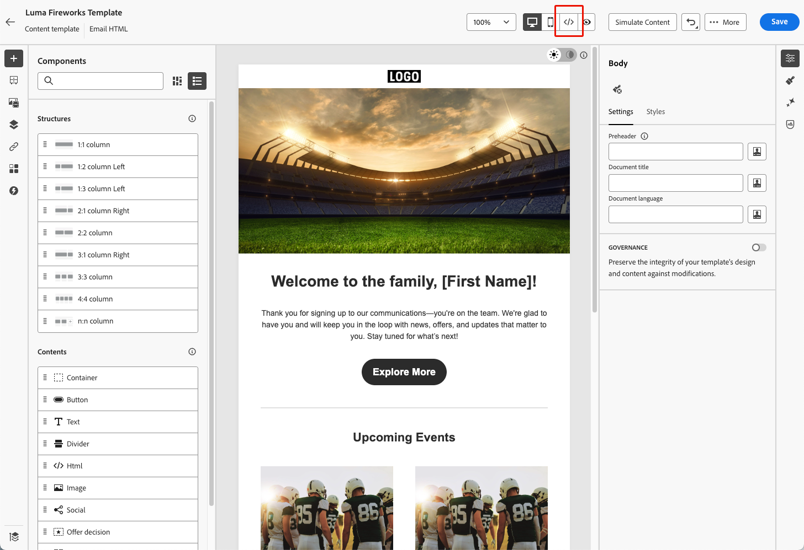
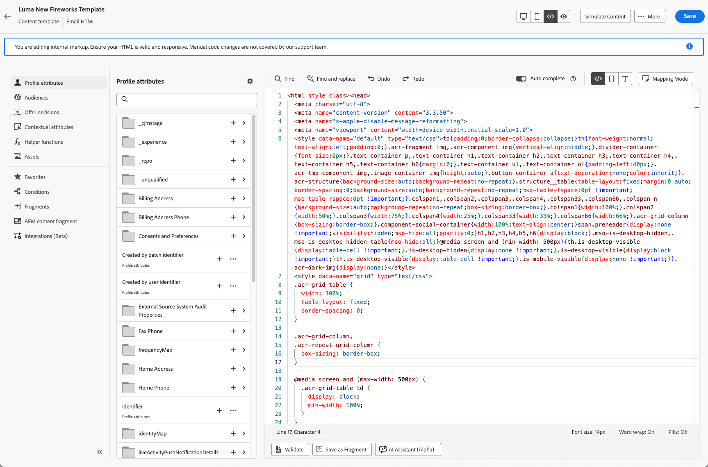

# E-Mail-Inhalte mit dem erweiterten HTML-Editor bearbeiten {#email-expert-mode}

>[!AVAILABILITY]
>
>Diese Funktion ist nur eingeschränkt verfügbar. Wenden Sie sich an den Adobe-Support, um Zugriff zu erhalten.

Der **erweiterte HTML-Editor** ist ein Expertenmodus, mit dem Sie die unformatierte HTML-Quelle **E-Mail-**) direkt in der [!DNL Journey Optimizer] [E-Mail-Designer](get-started-email-design.md) anzeigen und bearbeiten können - unabhängig davon, ob Sie [E-Mail erstellen](content-from-scratch.md) für eine Journey, eine Kampagne oder eine [E-Mail-Inhaltsvorlage](../content-management/create-content-templates.md).

Mit dieser Funktion können Sie erweiterte Ausdrücke - wie Bedingungen - direkt in die Quelle einfügen. Wenn Sie zur visuellen Ansicht (Desktop) zurückkehren, wird der Inhalt erneut gerendert, damit Sie überprüfen können, wie er aussieht, und die Bearbeitung in jeder Ansicht fortsetzen können.

## Leitlinien {#guardrails}

Wenn Sie den erweiterten HTML-Editor verwenden, schützen die folgenden Leitplanken die Inhaltskompatibilität und definieren Erwartungen.

* Der erweiterte HTML-Editor **validiert** Code nicht. Syntaxfehler oder fehlerhafte Layouts werden nicht geprüft. Überprüfen Sie Ihre Inhalte sorgfältig, bevor Sie sie speichern.

* Zukünftige Systemaktualisierungen können Änderungen überschreiben, die Sie am Standard-Markup vornehmen. **Ihre Änderungen bleiben möglicherweise nicht erhalten**.

* Das [!DNL Adobe] Support-Team **kann keine Probleme beheben oder**), die durch benutzerdefinierten Code und manuelle Änderungen verursacht werden. Erstellen Sie eine Sicherungskopie Ihres Inhalts, für den Fall, dass Sie ihn wiederherstellen müssen.

* In der erweiterten HTML-Ansicht können keine Inhalte simuliert werden. Zur Desktop-Ansicht wechseln, um eine Vorschau des Inhalts anzuzeigen.

* Um die Inhaltskompatibilität sicherzustellen, **Sie können nicht speichern** in der erweiterten HTML-Ansicht. Wechseln Sie zurück zur Desktop-Ansicht, wenn Sie zum Speichern Ihrer Änderungen bereit sind.

>[!WARNING]
>
>Der erweiterte HTML-Editor unterscheidet sich vom Modus **[!UICONTROL Eigenen Code erstellen]** in der E-Mail-Designer. Im Modus [!UICONTROL Eigenen Code erstellen] können Sie nicht zum visuellen Editor zurückkehren. Sobald Sie diesen Pfad ausgewählt haben, bleiben Sie in der schreibgeschützten Bearbeitung. Der erweiterte HTML-Editor dagegen ermöglicht es Ihnen, jederzeit zwischen der HTML- und der Desktopansicht (visuell) umzuschalten. [Erfahren Sie mehr über den Code-Editor](code-content.md)

## Zur erweiterten HTML-Ansicht wechseln {#switch-to-html-view}

Gehen Sie wie folgt vor, um den erweiterten HTML-Editor zu öffnen und Ihre HTML-Quelle zu bearbeiten.

1. Öffnen Sie die E-Mail oder Vorlage, die Sie in der E-Mail-Designer bearbeiten möchten, z. B. [E-Mail erstellen oder bearbeiten](create-email.md) von einer Journey oder Kampagne oder öffnen Sie eine [E-Mail-Inhaltsvorlage](../content-management/create-content-templates.md) und bearbeiten Sie deren Textkörper in der [E-Mail-Designer](get-started-email-design.md).

1. Klicken Sie oben rechts **[!UICONTROL Bildschirm auf die Schaltfläche]** HTML.

   

1. Beim ersten Öffnen des erweiterten HTML-Editors wird eine Warnmeldung angezeigt. Überprüfen Sie sie sorgfältig und klicken Sie auf **[!UICONTROL OK]**, um fortzufahren. [Weitere Informationen](#guardrails)

   {zoomable="yes"}

   >[!NOTE]
   >
   >Diese Warnung wird nur angezeigt, wenn Sie den erweiterten HTML-Editor zum ersten Mal öffnen und monatlich zurücksetzen.

1. Der erweiterte HTML-Editor wird angezeigt.

   

1. Fügen Sie die gewünschten Änderungen an Ihrem E-Mail-Inhalt hinzu.

   >[!WARNING]
   >
   >Achten Sie darauf, den richtigen HTML- und CSS-Code einzugeben, da es keinen Syntaxvalidierungsprozess gibt und von [!DNL Adobe] keine Unterstützung bereitgestellt wird. [Weitere Informationen](#guardrails)

1. Inhaltssimulation und -speicherung sind in der erweiterten HTML-Ansicht aus Kompatibilitätsgründen nicht verfügbar. Wechseln Sie zurück zur Desktop-Ansicht, um eine Vorschau Ihres Inhalts anzuzeigen und Ihre Änderungen zu speichern.

   {zoomable="yes"}

   >[!NOTE]
   >
   >Ihre Bearbeitungen bleiben beim Wechseln der Ansichten erhalten.

<!--
    {zoomable="yes"}
-->

## Verwandte Themen

* [Codieren Ihres eigenen E-Mail-Inhalts](code-content.md)
* [Erstellen von Inhaltsvorlagen](../content-management/create-content-templates.md)
* [Erste Schritte mit dem Email Designer](get-started-email-design.md)
