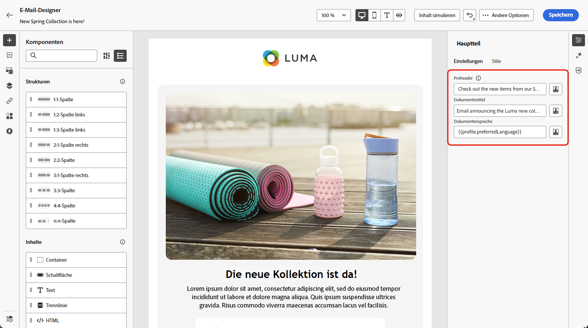
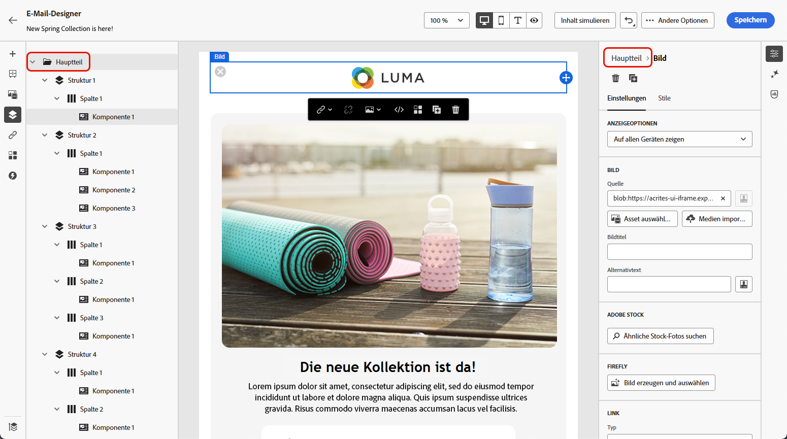
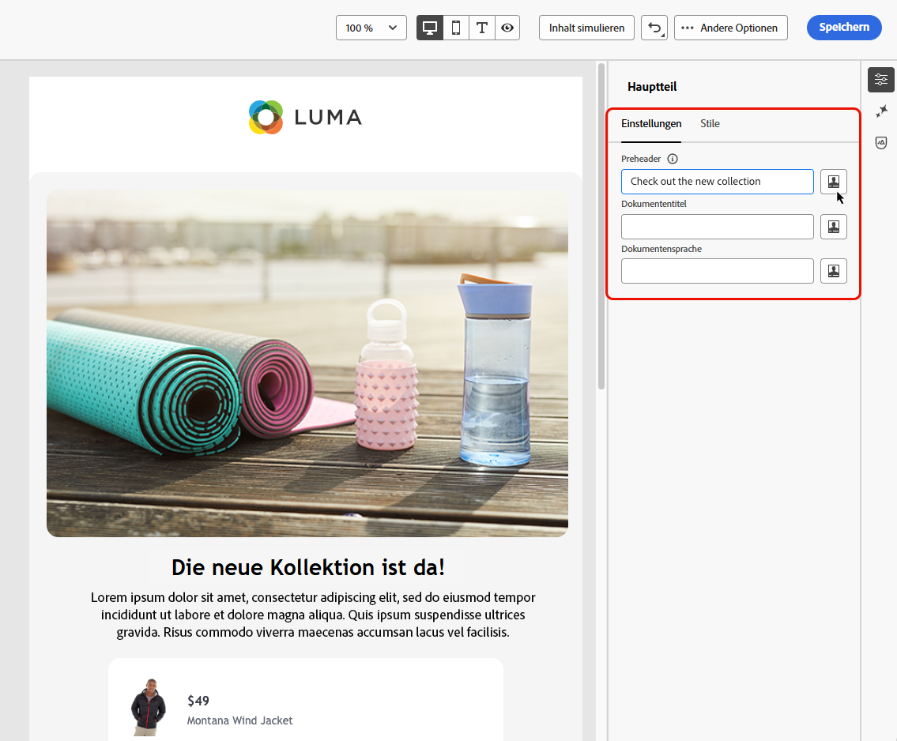

# Hinzufügen von Metadaten zu E-Mail-Inhalten {#email-metadata}

>[!CONTEXTUALHELP]
>id="ac_edition_preheader"
>title="Preheader definieren"
>abstract="Ein Preheader ist ein kurzer Zusammenfassungstext, der beim Anzeigen einer E-Mail über einen E-Mail-Client der Betreffzeile folgt. In vielen Fällen bietet er eine kurze Zusammenfassung der E-Mail und besteht normalerweise aus einem Satz."

Beim Entwerfen Ihrer E-Mails können Sie zusätzliche Meta-Attribute für Ihre Inhalte definieren, um die Lesbarkeit und Barrierefreiheit zu verbessern. Mit dem [E-Mail-Designer](get-started-email-design.md) von [!DNL Journey Optimizer] können Sie die folgenden Elemente angeben:

* **[!UICONTROL Preheader]**: Ein Preheader ist ein kurzer zusammenfassender Text, der auf die Betreffzeile folgt, wenn Sie eine E-Mail in Ihrem E-Mail-Client anzeigen. In vielen Fällen bietet er eine kurze Zusammenfassung der E-Mail und besteht normalerweise aus einem Satz.

  >[!NOTE]
  >
  >Preheader werden nicht von allen E-Mail-Clients unterstützt. Wird der Preheader nicht unterstützt, wird er nicht angezeigt.

* **[!UICONTROL Dokumententitel]**: Dieses Feld, das dem Element `<title>` entspricht, enthält beschreibende Informationen zum E-Mail-Inhalt, die normalerweise als QuickInfo angezeigt werden, wenn der Mauszeiger darüber bewegt wird. Es kann Benutzenden mit Beeinträchtigungen durch Bereitstellung von zusätzlichem Kontext helfen und zu einem besseren Verständnis Ihrer Inhalte durch Suchmaschinen beitragen.

* **[!UICONTROL Dokumentensprache]**: Um Barrierefreiheit sicherzustellen, können Sie die Sprache angeben, in der Bildschirmlesehilfen Text und Bilder für Menschen mit Seh- oder Lernbeeinträchtigungen in Sprache oder Blindenschrift konvertieren. Diese Einstellung entspricht dem Attribut `lang` im Element `<html>`.

Gehen Sie wie folgt vor, um diese Einstellungen zu konfigurieren.

1. Fügen Sie im [E-Mail-Designer](content-from-scratch.md) mindestens eine **[!UICONTROL Strukturkomponente]** hinzu, um mit der E-Mail-Gestaltung zu beginnen.

1. Klicken Sie entweder über dem **[!UICONTROL Navigationsbaum]** links oder oben im rechten Bereich auf **[!UICONTROL Hauptteil]**.

   

1. Geben Sie auf der Registerkarte **[!UICONTROL Einstellungen]** Text in die Felder **[!UICONTROL Preheader]**, **[!UICONTROL Dokumententitel]** und/oder **[!UICONTROL Dokumentensprache]** ein.

1. Sie können auch auf das Personalisierungssymbol neben jedem Feld klicken, um den Inhalt anhand von Profilattributen, Zielgruppen, Kontextattributen usw. anzupassen. [Weitere Informationen zur Personalisierung](../personalization/personalization-build-expressions.md)

   

1. Klicken Sie auf **[!UICONTROL Speichern]**, um Ihre Änderungen zu speichern.