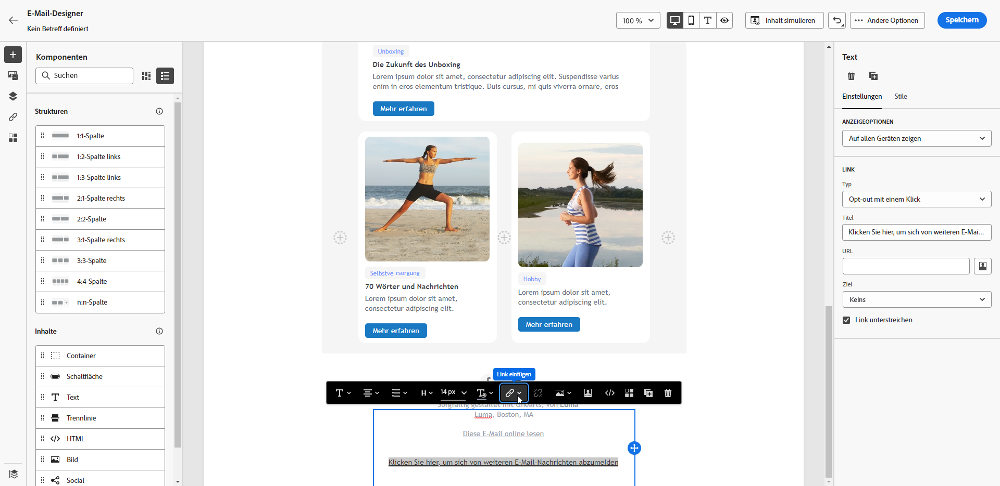
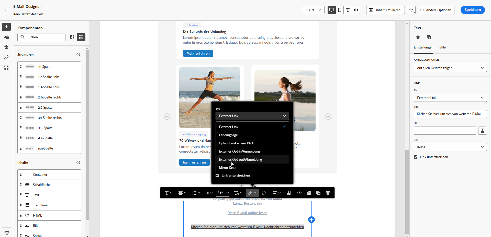
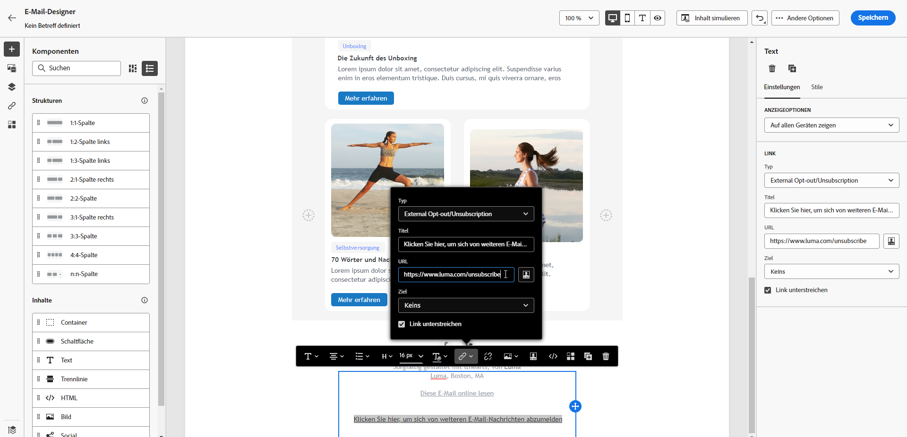
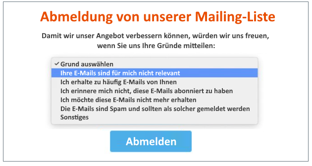
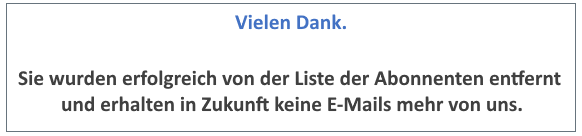
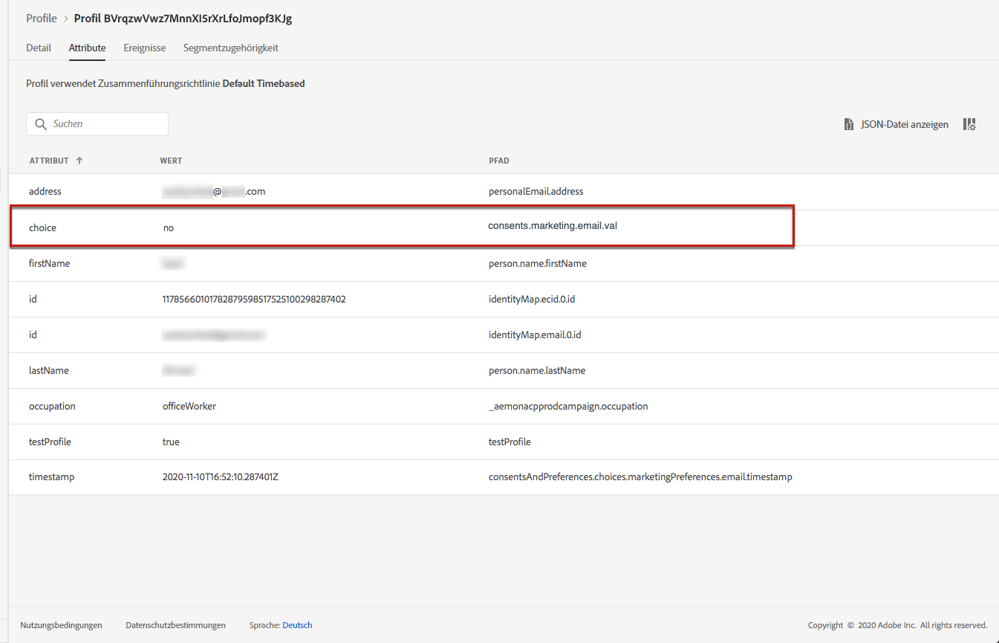
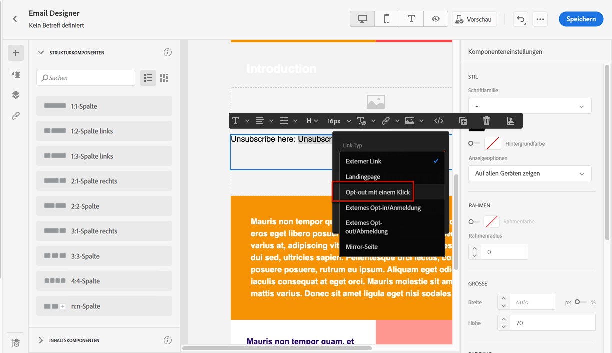
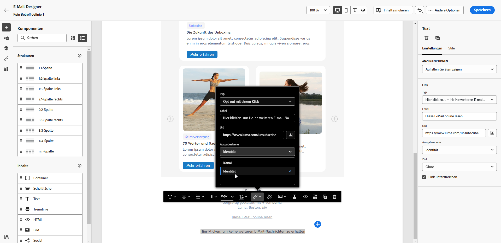
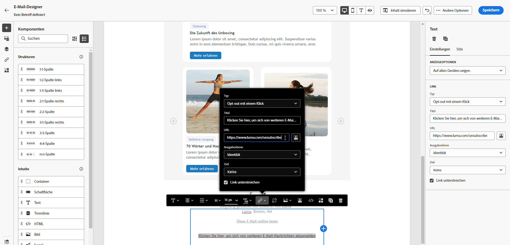
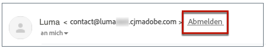

# Opt-out-Verwaltung für E-Mails {#email-opt-out}

Um Empfängern die Möglichkeit zu geben, sich vom Erhalt von E-Mail-Nachrichten abzumelden, müssen Sie stets eine **Abmelde-Link** in jeder E-Mail, die an Empfänger gesendet wird. [Erfahren Sie mehr über Datenschutz und Opt-out-Verwaltung](../privacy/opt-out.md)

Dazu haben Sie folgende Möglichkeiten:

* Einfügen einer **Link zu einer externen Landingpage** in eine E-Mail eingeben, damit sich Benutzer von der Anmeldung für den Erhalt von Nachrichten Ihrer Marke abmelden können. [Erfahren Sie, wie Sie einen externen Ausschluss-Link hinzufügen](#opt-out-external-lp)

* Hinzufügen einer **Ausschluss-Link mit einem Klick** in Ihren E-Mail-Inhalt ein. Über diesen Link können sich Ihre Empfänger schnell von Ihrer Nachricht abmelden, ohne auf eine Landingpage weitergeleitet zu werden, auf der sie ihre Auswahl bestätigen müssen, was den Abmeldevorgang beschleunigt. [Erfahren Sie, wie Sie einen Ausschluss-Link mit einem Klick hinzufügen](#one-click-opt-out)

Wenn die **[!UICONTROL List-Unsubscribe]** auf der Kanaloberfläche aktiviert ist, enthalten die entsprechenden mit Journey Optimizer gesendeten E-Mails einen Abmelde-Link in der E-Mail-Kopfzeile. [Weitere Informationen zum Opt-out in der E-Mail-Kopfzeile](#unsubscribe-header)

>[!NOTE]
>
>E-Mail-Nachrichten vom Typ Marketing müssen einen Ausschluss-Link enthalten, der für Transaktionsnachrichten nicht erforderlich ist. Die Kategorie der Nachricht (**[!UICONTROL Marketing]** oder **[!UICONTROL Transactional]**) definiert wird unter [Kanaloberfläche](../configuration/channel-surfaces.md#email-type) (d. h. Nachrichtenvorgabe) und beim Erstellen der Nachricht).

## Externes Opt-out {#opt-out-external-lp}

### Abmelde-Link hinzufügen {#add-unsubscribe-link}

Zunächst müssen Sie einen Abmelde-Link zu einer Nachricht hinzufügen. Gehen Sie dazu wie folgt vor:

1. Erstellen Sie Ihre eigene Abmelde-Landingpage.

1. Hosten Sie es auf dem Drittanbietersystem Ihrer Wahl.

1. Erstellen Sie eine Nachricht in einer Journey.

1. Wählen Sie Text in Ihrem Inhalt aus und [Link einfügen](../email/message-tracking.md#insert-links) über die dedizierte Symbolleiste.

   

1. Auswählen **[!UICONTROL External Opt-out/Unsubscription]** von **[!UICONTROL Link type]** Dropdown-Liste.

   

1. Im **[!UICONTROL Link]** den Link zu Ihrer Drittanbieter-Landingpage einfügen.

   

1. Klicken **[!UICONTROL Save]**.

### API-Aufruf zum Opt-out implementieren {#opt-out-api}

Damit sich Ihre Empfänger bei der Auswahl über die Landingpage abmelden können, müssen Sie eine **Abonnement-API-Aufruf** bis [Adobe-Entwickler](https://developer.adobe.com){target=&quot;_blank&quot;}, um die Voreinstellungen der entsprechenden Profile zu aktualisieren.

Dieser POST-Aufruf sieht wie folgt aus:

Endpunkt: platform.adobe.io/journey/imp/consent/preferences

Abfrageparameter:

* **params**: enthält die verschlüsselte Payload
* **sig**: signature
* **pid**: verschlüsselte Profil-ID

Diese drei Parameter werden in die URL der Landingpage eines Drittanbieters eingefügt, die an Ihren Empfänger gesendet wird:


Kopfzeilenanforderungen:

* x-api-key
* x-gw-ims-org-id
* x-sandbox-name
* Autorisierung (Benutzer-Token aus Ihrem technischen Konto)

Anfrageinhalt:

```
{
   "marketing": [
       {
            "type": "email",           
            "choice": "no",          
            "scope": "channel"       
        }
    ],
 
}
```

[!DNL Journey Optimizer] verwendet diese Parameter, um die Auswahl des entsprechenden Profils über die [Adobe-Entwickler](https://developer.adobe.com){target=&quot;_blank&quot;} API-Aufruf.

### Nachricht mit Abmelde-Link senden {#send-message-unsubscribe-link}

Nachdem Sie den Abmelde-Link zu Ihrer Landingpage konfiguriert und den API-Aufruf implementiert haben, kann Ihre Nachricht gesendet werden.

1. Senden Sie die Nachricht einschließlich des Links über eine [Journey](../building-journeys/journey.md).

1. Wenn der Empfänger nach Erhalt der Nachricht auf den Abmelde-Link klickt, wird Ihre Landingpage angezeigt.

   

1. Wenn der Empfänger das Formular sendet (hier durch Drücken der **Abmelden** -Schaltfläche in Ihrer Landingpage) werden die Profildaten über die [API-Aufruf](#opt-out-api).

1. Der abgemeldete Empfänger wird dann auf einen Bestätigungsbildschirm umgeleitet, der angibt, dass die Abmeldung erfolgreich war.

   

   Daher erhält dieser Benutzer keine Nachricht von Ihrer Marke, es sei denn, er hat sich erneut angemeldet.

1. Um zu überprüfen, ob die Auswahl des entsprechenden Profils aktualisiert wurde, gehen Sie zu Experience Platform und greifen Sie auf das Profil zu, indem Sie einen Identitäts-Namespace und einen entsprechenden Identitätswert auswählen. Weitere Informationen finden Sie unter [Dokumentation zu Experience Platform](https://experienceleague.adobe.com/docs/experience-platform/profile/ui/user-guide.html#getting-started){target=&quot;_blank&quot;}.

   

   Im **[!UICONTROL Attributes]** Registerkarte können Sie den Wert für **[!UICONTROL choice]** hat sich geändert auf **[!UICONTROL no]**.

## Opt-out mit einem Klick {#one-click-opt-out}

Gehen Sie wie folgt vor, um Ihrer E-Mail einen Ausschluss-Link hinzuzufügen.

1. [Link einfügen](../email/message-tracking.md#insert-links) und wählen Sie **[!UICONTROL One click Opt-out]** als Typ des Links.

   

1. Wählen Sie aus, wie Sie die Abmeldung anwenden möchten: auf Kanal-, Identitäts- oder Abonnementebene.

   

   * **[!UICONTROL Channel]**: Die Abmeldung gilt für künftige Nachrichten, die an die Zielgruppe des Profils (d. h. die E-Mail-Adresse) für den aktuellen Kanal gesendet werden. Wenn einem Profil mehrere Zielgruppen zugeordnet sind, gilt der Opt-out für alle Zielgruppen (d. h. E-Mail-Adressen) im Profil für diesen Kanal.
   * **[!UICONTROL Identity]**: Die Abmeldung gilt für künftige Nachrichten, die an die für die aktuelle Nachricht verwendete spezifische Zielgruppe (d. h. die E-Mail-Adresse) gesendet werden.
   * **[!UICONTROL Subscription]**: Die Abmeldung gilt für künftige Nachrichten, die einer bestimmten Abonnementliste zugeordnet sind. Diese Option kann nur ausgewählt werden, wenn die aktuelle Nachricht einer Abonnementliste zugeordnet ist.

1. Geben Sie die URL der Landingpage ein, zu der der Benutzer weitergeleitet wird, sobald er sich abgemeldet hat. Auf dieser Seite können Sie nur bestätigen, dass die Abmeldung erfolgreich war.

   >[!NOTE]
   >
   >Wenn Sie die **List-Unsubscribe** auf der Kanaloberfläche verwenden, wird diese URL auch verwendet, wenn Benutzer auf den Abmelde-Link im E-Mail-Header klicken. [Weitere Infos](#unsubscribe-header)

   

   Sie können Ihre Links personalisieren. Weitere Informationen zu personalisierten URLs finden Sie unter [diesem Abschnitt](../personalization/personalization-syntax.md).

1. Speichern Sie Ihre Änderungen.

Sobald Ihre Nachricht über eine [Journey](../building-journeys/journey.md)Wenn ein Empfänger auf den Abmelde-Link klickt, wird sein Profil sofort abgemeldet.

## Link zum Abmelden in E-Mail-Kopfzeile {#unsubscribe-header}

>[!CONTEXTUALHELP]
>id="ajo_admin_preset_unsubscribe"
>title="Abmelde-Link zum E-Mail-Header hinzufügen"
>abstract="Aktivieren Sie List-Unsubscribe , um einen Abmelde-Link zum E-Mail-Header hinzuzufügen. Um eine Abmelde-URL festzulegen, fügen Sie einen Abmelde-Link mit einem Klick in den E-Mail-Inhalt ein."
>additional-url="https://experienceleague.adobe.com/docs/journey-optimizer/using/privacy/consent/opt-out.html#one-click-opt-out" text="Opt-out mit einem Klick"

Wenn die Variable [List-Unsubscribe-Option](../configuration/channel-surfaces.md#list-unsubscribe) auf der Kanaloberfläche aktiviert ist, werden die entsprechenden E-Mails mit [!DNL Journey Optimizer] enthält einen Abmelde-Link in den E-Mail-Header.

Der Abmelde-Link wird beispielsweise in Gmail wie folgt angezeigt:



>[!NOTE]
>
>Um den Abmelde-Link im E-Mail-Header anzuzeigen, muss der E-Mail-Client der Empfänger diese Funktion unterstützen.

Die Abmelde-Adresse ist die Standardeinstellung. **[!UICONTROL Mailto (unsubscribe)]** Adresse, die auf der entsprechenden Kanaloberfläche angezeigt wird. [Weitere Infos](../configuration/channel-surfaces.md#list-unsubscribe).

Um eine personalisierte Abmelde-URL festzulegen, fügen Sie einen 1-Klick-Abmelde-Link in den Inhalt der E-Mail-Nachricht ein und geben Sie die URL Ihrer Wahl ein. [Weitere Infos](#one-click-opt-out)

Je nach E-Mail-Client kann das Klicken auf den Abmelde-Link im Header die folgenden Auswirkungen haben:

* Die Abmelde-Anfrage wird an die Standard-Abmelde-Adresse gesendet.

* Der Empfänger wird an die Landingpage-URL weitergeleitet, die Sie beim Hinzufügen des Ausschluss-Links zu Ihrer Nachricht angegeben haben.

   >[!NOTE]
   >
   >Wenn Sie keinen Ausschluss-Link mit einem Klick in Ihren Nachrichteninhalt einfügen, wird keine Landingpage angezeigt.

* Das entsprechende Profil wird sofort abgemeldet und diese Auswahl wird in Experience Platform aktualisiert. Weitere Informationen finden Sie unter [Dokumentation zu Experience Platform](https://experienceleague.adobe.com/docs/experience-platform/profile/ui/user-guide.html#getting-started){target=&quot;_blank&quot;}.
