# E-Mail-Einstellungen konfigurieren {#email-settings}

Um eine E-Mail zu erstellen, müssen Sie Oberflächen für E-Mail-Kanäle einrichten, die alle für Ihre Nachrichten erforderlichen technischen Parameter definieren. [Erfahren Sie, wie Sie Oberflächen erstellen](../configuration/channel-surfaces.md)

Definieren Sie die E-Mail-Einstellungen im entsprechenden Abschnitt der Kanaloberflächenkonfiguration.

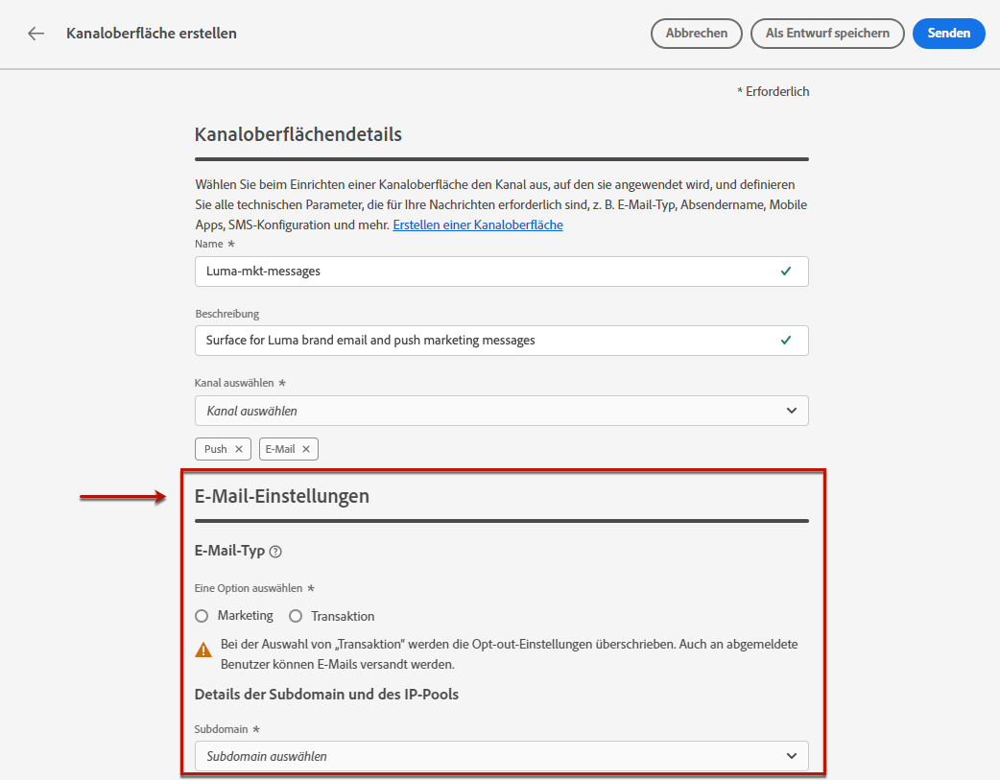

Die Konfiguration der E-Mail-Oberfläche wird wie folgt für den Versand von Nachrichten erfasst:

* Bei Batch- und Burst-Journeys gilt dies nicht für die Batch- oder Burst-Ausführung, die bereits begonnen hatte, bevor die E-Mail-Oberflächenkonfiguration vorgenommen wurde. Die Änderungen werden bei der nächsten Wiederholung oder der nächsten Ausführung übernommen.

* Bei Transaktionsnachrichten wird die Änderung sofort für die nächste Mitteilung übernommen (bis zu 5 Minuten Verzögerung).

>[!NOTE]
>
>Die aktualisierten E-Mail-Oberflächeneinstellungen werden automatisch in der/den Journey(n) oder Kampagne(n) erfasst, in der/denen die Oberfläche verwendet wird.

## E-Mail-Typ {#email-type}

>[!CONTEXTUALHELP]
>id="ajo_admin_presets_emailtype"
>title="E-Mail-Kategorie definieren"
>abstract="Wählen Sie unter Verwendung dieser Oberfläche den Typ der zu sendenden E-Mails aus: Marketing für Werbe-E-Mails, für die die Benutzerzustimmung erforderlich ist, oder Transaktionen für nicht kommerzielle E-Mails, die auch in bestimmten Kontexten an abgemeldete Profile gesendet werden können."

Im **E-MAIL-TYP** wählen Sie den Nachrichtentyp aus, der mit der Oberfläche gesendet werden soll: **Marketing** oder **Transactional**.

* Auswählen **Marketing** für Werbe-E-Mail: Diese Nachrichten erfordern die Zustimmung des Benutzers.

* Auswählen **Transactional** für nicht kommerzielle E-Mails, wie z. B. Bestellbestätigungen, Benachrichtigungen beim Zurücksetzen des Kennworts oder Versandinformationen.

>[!CAUTION]
>
>**Transactional** E-Mails können an Profile gesendet werden, die sich von Marketingnachrichten abgemeldet haben. Diese Nachrichten können nur in bestimmten Kontexten gesendet werden.

Bei der Erstellung einer Nachricht müssen Sie eine gültige Kanaloberfläche auswählen, die der für die E-Mail ausgewählten Kategorie entspricht.

## Subdomain- und IP-Pools {#subdomains-and-ip-pools}

Im **Subdomain- und IP-Pools** müssen Sie:

1. Wählen Sie die Subdomain aus, die zum Senden der E-Mails verwendet werden soll. [Weitere Infos](../configuration/about-subdomain-delegation.md)

1. Wählen Sie den IP-Pool aus, der mit der Oberfläche verknüpft werden soll. [Weitere Infos](../configuration/ip-pools.md)

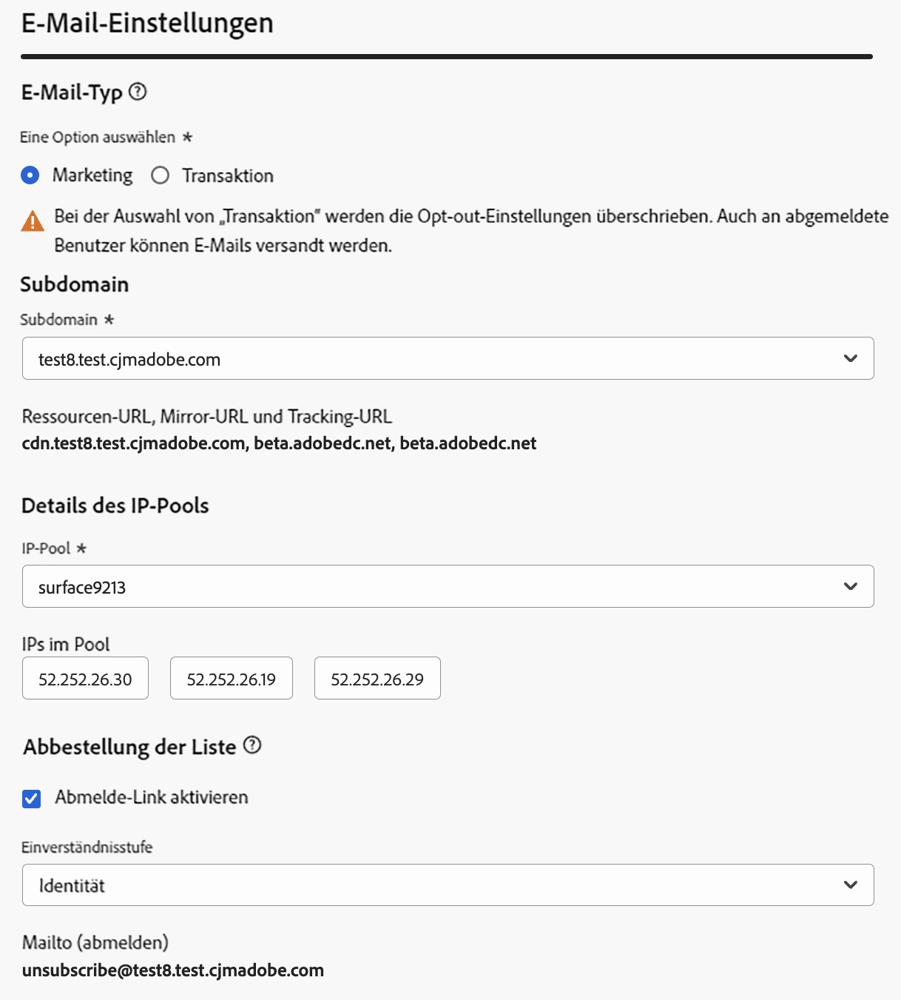

Sie können nicht mit der Oberflächenerstellung fortfahren, solange sich der ausgewählte IP-Pool unter [edition](../configuration/ip-pools.md#edit-ip-pool) (**[!UICONTROL Processing]** -Status) und noch nie mit der ausgewählten Subdomain verknüpft wurde. Andernfalls wird weiterhin die älteste Version der IP-Pool-/Subdomain-Zuordnung verwendet. Wenn dies der Fall ist, speichern Sie die Oberfläche als Entwurf und versuchen Sie es erneut, sobald der IP-Pool über die **[!UICONTROL Success]** Status.

>[!NOTE]
>
>Bei Nicht-Produktionsumgebungen erstellt Adobe keine nativen Test-Subdomains und gewährt keinen Zugriff auf einen freigegebenen Versand-IP-Pool. Sie müssen [Ihre eigenen Subdomains zuweisen](../configuration/delegate-subdomain.md) und verwenden Sie die IPs aus dem Pool, der Ihrer Organisation zugewiesen ist.

## List-Unsubscribe {#list-unsubscribe}

Bei [Auswählen einer Subdomain](#subdomains-and-ip-pools) aus der Liste **[!UICONTROL Enable List-Unsubscribe]** angezeigt.

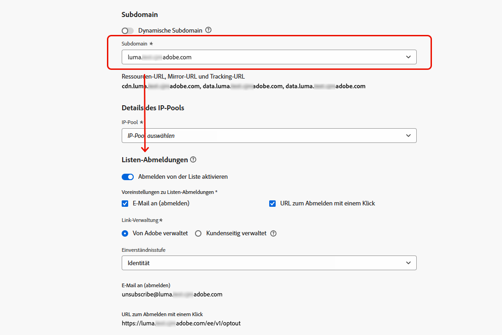

Diese Option ist standardmäßig aktiviert.

Wenn Sie diese Option aktiviert lassen, wird automatisch ein Abmelde-Link in den E-Mail-Header eingefügt, z. B.:

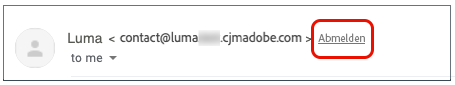

Wenn Sie diese Option deaktivieren, wird im E-Mail-Header kein Abmelde-Link angezeigt.

Der Abmelde-Link besteht aus zwei Elementen:

* Ein **Abmelde-E-Mail-Adresse**, an die alle Abmeldeanfragen gesendet werden.

   In [!DNL Journey Optimizer], ist die Abmelde-E-Mail-Adresse die Standardeinstellung. **[!UICONTROL Mailto (unsubscribe)]** Adresse, die auf der Kanaloberfläche angezeigt wird, basierend auf der [ausgewählte Subdomain](#subdomains-and-ip-pools).

   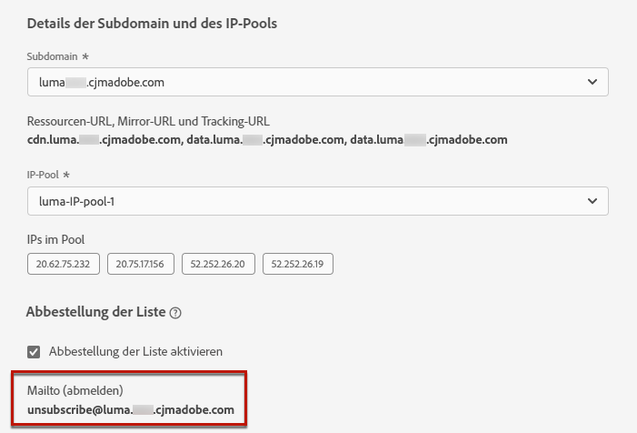

* Die **Abmelde-URL**: die URL der Landingpage, auf die der Benutzer umgeleitet wird, sobald er sich abgemeldet hat.

   Wenn Sie eine [Ausschluss-Link mit einem Klick](../privacy/opt-out.md#one-click-opt-out) einer auf dieser Oberfläche erstellten Nachricht entspricht die Abmelde-URL der für den Abmelde-Link mit einem Klick definierten URL.

   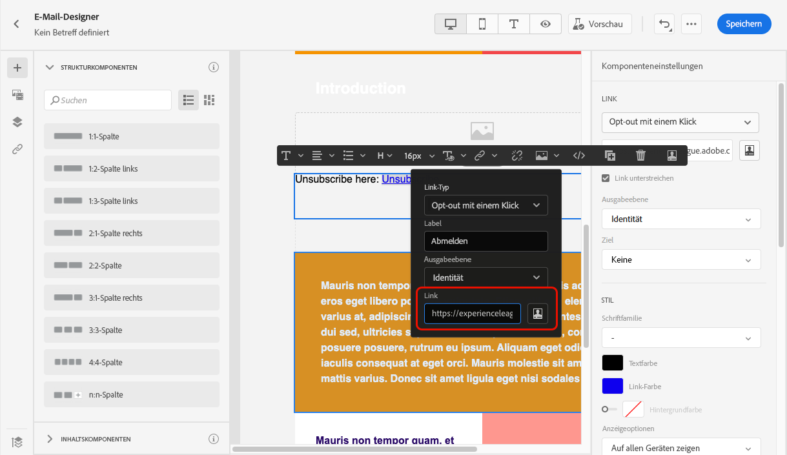

   >[!NOTE]
   >
   >Wenn Sie in Ihren Nachrichteninhalt keinen Ausschluss-Link mit einem Klick hinzufügen, wird dem Benutzer keine Landingpage angezeigt.

Erfahren Sie mehr über das Hinzufügen eines Header-Links zur Abmeldung Ihrer Nachrichten in [diesem Abschnitt](../privacy/opt-out.md#unsubscribe-header).

<!--Select the **[!UICONTROL Custom List-Unsubscribe]** option to enter your own Unsubscribe URL and/or your own Unsubscribe email address.(to add later)-->

## Kopfzeilenparameter {#email-header}

Im **[!UICONTROL Header parameters]** Geben Sie die Absendernamen und E-Mail-Adressen an, die mit der Art der mit dieser Oberfläche gesendeten E-Mails verknüpft sind.

* **[!UICONTROL Sender name]**: Name des Absenders, z. B. Ihres Markennamens.

* **[!UICONTROL Sender email]**: Die E-Mail-Adresse, die Sie für Ihre Kommunikation verwenden möchten.

* **[!UICONTROL Reply to (name)]**: Der Name, der verwendet wird, wenn der Empfänger auf die **Antwort** in der E-Mail-Client-Software.

* **[!UICONTROL Reply to (email)]**: Die E-Mail-Adresse, die verwendet wird, wenn der Empfänger auf die **Antwort** in der E-Mail-Client-Software. [Weitere Infos](#reply-to-email)

* **[!UICONTROL Error email]**: Alle Fehler, die von ISPs nach wenigen Tagen der Zustellung von E-Mails (asynchrone Bounces) erzeugt wurden, werden auf dieser Adresse empfangen.

>[!CAUTION]
>
>Die **[!UICONTROL Sender email]** und **[!UICONTROL Error email]** -Adressen müssen die aktuell ausgewählte [delegierte Subdomain](../configuration/about-subdomain-delegation.md). Wenn die delegierte Subdomain beispielsweise *marketing.luma.com* können Sie *contact@marketing.luma.com* und *error@marketing.luma.com*.

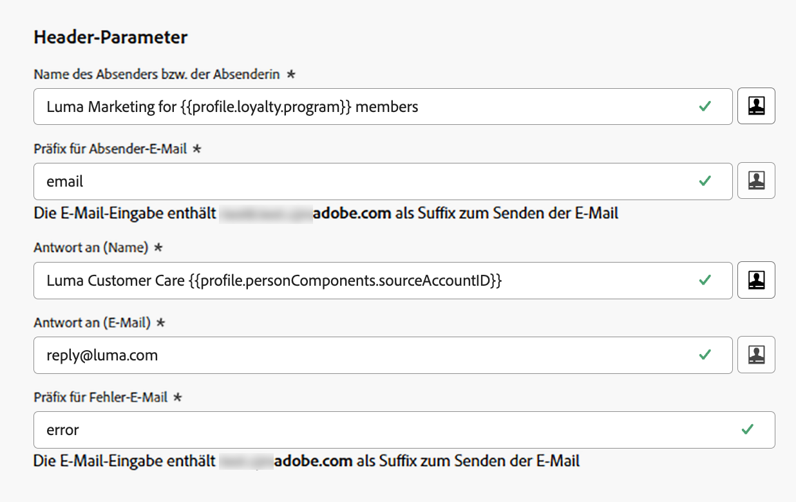

>[!NOTE]
>
>Adressen müssen mit einem Buchstaben (A-Z) beginnen und dürfen nur alphanumerische Zeichen enthalten. Sie können auch Unterstriche verwenden `_`, Punkt`.` und Bindestrich `-` Zeichen.

### Antwort auf E-Mail {#reply-to-email}

Bei der Definition der **[!UICONTROL Reply to (email)]** -Adresse können Sie eine beliebige E-Mail-Adresse angeben, vorausgesetzt, es handelt sich um eine gültige Adresse, ein korrektes Format und keine Tippfehler.

Befolgen Sie die nachstehenden Empfehlungen, um eine ordnungsgemäße Antwortverwaltung sicherzustellen:

* Der Posteingang, der für Antworten verwendet wird, erhält alle Antwort-E-Mails, einschließlich Abwesenheitsbenachrichtigungen und Anfechtungsantworten. Stellen Sie daher sicher, dass Sie über einen manuellen oder automatisierten Prozess zur Verarbeitung der E-Mails verfügen, die in diesen Posteingang eingehen.

* Stellen Sie sicher, dass der dedizierte Posteingang über genügend Aufnahmekapazität verfügt, um alle E-Mails zu erhalten, die über die E-Mail-Oberfläche gesendet werden. Wenn der Posteingang Bounces zurückgibt, werden manche Antworten von Ihren Kunden möglicherweise nicht empfangen.

* Die Antworten müssen unter Berücksichtigung der Datenschutz- und Compliance-Verpflichtungen verarbeitet werden, da sie personenbezogene Daten (PII) enthalten können.

* Markieren Sie keine Nachrichten im Antwort-Posteingang als Spam, da dies Auswirkungen auf alle anderen Antworten hat, die an diese Adresse gesendet werden.

### Weiterleitungs-E-Mail {#forward-email}

Wenn Sie alle E-Mails, die von [!DNL Journey Optimizer] Wenden Sie sich für die zugewiesene Subdomain an die Adobe-Kundenunterstützung. Sie müssen Folgendes bereitstellen:

* Die E-Mail-Weiterleitungsadresse Ihrer Wahl. Beachten Sie, dass die E-Mail-Adressdomäne für Weiterleitungen nicht mit einer Adobe zugewiesenen Subdomain übereinstimmen kann.
* Ihr Sandbox-Name.
* Der Oberflächenname, für den die Weiterleitungs-E-Mail-Adresse verwendet wird.
* Die aktuelle **[!UICONTROL Reply to (email)]** Adresse, die auf der Kanaloberfläche eingestellt ist.

>[!NOTE]
>
>Pro Subdomain kann nur eine Weiterleitungs-E-Mail-Adresse verwendet werden. Wenn mehrere Oberflächen dieselbe Subdomain verwenden, muss daher für alle dieselbe Weiterleitungs-E-Mail-Adresse verwendet werden.

Die Weiterleitungs-E-Mail-Adresse wird von Adobe eingerichtet. Dies kann 3 bis 4 Tage dauern.

## BCC-E-Mail {#bcc-email}

Sie können eine identische Kopie (oder blinde Kopie) der E-Mails senden, die von [!DNL Journey Optimizer] in einen BCC-Posteingang, in dem sie für Compliance- oder Archivierungszwecke gespeichert werden.

Aktivieren Sie dazu die **[!UICONTROL BCC email]** optionale Funktion auf der Kanaloberfläche. [Weitere Infos](../configuration/archiving-support.md#bcc-email)

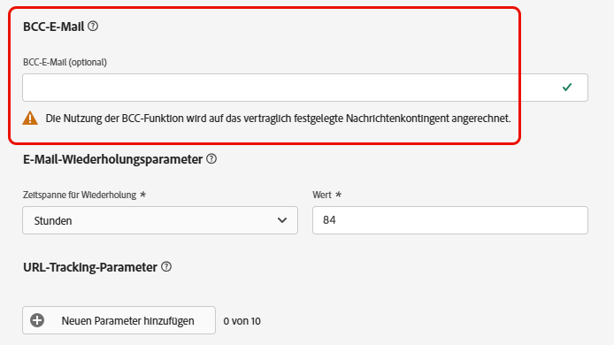

## Email-Wiederholungsparameter {#email-retry}

>[!CONTEXTUALHELP]
>id="ajo_admin_presets_retryperiod"
>title="Anpassen des Wiederholungszeitraumes"
>abstract="Wiederholungen werden für 3,5 Tage (84 Stunden) durchgeführt, wenn ein E-Mail-Versand aufgrund eines temporären Softbounce-Fehlers fehlschlägt. Sie können diesen standardmäßigen Wiederholungszeitraum an Ihre Anforderungen anpassen."
>additional-url="https://experienceleague.adobe.com/docs/journey-optimizer/using/configuration/configuration-message/email-configuration/monitor-reputation/retries.html" text="Über weitere Versuche"

Sie können die **Email-Wiederholungsparameter**.

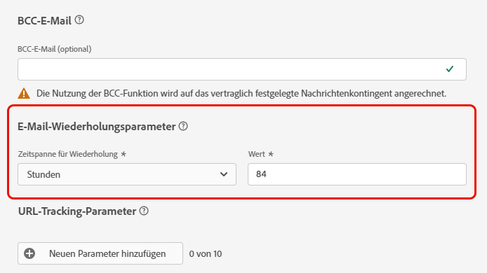

Standardmäßig wird die [Wiederholungszeitraum](../configuration/retries.md#retry-duration) auf 84 Stunden eingestellt ist, Sie können diese Einstellung jedoch an Ihre Anforderungen anpassen.

Sie müssen einen ganzzahligen Wert (in Stunden oder Minuten) innerhalb des folgenden Bereichs eingeben:

* Für Marketing-E-Mails beträgt die Wiederholungsdauer mindestens 6 Stunden.
* Bei Transaktions-E-Mails beträgt die Mindestdauer für den erneuten Versuch 10 Minuten.
* Für beide E-Mail-Typen beträgt der maximale Wiederholungszeitraum 84 Stunden (oder 5040 Minuten).

Erfahren Sie mehr über weitere Zustellversuche in [diesem Abschnitt](../configuration/retries.md).

## URL-Tracking {#url-tracking}

>[!CONTEXTUALHELP]
>id="ajo_admin_preset_utm"
>title="Definieren von URL-Tracking-Parametern"
>abstract="Verwenden Sie diesen Abschnitt, um Tracking-Parameter automatisch an die URLs anzuhängen, die in Ihrem E-Mail-Inhalt vorhanden sind. Diese Funktion ist optional."

>[!CONTEXTUALHELP]
>id="ajo_admin_preset_url_preview"
>title="Vorschau von URL-Tracking-Parametern"
>abstract="Überprüfen Sie, wie Tracking-Parameter an die in Ihrem E-Mail-Inhalt vorhandenen URLs angehängt werden."

Sie können **[!UICONTROL URL tracking parameters]** , um die Effektivität Ihrer Marketing-Maßnahmen kanalübergreifend zu messen. Diese Funktion ist optional.

Die in diesem Abschnitt definierten Parameter werden an das Ende der URLs angehängt, die in Ihrem E-Mail-Nachrichteninhalt enthalten sind. Sie können diese Parameter dann in Webanalysewerkzeugen wie Adobe Analytics oder Google Analytics erfassen und verschiedene Leistungsberichte erstellen.

<!--Three URL tracking parameters are auto-populated as an example when you create a channel surface. You can edit these and add up to 10 tracking parameters using the **[!UICONTROL Add new parameter]** button.-->

Mithilfe der **[!UICONTROL Add new parameter]** Schaltfläche.

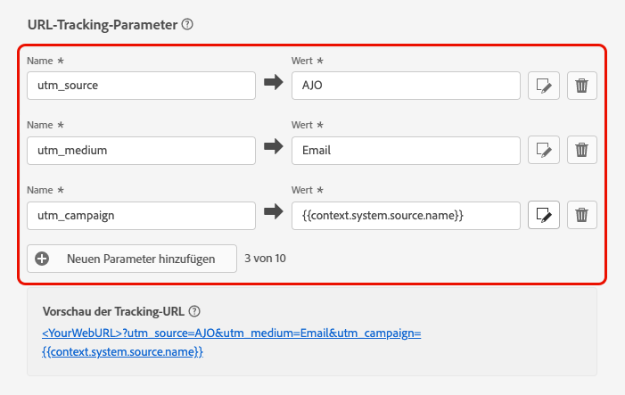

Um einen URL-Tracking-Parameter zu konfigurieren, können Sie die gewünschten Werte direkt in die **[!UICONTROL Name]** und **[!UICONTROL Value]** -Felder.

<!--You can also choose from a list of predefined values by navigating to the following objects:
* Journey attributes: **Source id**, **Source name**, **Source version id**
* Action attributes: **Action id**, **Action name**
* Offer decisioning attributes: **Offer id**, **Offer name**

>[!CAUTION]
>
>Do not select a folder: make sure to browse to the necessary folder and select a profile attribute to use as a tracking parameter value.-->

Sie können auch jede **[!UICONTROL Value]** -Feld mithilfe des [Ausdruckseditor](../personalization/personalization-build-expressions.md). Klicken Sie auf das Bearbeitungssymbol, um den Editor zu öffnen. Dort können Sie die von Ihnen ausgewählten Kontextattribute auswählen und/oder den Text direkt bearbeiten.

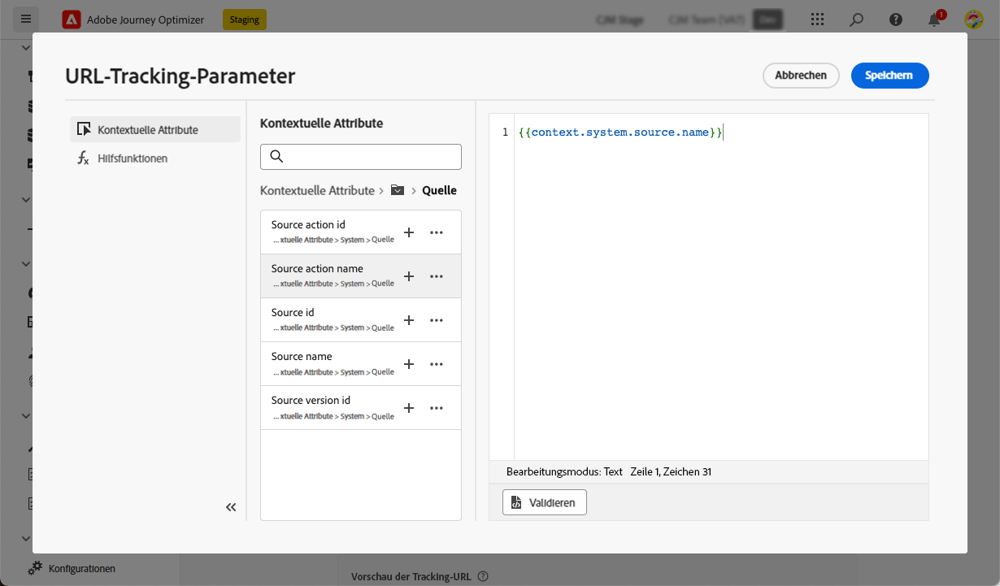

>[!NOTE]
>
>Sie können Textwerte eingeben und mithilfe von Kontextattributen aus dem Ausdruckseditor kombinieren. Jeder **[!UICONTROL Value]** kann bis zu 255 Zeichen lang sein.

<!--You can drag and drop the parameters to reorder them.-->

Im Folgenden finden Sie Beispiele für mit Adobe Analytics und Google Analytics kompatible URLs.

* Adobe Analytics-kompatible URL: `www.YourLandingURL.com?cid=email_AJO_{{context.system.source.id}}_image_{{context.system.source.name}}`

* Google Analytics-kompatible URL: `www.YourLandingURL.com?utm_medium=email&utm_source=AJO&utm_campaign={{context.system.source.id}}&utm_content=image`

Sie können die resultierende Tracking-URL dynamisch in der Vorschau anzeigen. Jedes Mal, wenn Sie einen Parameter hinzufügen, bearbeiten oder entfernen, wird die Vorschau automatisch aktualisiert.

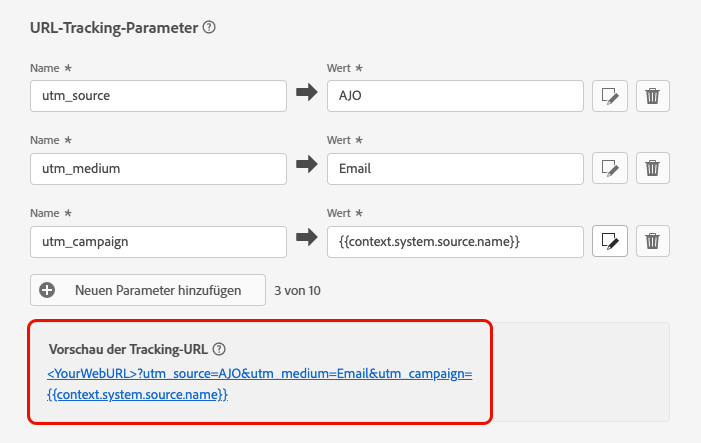