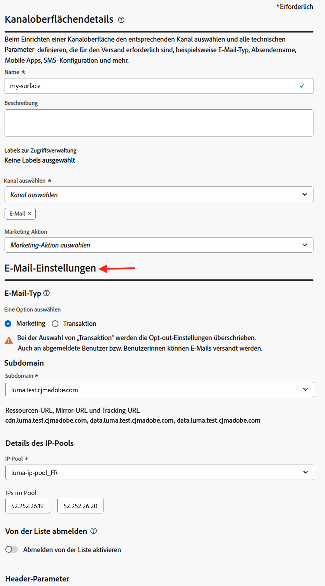
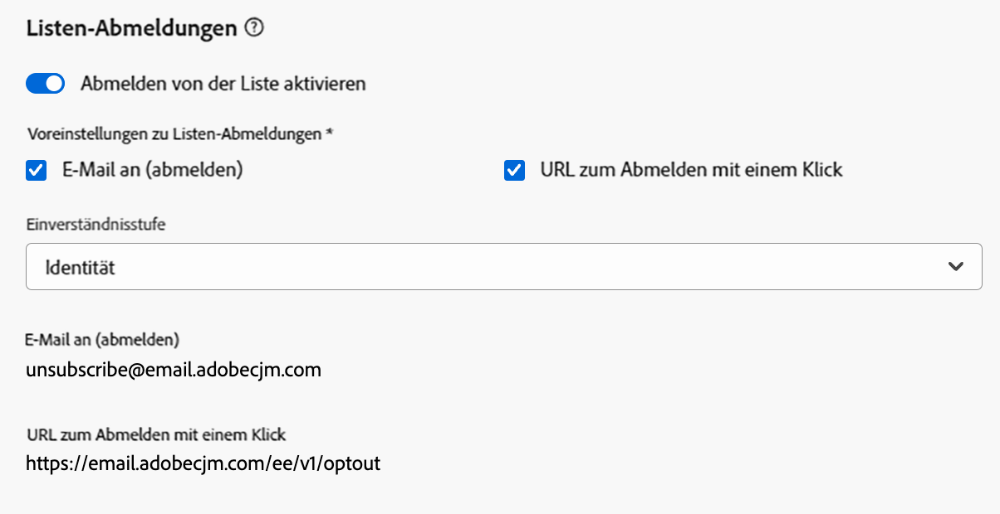
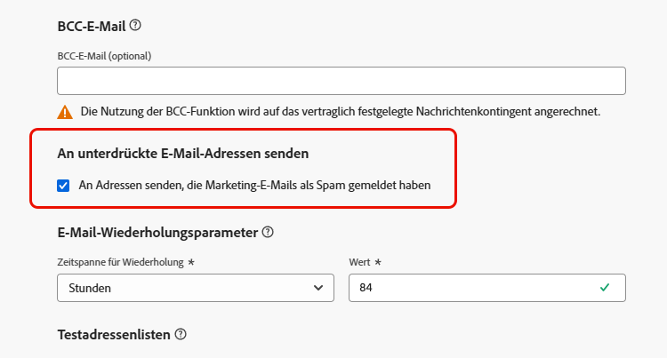

# Konfigurieren von E-Mail-Einstellungen {#email-settings}

Um eine E-Mail zu erstellen, müssen Sie E-Mail-Kanalkonfigurationen einrichten, die alle für Ihre Nachrichten erforderlichen technischen Parameter definieren. [Erfahren Sie, wie Sie Konfigurationen erstellen](../configuration/channel-surfaces.md)

>[!NOTE]
>
>Richten Sie vor der Erstellung einer E-Mail-Konfiguration die Subdomains ein, die Sie zum Senden von E-Mails verwenden, um Ihre Reputation zu wahren und Ihre Zustellbarkeit zu verbessern. [Weitere Informationen](../configuration/about-subdomain-delegation.md)

Definieren Sie die E-Mail-Einstellungen im entsprechenden Abschnitt der Kanalkonfiguration, wie unten beschrieben.

{width="50%" align="left"}

Die E-Mail-Konfiguration wird für den Versand von Nachrichten nach der folgenden Logik erfasst:

* Bei Batch-Journeys gilt dies nicht für Batch-Ausführungen, die bereits begonnen hatten, bevor die Konfiguration der E-Mail-Oberfläche festgelegt wurde. Die Änderungen werden beim nächsten Wiederkehren oder bei der nächsten Neuausführung übernommen.

* Bei Transaktionsnachrichten wird die Änderung sofort für die nächste Mitteilung übernommen (mit einer Verzögerung von bis zu fünf Minuten).

>[!NOTE]
>
>Die aktualisierten E-Mail-Konfigurationseinstellungen werden automatisch in den Journey(en) oder Kampagnen abgerufen, in denen die Konfiguration verwendet wird.

## E-Mail-Typ {#email-type}

>[!CONTEXTUALHELP]
>id="ajo_admin_presets_emailtype"
>title="Definieren des E-Mail-Typs"
>abstract="Wählen Sie den Typ der E-Mails aus, die bei Verwendung dieser Konfiguration gesendet werden sollen: Marketing für Werbe-E-Mails, für die die Zustimmung des Benutzers erforderlich ist, oder Transaktion für nicht kommerzielle E-Mails, die in bestimmten Kontexten auch an abgemeldete Profile gesendet werden können."

Wählen Sie im Abschnitt **E-Mail-Typ** den Nachrichtentyp für die Konfiguration aus: **[!UICONTROL Marketing]** oder **[!UICONTROL Transaktion]**.

* Wählen Sie **Marketing** für Werbe-E-Mails aus, z. B. für wöchentliche Werbeaktionen eines Einzelhandelsgeschäfts. Diese Nachrichten erfordern die Zustimmung der Person.

* Wählen Sie **Transaktion** für nicht-kommerzielle E-Mails aus, wie z. B. Bestellbestätigungen, Benachrichtigungen beim Zurücksetzen des Passworts oder Versandinformationen. Diese E-Mails können an Profile gesendet werden, die Marketing-Kommunikationen **abgemeldet** haben. Diese Nachrichten können nur in bestimmten Kontexten gesendet werden.

Bei der Erstellung einer Nachricht müssen Sie eine gültige Kanalkonfiguration auswählen, die der für die E-Mail ausgewählten Kategorie entspricht.

## Subdomain {#subdomains}

Wählen Sie die Subdomain aus, die zum Senden der E-Mails verwendet werden soll.

Um die Reputation Ihrer Domain zu wahren, den IP-Warming-Prozess zu beschleunigen und die Zustellbarkeit zu verbessern, delegieren Sie Ihre sendenden Subdomains an Adobe. [Weitere Informationen](../configuration/about-subdomain-delegation.md)

<!--If needed, you can define dynamic subdomains. [Learn more](../email/surface-personalization.md#dynamic-subdomains)-->

## Details des IP-Pools {#ip-pools}

Wählen Sie den IP-Pool aus, der mit der Konfiguration verknüpft werden soll. [Weitere Informationen](../configuration/ip-pools.md)

{width="50%" align="left"}

Sie können nicht mit der Konfigurationserstellung fortfahren, solange sich der ausgewählte IP-Pool unter dem Status [Bearbeitung](../configuration/ip-pools.md#edit-ip-pool) (**[!UICONTROL Verarbeitung]** ) befindet und noch nie mit der ausgewählten Subdomain verknüpft wurde. In diesem Fall wird weiterhin die älteste Version der IP-Pool-/Subdomain-Zuordnung verwendet. Wenn dies der Fall ist, speichern Sie die Konfiguration als Entwurf und versuchen Sie es erneut, sobald der IP-Pool den Status **[!UICONTROL Erfolg]** aufweist.

>[!NOTE]
>
>Für Nicht-Produktionsumgebungen erstellt Adobe keine nativen Test-Subdomains und gewährt auch keinen Zugriff auf einen freigegebenen Versand-IP-Pool. Sie müssen [Ihre eigenen Subdomains delegieren](../configuration/delegate-subdomain.md) und die IPs des Ihrem Unternehmen zugewiesenen Pools verwenden.

Nachdem ein IP-Pool ausgewählt wurde, sind PTR-Informationen zu sehen, wenn Sie den Mauszeiger über die IP-Adressen bewegen, die unter der Dropdown-Liste „IP-Pool“ angezeigt werden. [Weitere Informationen zu PTR-Einträgen](../configuration/ptr-records.md)

>[!NOTE]
>
>Wenn kein PTR-Eintrag konfiguriert ist, wenden Sie sich an den Adobe-Support.

## Abmelde-Link in Kopfzeile{#list-unsubscribe}

<!--Do not modify - Legal Review Done -->

Bei [der Auswahl einer Subdomain](#subdomains-and-ip-pools) aus der Liste wird die Option zur **[!UICONTROL Aktivierung der Abmeldung von der Liste]** angezeigt.

Diese Option ist standardmäßig aktiviert, um eine URL zum Abmelden mit einem Klick in die E-Mail-Kopfzeile einzufügen, z. B.:

Wenn Sie diese Option deaktivieren, wird in der E-Mail-Kopfzeile keine URL zum Abmelden mit einem Klick angezeigt.

Sie können die Einverständnisstufe aus der Dropdown-Liste **[!UICONTROL Einverständnisstufe]** auswählen. Sie kann sich auf den Kanal oder die Profilidentität beziehen. Basierend auf dieser Einstellung wird das Einverständnis in Adobe Journey Optimizer entweder auf Kanal- oder ID-Ebene aktualisiert, wenn sich jemand über die URL zum Abmelden von Listen in der Kopfzeile einer E-Mail abmeldet.

„Abmelde-Link in Kopfzeile“ bietet zwei Funktionen („Mailto“ und URL zum Abmelden mit einem Klick, wie unten beschrieben), die standardmäßig aktiviert sind, es sei denn, Sie deaktivieren eine oder beide Funktionen:

* Eine Adresse **Mailto (abmelden)**, bei der es sich um die Zieladresse handelt, an die Abmeldeanfragen zur automatischen Verarbeitung weitergeleitet werden.

  In Journey Optimizer ist die E-Mail-Adresse zum Abmelden die standardmäßige **Mailto (unsubscribe)** -Adresse, die in der Kanalkonfiguration basierend auf Ihrer [ausgewählten Subdomain](#subdomains-and-ip-pools) angezeigt wird.

  {width="80%" align="left"}

* Die **URL zum Abmelden mit einem Klick**, bei der es sich standardmäßig um die 1-Klick-Option für die von unserer URL generierte Kopfzeile zum Abmelden von Listen handelt, basierend auf der Subdomain, die Sie in den Kanalkonfigurationseinstellungen festgelegt und konfiguriert haben.

<!--
    >[!AVAILABILITY]
    >
    >One-click Unsubscribe URL Header will be available in Adobe Journey Optimizer starting June 3, 2024.
    >
-->

Die Funktionen **[!UICONTROL Mailto (abmelden)]** und **[!UICONTROL URL zum Abmelden mit einem Klick]** sind optional. Wenn Sie nicht die standardmäßig generierte URL zum Abmelden mit einem Klick verwenden möchten, können Sie die Funktion deaktivieren. In dem Szenario, in dem die Option **[!UICONTROL Opt-out-Konfiguration]** aktiviert und die Funktion **[!UICONTROL URL-Abmeldung mit einem Klick]** deaktiviert ist, nimmt der Header zur Abmeldung von der Liste den 1-Klick-Abmelde-Link, den Sie im Textkörper der E-Mail eingefügt haben, auf, wenn Sie einer Nachricht, die mit dieser Konfiguration erstellt wurde, einen 1-Klick-Abmelde-Link hinzuzufügen. Klicken Sie auf den Wert URL abmelden .

>[!NOTE]
>
>Wenn Sie keinen Ausschluss-Link mit einem Klick in Ihren Nachrichteninhalt einfügen und die standardmäßige Abmelde-URL mit einem Klick in den Kanalkonfigurationseinstellungen deaktiviert ist, wird im Header &quot;List Unsubscribe&quot;keine URL an den E-Mail-Header übergeben.

In [diesem Abschnitt](../email/email-opt-out.md#unsubscribe-header) erfahren Sie mehr über die Verwaltung von Abmeldefunktionen in Ihren Nachrichten.

## Kopfzeilenparameter {#email-header}

Geben Sie im Abschnitt **[!UICONTROL Header-Parameter]** die Absendernamen und E-Mail-Adressen ein, die mit dem Typ der mit dieser Konfiguration gesendeten E-Mails verknüpft sind.

* **[!UICONTROL Absendername]**: Der Name des Absenders, wie z. B. der Name der Marke.
* **[!UICONTROL Absender-E-Mail]**: Die E-Mail-Adresse, die für die Kommunikation verwendet werden soll.
* **[!UICONTROL Antwort an (Name)]**: Der Name, der verwendet wird, wenn der Empfänger in seiner E-Mail-Client-Software auf den Button **Antworten** klickt.
* **[!UICONTROL Antwort an (E-Mail)]**: Die E-Mail-Adresse, die verwendet wird, wenn der Empfänger in seiner E-Mail-Client-Software auf den Button **Antworten** klickt. [Weitere Informationen](#reply-to-email)
* **[!UICONTROL Fehler-E-Mail-Adresse]**: An dieser Adresse werden alle Fehlermeldungen empfangen, die von ISPs nach mehreren Tagen der E-Mail-Zustellung erzeugt wurden (asynchrone Bounces). Die Abwesenheitsbenachrichtigungen und Challenge-Responses werden ebenfalls an diese Adresse gesendet.

  Wenn Sie die Abwesenheitsbenachrichtigungen und Challenge-Responses auf Anfragen an eine bestimmte E-Mail-Adresse erhalten möchten, die nicht an Adobe delegiert ist, müssen Sie einen [Weiterleitungsprozess](#forward-email) einrichten. Vergewissern Sie sich in diesem Fall, dass Sie über eine manuelle oder automatisierte Lösung verfügen, mit der die in diesen Posteingang eingehenden E-Mails verarbeitet werden können.

>[!CAUTION]
>
>Die **[!UICONTROL Absender-E-Mail-Adresse]** und **[!UICONTROL Fehler-E-Mail]**-Adressen müssen die aktuell ausgewählte [delegierte Subdomain](../configuration/about-subdomain-delegation.md) verwenden. Wenn die delegierte Subdomain beispielsweise *marketing.luma.com* lautet, kann *contact@marketing.luma.com* und *error@marketing.luma.com* verwendet werden. 

>[!NOTE]
>
>Adressen müssen mit einem Buchstaben (A-Z) beginnen und dürfen nur alphanumerische Zeichen enthalten. Sie können auch die Zeichen Unterstrich `_`, Punkt `.` und Bindestrich `-` verwenden.

### Antwort auf E-Mail {#reply-to-email}

Bei der Definition der **[!UICONTROL Antwort an (E-Mail)]**-Adresse kann eine beliebige E-Mail-Adresse angegeben werden, vorausgesetzt es handelt sich um eine gültige Adresse in einem korrekten Format und ohne Tippfehler.

Der Posteingang, der für Antworten verwendet wird, erhält alle Antwort-E-Mails, mit Ausnahme der Abwesenheitsbenachrichtigungen und Challenge-Responses, die an der **[!UICONTROL Fehler-E-Mail-Adresse]** empfangen werden.

Befolgen Sie die nachstehenden Empfehlungen, um eine ordnungsgemäße Antwortverwaltung sicherzustellen:

* Stellen Sie sicher, dass der dedizierte Posteingang über genügend Aufnahmekapazität verfügt, um alle Antwort-E-Mails zu erhalten, die mit der E-Mail-Konfiguration gesendet werden. Wenn der Posteingang Bounce-Nachrichten zurückgibt, werden manche Antworten von den Kunden möglicherweise nicht empfangen.

* Die Antworten müssen unter Berücksichtigung der Datenschutz- und Compliance-Verpflichtungen verarbeitet werden, da sie personenbezogene Daten (PII) enthalten können.

* Bitte im Posteingang für Antworten keine Nachrichten als Spam markieren, da sich das auf alle anderen an diese Adresse gesendeten Antworten auswirken würde.

Stellen Sie außerdem bei der Definition der Adresse **[!UICONTROL Antwort an (E-Mail)]** sicher, dass Sie eine Subdomain mit einer gültigen MX-Datensatzkonfiguration verwenden. Andernfalls schlägt die E-Mail-Konfigurationsverarbeitung fehl.

Wenn beim Senden der E-Mail-Konfiguration ein Fehler auftritt, bedeutet dies, dass der MX-Datensatz nicht für die Subdomain der eingegebenen Adresse konfiguriert ist. Sie können die Administrierenden kontaktieren, um den entsprechenden MX-Eintrag zu konfigurieren, oder eine andere Adresse mit einer gültigen MX-Eintragskonfiguration verwenden.

>[!NOTE]
>
>Wenn die Subdomain der eingegebenen Adresse eine Domain ist, die Adobe [komplett delegiert](../configuration/delegate-subdomain.md#full-subdomain-delegation) wurde, kontaktieren Sie die Adobe-Kundenbetreuung.

### Weiterleiten von E-Mails {#forward-email}

Um alle von [!DNL Journey Optimizer] für die delegierte Subdomain empfangenen E-Mails an eine bestimmte E-Mail-Adresse weiterleiten zu lassen, wenden Sie sich an die Kundenunterstützung von Adobe.

>[!NOTE]
>
>Wenn die Subdomain für die **[!UICONTROL Antwortadresse (E-Mail)]** nicht an Adobe delegiert ist, kann die Weiterleitung für diese Adresse nicht funktionieren.

Sie müssen Folgendes angeben:

* Die E-Mail-Weiterleitungsadresse Ihrer Wahl. Beachten Sie, dass die E-Mail-Adress-Domain für Weiterleitungen nicht mit einer an Adobe delegierten Subdomain übereinstimmen darf.
* Ihren Sandbox-Namen.
* Der Konfigurationsname oder die Subdomain, für die die Weiterleitungs-E-Mail-Adresse verwendet wird.
  <!--* The current **[!UICONTROL Reply to (email)]** address or **[!UICONTROL Error email]** address set at the channel configuration level.-->

>[!NOTE]
>
>Pro Subdomain kann nur eine Weiterleitungs-E-Mail-Adresse verwendet werden. Wenn mehrere Konfigurationen dieselbe Subdomain verwenden, muss daher für alle dieselbe Weiterleitungs-E-Mail-Adresse verwendet werden.

Die Weiterleitungs-E-Mail-Adresse wird von Adobe eingerichtet. Dies kann 3 bis 4 Tage dauern.

Nach Abschluss des Vorgangs werden alle Nachrichten, die an der **[!UICONTROL Antwortadresse (E-Mail)]** und der **[!UICONTROL Fehler-E-Mail-Adresse]** empfangen wurden, an die von Ihnen angegebene E-Mail-Adresse weitergeleitet.

## BCC-E-Mail-Adresse {#bcc-email}

Sie können eine identische Kopie (oder Blindkopie) von E-Mails senden, die von [!DNL Journey Optimizer] an einen BCC-Posteingang gesendet wurden, in dem sie für Compliance- oder Archivierungszwecke gespeichert werden.

Aktivieren Sie dazu die optionale Funktion **[!UICONTROL BCC email]** auf der Kanalkonfigurationsebene. [Weitere Informationen](../configuration/archiving-support.md#bcc-email)

Stellen Sie außerdem bei der Definition der **[!UICONTROL Bcc-E-Mail-1}-Adresse sicher, dass Sie eine Subdomain mit einer gültigen MX-Datensatzkonfiguration verwenden. Andernfalls schlägt die E-Mail-Konfigurationsverarbeitung fehl.]**

Wenn beim Senden der E-Mail-Konfiguration ein Fehler auftritt, bedeutet dies, dass der MX-Datensatz nicht für die Subdomain der eingegebenen Adresse konfiguriert ist. Sie können die Administrierenden kontaktieren, um den entsprechenden MX-Eintrag zu konfigurieren, oder eine andere Adresse mit einer gültigen MX-Eintragskonfiguration verwenden.

## Senden an unterdrückte E-Mail-Adressen {#send-to-suppressed-email-addresses}

>[!CONTEXTUALHELP]
>id="ajo_surface_suppressed_addresses"
>title="Überschreiben der Unterdrückungslistenpriorität"
>abstract="Sie können Transaktionsnachrichten auch dann an Profile senden, wenn deren E-Mail-Adressen aufgrund von Spam-Beschwerden auf der Adobe Journey Optimizer-Unterdrückungsliste stehen. Standardmäßig ist diese Option deaktiviert."
>additional-url="https://experienceleague.adobe.com/docs/journey-optimizer/using/configuration/monitor-reputation/manage-suppression-list.html?lang=de" text="Verwalten der Unterdrückungsliste"

>[!IMPORTANT]
>
>Diese Option ist nur verfügbar, wenn Sie den E-Mail-Typ **[!UICONTROL Transaktion]** ausgewählt haben. [Weitere Informationen](#email-type)

In [!DNL Journey Optimizer] werden alle E-Mail-Adressen, die als Hardbounces, Softbounces und Spam-Beschwerden gekennzeichnet sind, automatisch in der [Unterdrückungsliste](../configuration/manage-suppression-list.md) gesammelt und vom Versand in einer Journey oder Kampagne ausgeschlossen.

Sie können jedoch entscheiden, Nachrichten des Typs **Transaktion** an Profile zu senden, auch wenn ihre E-Mail-Adressen aufgrund von Spam-Beschwerden einer Benutzerin oder eines Benutzers auf der Unterdrückungsliste stehen.

Tatsächlich erhalten Transaktionsnachrichten im Allgemeinen nützliche und erwartete Informationen wie eine Bestellbestätigung oder eine Benachrichtigung zur Passwortzurücksetzung. Selbst wenn eine Ihrer Marketing-Nachrichten als Spam gemeldet wurde, möchten Sie in den meisten Fällen, dass Ihre Kunden diese Art nicht kommerzieller E-Mails erhalten.

Um E-Mail-Adressen, die aufgrund von Spam-Beschwerden unterdrückt wurden, in Ihre Zielgruppe für Transaktionsnachrichten aufzunehmen, wählen Sie die entsprechende Option aus dem Abschnitt **[!UICONTROL An unterdrückte E-Mail-Adressen senden]** aus.

>[!NOTE]
>
>Standardmäßig ist diese Option deaktiviert.

Als Best Practice für die Zustellbarkeit ist diese Option standardmäßig deaktiviert, um sicherzustellen, dass Ihre Kundinnen und Kunden, die sich abgemeldet haben, nicht kontaktiert werden. Sie können diese Standardoption jedoch ändern, sodass Sie dann Transaktionsnachrichten an Ihre Kundinnen und Kunden senden können.

Wenn diese Option aktiviert ist, kann ein Kunde zwar Ihre Marketing-E-Mail als Spam gekennzeichnet haben, aber mithilfe der aktuellen Konfiguration Transaktionsnachrichten empfangen. Achten Sie immer darauf, Opt-out-Voreinstellungen gemäß den Best Practices für die Zustellbarkeit zu verwalten.

## Testadressenliste {#seed-list}

>[!CONTEXTUALHELP]
>id="ajo_surface_seed_list"
>title="Testadressenliste hinzufügen"
>abstract="Wählen Sie die Testadressenliste Ihrer Wahl aus, um automatisch bestimmte interne Adressen zu Ihren Zielgruppen hinzuzufügen. Diese Testadressen werden zum Ausführungszeitpunkt des Versands hinzugefügt und erhalten für Sicherheitszwecke eine exakte Kopie der Nachricht."
>additional-url="https://experienceleague.adobe.com/docs/journey-optimizer/using/configuration/seed-lists.html?lang=de#use-seed-list" text="Was sind Testadressenlisten?"

Eine Testadressenliste in [!DNL Journey Optimizer] ermöglicht es Ihnen, automatisch bestimmte E-Mail-Testadressen in Ihre Sendungen einzuschließen. [Weitere Informationen](../configuration/seed-lists.md)

>[!CAUTION]
>
>Diese Funktion ist derzeit nur für den E-Mail-Kanal verfügbar.

Wählen Sie die Liste, die für Sie relevant ist, im Abschnitt **[!UICONTROL Testadressenliste]** aus. In [diesem Abschnitt](../configuration/seed-lists.md#create-seed-list) erfahren Sie, wie Sie eine Testadressenliste erstellen.

>[!NOTE]
>
>Es kann jeweils nur eine Testadressenliste ausgewählt werden.

Wenn die aktuelle Konfiguration in einer Kampagne oder einer Journey verwendet wird, werden die E-Mail-Adressen auf der ausgewählten Testliste zum Zeitpunkt der Versandausführung einbezogen, d. h. sie erhalten zur Gewährleistung eine Kopie des Versands.

In [diesem Abschnitt](../configuration/seed-lists.md#use-seed-list) erfahren Sie, wie Sie eine Testadressenliste in einer Kampagne oder einer Journey verwenden.

## E-Mail-Wiederholungsparameter {#email-retry}

>[!CONTEXTUALHELP]
>id="ajo_admin_presets_retryperiod"
>title="Anpassen des Wiederholungszeitraumes"
>abstract="Wiederholungen werden 3,5 Tage lang (84 Stunden) durchgeführt, wenn ein E-Mail-Versand aufgrund eines temporären Softbounce-Fehlers fehlschlägt. Sie können diesen standardmäßigen Wiederholungszeitraum an Ihre Anforderungen anpassen."
>additional-url="https://experienceleague.adobe.com/docs/journey-optimizer/using/configuration/monitor-reputation/retries.html?lang=de" text="Über weitere Zustellversuche"

Sie können die **E-Mail-Wiederholungsparameter** konfigurieren.

Standardmäßig ist der [Zeitraum für weitere Zustellversuche](../configuration/retries.md#retry-duration) auf 84 Stunden festgelegt. Sie können diese Einstellung jedoch an Ihre Anforderungen anpassen.

Sie müssen einen ganzzahligen Wert (in Stunden oder Minuten) innerhalb des folgenden Bereichs eingeben:

* Für E-Mails vom Typ Marketing beträgt der Mindestzeitraum für weitere Zustellversuche 6 Stunden.
* Für E-Mails vom Typ Transaktion beträgt der Mindestzeitraum für weitere Zustellversuche 10 Minuten.
* Für beide E-Mail-Typen beträgt der maximale Zeitraum für weitere Zustellversuche 84 Stunden (d. h. 5.040 Minuten).

Weitere Informationen zu weiteren Zustellversuchen finden Sie in [diesem Abschnitt](../configuration/retries.md).

## URL-Tracking {#url-tracking}

>[!CONTEXTUALHELP]
>id="ajo_admin_preset_utm"
>title="Definieren der URL-Tracking-Parameter"
>abstract="Verwenden Sie diesen Abschnitt, um Tracking-Parameter automatisch an die im E-Mail-Inhalt vorhandenen URLs anzuhängen. Diese Funktion ist optional."

>[!CONTEXTUALHELP]
>id="ajo_admin_preset_url_preview"
>title="Vorschau der URL-Tracking-Parameter"
>abstract="Überprüfen Sie, wie Tracking-Parameter an die in Ihrem E-Mail-Inhalt vorhandenen URLs angehängt werden."

Sie können **[!UICONTROL URL-Tracking-Parameter]** verwenden, um die Effektivität Ihrer Marketing-Maßnahmen kanalübergreifend zu messen. Diese Funktion ist optional.

Die in diesem Abschnitt definierten Parameter werden an das Ende der URLs angehängt, die im Inhalt Ihrer E-Mail-Nachricht enthalten sind. Anschließend können Sie diese Parameter in Web-Analyse-Tools wie Adobe Analytics oder Google Analytics erfassen und verschiedene Performance-Berichte erstellen.

Sie können mithilfe der Schaltfläche **[!UICONTROL Neuen Parameter hinzufügen]** bis zu 10 Tracking-Parameter hinzufügen.

Um einen URL-Tracking-Parameter zu konfigurieren, können Sie die gewünschten Werte direkt in die Felder **[!UICONTROL Name]** und **[!UICONTROL Wert]** eingeben.

Mithilfe des [Personalisierungseditors](../personalization/personalization-build-expressions.md) können Sie auch jedes Feld **[!UICONTROL Wert]** bearbeiten.  Klicken Sie auf das Bearbeitungssymbol, um den Editor zu öffnen. Dort können Sie die gewünschten Kontexteigenschaften und/oder den Text direkt bearbeiten.

Die folgenden vordefinierten Werte sind über den Personalisierungseditor verfügbar:

* **Quellaktion-ID**: ID der E-Mail-Aktion, die der Journey oder Kampagne hinzugefügt wurde.

* **Name der Quellaktion**: Name der E-Mail-Aktion, die der Journey oder Kampagne hinzugefügt wurde.

* **Quell-ID**: ID der Journey oder Kampagne, mit der die E-Mail gesendet wurde.

* **Quellname**: Name der Journey oder Kampagne, mit der die E-Mail gesendet wurde.

* **Quellversions-ID**: ID der Journey- oder Kampagnenversion, mit der die E-Mail gesendet wurde.

* **Angebots-ID**: ID des in der E-Mail verwendeten Angebots.

>[!NOTE]
>
>Sie können die Eingabe von Textwerten und die Verwendung von kontextuellen Attributen im Personalisierungseditor kombinieren.  Jedes **[!UICONTROL Wert]**-Feld kann eine Anzahl von Zeichen bis zu einer Größe von 5 KB enthalten.

<!--You can drag and drop the parameters to reorder them.-->

Im Folgenden finden Sie Beispiele für URLs, die mit Adobe Analytics und Google Analytics kompatibel sind.

* Mit Adobe Analytics kompatible URL: `www.YourLandingURL.com?cid=email_AJO_{{context.system.source.id}}_image_{{context.system.source.name}}`

* Mit Google Analytics kompatible URL: `www.YourLandingURL.com?utm_medium=email&utm_source=AJO&utm_campaign={{context.system.source.id}}&utm_content=image`

Sie können die resultierende Tracking-URL dynamisch in der Vorschau anzeigen. Jedes Mal, wenn Sie einen Parameter hinzufügen, bearbeiten oder entfernen, wird die Vorschau automatisch aktualisiert.

>[!NOTE]
>
>Sie können den Links in Ihrem E-Mail-Inhalt auch dynamische personalisierte Tracking-Parameter hinzufügen, dies ist jedoch auf Konfigurationsebene nicht möglich. Diesen Schritt müssen Sie bei der Erstellung Ihrer Nachricht mit dem E-Mail-Designer durchführen. [Weitere Informationen](message-tracking.md#url-tracking)
