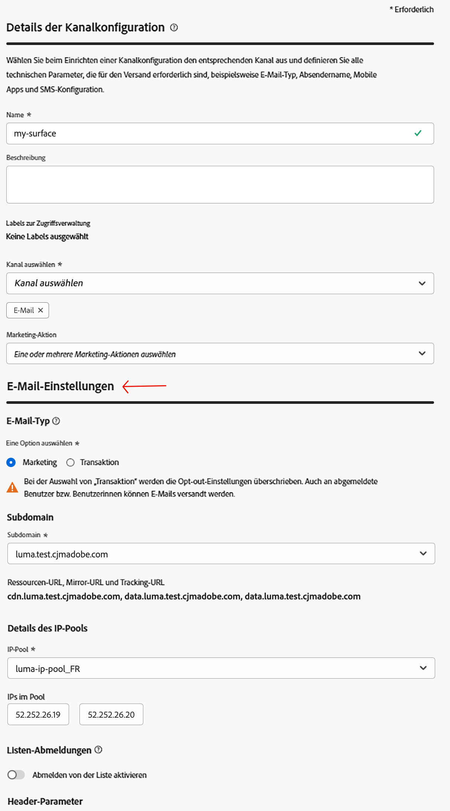
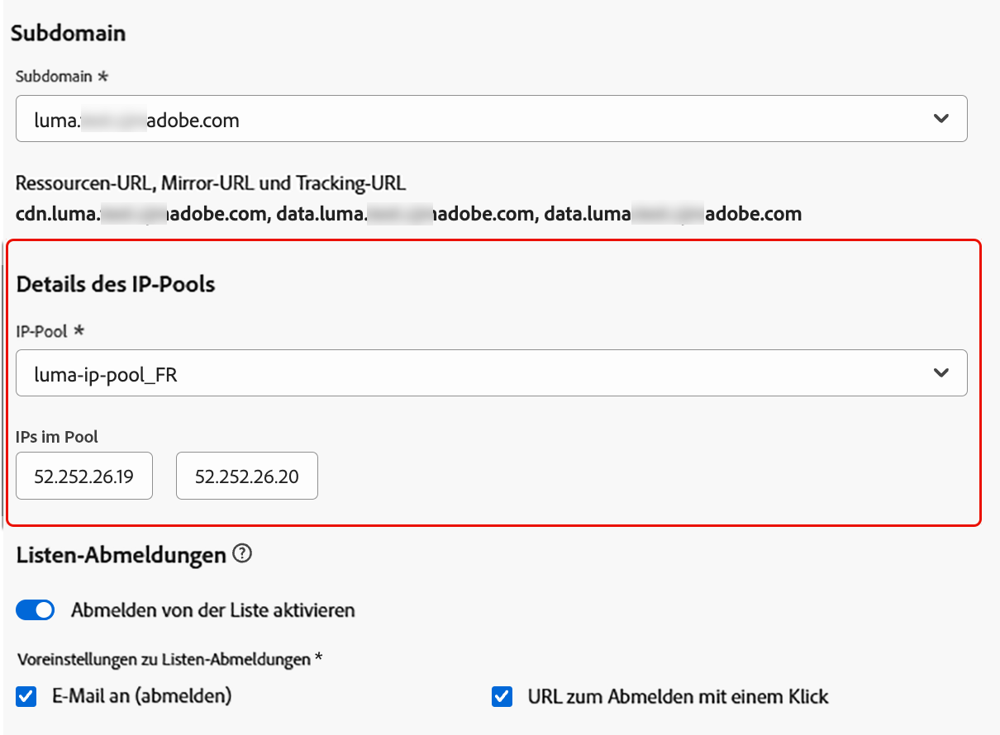
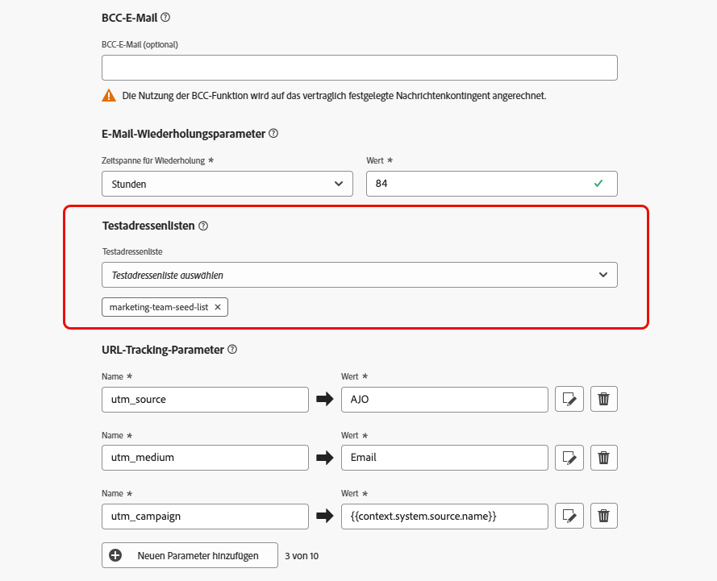

# Konfigurieren von E-Mail-Einstellungen {#email-settings}

Zu Beginn der Erstellung einer E-Mail müssen Sie Konfigurationen für E-Mail-Kanäle einrichten, die alle für Ihre Nachrichten erforderlichen technischen Parameter definieren. [Erfahren Sie, wie Sie Konfigurationen erstellen](../configuration/channel-surfaces.md)

>[!NOTE]
>
>Richten Sie vor der Erstellung einer E-Mail-Konfiguration die Subdomains ein, die Sie zum Senden von E-Mails verwenden, um Ihre Reputation zu wahren und Ihre Zustellbarkeit zu verbessern. [Weitere Informationen](../configuration/about-subdomain-delegation.md)

Legen Sie die E-Mail-Einstellungen im entsprechenden Abschnitt der Kanalkonfiguration fest, wie unten beschrieben.

{width="50%" align="left"}

Die E-Mail-Konfiguration wird nach der folgenden Logik für das Senden von Nachrichten übernommen:

* Bei Batch-Journeys gilt dies nicht für Batch-Ausführungen, die bereits begonnen hatten, bevor die Konfiguration der E-Mail-Oberfläche festgelegt wurde. Die Änderungen werden beim nächsten Wiederkehren oder bei der nächsten Neuausführung übernommen.

* Bei Transaktionsnachrichten wird die Änderung sofort für die nächste Mitteilung übernommen (mit einer Verzögerung von bis zu fünf Minuten).

>[!NOTE]
>
>Die aktualisierten E-Mail-Konfigurationseinstellungen werden automatisch in den Journeys oder Kampagnen aufgenommen, in denen die Konfiguration verwendet wird.

## E-Mail-Typ {#email-type}

>[!CONTEXTUALHELP]
>id="ajo_admin_presets_emailtype"
>title="Definieren des E-Mail-Typs"
>abstract="Typ der E-Mails auswählen, die bei Verwendung dieser Konfiguration gesendet werden sollen: „Marketing“ für Werbenachrichten, für die das Einverständnis der Benutzenden erforderlich ist, oder „Transaktion“ für nicht kommerzielle Nachrichten, die in bestimmten Situationen auch an abgemeldete Profile gesendet werden können."

Wählen Sie im Abschnitt **E-Mail-Typ** die Art der Nachricht für die Konfiguration aus: **[!UICONTROL Marketing]** oder **[!UICONTROL Transaktion]**.

* Wählen Sie **Marketing** für Werbe-E-Mails aus, z. B. für wöchentliche Werbeaktionen eines Einzelhandelsgeschäfts. Diese Nachrichten erfordern die Zustimmung der Person.

* Wählen Sie **Transaktion** für nicht-kommerzielle E-Mails aus, wie z. B. Bestellbestätigungen, Benachrichtigungen beim Zurücksetzen des Passworts oder Versandinformationen. Diese E-Mails können an Profile gesendet werden, die Marketing-Kommunikationen **abgemeldet** haben. Diese Nachrichten können nur in bestimmten Kontexten gesendet werden.

Wenn Sie eine Nachricht erstellen, müssen Sie eine gültige Kanalkonfiguration auswählen, die der für Ihre E-Mail ausgewählten Kategorie entspricht.

## Subdomain {#subdomains}

Wählen Sie die Subdomain aus, die zum Senden der E-Mails verwendet werden soll.

>[!NOTE]
>
>Um die Kontrolle über die E-Mail-Einstellungen zu verbessern, können Sie dynamische Subdomains definieren. [Weitere Informationen](../email/surface-personalization.md#dynamic-subdomains)

Um die Reputation Ihrer Domain zu wahren, den IP-Warming-Prozess zu beschleunigen und die Zustellbarkeit zu verbessern, delegieren Sie Ihre sendenden Subdomains an Adobe. [Weitere Informationen](../configuration/about-subdomain-delegation.md)

## Details des IP-Pools {#ip-pools}

Wählen Sie den IP-Pool aus, der mit der Konfiguration verknüpft werden soll. [Weitere Informationen](../configuration/ip-pools.md)

{width="50%" align="left"}

Sie können nicht mit der Erstellung der Konfiguration fortfahren, während sich der ausgewählte IP-Pool in [Bearbeitung](../configuration/ip-pools.md#edit-ip-pool) befindet (Status **[!UICONTROL Verarbeitung läuft]**) und noch nie mit der ausgewählten Subdomain verknüpft wurde. In diesem Fall wird weiterhin die älteste Version der IP-Pool-/Subdomain-Zuordnung verwendet. Wenn dies der Fall ist, speichern Sie die Konfiguration als Entwurf und versuchen Sie es erneut, sobald der IP-Pool den Status **[!UICONTROL Erfolg]** erreicht hat.

>[!NOTE]
>
>Für Nicht-Produktionsumgebungen erstellt Adobe keine nativen Test-Subdomains und gewährt auch keinen Zugriff auf einen freigegebenen Versand-IP-Pool. Sie müssen [Ihre eigenen Subdomains delegieren](../configuration/delegate-subdomain.md) und die IPs des Ihrem Unternehmen zugewiesenen Pools verwenden.

Nachdem ein IP-Pool ausgewählt wurde, sind PTR-Informationen zu sehen, wenn Sie den Mauszeiger über die IP-Adressen bewegen, die unter der Dropdown-Liste „IP-Pool“ angezeigt werden. [Weitere Informationen zu PTR-Einträgen](../configuration/ptr-records.md)

>[!NOTE]
>
>Wenn kein PTR-Eintrag konfiguriert ist, wenden Sie sich an den Adobe-Support.

## Abmelden von der Liste {#list-unsubscribe}

Bei der Auswahl einer Subdomain aus der Liste wird die Option **[!UICONTROL Listen-Abonnement kündigen aktivieren]** angezeigt. Sie ist standardmäßig aktiviert.

Damit können Sie eine 1-Klick-Abmelde-URL in die E-Mail-Kopfzeile einfügen. [Weitere Informationen](list-unsubscribe.md)

## Kopfzeilenparameter {#email-header}

Geben Sie im Abschnitt **[!UICONTROL Kopfzeilenparameter]** die Absendernamen und E-Mail-Adressen ein, die mit dem Typ der mit dieser Konfiguration gesendeten E-Mails verknüpft sind.

>[!NOTE]
>
>Um die Kontrolle über die E-Mail-Einstellungen zu verbessern, können Sie die Kopzeilen-Parameter personalisieren. [Weitere Informationen](../email/surface-personalization.md#personalize-header)

* **[!UICONTROL Name des Absenders bzw. der Absenderin]**: Der Absendername, wie z. B. der Name Ihrer Marke.
* **[!UICONTROL Präfix für Absender-E-Mail]**: Die E-Mail-Adresse, die für die Kommunikation verwendet werden soll.
* **[!UICONTROL Antwort an (Name)]**: Der Name, der verwendet wird, wenn die Empfängerin oder der Empfänger in der E-Mail-Client-Software auf die Schaltfläche **Antworten** klickt.
* **[!UICONTROL Antwort an (E-Mail)]**: Die E-Mail-Adresse, die verwendet wird, wenn die Empfängerin oder der Empfänger in der E-Mail-Client-Software auf die Schaltfläche **Antworten** klickt. [Weitere Informationen](#reply-to-email)
* **[!UICONTROL Präfix für Fehler-E-Mail]**: Unter dieser Adresse werden alle Fehler empfangen, die von ISPs einige Tage nach der E-Mail-Zustellung erzeugt wurden (asynchrone Bounces). Die Abwesenheitsbenachrichtigungen und Challenge-Responses werden ebenfalls an diese Adresse gesendet.

  Wenn Sie die Abwesenheitsbenachrichtigungen und Challenge-Responses auf Anfragen an eine bestimmte E-Mail-Adresse erhalten möchten, die nicht an Adobe delegiert ist, müssen Sie einen [Weiterleitungsprozess](#forward-email) einrichten. Vergewissern Sie sich in diesem Fall, dass Sie über eine manuelle oder automatisierte Lösung verfügen, mit der die in diesen Posteingang eingehenden E-Mails verarbeitet werden können.

>[!NOTE]
>
>Die Adressen unter **[!UICONTROL Präfix für Absender-E-Mail]** und **[!UICONTROL Präfix für Fehler-E-Mail]** verwenden die aktuell ausgewählte [delegierte Subdomain](../configuration/about-subdomain-delegation.md) zum Senden der E-Mail. Gehen Sie wie folgt vor, wenn die delegierte Subdomain beispielsweise *marketing.luma.com* lautet:
>* Geben Sie *contact* als **[!UICONTROL Präfix für Absender-E-Mail]** ein – die Absender-E-Mail lautet *contact@marketing.luma.com*.
>* Geben Sie *error* als **[!UICONTROL Präfix für Fehler-E-Mail]** ein – die Fehleradresse lautet *error@marketing.luma.com*.

{width="80%"}

>[!NOTE]
>
>Adressen müssen mit einem Buchstaben (A-Z) beginnen und dürfen nur alphanumerische Zeichen enthalten. Sie können auch die Zeichen Unterstrich `_`, Punkt `.` und Bindestrich `-` verwenden.

### Antwort auf E-Mail {#reply-to-email}

Beim Definieren der Adresse unter **[!UICONTROL Antwort an (E-Mail)]** kann eine beliebige E-Mail-Adresse angegeben werden, sofern es sich um eine gültige Adresse in einem korrekten Format und ohne Tippfehler handelt.

Der Posteingang, der für Antworten verwendet wird, erhält alle Antwort-E-Mails, mit Ausnahme der Abwesenheitsbenachrichtigungen und Challenge-Responses, die an der **Fehler-E-Mail-Adresse** empfangen werden.

Befolgen Sie die nachstehenden Empfehlungen, um eine ordnungsgemäße Antwortverwaltung sicherzustellen:

* Stellen Sie sicher, dass der dedizierte Posteingang über genügend Aufnahmekapazität verfügt, um alle Antwort-E-Mails zu empfangen, die über die E-Mail-Konfiguration gesendet werden. Wenn der Posteingang Bounce-Nachrichten zurückgibt, werden manche Antworten von den Kunden möglicherweise nicht empfangen.

* Die Antworten müssen unter Berücksichtigung der Datenschutz- und Compliance-Verpflichtungen verarbeitet werden, da sie personenbezogene Daten (PII) enthalten können.

* Bitte im Posteingang für Antworten keine Nachrichten als Spam markieren, da sich das auf alle anderen an diese Adresse gesendeten Antworten auswirken würde.

Darüber hinaus ist beim Definieren der Adresse unter **[!UICONTROL Antwort an (E-Mail)]** sicherzustellen, dass eine Subdomain mit einer gültigen MX-Eintragskonfiguration verwendet wird. Andernfalls schlägt die Verarbeitung der E-Mail-Konfiguration fehl.

Wenn beim Senden der E-Mail-Konfiguration ein Fehler auftritt, bedeutet dies, dass der MX-Eintrag nicht für die Subdomain der eingegebenen Adresse konfiguriert ist. Sie können die Administrierenden kontaktieren, um den entsprechenden MX-Eintrag zu konfigurieren, oder eine andere Adresse mit einer gültigen MX-Eintragskonfiguration verwenden.

>[!NOTE]
>
>Wenn die Subdomain der eingegebenen Adresse eine Domain ist, die Adobe [komplett delegiert](../configuration/delegate-subdomain.md#full-subdomain-delegation) wurde, kontaktieren Sie die Adobe-Kundenbetreuung.

### Weiterleiten von E-Mails {#forward-email}

Um alle von [!DNL Journey Optimizer] für die delegierte Subdomain empfangenen E-Mails an eine bestimmte E-Mail-Adresse weiterleiten zu lassen, wenden Sie sich an die Kundenunterstützung von Adobe.

>[!NOTE]
>
>Wenn die Subdomain für die Adresse unter **[!UICONTROL Antwort an (E-Mail)]** nicht an Adobe delegiert ist, kann die Weiterleitung für diese Adresse nicht funktionieren.

Sie müssen Folgendes angeben:

* Die E-Mail-Weiterleitungsadresse Ihrer Wahl. Beachten Sie, dass die E-Mail-Adress-Domain für Weiterleitungen nicht mit einer an Adobe delegierten Subdomain übereinstimmen darf.
* Ihren Sandbox-Namen.
* Den Namen der Konfiguration oder die Subdomain, für die die Weiterleitungs-E-Mail-Adresse verwendet wird.
  <!--* The current **[!UICONTROL Reply to (email)]** address or **[!UICONTROL Error email]** address set at the channel configuration level.-->

>[!NOTE]
>
>Pro Subdomain kann nur eine Weiterleitungs-E-Mail-Adresse verwendet werden. Wenn mehrere Konfigurationen dieselbe Subdomain verwenden, muss daher für alle dieselbe Weiterleitungs-E-Mail-Adresse verwendet werden.

Die Weiterleitungs-E-Mail-Adresse wird von Adobe eingerichtet. Dies kann 3 bis 4 Tage dauern.

Danach werden alle Nachrichten, die über die Adressen unter **[!UICONTROL Antwort an (E-Mail)]** und **Fehler-E-Mail** empfangen werden, sowie alle E-Mails, die an die Adresse unter **Von E-Mail** gesendet werden, an die von Ihnen angegebene spezifische E-Mail-Adresse weitergeleitet.

>[!NOTE]
>
>Wenn die Weiterleitung nicht aktiviert ist, werden standardmäßig alle E-Mails verworfen, die direkt an die Adresse unter **Von E-Mail** gesendet werden.

## BCC-E-Mail-Adresse {#bcc-email}

Sie können eine identische Kopie (oder Blindkopie) von E-Mails senden, die von [!DNL Journey Optimizer] an einen BCC-Posteingang gesendet wurden, in dem sie für Compliance- oder Archivierungszwecke gespeichert werden.

Aktivieren Sie dazu auf der Ebene der Kanalkonfiguration die optionale Funktion **[!UICONTROL BCC-E-Mail]**. [Weitere Informationen](../configuration/archiving-support.md#bcc-email)

Darüber hinaus ist bei der Definition der **[!UICONTROL BCC-E-Mail]**-Adresse sicherzustellen, dass eine Subdomain mit einer gültigen MX-Eintragskonfiguration verwendet wird. Andernfalls schlägt die Verarbeitung der E-Mail-Konfiguration fehl.

Wenn beim Senden der E-Mail-Konfiguration ein Fehler auftritt, bedeutet dies, dass der MX-Eintrag nicht für die Subdomain der eingegebenen Adresse konfiguriert ist. Sie können die Administrierenden kontaktieren, um den entsprechenden MX-Eintrag zu konfigurieren, oder eine andere Adresse mit einer gültigen MX-Eintragskonfiguration verwenden.

## Senden an unterdrückte E-Mail-Adressen {#send-to-suppressed-email-addresses}

>[!CONTEXTUALHELP]
>id="ajo_surface_suppressed_addresses"
>title="Überschreiben der Unterdrückungslistenpriorität"
>abstract="Sie können Transaktionsnachrichten auch dann an Profile senden, wenn deren E-Mail-Adressen aufgrund von Spam-Beschwerden auf der Adobe Journey Optimizer-Unterdrückungsliste stehen. Standardmäßig ist diese Option deaktiviert."
>additional-url="https://experienceleague.adobe.com/docs/journey-optimizer/using/configuration/monitor-reputation/manage-suppression-list.html?lang=de" text="Verwalten der Unterdrückungsliste"

>[!IMPORTANT]
>
>Diese Option ist nur verfügbar, wenn Sie den E-Mail-Typ **[!UICONTROL Transaktion]** ausgewählt haben. [Weitere Informationen](#email-type)

In [!DNL Journey Optimizer] werden alle E-Mail-Adressen, die als Hardbounces, Softbounces und Spam-Beschwerden gekennzeichnet sind, automatisch in der [Unterdrückungsliste](../configuration/manage-suppression-list.md) gesammelt und vom Versand in einer Journey oder Kampagne ausgeschlossen.

Sie können jedoch entscheiden, Nachrichten des Typs **Transaktion** an Profile zu senden, auch wenn ihre E-Mail-Adressen aufgrund von Spam-Beschwerden einer Benutzerin oder eines Benutzers auf der Unterdrückungsliste stehen.

Tatsächlich erhalten Transaktionsnachrichten im Allgemeinen nützliche und erwartete Informationen wie eine Bestellbestätigung oder eine Benachrichtigung zur Passwortzurücksetzung. Selbst wenn eine Ihrer Marketing-Nachrichten als Spam gemeldet wurde, möchten Sie in den meisten Fällen, dass Ihre Kunden diese Art nicht kommerzieller E-Mails erhalten.

Um E-Mail-Adressen, die aufgrund von Spam-Beschwerden unterdrückt wurden, in Ihre Zielgruppe für Transaktionsnachrichten aufzunehmen, wählen Sie die entsprechende Option aus dem Abschnitt **[!UICONTROL An unterdrückte E-Mail-Adressen senden]** aus.

>[!NOTE]
>
>Standardmäßig ist diese Option deaktiviert.

Als Best Practice für die Zustellbarkeit ist diese Option standardmäßig deaktiviert, um sicherzustellen, dass Ihre Kundinnen und Kunden, die sich abgemeldet haben, nicht kontaktiert werden. Sie können diese Standardoption jedoch ändern, sodass Sie dann Transaktionsnachrichten an Ihre Kundinnen und Kunden senden können.

Wenn diese Option aktiviert ist, kann eine Kundin bzw. ein Kunde zwar Ihre Marketing-E-Mail als Spam gekennzeichnet haben, wird jedoch Ihre Transaktionsnachrichten unter Verwendung der aktuellen Konfiguration empfangen können. Achten Sie immer darauf, Opt-out-Voreinstellungen gemäß den Best Practices für die Zustellbarkeit zu verwalten.

## Testadressenliste {#seed-list}

>[!CONTEXTUALHELP]
>id="ajo_surface_seed_list"
>title="Testadressenliste hinzufügen"
>abstract="Gewünschte Testadressenliste auswählen, um den Zielgruppen automatisch bestimmte interne Adressen zu hinzuzufügen. Diese Testadressen werden zum Ausführungszeitpunkt des Versands hinzugefügt und erhalten für Sicherheitszwecke eine exakte Kopie der Nachricht."
>additional-url="https://experienceleague.adobe.com/docs/journey-optimizer/using/configuration/seed-lists.html?lang=de#use-seed-list" text="Was sind Testadressenlisten?"

Eine Testadressenliste in [!DNL Journey Optimizer] ermöglicht es Ihnen, automatisch bestimmte E-Mail-Testadressen in Ihre Sendungen einzuschließen. [Weitere Informationen](../configuration/seed-lists.md)

>[!CAUTION]
>
>Diese Funktion ist derzeit nur für den E-Mail-Kanal verfügbar.

Wählen Sie die Liste, die für Sie relevant ist, im Abschnitt **[!UICONTROL Testadressenliste]** aus. In [diesem Abschnitt](../configuration/seed-lists.md#create-seed-list) erfahren Sie, wie Sie eine Testadressenliste erstellen.

{width="80%"}

>[!NOTE]
>
>Es kann jeweils nur eine Testadressenliste ausgewählt werden.

Wenn die aktuelle Konfiguration in einer Kampagne oder einer Journey verwendet wird, werden zum Zeitpunkt der Versandausführung die E-Mail-Adressen in der ausgewählten Testadressenliste einbezogen, d. h. sie erhalten zu Sicherheitszwecken eine Kopie des Versands.

In [diesem Abschnitt](../configuration/seed-lists.md#use-seed-list) erfahren Sie, wie Sie eine Testadressenliste in einer Kampagne oder einer Journey verwenden.

## E-Mail-Wiederholungsparameter {#email-retry}

>[!CONTEXTUALHELP]
>id="ajo_admin_presets_retryperiod"
>title="Anpassen des Wiederholungszeitraumes"
>abstract="Wiederholungen werden 3,5 Tage lang (84 Stunden) durchgeführt, wenn ein E-Mail-Versand aufgrund eines temporären Softbounce-Fehlers fehlschlägt. Sie können diesen standardmäßigen Wiederholungszeitraum an Ihre Anforderungen anpassen."
>additional-url="https://experienceleague.adobe.com/docs/journey-optimizer/using/configuration/monitor-reputation/retries.html?lang=de" text="Über weitere Zustellversuche"

Sie können die **E-Mail-Wiederholungsparameter** konfigurieren.

Standardmäßig ist der [Zeitraum für weitere Zustellversuche](../configuration/retries.md#retry-duration) auf 84 Stunden festgelegt. Sie können diese Einstellung jedoch an Ihre Anforderungen anpassen.

Sie müssen einen ganzzahligen Wert (in Stunden oder Minuten) innerhalb des folgenden Bereichs eingeben:

* Für E-Mails vom Typ Marketing beträgt der Mindestzeitraum für weitere Zustellversuche 6 Stunden.
* Für E-Mails vom Typ Transaktion beträgt der Mindestzeitraum für weitere Zustellversuche 10 Minuten.
* Für beide E-Mail-Typen beträgt der maximale Zeitraum für weitere Zustellversuche 84 Stunden (d. h. 5.040 Minuten).

Weitere Informationen zu weiteren Zustellversuchen finden Sie in [diesem Abschnitt](../configuration/retries.md).

## URL-Tracking {#url-tracking}

>[!CONTEXTUALHELP]
>id="ajo_admin_preset_utm"
>title="Definieren der URL-Tracking-Parameter"
>abstract="Diesen Abschnitt verwenden, um Tracking-Parameter automatisch an die im E-Mail-Inhalt vorhandenen URLs anzuhängen. Diese Funktion ist optional."

>[!CONTEXTUALHELP]
>id="ajo_admin_preset_url_preview"
>title="Vorschau der URL-Tracking-Parameter"
>abstract="Überprüfen Sie, wie Tracking-Parameter an die in Ihrem E-Mail-Inhalt vorhandenen URLs angehängt werden."

Sie können **[!UICONTROL URL-Tracking-Parameter]** verwenden, um die Effektivität Ihrer Marketing-Maßnahmen kanalübergreifend zu messen. Diese Funktion ist optional.

Die in diesem Abschnitt definierten Parameter werden an das Ende der URLs angehängt, die im Inhalt Ihrer E-Mail-Nachricht enthalten sind. Anschließend können Sie diese Parameter in Web-Analyse-Tools wie Adobe Analytics oder Google Analytics erfassen und verschiedene Performance-Berichte erstellen.

Sie können mithilfe der Schaltfläche **[!UICONTROL Neuen Parameter hinzufügen]** bis zu 10 Tracking-Parameter hinzufügen.

{width="80%"}

Um einen URL-Tracking-Parameter zu konfigurieren, können Sie die gewünschten Werte direkt in die Felder **[!UICONTROL Name]** und **[!UICONTROL Wert]** eingeben.

Mithilfe des [Personalisierungseditors](../personalization/personalization-build-expressions.md) können Sie auch jedes Feld **[!UICONTROL Wert]** bearbeiten.  Klicken Sie auf das Bearbeitungssymbol, um den Editor zu öffnen. Dort können Sie die gewünschten Kontexteigenschaften und/oder den Text direkt bearbeiten.

Die folgenden vordefinierten Werte sind über den Personalisierungseditor verfügbar:

* **Quellaktion-ID**: ID der E-Mail-Aktion, die der Journey oder Kampagne hinzugefügt wurde.

* **Name der Quellaktion**: Name der E-Mail-Aktion, die der Journey oder Kampagne hinzugefügt wurde.

* **Quell-ID**: ID der Journey oder Kampagne, mit der die E-Mail gesendet wurde.

* **Quellname**: Name der Journey oder Kampagne, mit der die E-Mail gesendet wurde.

* **Quellversions-ID**: ID der Journey- oder Kampagnenversion, mit der die E-Mail gesendet wurde.

* **Angebots-ID**: ID des in der E-Mail verwendeten Angebots.

>[!NOTE]
>
>Sie können die Eingabe von Textwerten und die Verwendung von kontextuellen Attributen im Personalisierungseditor kombinieren.  Jedes **[!UICONTROL Wert]**-Feld kann eine Anzahl von Zeichen bis zu einer Größe von 5 KB enthalten.

<!--You can drag and drop the parameters to reorder them.-->

Im Folgenden finden Sie Beispiele für URLs, die mit Adobe Analytics und Google Analytics kompatibel sind.

* Mit Adobe Analytics kompatible URL: `www.YourLandingURL.com?cid=email_AJO_{{context.system.source.id}}_image_{{context.system.source.name}}`

* Mit Google Analytics kompatible URL: `www.YourLandingURL.com?utm_medium=email&utm_source=AJO&utm_campaign={{context.system.source.id}}&utm_content=image`

Sie können die resultierende Tracking-URL dynamisch in der Vorschau anzeigen. Jedes Mal, wenn Sie einen Parameter hinzufügen, bearbeiten oder entfernen, wird die Vorschau automatisch aktualisiert.

>[!NOTE]
>
>Sie können auch dynamische, personalisierte Tracking-Parameter zu den Links im E-Mail-Inhalt hinzufügen. Auf Konfigurationsebene ist dies jedoch nicht möglich. Diesen Schritt müssen Sie bei der Erstellung Ihrer Nachricht mit dem E-Mail-Designer durchführen. [Weitere Informationen](message-tracking.md#url-tracking)

## Ausführungsadresse {#execution-address}

>[!CONTEXTUALHELP]
>id="ajo_email_config_execution_address"
>title="Überschreiben der zu verwendenden Standard-Ausführungsadresse"
>abstract="Wenn mehrere E-Mail-Adressen in der Datenbank vorhanden sind (privat, beruflich usw.), können Sie auswählen, welche Adresse für den Versand Vorrang haben soll. Die primäre Adresse wird auf Sandbox-Ebene definiert, aber hier können Sie die Standardeinstellung für diese spezifische E-Mail-Konfiguration überschreiben."

Wenn Sie ein Profil als Ziel auswählen, stehen in der Datenbank möglicherweise mehrere E-Mail-Adressen zur Verfügung (private, berufliche E-Mail-Adresse usw.).

In diesem Fall verwendet [!DNL Journey Optimizer] die in den **[!UICONTROL Ausführungsfeldern]** auf Sandbox-Ebene angegebene Adresse, um zu bestimmen, welche E-Mail-Adresse vom Profildienst vorrangig verwendet werden soll. [Weitere Informationen](../configuration/primary-email-addresses.md)

>[!NOTE]
>
>Um die standardmäßig verwendeten Felder zu überprüfen, rufen Sie das Menü **[!UICONTROL Administration]** > **[!UICONTROL Kanäle]** > **[!UICONTROL Allgemeine Einstellungen]** > **[!UICONTROL Ausführungsfelder]** auf.

Dieses standardmäßige Ausführungsfeld kann jedoch auf der Konfigurationsebene des E-Mail-Kanals geändert werden. Diese Einstellung kann dann auf bestimmte Kampagnen oder Journeys angewendet werden.

Bearbeiten Sie dazu das Feld **[!UICONTROL Versandadresse]** und wählen Sie ein Element aus der Liste der verfügbaren XDM-Felder vom Typ E-Mail aus.

Das Ausführungsfeld wird aktualisiert und dann als primäre Adresse verwendet. Dies überschreibt die allgemeine Einstellung auf Sandbox-Ebene.
