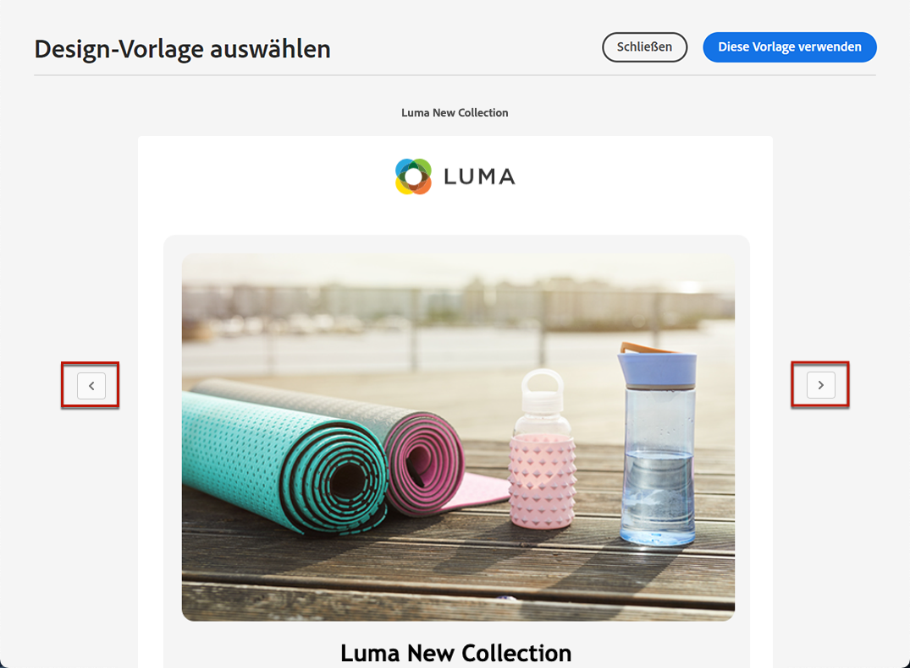

# Arbeiten mit E-Mail-Vorlagen {#email-templates}

Verwenden Sie die **[!UICONTROL Select design template]** -Abschnitt, um Ihren Inhalt aus einer Vorlage zu erstellen.

Sie können aus folgenden Optionen wählen:
* 20 vordefinierte E-Mail-Vorlagen.
* Gespeicherte Vorlagen. [Weitere Infos](#use-saved-template)

## Als Vorlage speichern {#save-as-template}

>[!CONTEXTUALHELP]
>id="ajo_messages_depecrated_inventory"
>title="Erfahren Sie, wie Sie Ihre Nachrichten migrieren"
>abstract="Am 25. Juli 2022 wurde das Menü Nachrichten nicht mehr angezeigt und Nachrichten werden jetzt direkt von einer Journey aus verfasst. Wenn Sie Ihre alten Nachrichten in Journeys wiederverwenden möchten, müssen Sie sie als Vorlagen speichern."

Sobald Sie Ihre [E-Mail-Inhalt](get-started-email-design.md), können Sie sie zur späteren Wiederverwendung speichern. Gehen Sie dazu wie folgt vor.

1. Klicken Sie oben rechts im Bildschirm auf das Auslassungszeichen.

1. Auswählen **[!UICONTROL Save design template]** aus dem Dropdown-Menü.

   

1. Fügen Sie dieser Vorlage einen Namen hinzu.

   

1. Klicken **[!UICONTROL Save]**.

Wenn Sie das nächste Mal eine E-Mail erstellen, können Sie diese Vorlage verwenden, um Ihren Inhalt zu erstellen. [Erfahren Sie mehr](#use-saved-template)

## Verwenden einer gespeicherten Vorlage {#use-saved-template}

1. Öffnen Sie die [Email Designer](content-from-scratch.md).

1. Im **[!UICONTROL Create your email screen]**, die **[!UICONTROL Sample templates]** ist standardmäßig ausgewählt. Wählen Sie die **[!UICONTROL Saved templates]** Registerkarte.

   

1. Die Liste aller zuvor [gespeicherte Vorlagen](#save-as-template) angezeigt. Sie können sie sortieren **[!UICONTROL By name]**, **[!UICONTROL Last modified]** und **[!UICONTROL Last created]**.

   

1. Wählen Sie aus der Liste die gewünschte Vorlage aus.

1. Nach der Auswahl können Sie mithilfe der Rechts- und Linkspfeile zwischen allen gespeicherten Vorlagen navigieren.

   

1. Klicken **[!UICONTROL Use this email]** oben rechts auf dem Bildschirm.

1. Bearbeiten Sie den Inhalt nach Bedarf mit dem E-Mail-Designer.
