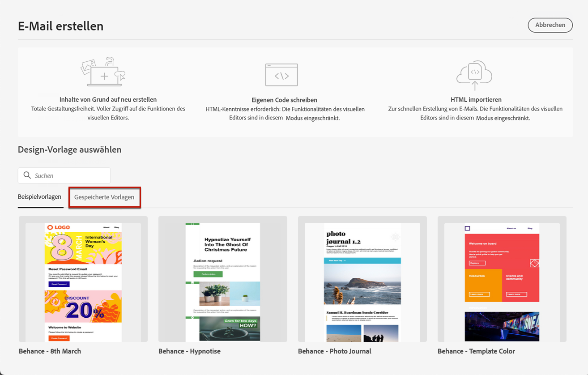

# Verwenden von E-Mail-Vorlagen {#email-templates}

Aus dem **[!UICONTROL E-Mail erstellen]** -Bildschirm verwenden, verwenden Sie die **[!UICONTROL Designvorlage auswählen]** -Abschnitt, um Ihren Inhalt aus einer Vorlage zu erstellen.

Sie können aus folgenden Optionen wählen:
* **Beispielvorlagen**. Die [!DNL Journey Optimizer] -Benutzeroberfläche bietet 20 vordefinierte E-Mail-Vorlagen, aus denen Sie wählen können.
* **Gespeicherte Vorlagen**. Sie können auch eine benutzerdefinierte Vorlage verwenden, die Sie entweder:
   * Erstellt von Grund auf mit der **[!UICONTROL Inhaltsvorlagen]** Menü. [Weitere Informationen](content-templates.md#create-template-from-scratch)
   * Gespeichert aus einer E-Mail in einer Journey oder einer Kampagne mithilfe der **[!UICONTROL Als Inhaltsvorlage speichern]** -Option. [Weitere Informationen](content-templates.md#save-as-template)

Gehen Sie wie folgt vor, um mit der Erstellung Ihres Inhalts mit einer der Beispielvorlagen oder gespeicherten Vorlagen zu beginnen.

1. [Zugriff auf Email Designer](get-started-email-design.md) aus der E-Mail **[!UICONTROL Inhalt bearbeiten]** angezeigt.

1. Im **[!UICONTROL E-Mail erstellen]** -Bildschirm, die **[!UICONTROL Beispielvorlagen]** ist standardmäßig ausgewählt.

1. Um eine benutzerdefinierte Vorlage zu verwenden, navigieren Sie zum **[!UICONTROL Gespeicherte Vorlagen]** Registerkarte.

   

1. Die Liste aller [Inhaltsvorlagen](content-templates.md#create-content-templates) wird in der aktuellen Sandbox erstellt. Sie können sie nach **[!UICONTROL Name]**, **[!UICONTROL Zuletzt geändert]** und **[!UICONTROL Zuletzt erstellt]** sortieren.

   

1. Wählen Sie aus der Liste die gewünschte Vorlage aus.

1. Nach der Auswahl können Sie mithilfe der Rechts- und Linkspfeile zwischen allen Vorlagen einer Kategorie (Beispiel oder je nach Auswahl gespeichert) navigieren.

   

1. Klicken **[!UICONTROL Verwenden Sie diese Vorlage]** oben rechts auf dem Bildschirm.

1. Bearbeiten Sie den Inhalt nach Bedarf mit Email Designer.
