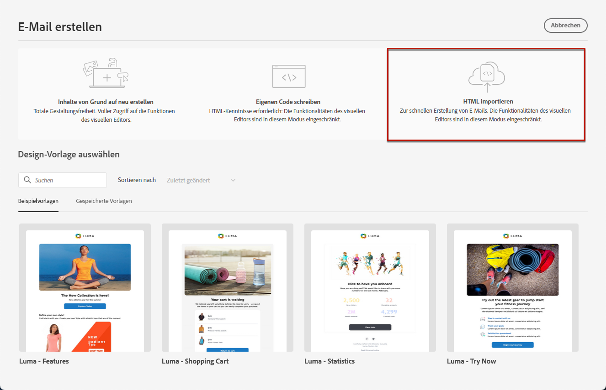
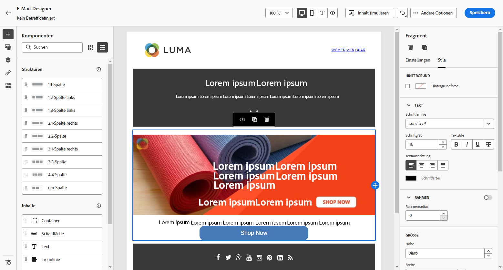

# Importieren von E-Mail-Inhalten {#existing-content}

Mit [!DNL Journey Optimizer] können Sie vorhandenen HTML-Inhalt importieren, um Ihre E-Mails zu gestalten. Der Inhalt kann vorliegen als

* eine **HTML-Datei** mit integriertem Stylesheet;
* ein **komprimierter Ordner** (ZIP) mit HTML-Datei, Stylesheet (.css) und Bildern.

   >[!NOTE]
   >
   >Die Dateistruktur des komprimierten Ordners ist freigestellt. Verweise müssen jedoch relativ sein und mit der Baumstruktur des ZIP-Ordners übereinstimmen.

Gehen Sie wie folgt vor, um eine Datei mit HTML-Inhalt zu importieren:

1. Wählen Sie auf der Startseite des E-Mail-Designers die Option **[!UICONTROL HTML importieren]**.

   

1. Ziehen Sie die HTML- oder ZIP-Datei mit Ihrem HTML-Inhalt per Drag-and-Drop.

1. Sobald der HTML-Inhalt hochgeladen wurde, können Sie die Funktionen von Email Designer nutzen, um Ihre E-Mail zu bearbeiten und Vorschauen zu erstellen. [Weitere Informationen](content-from-scratch.md)

   

## Anleitungsvideo {#video}

Erfahren Sie, wie Sie vorhandenen HTML-Inhalt importieren, das Design anpassen, Mirror-Seiten- und Abmelde-Links hinzufügen und Ihren Inhalt codieren können.

>[!VIDEO](https://video.tv.adobe.com/v/334102?quality=12)
