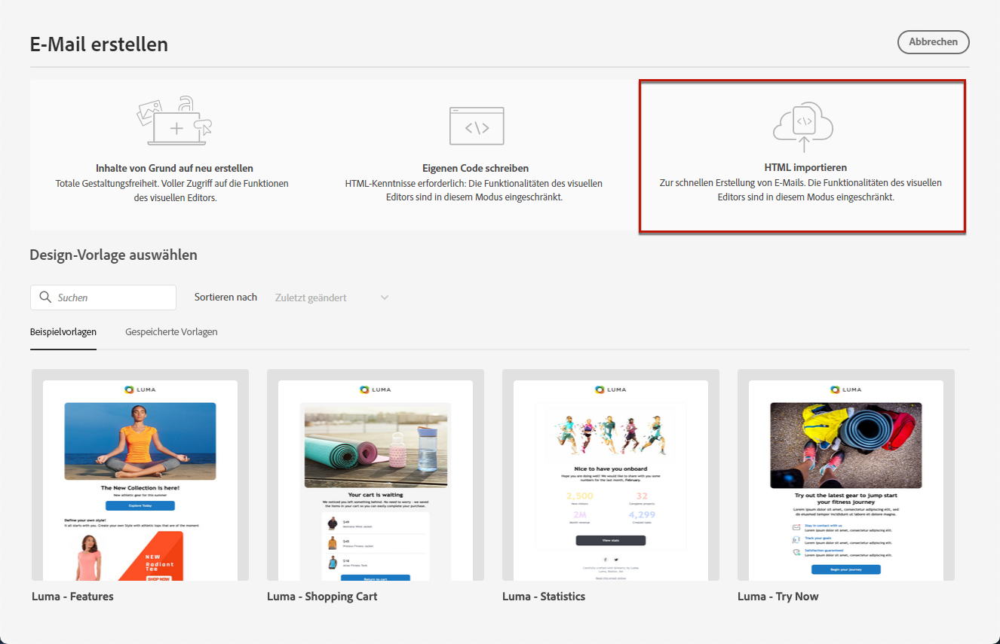
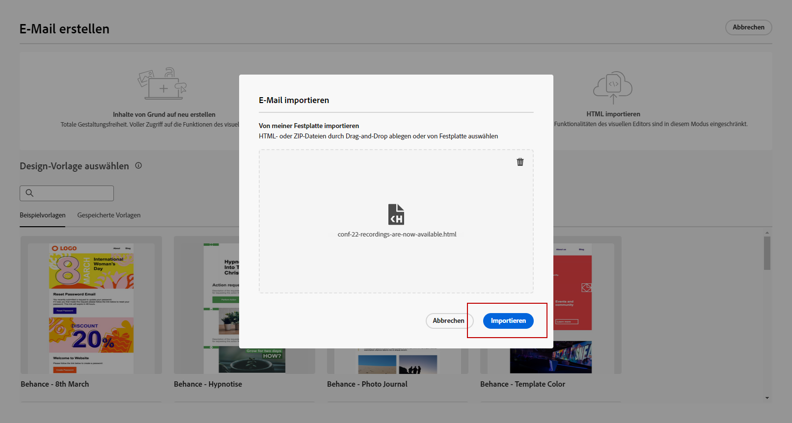
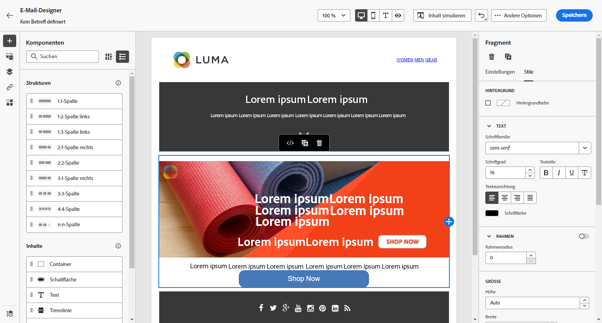

# Importieren von E-Mail-Inhalten {#existing-content}

>[!BEGINSHADEBOX]

**Auf dieser Seite** Erfahren Sie, wie Sie vorhandene HTML-Inhalte importieren, entweder als HTML-Datei oder als ZIP-Ordner, und konvertieren Sie sie, damit Sie sie mit der E-Mail-Designer bearbeiten und personalisieren können.

>[!ENDSHADEBOX]

Mit [!DNL Journey Optimizer] können Sie vorhandenen HTML-Inhalt importieren, um Ihre E-Mails zu gestalten. Der Inhalt kann vorliegen als

* eine **HTML-Datei** mit integriertem Stylesheet;
* ein **komprimierter Ordner** (ZIP) mit HTML-Datei, Stylesheet (.css) und Bildern.

  >[!NOTE]
  >
  >Die Dateistruktur des komprimierten Ordners ist freigestellt. Verweise müssen jedoch relativ sein und mit der Baumstruktur des ZIP-Ordners übereinstimmen.

>[!TIP]
>
>Wenn Sie Bildentwürfe (JPEG oder PNG) anstelle von HTML-Dateien haben, können Sie den [Bild-zu-HTML-Converter](../content-management/image-to-html.md) verwenden, um diese automatisch mithilfe von KI in bearbeitbare HTML-E-Mail-Vorlagen zu konvertieren.

Gehen Sie wie folgt vor, um eine Datei mit HTML-Inhalt zu importieren:

1. Wählen Sie auf der Startseite des E-Mail-Designers die Option **[!UICONTROL HTML importieren]**.

   

1. Ziehen Sie die HTML- oder ZIP-Datei mit Ihrem HTML-Inhalt per Drag-and-Drop und klicken Sie auf **[!UICONTROL Importieren]**.

   

1. Sobald der HTML-Inhalt hochgeladen wurde, befindet sich Ihr Inhalt im **[!UICONTROL Kompatibilitätsmodus]**.

   In diesem Modus können Sie nur Ihren Text personalisieren, Links hinzufügen oder Assets zu Ihrem Inhalt hinzufügen.

1. Um die Inhaltskomponenten des E-Mail-Designers nutzen zu können, gehen Sie zur Registerkarte **[!UICONTROL HTML-Konverter]** und klicken Sie auf **[!UICONTROL Konvertieren]**.

   

   >[!NOTE]
   >
   > Einen `<table>`-Tag als erste Ebene in einer HTML-Datei zu verwenden kann zum Verlust des Stils führen, einschließlich der Einstellungen für Hintergrund und Breite im Tag der obersten Ebene.

1. Jetzt können Sie Ihre importierte Datei nach Bedarf mit den Funktionen des E-Mail-Designers personalisieren. [Weitere Informationen](content-from-scratch.md)

## Anleitungsvideo {#video}

Erfahren Sie, wie Sie vorhandene HTML-Inhalte importieren, das Design anpassen, Mirrorseiten- und Abmelde-Links hinzufügen und Ihre Inhalte codieren können.

>[!VIDEO](https://video.tv.adobe.com/v/334102?quality=12)
