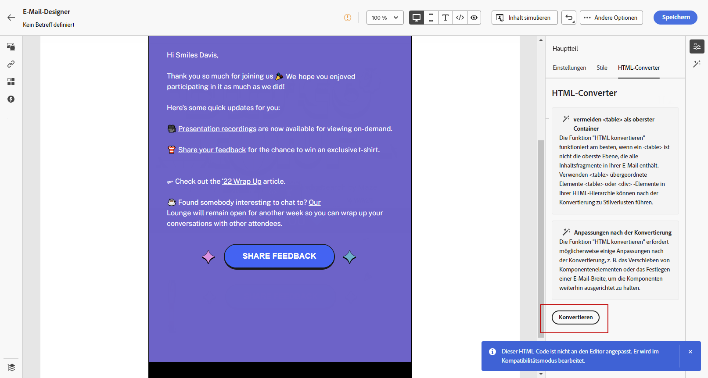

# E-Mail-Inhalt importieren {#existing-content}

[!DNL Journey Optimizer] ermöglicht Ihnen den Import vorhandener HTML-Inhalte, um E-Mails zu erstellen. Dieser Inhalt kann wie folgt lauten:

* Ein **HTML-Datei** mit integriertem Stylesheet,
* A **.zip-Ordner** einschließlich einer HTML-Datei, des Stylesheets (.css) und der Bilder.

   >[!NOTE]
   >
   >Die ZIP-Dateistruktur unterliegt keinen Beschränkungen. Verweise müssen jedoch relativ sein und in die Baumstruktur des Ordners .zip passen.

Gehen Sie wie folgt vor, um eine Datei mit HTML-Inhalt zu importieren:

1. Wählen Sie auf der Startseite von Email Designer die Option **[!UICONTROL Import HTML]**.

   

1. Ziehen Sie die HTML- oder ZIP-Datei mit Ihrem HTML-Inhalt in den Arbeitsbereich.

1. Nach dem Hochladen des HTML-Inhalts können Sie die Funktionen von Email Designer nutzen, um Ihre E-Mail zu bearbeiten und in der Vorschau anzuzeigen. [Weitere Infos](content-from-scratch.md)

   

## Anleitungsvideo {#video}

Erfahren Sie, wie Sie vorhandenen HTML-Inhalt importieren, das Design anpassen, Mirrorseite hinzufügen und Links abmelden und wie Sie Ihren Inhalt kodieren können.

>[!VIDEO](https://video.tv.adobe.com/v/334102?quality=12)
