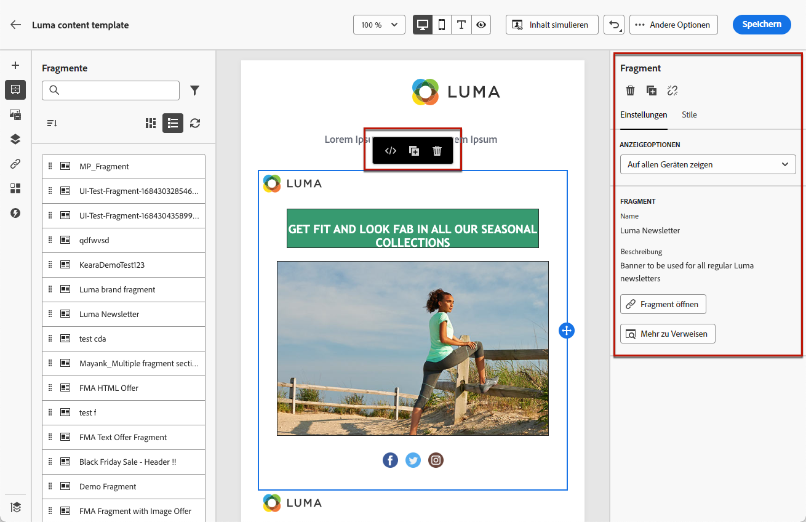

# Arbeiten mit Fragmenten {#fragments}

Ein Fragment ist eine wiederverwendbare Komponente, die in einer oder mehreren E-Mails über [!DNL Journey Optimizer] Kampagnen und Journey.

Mit dieser Funktion können Sie mehrere benutzerdefinierte Inhaltsbausteine vorab erstellen, die von nicht-technischen Marketing-Benutzern verwendet werden können, um E-Mail-Inhalte schnell in einem verbesserten Designprozess zusammenzustellen.

<!--
➡️ [Learn how to create and use templates in this video](#video-templates)-->

>[!CAUTION]
>
>Zum Erstellen, Bearbeiten und Archivieren von Fragmenten benötigen Sie die **[!DNL Manage Library Items]** in der **[!DNL Content Library Manager]** Produktprofil. [Weitere Informationen](../administration/ootb-product-profiles.md#content-library-manager)

So nutzen Sie Fragmente optimal:

* Eigene Fragmente erstellen: Siehe [Fragmente erstellen](#create-fragments)
* Diese können beliebig oft in E-Mails verwendet werden. Siehe [Fragmente verwenden](#use-fragments)

>[!NOTE]
>
>Diese Funktion ist derzeit nur für E-Mails verfügbar.

## Fragmente aufrufen und verwalten {#access-manage-fragments}

Um auf die Fragmentliste zuzugreifen, wählen Sie **[!UICONTROL Content Management]** > **[!UICONTROL Fragmente]** über das Menü links.

Alle Fragmente, die in der aktuellen Sandbox erstellt wurden - entweder aus dem **[!UICONTROL Fragmente]** -Menü entweder über die [Als Fragment speichern](#save-as-fragment) option - angezeigt.

Sie können Fragmente nach dem Erstellungs- oder Änderungsdatum filtern. Sie können festlegen, dass alle Fragmente oder nur die Elemente angezeigt werden, die der aktuelle Benutzer erstellt oder geändert hat. Sie können auch die **[!UICONTROL Archiviert]** Fragmente. [Weitere Informationen](#archive-fragments)

Aus dem **[!UICONTROL Mehr Aktionen]** neben jedem Fragment können Sie Folgendes tun:

* Duplizieren Sie ein Fragment.

* Verwenden Sie die **[!UICONTROL Verweise durchsuchen]** -Option, um die Journey, Kampagnen oder Vorlagen anzuzeigen, in denen sie verwendet werden. [Weitere Informationen](#explore-references)

* Archivieren Sie ein Fragment. [Weitere Informationen](#archive-fragments)

### Fragmente bearbeiten {#edit-fragments}

Gehen Sie wie folgt vor, um ein Fragment zu bearbeiten.

1. Klicken Sie auf das gewünschte Element aus der **[!UICONTROL Fragment]** Liste.
1. In den Fragmenteigenschaften können Sie [Erkunden von Verweisen](#explore-references), [Zugriff verwalten](../administration/object-based-access.md) und aktualisieren Sie die Fragmentdetails.

   

1. Wählen Sie die entsprechende Schaltfläche aus, um den Inhalt so zu bearbeiten, wie Sie es bei der Erstellung eines Fragments von Grund auf tun würden. [Weitere Informationen](#create-from-scratch)

>[!NOTE]
>
>Wenn Sie ein Fragment bearbeiten, werden die Änderungen automatisch an alle E-Mails oder Vorlagen übertragen, die dieses Fragment enthalten, mit Ausnahme der in **[!UICONTROL Live]** Journey oder Kampagnen. Sie können die Vererbung auch vom ursprünglichen Fragment trennen. [Weitere Informationen](#break-inheritance)

<!--Changes made to a fragment are not propagated to live journeys or campaigns where it is used.-->

<!--When added to an email, if you want to modify a fragment for a specific email, you can break the synchronization with the original fragment. The fragment becomes part of the email content and the changes will not be synchronized anymore. [Learn more](#break-inheritance)-->

### Verweise durchsuchen {#explore-references}

Sie können die Liste der Journey, Kampagnen und Inhaltsvorlagen anzeigen, die derzeit ein Fragment verwenden.

Wählen Sie dazu **[!UICONTROL Verweise durchsuchen]** entweder von der **[!UICONTROL Mehr Aktionen]** in der Fragmentliste oder im Bildschirm mit den Fragmenteigenschaften angezeigt.

Wählen Sie einen Tab aus, um zwischen Journey, Kampagnen und Vorlagen zu wechseln. Sie können ihren Status anzeigen und auf einen Namen klicken, um zum entsprechenden Element umgeleitet zu werden, auf das das Fragment verwiesen wird.

>[!NOTE]
>
>Wenn das Fragment in einer Journey, Kampagne oder Vorlage verwendet wird, die über einen Titel verfügt, der den Zugriff auf das Fragment verhindert, wird oben auf dem ausgewählten Tab eine Warnmeldung angezeigt. [Weitere Informationen zur Zugriffssteuerung auf Objektebene (OLAC)](../administration/object-based-access.md)

### Archivfragmente {#archive-fragments}

Sie können die Fragmentliste aus den Elementen löschen, die für Ihre Marke nicht mehr relevant sind.

Klicken Sie dazu auf die Schaltfläche **[!UICONTROL Mehr Aktionen]** Symbol neben dem gewünschten Fragment und wählen Sie **[!UICONTROL Archivieren]**. Sie wird aus der Fragmentliste verschwinden, was verhindert, dass Benutzer sie in zukünftigen E-Mails oder Vorlagen verwenden.

>[!NOTE]
>
>Wenn Sie ein Fragment archivieren, das in einer E-Mail oder in einer Inhaltsvorlage verwendet wird, <!--it will remain in the email or template, but you won't be able to select it from the fragment list to edit it-->die E-Mail oder Vorlage nicht betroffen ist.

Um die Archivierung eines Fragments aufzuheben, filtern Sie nach **[!UICONTROL Archiviert]** Elemente und wählen Sie **[!UICONTROL Archivierung aufheben]** von **[!UICONTROL Mehr Aktionen]** Menü. Sie ist jetzt wieder über die Fragmentliste zugänglich und kann in jeder E-Mail oder Vorlage verwendet werden.

## Fragmente erstellen {#create-fragments}

Fragmente können auf zwei Arten erstellt werden:

* Erstellen Sie ein Fragment von Grund auf mithilfe der **[!UICONTROL Fragmente]** dediziertes Menü. [Weitere Informationen](#create-template-from-scratch)

* Speichern Sie beim Entwerfen einer E-Mail oder einer Inhaltsvorlage einen Teil Ihres Inhalts als Fragment. [Weitere Informationen](#save-as-template)

Nach dem Speichern ist das Fragment für die Verwendung in einer Journey, Kampagne oder Vorlage verfügbar. Unabhängig davon, ob es von Grund auf neu oder aus einem vorhandenen Inhalt erstellt wurde, können Sie dieses Fragment jetzt beim Erstellen eines beliebigen [email](get-started-email-design.md) oder [Inhaltsvorlage](content-templates.md) Innerhalb [!DNL Journey Optimizer]. [Weitere Informationen](#use-fragments)

### Neu erstellen {#create-from-scratch}

>[!CONTEXTUALHELP]
>id="ajo_create_fragment"
>title="Eigenes Fragment definieren"
>abstract="Erstellen Sie ein eigenständiges Fragment von Grund auf neu, damit Ihre Inhalte über mehrere Journey und Kampagnen hinweg wiederverwendet werden können."

Gehen Sie wie folgt vor, um ein Fragment von Grund auf neu zu erstellen.

1. Zugriff auf die Fragmentliste über **[!UICONTROL Content Management]** > **[!UICONTROL Fragmente]** Menü links.

1. Auswählen **[!UICONTROL Fragment erstellen]**.

1. Füllen Sie die Fragmentdetails aus, d. h. Name und Beschreibung (falls erforderlich).

   

   >[!NOTE]
   >
   >Derzeit ist nur der **[!UICONTROL Visuelles Fragment]** Typ und **Email** -Kanal werden unterstützt.

1. Um dem Fragment benutzerdefinierte oder Core-Datennutzungsbezeichnungen zuzuweisen, wählen Sie **[!UICONTROL Zugriff verwalten]**. [Weitere Informationen zur Zugriffssteuerung auf Objektebene (OLAC)](../administration/object-based-access.md).

1. Klicken Sie auf **[!UICONTROL Erstellen]**.

1. Der [E-Mail-Designer](get-started-email-design.md) wird angezeigt. Bearbeiten Sie den Inhalt nach Bedarf auf die gleiche Weise wie für jede E-Mail innerhalb einer Journey oder Kampagne.

   >[!NOTE]
   >
   >Sie können Personalisierungsfelder und dynamischen Inhalt hinzufügen, doch werden in Fragmenten keine kontextuellen Attribute unterstützt.

   

1. Sobald das Fragment fertig ist, klicken Sie auf **[!UICONTROL Speichern]**.

1. Klicken Sie bei Bedarf auf den Pfeil neben dem Fragmentnamen, um zur **[!UICONTROL Details]** angezeigt und bearbeitet.

   

Dieses Fragment kann jetzt beim Erstellen von [email](get-started-email-design.md) oder [Inhaltsvorlage](content-templates.md) Innerhalb [!DNL Journey Optimizer]. [Weitere Informationen](#use-fragments)

### Als Fragment speichern {#save-as-fragment}

Beim Entwerfen einer [Inhaltsvorlage](content-templates.md) oder [email](get-started-email-design.md) in einer Kampagne oder einer Journey speichern Sie einen Teil Ihres Inhalts zur späteren Wiederverwendung als Fragment. Gehen Sie dazu wie folgt vor.

1. Im [Email Designer](get-started-email-design.md)klicken Sie auf das Auslassungszeichen oben rechts im Bildschirm.

1. Auswählen **[!UICONTROL Als Fragment speichern]** aus dem Dropdown-Menü.

   

1. Die **[!UICONTROL Als Fragment speichern]** angezeigt. Hier können Sie die Elemente auswählen, die Sie in Ihr Fragment aufnehmen möchten, einschließlich Personalisierungsfeldern und dynamischem Inhalt. Beachten Sie, dass Kontextattribute in Fragmenten nicht unterstützt werden.

   >[!CAUTION]
   >
   >Sie können nur nebeneinander liegende Abschnitte auswählen. Sie können keine leere Struktur oder ein anderes Fragment auswählen.

   

1. Klicken Sie auf **[!UICONTROL Erstellen]**. Füllen Sie die Fragmentdetails aus, d. h. Name und Beschreibung (falls erforderlich).

   

   >[!NOTE]
   >
   >Derzeit ist nur der **[!UICONTROL Visuelles Fragment]** Typ und **Email** -Kanal werden unterstützt.

1. Um dem Fragment benutzerdefinierte oder Core-Datennutzungsbezeichnungen zuzuweisen, wählen Sie **[!UICONTROL Zugriff verwalten]**. [Weitere Informationen zur Zugriffssteuerung auf Objektebene (OLAC)](../administration/object-based-access.md).

1. Klicken **[!UICONTROL Erstellen]** erneut. Das Fragment wird im **[!UICONTROL Fragmente]** Liste, auf die über die [!DNL Journey Optimizer] dediziertes Menü.

   Es wird zu einem eigenständigen Fragment, das [access](#access-manage-fragments), [bearbeitet](#edit-fragments) und [archiviert](#archive-fragments) wie jedes andere Element auf dieser Liste.

Dieses Fragment kann jetzt beim Erstellen von [email](get-started-email-design.md) oder [Inhaltsvorlage](content-templates.md) Innerhalb [!DNL Journey Optimizer]. [Weitere Informationen](#use-fragments)

>[!NOTE]
>
>Änderungen an diesem neuen Fragment werden nicht in die E-Mail oder Vorlage übertragen, aus der es stammt. Wenn der ursprüngliche Inhalt in dieser E-Mail oder Vorlage bearbeitet wird, wird das neue Fragment ebenfalls nicht geändert.

## Fragmente verwenden {#use-fragments}

Sie können ein Fragment in einem [email](get-started-email-design.md) innerhalb einer Journey oder einer Kampagne oder in einer [Inhaltsvorlage](content-templates.md).

1. Öffnen Sie eine E-Mail oder einen Vorlageninhalt mit dem [Email Designer](get-started-email-design.md).

1. Wählen Sie die **[!UICONTROL Fragmente]** in der linken Leiste.

   

1. Die Liste aller in der aktuellen Sandbox erstellten Fragmente wird angezeigt. Sie haben folgende Möglichkeiten:

   * Suchen Sie nach einem bestimmten Fragment, indem Sie mit der Eingabe des Titels beginnen.
   * Sortieren Sie Fragmente in auf- oder absteigender Reihenfolge.
   * Ändern Sie die Anzeige der Fragmente (Karten- oder Listenansicht).

1. Sie können die Liste auch aktualisieren.

   >[!NOTE]
   >
   >Wenn einige Fragmente während der Bearbeitung des Inhalts geändert oder hinzugefügt wurden, wird die Liste mit den neuesten Änderungen aktualisiert.

1. Ziehen Sie ein beliebiges Fragment aus der Liste in den Bereich, in den Sie es einfügen möchten.

   

1. Wie jede andere Komponente können Sie das Fragment in Ihrem Inhalt verschieben.

1. Wählen Sie das Fragment aus, um den entsprechenden Bereich auf der rechten Seite anzuzeigen. Dort können Sie das Fragment aus Ihrem Inhalt löschen oder duplizieren. Sie können diese Aktionen auch direkt über das Kontextmenü ausführen, das über dem Fragment angezeigt wird.

   

1. Aus dem **[!UICONTROL Einstellungen]** können Sie:

   * Wählen Sie die Geräte aus, auf denen das Fragment angezeigt werden soll.
   * Öffnen Sie das Fragment in einer neuen Registerkarte, um es bei Bedarf zu bearbeiten. [Weitere Informationen](#edit-fragments)
   * Verweise durchsuchen. [Weitere Informationen](#explore-references)

1. Sie können Ihr Fragment mit dem **[!UICONTROL Stile]** Registerkarte.

1. Bei Bedarf können Sie die Vererbung mit dem ursprünglichen Fragment aufheben. [Weitere Informationen](#break-inheritance)

1. Fügen Sie beliebig viele Fragmente hinzu und **[!UICONTROL Speichern]** Ihre Änderungen.

### Vererbung unterbrechen {#break-inheritance}

Wenn Sie ein Fragment bearbeiten, werden die Änderungen synchronisiert. Sie werden automatisch an alle **[!UICONTROL Entwurf]** Journey/Kampagnen und Inhaltsvorlagen, die dieses Fragment enthalten.

>[!NOTE]
>
>Die Änderungen werden nicht an E-Mails weitergeleitet, die in **[!UICONTROL Live]** Journey oder Kampagnen.

Wenn Fragmente zu einer E-Mail oder einer Inhaltsvorlage hinzugefügt werden, werden sie standardmäßig synchronisiert.

Sie können die Vererbung jedoch vom ursprünglichen Fragment abbrechen. In diesem Fall wird der Inhalt des Fragments in den aktuellen Entwurf kopiert und die Änderungen werden nicht mehr synchronisiert.

Gehen Sie wie folgt vor, um die Vererbung aufzuheben:

1. Wählen Sie das Fragment aus.

1. Klicken Sie in der dedizierten Symbolleiste auf das Symbol Entsperren .

   

1. Dieses Fragment wird zu einem eigenständigen Element, das nicht mehr mit dem ursprünglichen Fragment verknüpft ist. Bearbeiten Sie sie wie jede andere Inhaltskomponente in Ihrem Inhalt. [Weitere Informationen](content-components.md)

<!--

## How-to video {#video-templates}

Learn how to create, edit, and use fragments in [!DNL Journey Optimizer].

>[!VIDEO](https://video.tv.adobe.com/v/3413743/?quality=12)

-->
