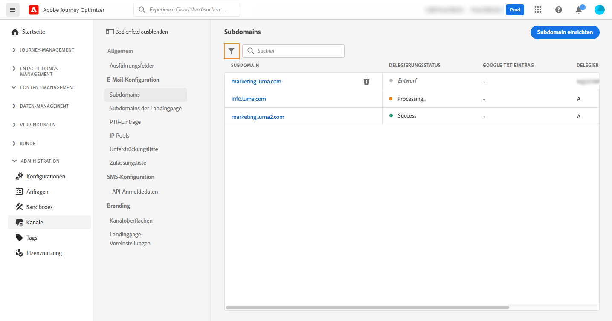
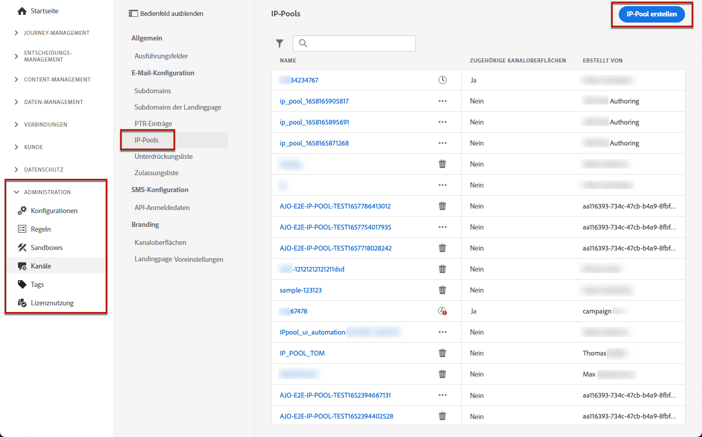
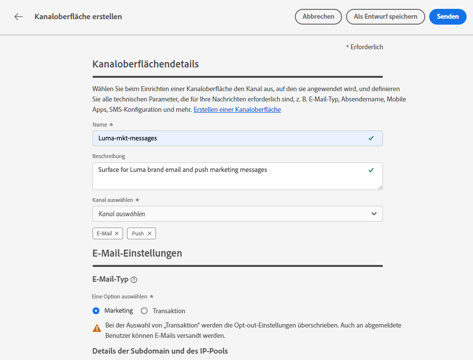
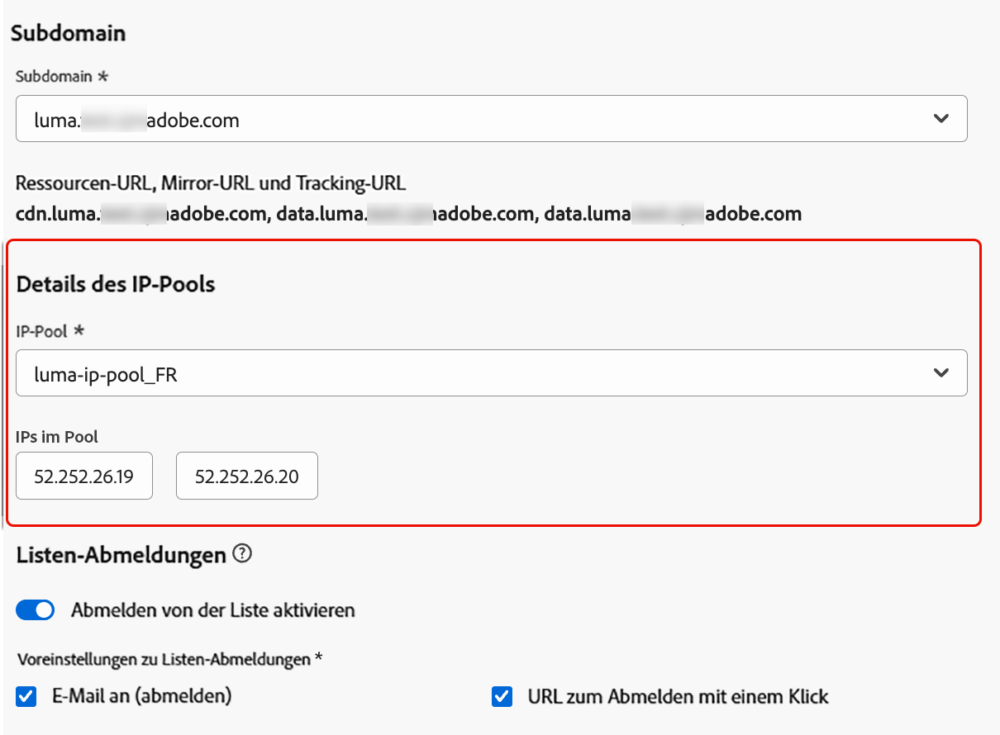
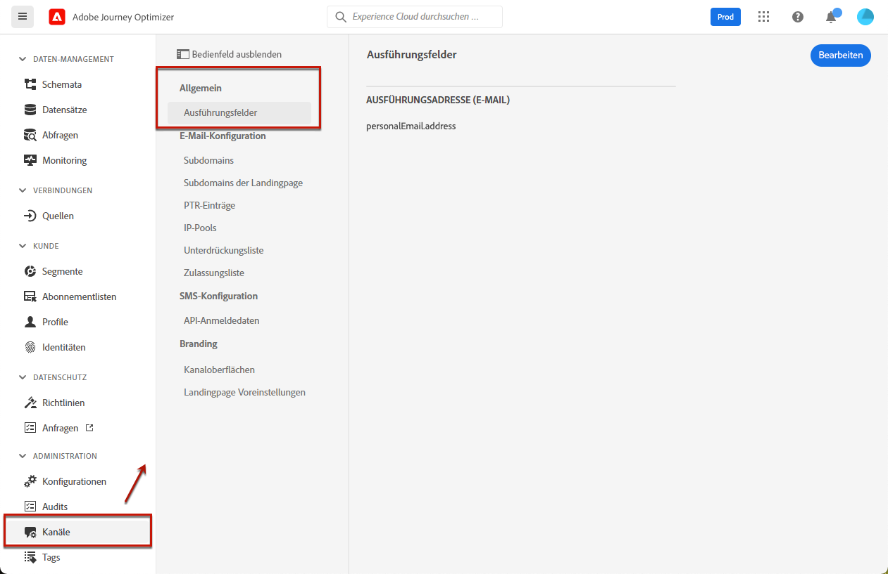
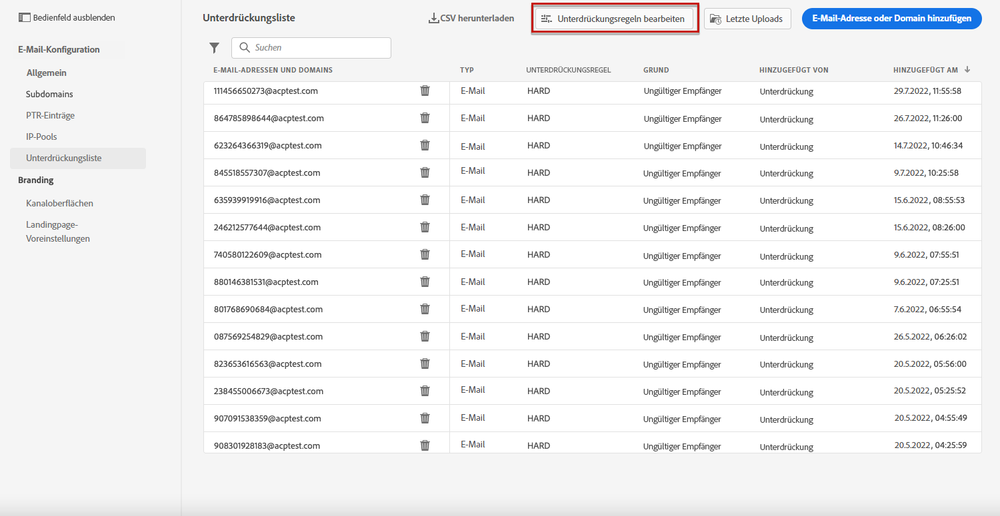

# Erste Schritte bei der E-Mail-Konfiguration {#get-starte-email-config}

>[!BEGINSHADEBOX]

**Auf dieser Seite:** Erfahren Sie mehr über die wichtigsten Schritte zur Konfiguration des E-Mail-Kanals in Adobe Journey Optimizer, von der Zuweisung von Subdomains und der Erstellung von IP-Pools bis zur Einrichtung von Kanalkonfigurationen, Ausführungsfeldern und weiteren Zustellversuchen.

>[!ENDSHADEBOX]

Durch das Konfigurieren des E-Mail-Kanals in Adobe Journey Optimizer können Sie wirkungsvolle, personalisierte E-Mail-Erlebnisse schaffen, die Ihre Zielgruppe effektiv ansprechen.

Dieser Abschnitt führt Sie durch die wichtigsten Konfigurationsschritte, die Sie ausführen müssen, um E-Mails über [!DNL Journey Optimizer] zu senden. Außerdem erfahren Sie, wie Sie E-Mail-Kopfzeilen einrichten, Einstellungen für mehrere Marken personalisieren, das URL-Tracking für Analysen aktivieren und sogar einen Link zur Abmeldung mit einem Klick hinzufügen, um das Abonnieren für den Benutzer zu vereinfachen. Jedes Thema baut auf dem vorherigen auf und gibt Ihnen die Tools an die Hand, mit denen Sie Ihre E-Mail-Strategie optimieren und gleichzeitig die Kontrolle behalten und Präzision sicherstellen können.

Damit während Journeys und Kampagnen E-Mails aus [!DNL Journey Optimizer] versendet werden zu können, müssen Sie eine Reihe von Konfigurationsschritten durchlaufen. Diese Schritte sind unten aufgeführt:

1. Um eine optimale Zustellbarkeit zu gewährleisten und Ihre Reputation zu schützen, **delegieren Sie zunächst die Subdomains an Adobe**, die Sie für den Versand Ihrer E-Mails mit [!DNL Journey Optimizer] verwenden möchten. Diese Subdomains bestimmen Elemente wie etwa die zu verfolgenden Web-Seiten und die URLs von Mirrorseiten. [Weitere Informationen](../configuration/about-subdomain-delegation.md)

   

1. Erstellen Sie IP-Pools, um **IP-Adressen zu gruppieren**, die mit Ihrer Instanz bereitgestellt wurden. [Weitere Informationen](../configuration/ip-pools.md)

   

1. Erstellen Sie **Kanalkonfigurationen** und wählen Sie den Kanal **[!UICONTROL E-Mail]** aus. [Weitere Informationen](../configuration/channel-surfaces.md)

   

1. Konfigurieren Sie in jeder E-Mail-Kanalkonfiguration alle **technischen Parameter**, die für den Versand von E-Mails erforderlich sind. [Weitere Informationen](email-settings.md)

   * Hier wählen Sie die Subdomain aus, die zum Senden der E-Mails verwendet werden soll, sowie die IP-Pools, die mit der Konfiguration verknüpft werden sollen. [Weitere Informationen](email-settings.md#ip-pools)

   

   * Die **[!UICONTROL Von E-Mail]** Präfix und **[!UICONTROL Fehler-E-Mail]** Präfix verwenden die aktuell ausgewählte [delegierte Subdomain](../configuration/about-subdomain-delegation.md). Optional können **[!UICONTROL Absendername]** und **[!UICONTROL Absender-E-Mail]** eine andere übertragende Partei identifizieren (vollständige **Absender**-Adresse, nicht an dieses Subdomain-Suffix gebunden). [Weitere Informationen](header-parameters.md#sender-header)

   

1. Schließen Sie die Konfiguration des E-Mail-Kanals ab, indem Sie andere erweiterte Parameter einrichten, z. B. BCC aktivieren, URL-Tracking für Analytics definieren oder Links zum Abmelden mit einem Klick hinzufügen, um den Benutzenden das Arbeiten zu erleichtern. [Weitere Informationen](email-settings.md)

1. Bestimmen Sie, welche **Ausführungsfelder** für Ihre Empfängerinnen und Empfänger vorrangig verwendet werden sollen, wenn in Adobe Experience Platform mehrere Adressen verfügbar sind. [Weitere Informationen](../configuration/primary-email-addresses.md)

   

1. Verwalten Sie die Anzahl der Tage, in denen **weitere Zustellversuche** unternommen werden, bevor E-Mail-Adressen an die Unterdrückungsliste gesendet werden. [Weitere Informationen](../configuration/manage-suppression-list.md)

   

:::: landing-cards-container
:::

Erste Schritte bei der E-Mail-Konfiguration

Erfahren Sie mehr über die wichtigsten Schritte zur Konfiguration von E-Mail-Funktionen, einschließlich Subdomain-Delegierung, IP-Pools und Verwaltung von Unterdrückungslisten.

[Mit der Konfiguration von E-Mails beginnen](get-started-email-config.md)
:::

:::

Definieren von E-Mail-Konfigurationseinstellungen

Richten Sie E-Mail-Konfigurationen für Zustellbarkeit, Compliance und Anpassung mit erweiterten Funktionen wie BCC, Unterdrückungsüberschreibungen und URL-Tracking ein.

[Einstellungen konfigurieren](email-settings.md)
:::

:::

Erstellen und Konfigurieren der Listen-Abmeldung

Erfahren Sie, wie Sie die Funktion zur Listen-Abmeldung aktivieren, um für das Opt-out von Empfängerinnen und Empfängern URLs zum Abmelden mit einem Klick in E-Mail-Header einzufügen.

[Listen-Abmeldung einrichten](list-unsubscribe.md)
:::

:::

Konfigurieren von Header-Parametern für E-Mails

Passen Sie Absender- und Antwort-E-Mail-Adressen an, behandeln Sie Fehler und leiten Sie E-Mails weiter, um eine effektive Kommunikation zu gewährleisten.

[Header-Parameter einrichten](header-parameters.md)
:::

:::

Konfigurieren des URL-Trackings für den E-Mail-Kanal

Richten Sie URL-Tracking-Parameter ein, um die Effektivität von E-Mail-Kampagnen zu messen und sie in Analyse-Tools zu integrieren.

[URL-Tracking einrichten](url-tracking.md)
:::

:::

Personalisierte Einstellungen der E-Mail-Konfiguration

Richten Sie dynamische Subdomains, personalisierte Header und URL-Tracking ein, um maßgeschneiderte E-Mail-Erlebnisse zu bieten.

[Personalisierte E-Mails konfigurieren](surface-personalization.md)
:::

::::
