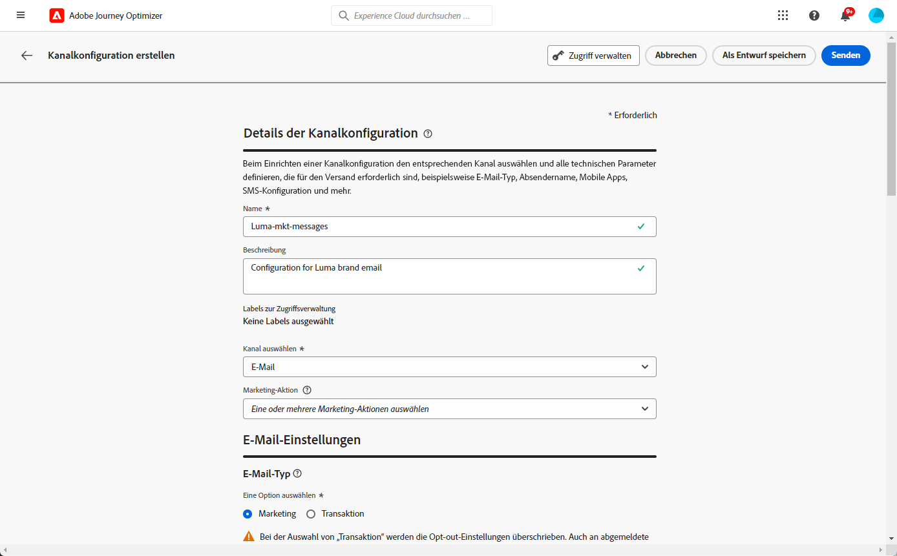

# Erste Schritte bei der E-Mail-Konfiguration {#get-starte-email-config}

Damit während Journeys und Kampagnen E-Mails aus [!DNL Journey Optimizer] versendet werden zu können, müssen Sie eine Reihe von Konfigurationsschritten durchlaufen.

1. Um eine optimale Zustellbarkeit zu gewährleisten und Ihre Reputation zu schützen, delegieren Sie zunächst die Subdomains, die Sie für den Versand Ihrer E-Mails mit [!DNL Journey Optimizer] verwenden möchten, an Adobe. Diese Subdomains bestimmen Elemente wie etwa die zu verfolgenden Web-Seiten und die URLs von Mirrorseiten. [Weitere Informationen](../configuration/about-subdomain-delegation.md)

   

1. Verbessern Sie die Zustellbarkeit Ihrer E-Mails und Ihre Reputation, indem Sie IP-Adressen gruppieren, die mit Ihrer Instanz bereitgestellt wurden. [Weitere Informationen](../configuration/ip-pools.md)

   

1. Erstellen Sie Kanaloberflächen und wählen Sie den **[!UICONTROL E-Mail]**-Kanal aus. [Weitere Informationen](../configuration/channel-surfaces.md)

   

1. Konfigurieren Sie auf jeder E-Mail-Kanaloberfläche alle technischen Parameter, die für die Zustellung von E-Mails erforderlich sind. [Weitere Informationen](email-settings.md)

   * Hier wählen Sie die Subdomain aus, die zum Senden der E-Mails verwendet werden soll, sowie die IP-Pools, die mit der Oberfläche verknüpft werden sollen. [Weitere Informationen](email-settings.md#subdomains-and-ip-pools)

   

   * Die **[!UICONTROL Absender-E-Mail-Adresse]** und **[!UICONTROL Fehler-E-Mail]**-Adressen müssen die aktuell ausgewählte delegierte Subdomain verwenden. [Weitere Informationen](email-settings.md#email-header)

   

1. Bestimmen Sie, welche E-Mail-Adresse für Ihre Empfänger vorrangig verwendet werden soll, wenn in Adobe Experience Platform mehrere Adressen verfügbar sind. [Weitere Informationen](../configuration/primary-email-addresses.md)

   

1. Verwalten Sie die Anzahl der Tage, in denen weitere Zustellversuche unternommen werden, bevor E-Mail-Adressen an die Unterdrückungsliste gesendet werden. [Weitere Informationen](../configuration/manage-suppression-list.md)

   
