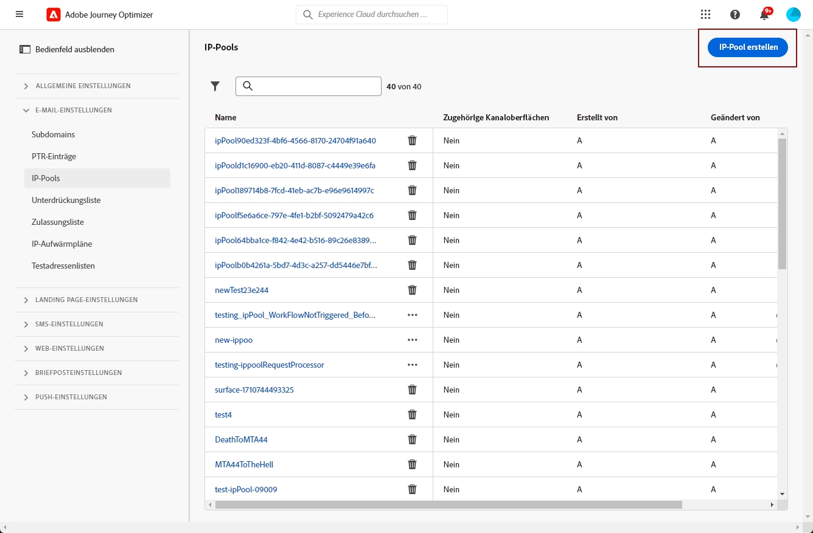
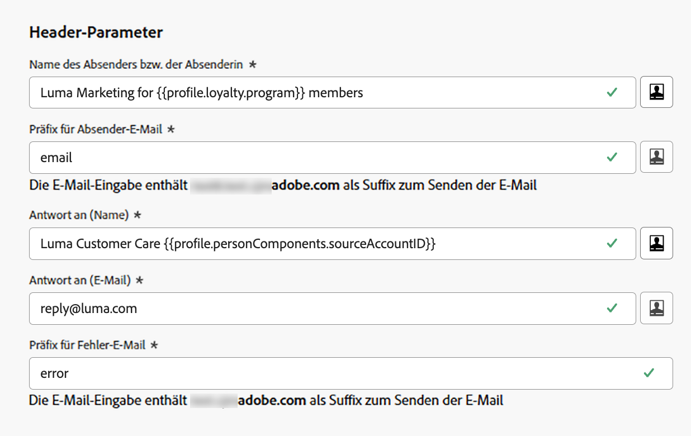

# Erste Schritte mit der E-Mail-Konfiguration {#get-starte-email-config}

So können Sie E-Mails durch Journeys und Kampagnen in senden [!DNL Journey Optimizer]müssen Sie eine Reihe von Konfigurationsschritten durchlaufen.

1. Um eine optimale Zustellbarkeit zu gewährleisten und Ihre Reputation zu schützen, delegieren Sie zunächst die Subdomains, mit denen Sie Ihre E-Mails senden möchten [!DNL Journey Optimizer]. Diese Subdomains bestimmen Elemente wie die zu verfolgenden Webseiten und die Mirrorseiten-URLs. [Weitere Infos](../configuration/about-subdomain-delegation.md)

   

1. Verbessern Sie die Zustellbarkeit und Reputation Ihrer E-Mail, indem Sie IP-Adressen gruppieren, die mit Ihrer Instanz bereitgestellt wurden. [Weitere Infos](../configuration/ip-pools.md)

   

1. Erstellen Sie Kanaloberflächen und wählen Sie die **[!UICONTROL Email]** -Kanal. [Weitere Infos](../configuration/channel-surfaces.md)

   

1. Konfigurieren Sie auf jeder E-Mail-Kanal-Oberfläche alle technischen Parameter, die für den Versand von E-Mails erforderlich sind. [Weitere Infos](email-settings.md)

   * Hier wählen Sie die Subdomain aus, die zum Senden der E-Mails verwendet werden soll, sowie die IP-Pools, die mit der Oberfläche verknüpft werden sollen. [Weitere Infos](email-settings.md#subdomains-and-ip-pools)

   

   * Die **[!UICONTROL Sender email]** und **[!UICONTROL Error email]** -Adressen müssen die aktuell ausgewählte delegierte Subdomain verwenden. [Weitere Infos](email-settings.md#email-header)

   

1. Bestimmen Sie, welche E-Mail-Adresse für Ihre Empfänger vorrangig verwendet werden soll, wenn in Adobe Experience Platform mehrere Adressen verfügbar sind. [Weitere Infos](../configuration/primary-email-addresses.md)

   

1. Verwalten Sie die Anzahl der Tage, in denen erneute Zustellversuche unternommen werden, bevor E-Mail-Adressen an die Unterdrückungsliste gesendet werden. [Weitere Infos](../configuration/manage-suppression-list.md)

   
