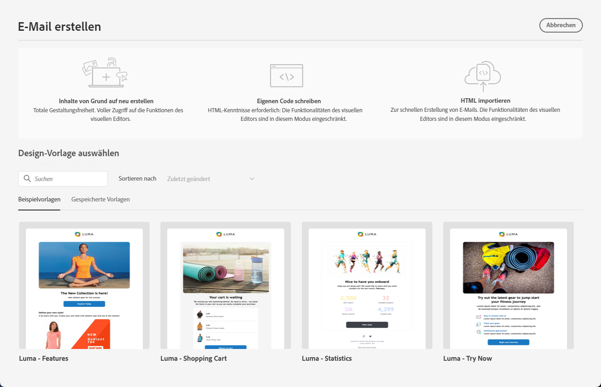
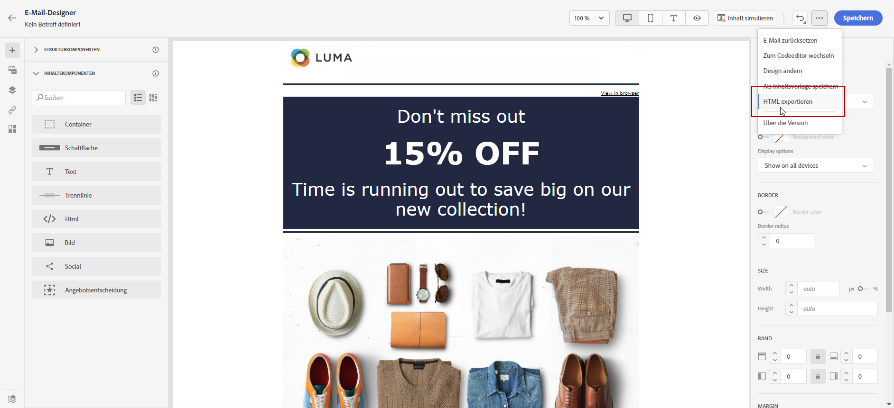

# Erste Schritte beim Gestalten von E-Mails {#get-started-content-design}

Sie können vorhandene Inhalte in [!DNL Journey Optimizer] importieren oder die Funktionen zur Inhaltserstellung nutzen:

* Sie können die **Funktionen zur E-Mail-Gestaltung** in [!DNL Journey Optimizer] verwenden, um responsive E-Mails zu erstellen bzw. zu importieren. [Weitere Informationen](content-from-scratch.md)

* Nutzen Sie die Möglichkeiten von **Adobe Experience Manager Assets Essentials**, um Ihre E-Mails zu gestalten und um Ihre eigene Asset-Datenbank zu erstellen und verwalten. [Weitere Informationen](../content-management/assets-essentials.md)

* Suchen Sie **Adobe Stock-Fotos**, um Ihre Inhalte zu erstellen und Ihr E-Mail-Design zu verbessern. [Weitere Informationen](../content-management/stock.md)

* Verbessern Sie das Kundenerlebnis, indem Sie personalisierte und dynamische Nachrichten auf der Basis ihrer Kundenprofil-Attribute erstellen. Weitere Informationen zu [Personalisierung](../personalization/personalize.md) und [dynamischen Inhalten](../personalization/get-started-dynamic-content.md).

➡️ [Entdecken Sie diese Funktion im Video](#video)

## Best Practices für das E-Mail-Design {#best-practices}

Beim Senden von E-Mails ist es wichtig zu beachten, dass die Empfängerinnen und Empfänger sie weiterleiten könnten, was manchmal zu Problemen mit dem Rendering der E-Mail führen kann. Dies gilt insbesondere bei der Verwendung von CSS-Klassen, die vom E-Mail-Anbieter, der für die Weiterleitung verwendet wird, möglicherweise nicht unterstützt werden, z. B. wenn Sie die CSS-Klasse „is-desktop-hidden“ verwenden, um ein Bild auf Mobilgeräten auszublenden.

Um diese Rendering-Probleme zu minimieren, empfehlen wir, Ihre E-Mail-Design-Struktur so einfach wie möglich zu halten. Versuchen Sie, ein einzelnes Design zu verwenden, das sowohl für Desktop- als auch für Mobilgeräte gut funktioniert, und vermeiden Sie die Verwendung komplexer CSS-Klassen oder anderer Design-Elemente, die möglicherweise nicht von allen E-Mail-Clients vollständig unterstützt werden. Mithilfe dieser Best Practices können Sie sicherstellen, dass Ihre E-Mails konsistent korrekt gerendert werden, unabhängig davon, wie sie von Empfangenden angezeigt oder weitergeleitet werden.

## Wichtige Schritte zum Erstellen von E-Mail-Inhalten {#key-steps}

Nachdem Sie einer Journey oder Kampagne eine [E-Mail hinzugefügt](create-email.md) haben, können Sie mit der Erstellung Ihres E-Mail-Inhalts beginnen.

1. Verwenden Sie im Konfigurationsbildschirm der Journey oder der Kampagne den Bildschirm **[!UICONTROL Inhalt bearbeiten]**, um auf den E-Mail-Designer zuzugreifen. [Weitere Informationen](create-email.md#define-email-content)

   

1. Wählen Sie zum Gestalten Ihrer E-Mail auf der Startseite des E-Mail-Designers unter den folgenden Optionen:

   * **Entwerfen Sie Ihre E-Mail von Grund auf** über die Benutzeroberfläche des E-Mail-Designers und nutzen Sie Bilder aus [Adobe Experience Manager Assets Essentials](../content-management/assets-essentials.md). In [diesem Abschnitt](content-from-scratch.md) erfahren Sie, wie Sie E-Mail-Inhalte gestalten.

   * **Codieren oder fügen Sie unbearbeitetes HTML** direkt in den E-Mail-Designer ein. In [diesem Abschnitt](code-content.md) erfahren Sie, wie Sie Ihren Inhalt codieren.

     >[!NOTE]
     >
     >In einer Kampagne können Sie auch die Schaltfläche **[!UICONTROL Code Editor]** im Bildschirm **[!UICONTROL Inhalt bearbeiten]** auswählen. [Weitere Informationen](create-email.md#define-email-content)

   * **Importieren Sie vorhandenen HTML-Inhalt** aus einer Datei oder einem .zip-Ordner. In [diesem Abschnitt](existing-content.md) erfahren Sie, wie Sie E-Mail-Inhalte importieren.

   * Wählen Sie aus einer Liste integrierter oder benutzerdefinierter Vorlagen einen **existierenden Inhalt aus**. Informationen zum Nutzen von E-Mail-Vorlagen finden Sie in [diesem Abschnitt](../email/use-email-templates.md).

   

1. Sobald Ihr E-Mail-Inhalt definiert und personalisiert wurde, können Sie Ihren Inhalt zur Validierung oder zur späteren Verwendung exportieren. Klicken Sie auf **[!UICONTROL HTML exportieren]**, um eine ZIP-Datei auf Ihrem Computer zu speichern, die Ihre HTML und Ihre Assets enthält.

   

## Anleitungsvideos {#video}

Erfahren Sie, wie Sie mit dem Nachrichteneditor E-Mail-Inhalte erstellen.

>[!VIDEO](https://video.tv.adobe.com/v/334150?quality=12)

Erfahren Sie, wie Sie Inhaltsexperimente für A/B-Tests konfigurieren und E-Mail-Inhalte ausprobieren können, um Ihre Geschäftsziele bestmöglich zu erreichen.

>[!VIDEO](https://video.tv.adobe.com/v/3419893)
