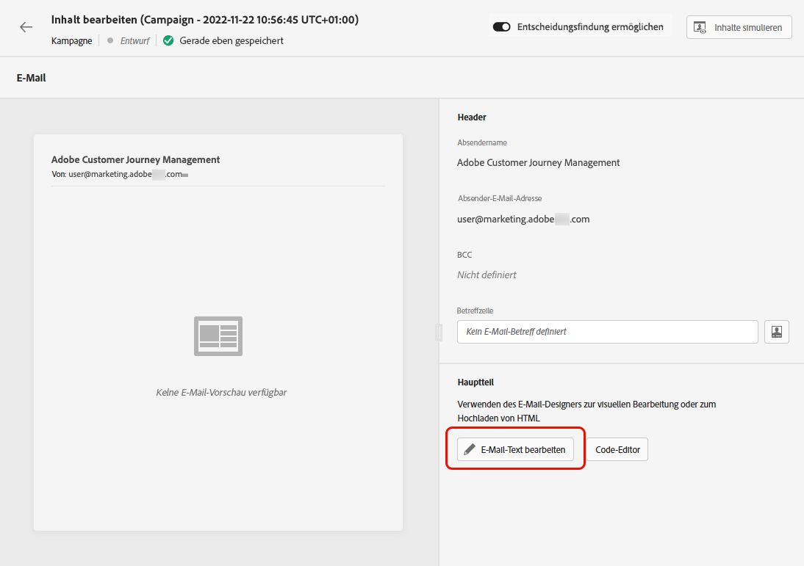

# Erste Schritte mit E-Mail-Design {#get-started-content-design}

Sie können vorhandenen Inhalt in [!DNL Journey Optimizer] oder nutzen Sie die Funktionen zur Inhaltserstellung:

* Verwendung [!DNL Journey Optimizer] **E-Mail-Designfunktionen** , um responsive E-Mails zu erstellen oder zu importieren. [Weitere Infos](content-from-scratch.md)

* Nutzung **Grundlagen zu Adobe Experience Manager Assets** um Ihre E-Mails anzureichern, erstellen und verwalten Sie Ihre eigene Asset-Datenbank. [Weitere Infos](assets-essentials.md)

* Suchen **Adobe Stock Fotos** um Ihren Inhalt zu erstellen und Ihr E-Mail-Design zu verbessern. [Weitere Infos](stock.md)

* Verbessern Sie das Kundenerlebnis, indem Sie personalisierte und dynamische Nachrichten basierend auf ihren Profilattributen erstellen. Weitere Informationen [Personalisierung](../personalization/personalize.md) und [dynamischer Inhalt](../personalization/get-started-dynamic-content.md).

➡️ [Funktion im Video kennenlernen](#video)

Einmal [E-Mail hinzugefügt](create-email.md) in eine Journey oder eine Kampagne klicken, können Sie mit der Erstellung Ihres E-Mail-Inhalts beginnen.

1. Navigieren Sie im Bildschirm zur Journey oder Kampagnenkonfiguration zum **[!UICONTROL Edit content]** angezeigt, um auf Email Designer zuzugreifen. [Weitere Infos](create-email.md#define-email-content)

   

1. Wählen Sie auf der Startseite von Email Designer aus den folgenden Optionen aus, wie Sie Ihre E-Mail erstellen möchten:

   * **E-Mail von Grund auf neu erstellen** über die Benutzeroberfläche des E-Mail-Designers und Verwendung von Bildern aus [Grundlagen zu Adobe Experience Manager Assets](assets-essentials.md). Erfahren Sie, wie Sie E-Mail-Inhalte erstellen in [diesem Abschnitt](content-from-scratch.md).

   * **Unformatierten HTML-Code und -Paste** direkt im E-Mail-Designer. Erfahren Sie, wie Sie Ihren eigenen Inhalt kodieren in [diesem Abschnitt](code-content.md).

      >[!NOTE]
      >
      >In einer Kampagne können Sie auch die **[!UICONTROL Code Editor]** -Schaltfläche in der **[!UICONTROL Edit content]** angezeigt. [Weitere Infos](create-email.md#define-email-content)

   * **Vorhandenen HTML-Inhalt importieren** aus einer Datei oder einem ZIP-Ordner. Erfahren Sie, wie Sie E-Mail-Inhalte importieren in [diesem Abschnitt](existing-content.md).

   * **Existierenden Inhalt auswählen** aus einer Liste integrierter oder benutzerdefinierter Vorlagen. Erfahren Sie, wie Sie mit E-Mail-Vorlagen arbeiten. [diesem Abschnitt](email-templates.md).

   

## Anleitungsvideo {#video}

Erfahren Sie, wie Sie mit dem Nachrichteneditor E-Mail-Inhalte erstellen.

>[!VIDEO](https://video.tv.adobe.com/v/334150?quality=12)