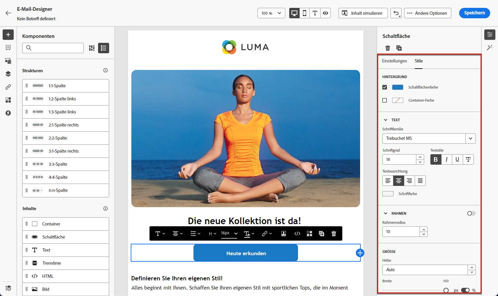

# Erste Schritte mit E-Mail-Stilen {#get-started-email-style}

Sobald Sie mit der Erstellung Ihres E-Mail-Inhalts in [!DNL Journey Optimizer] begonnen haben, können Sie eine Reihe von Stilparametern und Attributen im Bereich **[!UICONTROL Stil]** des E-Mail-Designers anpassen.

Sie können Ihre Änderungen auf den E-Mail-Text, auf eine Strukturkomponente oder auf eine Inhaltskomponente anwenden.

Folgen Sie den unten stehenden Links, um zu erfahren, wie Sie Stileinstellungen in Ihrer E-Mail anpassen können.

* Erfahren Sie, wie Sie [Ihren E-Mail-Hintergrund personalisieren können](backgrounds.md).
* Erfahren Sie, wie Sie die [vertikale Ausrichtung und den Abstand verwalten](alignment-and-padding.md).
* Erfahren Sie, wie Sie [Inline-Stilattribute anpassen](inline-styling.md).
* Erfahren Sie, wie Sie [benutzerdefinierten CSS zu Ihrem E-Mail-Inhalt hinzufügen](custom-css.md)
* Erfahren Sie, wie [Inhalte im Dunkelmodus verwalten](dark-mode.md)

>[!NOTE]
>
>Der [European Accessibility Act](https://eur-lex.europa.eu/legal-content/DE/TXT/?uri=CELEX:32019L0882){target="_blank"} legt fest, dass alle digitalen Kommunikationen zugänglich sein sollten. Achten Sie beim Entwerfen von Inhalten in [ auf ](../email/accessible-content.md)dieser Seite[!DNL Journey Optimizer] die spezifischen Stilrichtlinien, z. B. die Anpassung von Farben, Beschriftungen und Symbolen, um Klarheit zu gewährleisten, und bei der Optimierung Ihres Designs für mobile und responsive Layouts.