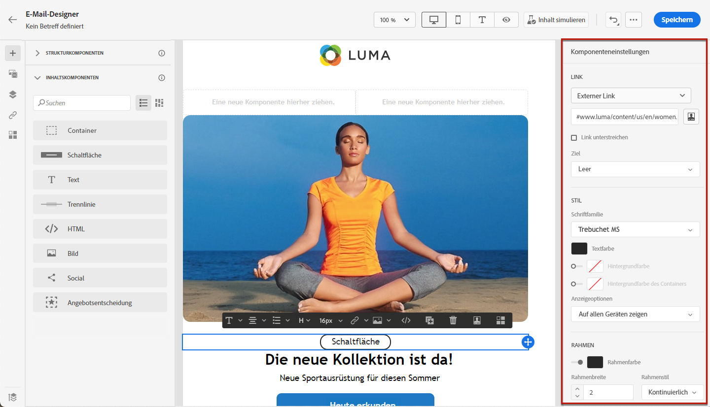

# Erste Schritte mit E-Mail-Stilen {#get-started-email-style}

Nachdem Sie mit der Erstellung Ihres E-Mail-Inhalts in [!DNL Journey Optimizer] begonnen haben, können Sie eine Reihe von Stilparametern und Attributen im Einstellungsfenster des E-Mail-Designers anpassen.

Sie können Ihre Änderungen auf den E-Mail-Text, auf eine Strukturkomponente oder auf eine Inhaltskomponente anwenden.

Folgen Sie den unten stehenden Links, um zu erfahren, wie Sie Stileinstellungen in Ihrer E-Mail anpassen können.

* Erfahren Sie, wie Sie [Ihren E-Mail-Hintergrund personalisieren können](backgrounds.md).
* Erfahren Sie, wie Sie die [vertikale Ausrichtung und den Abstand verwalten](alignment-and-padding.md).
* Erfahren Sie, wie Sie [Inline-Stilattribute anpassen](inline-styling.md).
