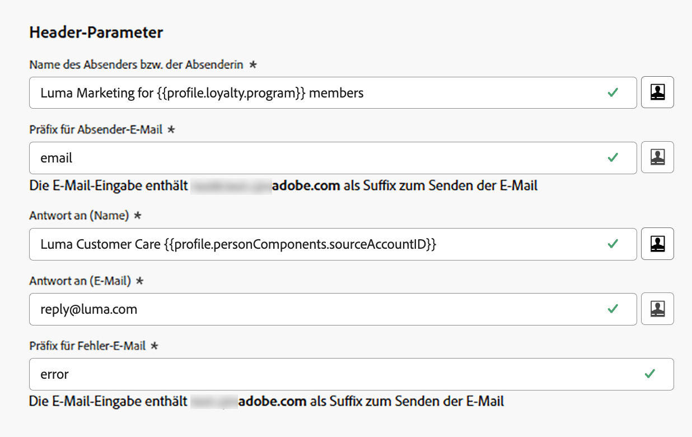

# Header-Parameter {#email-header}

>[!BEGINSHADEBOX]

**Auf dieser Seite** Erfahren Sie, wie Sie die E-Mail-Header-Parameter in einer Kanalkonfiguration einrichten, einschließlich der Felder „Von“, „Antwort an“, „Fehler“ und „Optionaler Absender“, sowie wie Sie die Antwortverarbeitung und E-Mail-Weiterleitung verwalten.

>[!ENDSHADEBOX]

Geben Sie beim Konfigurieren einer neuen [E-Mail-Kanalkonfiguration](email-settings.md) im Abschnitt **[!UICONTROL Header-Parameter]** die Absendernamen und E-Mail-Adressen ein, die mit dem Typ der mit dieser Konfiguration gesendeten E-Mails verknüpft sind.

>[!NOTE]
>
>Um die Kontrolle über die E-Mail-Einstellungen zu verbessern, können Sie die Kopfzeilen-Parameter personalisieren. [Weitere Informationen](../email/surface-personalization.md#personalize-header)
>
>Beim [Bearbeiten einer E](../configuration/channel-surfaces.md#edit-channel-surface)Mail-Konfiguration können Sie keine neuen [Profilattribute](../personalization/personalization-build-expressions.md#sources) zu Kopfzeilenparametern hinzufügen. Sie müssen eine neue Kanalkonfiguration erstellen.

* **[!UICONTROL Name des Absenders bzw. der Absenderin]**: Der Absendername, wie z. B. der Name Ihrer Marke.

* **[!UICONTROL Präfix für Absender-E-Mail]**: Die E-Mail-Adresse, die für die Kommunikation verwendet werden soll.

* **[!UICONTROL Antwort an (Name)]**: Der Name, der verwendet wird, wenn die Empfängerin oder der Empfänger in der E-Mail-Client-Software auf die Schaltfläche **Antworten** klickt.

* **[!UICONTROL Antwort an (E-Mail)]**: Die E-Mail-Adresse, die verwendet wird, wenn die Empfängerin oder der Empfänger in der E-Mail-Client-Software auf die Schaltfläche **Antworten** klickt. [Weitere Informationen](#reply-to-email)

* **[!UICONTROL Präfix für Fehler-E-Mail]**: Unter dieser Adresse werden alle Fehler empfangen, die von ISPs einige Tage nach der E-Mail-Zustellung erzeugt wurden (asynchrone Bounces). Die Abwesenheitsbenachrichtigungen und Challenge-Responses werden ebenfalls an diese Adresse gesendet.

  Wenn Sie die Abwesenheitsbenachrichtigungen und Challenge-Responses auf Anfragen an eine bestimmte E-Mail-Adresse erhalten möchten, die nicht an Adobe delegiert ist, müssen Sie einen [Weiterleitungsprozess](#forward-email) einrichten. Vergewissern Sie sich in diesem Fall, dass Sie über eine manuelle oder automatisierte Lösung verfügen, mit der die in diesen Posteingang eingehenden E-Mails verarbeitet werden können.

>[!NOTE]
>
>Die Adressen unter **[!UICONTROL Präfix für Absender-E-Mail]** und **[!UICONTROL Präfix für Fehler-E-Mail]** verwenden die aktuell ausgewählte [delegierte Subdomain](../configuration/about-subdomain-delegation.md) zum Senden der E-Mail. Gehen Sie wie folgt vor, wenn die delegierte Subdomain beispielsweise *marketing.luma.com* lautet:
>
>* Geben Sie *contact* als **[!UICONTROL Präfix für Absender-E-Mail]** ein – die Absender-E-Mail lautet *contact@marketing.luma.com*.
>* Geben Sie *error* als **[!UICONTROL Präfix für Fehler-E-Mail]** ein – die Fehleradresse lautet *error@marketing.luma.com*.

{width="80%"}

>[!NOTE]
>
>Bei **[!UICONTROL Von-E]** Mail-Präfix **[!UICONTROL und Fehler-E-Mail-Präfix]** müssen Werte mit einem Buchstaben (A-Z) beginnen und dürfen nur alphanumerische Zeichen enthalten. Sie können auch die Zeichen Unterstrich `_`, Punkt `.` und Bindestrich `-`.

## Absender-Header {#sender-header}

>[!CONTEXTUALHELP]
>id="ajo_admin_preset_sender_header"
>title="Absender-Header"
>abstract="Verwenden Sie diese optionalen Felder, wenn sich die sendende Entität (Absender) von der erstellenden Entität (Von) unterscheidet: z. B. ein übergeordnetes Unternehmen, das Nachrichten für eine untergeordnete Marke sendet, oder eine Agentur, die Nachrichten für mehrere Kundinnen bzw. Kunden sendet. E-Mail-Clients, die diese Funktion unterstützen, stellen dies in der Regel als „Absender im Namen von“ dar oder zeigen den Hinweis „über“ an."

Bei einigen Anwendungsfällen muss sich das Postfach, das die Nachricht übermittelt, vom **Von**-Autor unterscheiden, z. B. eine übergeordnete Organisation, die im Namen einer Tochtergesellschaft sendet, ein gemeinsames Marketing-Team für mehrere Marken oder eine Agentur, die für mehrere Kunden sendet.

Mit anderen Worten: **Von** ist der Autor der Nachricht (von dem die E-Mail stammt) und **Absender** ist der für die Übertragung der Nachricht verantwortliche Agent (der sie tatsächlich gesendet hat). Das Feld **Absender** ist für die Verwendung vorgesehen, wenn sich die Übertragungsentität vom Autor unterscheidet.

In diesem Fall können Sie einen anderen **Absender**-Namen und eine andere E-Mail-Adresse festlegen, die zum E-Mail-Header hinzugefügt werden sollen, indem Sie die folgenden Felder im Abschnitt **Absender-**&quot; verwenden:

* **[!UICONTROL Absendername]**: Der Name des für die Übertragung der Nachricht verantwortlichen Benutzers, sofern dieser nicht mit dem **Absenderautor** übereinstimmt.

* **[!UICONTROL Absender-E-]**: Die E-Mail-Adresse des sendenden Teilnehmers.

{width="80%"}

>[!NOTE]
>
>Diese Felder sind optional. Sie können [ wie ](surface-personalization.md#personalize-header) anderen Header-Felder personalisieren.

Wenn **[!UICONTROL Absendername]** und **[!UICONTROL Absender-E-Mail]** festgelegt sind, fügt [!DNL Journey Optimizer] der E-Mail eine **Absender**-SMTP-Kopfzeile hinzu<!--as defined in [RFC 5322](https://datatracker.ietf.org/doc/html/rfc5322#section-3.6.2){target="_blank"}-->. E-Mail-Clients, die dies unterstützen, können Formulierungen wie **Absender im Auftrag von** oder einen **über**-Indikator anzeigen.

>[!IMPORTANT]
>
>**[!UICONTROL Absendername]** und **[!UICONTROL Absender-E-Mail]** müssen zusammen konfiguriert werden. Entweder sind beide Felder ausgefüllt oder beide Felder sind leer. Wenn Sie nur eine davon ausfüllen, wird verhindert, dass Journey und Kampagnen mit dieser Kanalkonfiguration veröffentlicht werden.

Beachten Sie beim Konfigurieren der **Absender**-Header Folgendes:

* Wenn Sie beide Felder **[!UICONTROL Absendername]** und **[!UICONTROL Absender-E-Mail]** leer lassen oder wenn der aufgelöste **Absender** identisch mit **From** ist, wird kein **Absender**-Header hinzugefügt.
* Die **Absenderadresse** wird nicht für die Ausrichtung von SPF, DKIM oder DMARC verwendet, sondern nur **format**-Validierung. SPF, DKIM und DMARC sind weiterhin auf die Felder **Von** angewiesen. Die [delegierte Subdomain](../configuration/about-subdomain-delegation.md) die für die Konfiguration ausgewählt wurde, bleibt die für diese Prüfungen verwendete Versand-Domain.

* Wenn die **Absender**-Kopfzeilen konfiguriert sind und die Personalisierung nicht in einen Wert für einen Empfänger aufgelöst wird, wird die Nachricht nicht an diesen Empfänger gesendet.

## Antwort auf E-Mail {#reply-to-email}

Beim Definieren der Adresse unter **[!UICONTROL Antwort an (E-Mail)]** kann eine beliebige E-Mail-Adresse angegeben werden, sofern es sich um eine gültige Adresse in einem korrekten Format und ohne Tippfehler handelt.

Der Posteingang, der für Antworten verwendet wird, erhält alle Antwort-E-Mails, mit Ausnahme der Abwesenheitsbenachrichtigungen und Challenge-Responses, die an der **Fehler-E-Mail-Adresse** empfangen werden.

Befolgen Sie die nachstehenden Empfehlungen, um eine ordnungsgemäße Antwortverwaltung sicherzustellen:

* Stellen Sie sicher, dass der dedizierte Posteingang über genügend Aufnahmekapazität verfügt, um alle Antwort-E-Mails zu empfangen, die über die E-Mail-Konfiguration gesendet werden. Wenn der Posteingang Bounce-Nachrichten zurückgibt, werden manche Antworten von den Kunden möglicherweise nicht empfangen.

* Die Antworten müssen unter Berücksichtigung der Datenschutz- und Compliance-Verpflichtungen verarbeitet werden, da sie personenbezogene Daten (PII) enthalten können.

* Bitte im Posteingang für Antworten keine Nachrichten als Spam markieren, da sich das auf alle anderen an diese Adresse gesendeten Antworten auswirken würde.

Darüber hinaus ist beim Definieren der Adresse unter **[!UICONTROL Antwort an (E-Mail)]** sicherzustellen, dass eine Subdomain mit einer gültigen MX-Eintragskonfiguration verwendet wird. Andernfalls schlägt die Verarbeitung der E-Mail-Konfiguration fehl.

Wenn beim Senden der E-Mail-Konfiguration ein Fehler auftritt, bedeutet dies, dass der MX-Eintrag nicht für die Subdomain der eingegebenen Adresse konfiguriert ist. Sie können die Administrierenden kontaktieren, um den entsprechenden MX-Eintrag zu konfigurieren, oder eine andere Adresse mit einer gültigen MX-Eintragskonfiguration verwenden.

>[!NOTE]
>
>Wenn die Subdomain der eingegebenen Adresse eine Domain ist, die an Adobe [vollständig delegiert](../configuration/delegate-subdomain.md#set-up-subdomain) wurde, kontaktieren Sie die Adobe-Kundenbetreuung.

## Weiterleiten von E-Mails {#forward-email}

Um alle von [!DNL Journey Optimizer] für die delegierte Subdomain empfangenen E-Mails an eine bestimmte E-Mail-Adresse weiterleiten zu lassen, wenden Sie sich an die Kundenunterstützung von Adobe.

>[!NOTE]
>
>Wenn die Subdomain für die Adresse unter **[!UICONTROL Antwort an (E-Mail)]** nicht an Adobe delegiert ist, kann die Weiterleitung für diese Adresse nicht funktionieren.

Sie müssen Folgendes angeben:

* Die E-Mail-Weiterleitungsadresse Ihrer Wahl. Beachten Sie, dass die E-Mail-Adress-Domain für Weiterleitungen nicht mit einer an Adobe delegierten Subdomain übereinstimmen darf.
* Ihren Sandbox-Namen.
* Den Namen der Konfiguration oder die Subdomain, für die die Weiterleitungs-E-Mail-Adresse verwendet wird.
  <!--* The current **[!UICONTROL Reply to (email)]** address or **[!UICONTROL Error email]** address set at the channel configuration level.-->

>[!NOTE]
>
>* Pro Subdomain kann nur eine Weiterleitungs-E-Mail-Adresse verwendet werden. Wenn mehrere Konfigurationen dieselbe Subdomain verwenden, muss für alle dieselbe Weiterleitungs-E-Mail-Adresse verwendet werden.
>* Wenn die Weiterleitung nicht aktiviert ist, werden E-Mails, die direkt an die Adresse **Absender-E-Mail** gesendet werden, standardmäßig verworfen.

Die Weiterleitungs-E-Mail-Adresse wird von Adobe eingerichtet. Dies kann 3 bis 4 Tage dauern.

Danach werden alle Nachrichten, die über die Adressen unter **[!UICONTROL Antwort an (E-Mail)]** und **Fehler-E-Mail** empfangen werden, sowie alle E-Mails, die an die Adresse unter **Von E-Mail** gesendet werden, an die von Ihnen angegebene spezifische E-Mail-Adresse weitergeleitet.

