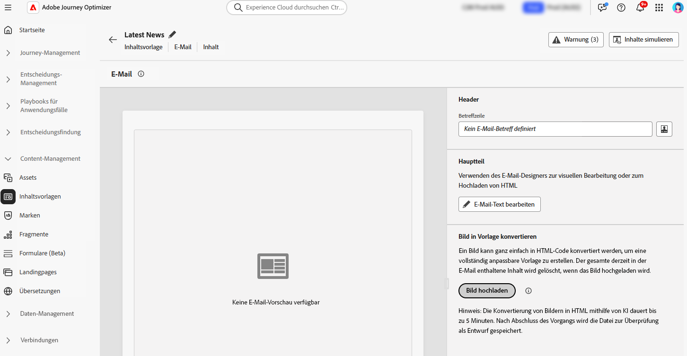
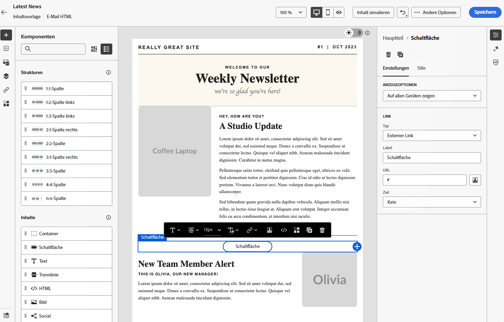

# Konvertieren von Bildern in HTML-Vorlagen mit dem Bild-zu-HTML-Converter {#image-to-html}

## Überblick {#overview}

Der Bild-zu-HTML-Converter ist eine innovative KI-gestützte Funktion, die im Menü **Inhaltsvorlagen** verfügbar ist und die E-Mail-Erstellung maßgeblich beschleunigt, indem statische Bild-Designs in vollständig anpassbare, modulare HTML-E-Mail-Inhaltsvorlagen konvertiert werden. Dieses Code-freie Tool ermöglicht es Marketing-Fachleuten, visuelle Designs von Grafik-Designerinnen und -Designern oder Design-Tools in responsive, bearbeitbare E-Mail-Vorlagen umzuwandeln, die in der Inhaltsvorlagenbibliothek gespeichert und dann in mehreren Journeys und Kampagnen wiederverwendet werden können, ohne dass technisches Know-how erforderlich ist.

>[!AVAILABILITY]
>
>Diese Funktion ist nur eingeschränkt verfügbar. Wenden Sie sich an den Adobe-Support, um Zugriff zu erhalten.

Durch die Nutzung der generativen KI-Technologie analysiert der Bild-zu-HTML-Converter das Layout, die Typografie, die Farben und visuellen Elemente in Ihrem Bild und generiert einen übersichtlichen, modularen HTML-Code, der die Design-Treue beibehält und gleichzeitig eine vollständige Bearbeitbarkeit und Kompatibilität mit dem E-Mail-Designer sicherstellt. Dadurch entfällt der manuelle, zeitaufwendige Prozess der Konvertierung von Mockups in HTML und die Abhängigkeit von Entwicklungsressourcen wird reduziert.

**Wichtigste Vorteile:**

* **Design zu HTML in wenigen Minuten**: Die KI-gestützte Code-freie Konvertierung wandelt statische Bilder in Minuten in bearbeitbare, modulare Vorlagen um, wodurch die Erstellungszeit von Vorlagen erheblich verkürzt wird
* **Ermöglicht Nutzung ohne technisches Fachwissen**: Verringert die Abhängigkeit von Design- oder Entwicklungs-Teams – Marketing-Fachleute können Vorlagen mit minimalem technischen Wissen erstellen und anpassen
* **Vereinfachte Plattformmigration**: Konvertieren Sie externe Vorlagen oder Designs von anderen Plattformen mühelos in AJO-fähiges HTML
* **Erstellen einer wiederverwendbaren Vorlagenbibliothek**: Erstellen Sie eine skalierbare, markenkonsistente Vorlagenbibliothek, die in mehreren Journeys und Kampagnen verwendet werden kann
* **Design-Treue**: Wahren Sie die visuelle Konsistenz mit Ihrem Original-Design und erstellen Sie gleichzeitig vollständig bearbeitbare Inhalte
* **E-Mail-Kompatibilität**: Generieren Sie HTML, das nahtlos mit dem E-Mail-Designer und E-Mail-Clients zusammenarbeitet

## Häufige Anwendungsfälle {#use-cases}

Der Bild-zu-HTML-Converter eignet sich ideal für:

* **Plattformmigration**: Sie migrieren von einer anderen E-Mail-Marketing-Plattform? Konvertieren Sie Ihre bestehenden E-Mail-Designs in AJO-fähige HTML-Vorlagen, ohne sie von Grund auf neu zu erstellen
* **Konvertierung von Design-Mockups**: Wandeln Sie Design-Mockups aus Tools wie Photoshop, Figma oder anderer Design-Software in funktionale E-Mail-Vorlagen um
* **Schnelle Vorlagenerstellung**: Generieren Sie schnell E-Mail-Vorlagen für zeitkritische Kampagnen, ohne auf Entwicklerressourcen zu warten
* **Erstellen von Vorlagenbibliotheken**: Erstellen Sie eine umfassende Bibliothek markenkonsistenter Vorlagen, die Team-Mitglieder ohne technisches Fachwissen anpassen und bereitstellen können
* **Reduzieren technischer Abhängigkeiten**: Marketing-Fachleute können E-Mail-Vorlagen unabhängig erstellen und iterieren und dadurch die Kampagnenausführung beschleunigen

## Voraussetzungen {#prerequisites}

Bevor Sie den Bild-zu-HTML-Converter verwenden, müssen Sie über Folgendes verfügen:

* Zugriff auf Adobe Journey Optimizer mit dem E-Mail-Designer
* Eine Grafikdatei im JPEG- oder PNG-Format, die Ihr E-Mail-Design enthält
* Eingeschränkten Zugriff auf die Funktion „Bild-zu-HTML-Converter“ (kontaktieren Sie den Adobe-Support)

>[!NOTE]
>
>Für optimale Ergebnisse sollten Sie hochwertige Bilder mit klaren visuellen Elementen und lesbarem Text verwenden. Bilder sollten idealerweise zwischen 600 und 800 Pixel breit sein, um den standardmäßigen E-Mail-Größen zu entsprechen.

## Konvertieren eines Bildes in eine HTML-Vorlage {#convert-image}

Gehen Sie wie folgt vor, um ein Bild-Design in eine vollständig anpassbare HTML-E-Mail-Vorlage zu konvertieren:

1. Um auf die Liste der Inhaltsvorlagen zuzugreifen, wählen Sie **[!UICONTROL Content-Management]** > **[!UICONTROL Inhaltsvorlagen]** im Menü links aus.

1. Klicken Sie auf **[!UICONTROL Vorlage erstellen]**.

1. Füllen Sie die Vorlagendetails aus, wählen Sie **[!UICONTROL E-Mail]** als Kanal aus und klicken Sie auf **[!UICONTROL Erstellen]**.

1. Klicken Sie im rechten Bereich im Abschnitt **[!UICONTROL Bild in Vorlage konvertieren]** auf die Schaltfläche **[!UICONTROL Bild hochladen]**, um Ihre Grafikdatei auszuwählen.

   

   >[!CAUTION]
   >
   >Wenn Sie ein Bild zum Konvertieren hochladen,**werden alle aktuell in der E-Mail hinzugefügten Inhalte gelöscht und durch die** generierte Vorlage ersetzt. Wenn in Ihrer E-Mail bereits ein Inhalt vorhanden ist, speichern Sie sie, bevor Sie mit der Bildkonvertierung fortfahren.

1. Wählen Sie das Bild aus und klicken Sie auf **[!UICONTROL Öffnen]**, um den KI-gestützten Konvertierungsprozess zu starten.

   >[!NOTE]
   >
   >Der Generierungsvorgang kann je nach Komplexität und Größe Ihres Bild-Designs bis zu 5 Minuten dauern. Die KI-Verarbeitung erfolgt im Hintergrund, sodass Sie während der Konvertierung diesen Bildschirm verlassen und an anderen Aufgaben arbeiten können. Der Bildschirm muss nicht geöffnet sein.

1. Nach Abschluss der Konvertierung wird Ihre Inhaltsvorlage automatisch als Entwurf gespeichert. Sie können dann die generierte HTML-Vorlage auf der Arbeitsfläche des E-Mail-Designers überprüfen und bearbeiten.

   

1. Die konvertierte Vorlage wird im E-Mail-Designer mit allen Bearbeitungsfunktionen geöffnet. Sie können jetzt:

   * Textinhalt bearbeiten und Personalisierung anwenden
   * Bilder ändern und Links hinzufügen
   * Farben, Schriften und Stile anpassen
   * Inhaltskomponenten hinzufügen, entfernen oder neu anordnen
   * Alle E-Mail-Designer-Funktionen wie bei jeder anderen Vorlage nutzen

   

1. Nehmen Sie die erforderlichen Anpassungen vor, um die Vorlage zu verfeinern und auf Ihre Markenrichtlinien abzustimmen.

1. Wenn Sie mit Ihrer Vorlage zufrieden sind, klicken Sie auf **[!UICONTROL Speichern]**, um die Inhaltsvorlage zu speichern.

1. Ihre Vorlage ist jetzt in der Inhaltsvorlagenbibliothek verfügbar und kann beim Erstellen von E-Mails in Journeys oder Kampagnen verwendet werden. [Informationen zur Verwendung von Inhaltsvorlagen](use-email-templates.md)

## Verwenden der konvertierten Vorlage in E-Mails {#use-template}

Nachdem Sie Ihre Inhaltsvorlage erstellt und gespeichert haben, können Sie sie beim Entwerfen von E-Mails in Journeys oder Kampagnen verwenden:

Wenn Sie eine E-Mail in einer Journey oder in einer Kampagne erstellen, greifen Sie über den Bildschirm **[!UICONTROL Inhalt bearbeiten]** auf den E-Mail-Designer zu.

Erfahren Sie mehr über das [Arbeiten mit E-Mail-Vorlagen](use-email-templates.md) und [Erstellen von Inhaltsvorlagen](../content-management/content-templates.md).

## Best Practices {#best-practices}

Um bei der Verwendung des Bild-zu-HTML-Converters optimale Ergebnisse zu erzielen, befolgen Sie die folgenden Empfehlungen:

**Vorbereitung**

* **Speichern Sie vorhandene Inhalte**: Wenn Sie ein Bild in HTML konvertieren, werden alle in Ihrer E-Mail vorhandenen Inhalte ersetzt. Speichern Sie Ihre aktuelle Arbeit immer, bevor Sie diese Funktion verwenden.
* **Planen Sie den Workflow**: Verwenden Sie den Bild-zu-HTML-Converter zu Beginn Ihres E-Mail-Erstellungsprozesses oder stellen Sie sicher, dass Sie bereit sind, den gesamten aktuellen Inhalt zu ersetzen.

**Bildvorbereitung**

* **Auflösung**: Verwenden Sie hochauflösende Bilder (mindestens 1200 Pixel breit) für eine bessere Texterkennung und Auffindbarkeit von Elementen
* **Klarheit**: Stellen Sie sicher, dass der Text klar lesbar ist und visuelle Elemente klar definiert sind
* **Breite**: Entwerfen Sie Bilder mit standardmäßigen E-Mail-Breiten (600–800 px), um die Anforderungen typischer E-Mail-Clients zu erfüllen
* **Dateiformat**: Verwenden Sie das JPEG- oder PNG-Format, um komprimierte Bilder oder Bilder mit geringer Qualität zu vermeiden
* **Vollständiges Design**: Nehmen Sie das vollständige E-Mail-Design in ein einziges Bild auf, von Kopf- bis Fußzeile

**Überlegungen zum Design**

* **Einfache Layouts**: Einfachere, gut strukturierte Layouts ermöglichen eine präzisere Konvertierung als hochkomplexe Designs
* **Standardelemente**: Verwenden Sie gängige E-Mail-Design-Muster (Kopfzeile, Hauptteil, CTAs und Fußzeile)
* **Textlesbarkeit**: Stellen Sie einen ausreichenden Kontrast zwischen Text und Hintergrund sicher
* **Web-sichere Schriften**: Designs, die gängige Web-sichere Schriften verwenden, sind zuverlässiger
* **Vermeiden Sie überlappende Elemente**: Halten Sie Design-Elemente zur besseren Strukturerkennung klar getrennt

**Nach der Konvertierung**

* **Prüfen Sie den Entwurf**: Nach Abschluss der Konvertierung wird Ihre Vorlage automatisch als Entwurf gespeichert. Nehmen Sie sich Zeit, um die generierte HTML-Version sorgfältig auf Korrektheit zu überprüfen
* **Testen Sie sorgfältig**: Testen Sie die E-Mail auf verschiedenen E-Mail-Clients und Geräten
* **Optimieren Sie manuell**: Nehmen Sie die benötigten Anpassungen mit den umfassenden Bearbeitungsfunktionen des E-Mail-Designers vor
* **Markenausrichtung**: Prüfen Sie, ob die Farben, Schriften und Formate Ihren Markenrichtlinien entsprechen
* **Personalisierung**: Fügen Sie nach Bedarf dynamische Inhalte und Personalisierungs-Token hinzu
* **Barrierefreiheit**: Prüfen und erweitern Sie die Barrierefreiheitsfunktionen bei Bedarf

## Einschränkungen und Überlegungen {#limitations}

Beachten Sie die folgenden Einschränkungen bei der Verwendung des Bild-zu-HTML-Converters:

* **KI-Interpretation**: Die KI generiert HTML basierend auf der visuellen Interpretation Ihres Bildes. Komplexe oder ungewöhnliche Designs erfordern nach der Konvertierung möglicherweise manuelle Anpassungen.

* **Textgenauigkeit**: Die KI versucht zwar, Text genau zu erkennen und zu reproduzieren, aber Sie sollten Textinhalte immer überprüfen und nach Bedarf korrigieren.

* **Dynamische Inhalte**: Der Konvertierungsprozess erstellt statisches HTML basierend auf Ihrem Bild. Nach der Konvertierung müssen Sie Personalisierung, dynamische Inhalte und Tracking manuell hinzufügen.

* **Komplexe Layouts**: Hochkomplexe Designs mit komplizierten Ebenen, ungewöhnlichen Formen oder nicht standardmäßigen Elementen werden möglicherweise nicht perfekt konvertiert. Einfachere Designs liefern in der Regel bessere Ergebnisse.

* **Verarbeitungszeit**: Der Konvertierungsprozess kann je nach Komplexität und Größe des Bildes bis zu 5 Minuten dauern. Die KI-Verarbeitung erfolgt im Hintergrund, sodass Sie andere Aufgaben bearbeiten können und der Bildschirm nicht geöffnet sein muss. Die Vorlage wird nach Abschluss der Konvertierung automatisch als Entwurf gespeichert.

* **Eingeschränkte Verfügbarkeit**: Als Funktion mit eingeschränkter Verfügbarkeit wird der Bild-zu-HTML-Converter kontinuierlich verbessert. Funktionalität und Genauigkeit können variieren, und Ihr Feedback trägt zur Verbesserung der Funktion bei.

>[!NOTE]
>
>Der Bild-zu-HTML-Converter ist als leistungsstarker Ausgangspunkt für die Erstellung von E-Mails konzipiert. Das generierte HTML sollte mithilfe des E-Mail-Designers überprüft und verfeinert werden, um sicherzustellen, dass es Ihren genauen Anforderungen entspricht.

## Häufig gestellte Fragen {#faq}

+++Was geschieht mit meinen vorhandenen E-Mail-Inhalten, wenn ich den Bild-zu-HTML-Converter verwende?

Alle vorhandenen Inhalte in Ihrer E-Mail werden gelöscht und durch die neu generierte Vorlage ersetzt, wenn Sie ein Bild zur Konvertierung hochladen. Speichern Sie alle wichtigen Inhalte, bevor Sie diese Funktion verwenden. Am besten verwenden Sie den Bild-zu-HTML-Converter zu Beginn Ihres E-Mail-Erstellungsprozesses.

+++

+++Welche Dateiformate werden unterstützt?

Der Bild-zu-HTML-Converter unterstützt die Bildformate JPEG (.jpg, .jpeg) und PNG (.png).

+++

+++Wie lange dauert der Konvertierungsprozess?

Die Konvertierung kann je nach Komplexität und Größe Ihres Bild-Designs bis zu 5 Minuten dauern. Die KI-Verarbeitung erfolgt im Hintergrund, sodass Sie zu anderen Aufgaben wechseln und diese bearbeiten können. Der Bildschirm muss nicht geöffnet bleiben. Nach Abschluss der Konvertierung wird Ihre Datei automatisch als Entwurf gespeichert, den Sie überprüfen und bearbeiten können.

+++

+++Kann ich die generierte Vorlage bearbeiten?

Ja. Die generierte HTML-Vorlage wird im E-Mail-Designer mit allen Bearbeitungsfunktionen geöffnet. Sie können alle Aspekte der Vorlage ändern, einschließlich Text, Bilder, Stil, Layout und Struktur.

+++

+++Was geschieht, wenn die Konvertierung nicht genau meinem Design entspricht?

Die KI bemüht sich, Ihr Design möglichst genau zu interpretieren, doch einige manuelle Anpassungen können erforderlich sein. Verwenden Sie den E-Mail-Designer, um alle Elemente anzupassen, die einer Feinabstimmung bedürfen.

+++

+++Kann ich diese Funktion für Landingpages oder andere Inhaltstypen verwenden?

Der Bild-zu-HTML-Converter ist derzeit speziell für E-Mail-Vorlagen konzipiert. Verwenden Sie für andere Inhaltstypen die standardmäßigen Design- und Importoptionen, die im E-Mail-Designer verfügbar sind.

+++

+++Benötige ich spezielle Berechtigungen, um diese Funktion nutzen zu können?

Der Bild-zu-HTML-Converter ist nur eingeschränkt verfügbar. Um diese Funktion nutzen zu können, benötigen Sie Zugriff auf eingeschränkt verfügbare Funktionen (wenden Sie sich an den Adobe-Support, um Zugriff zu erhalten) und die Standardberechtigungen im E-Mail-Designer.

+++

+++Kann ich konvertierte Vorlagen in mehreren Kampagnen wiederverwenden?

Ja. Mit dem Bild-zu-HTML-Converter erstellte Vorlagen werden automatisch in der Inhaltsvorlagenbibliothek gespeichert. Sie können auf sie zugreifen und sie in beliebigen E-Mails innerhalb Ihrer Journeys und Kampagnen wiederverwenden. [Weitere Informationen](../content-management/content-templates.md)

+++

+++Kann ich dies für eine Plattformmigration verwenden?

Ja. Der Bild-zu-HTML-Converter eignet sich ideal für die Migration von anderen E-Mail-Marketing-Plattformen. Exportieren Sie Ihre bestehenden E-Mail-Designs aus Ihrer vorherigen Plattform oder erstellen Sie einfach Screenshots und konvertieren Sie diese in AJO-fähige HTML-Vorlagen, ohne sie von Grund auf neu erstellen zu müssen.

+++

## Verwandte Themen {#related-topics}

* [Erste Schritte mit Inhaltsvorlagen](../content-management/content-templates.md)
* [Erstellen von Inhaltsvorlagen](../content-management/create-content-templates.md)
* [Verwenden von E-Mail-Vorlagen](use-email-templates.md)
* [Erste Schritte mit dem E-Mail-Design](get-started-email-design.md)
* [Importieren von E-Mail-Inhalten](existing-content.md)
* [Neugestalten von Inhalten](content-from-scratch.md)

