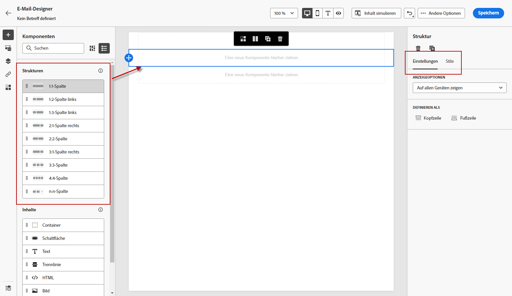

# Konvertieren von Bildern in HTML-Vorlagen mit dem Vorlagenbeschleuniger {#image-to-html}

>[!CONTEXTUALHELP]
>id="ajo_template_accelerator"
>title="Vorlagenbeschleuniger"
>abstract="Verwenden Sie den Vorlagenbeschleuniger, um statische Bildentwürfe (JPEG oder PNG) in vollständig anpassbare HTML-E-Mail-Vorlagen zu konvertieren. Mit dieser KI-gestützten Funktion können Sie visuelle Designs schnell in responsive, bearbeitbare E-Mail-Inhalte umwandeln. Hinweis: Alle vorhandenen Inhalte in Ihrer E-Mail werden gelöscht, wenn Sie ein Bild zur Konvertierung hochladen."

>[!AVAILABILITY]
>
>Diese Funktion ist nur eingeschränkt verfügbar. Wenden Sie sich an den Adobe-Support, um Zugriff zu erhalten.

## Überblick {#overview}

Der Vorlagenbeschleuniger ist eine innovative KI-gestützte Funktion, die im Menü **Inhaltsvorlagen** verfügbar ist und die E-Mail-Erstellung erheblich beschleunigt, indem statische Bilddesigns in vollständig anpassbare HTML-E-Mail-Inhaltsvorlagen umgewandelt werden. Dieses Tool ermöglicht es Marketing-Experten, visuelle Designs von Grafikdesignern oder Design-Tools in responsive, bearbeitbare E-Mail-Vorlagen umzuwandeln, die in der Inhaltsvorlagenbibliothek gespeichert und dann in mehreren Journey und Kampagnen wiederverwendet werden können.

Durch die Nutzung der generativen KI-Technologie analysiert der Vorlagenbeschleuniger das Layout, die Typografie, die Farben und visuellen Elemente in Ihrem Bild und generiert einen übersichtlichen, strukturierten HTML-Code, der die Designtreue erhält und gleichzeitig eine vollständige Bearbeitbarkeit und Kompatibilität mit dem E-Mail-Designer gewährleistet.

**Wichtigste Vorteile:**

* **Beschleunigtes Authoring**: Verringern Sie die Erstellungszeit von E-Mails, indem Sie Design-Mockups sofort in wiederverwendbare Inhaltsvorlagen konvertieren
* **Designer-Developer Bridge**: Bei der Arbeit mit visuellen Designs ist keine manuelle HTML-Codierung mehr erforderlich
* **Designtreue**: Wahrung der Integrität Ihres ursprünglichen Designs beim Erstellen bearbeitbarer Inhalte
* **Wiederverwendbarkeit**: Speichern von Vorlagen in der Inhaltsvorlagenbibliothek zur Verwendung in mehreren Journey und Kampagnen
* **E-Mail-Kompatibilität**: Generieren Sie eine HTML, die nahtlos mit E-Mail-Designer und E-Mail-Clients zusammenarbeitet

## Voraussetzungen {#prerequisites}

Bevor Sie den Vorlagenbeschleuniger verwenden, stellen Sie Folgendes sicher:

* Zugriff auf Adobe Journey Optimizer mit der E-Mail-Designer
* Eine Bilddatei im JPEG- oder PNG-Format, die Ihr E-Mail-Design enthält
* Eingeschränkter Zugriff auf die Funktion „Vorlagenbeschleuniger“ (Adobe-Support kontaktieren)

>[!NOTE]
>
>Für optimale Ergebnisse sollten Sie hochwertige Bilder mit klaren visuellen Elementen und lesbarem Text verwenden. Bilder sollten idealerweise zwischen 600 und 800 Pixel breit sein, um die standardmäßigen E-Mail-Abmessungen zu erfüllen.

## Konvertieren eines Bildes in eine HTML-Vorlage {#convert-image}

Gehen Sie wie folgt vor, um ein Bilddesign in eine vollständig anpassbare HTML-E-Mail-Vorlage zu konvertieren:

1. Greifen Sie auf die Liste der Inhaltsvorlagen zu, indem **[!UICONTROL Content]** Management“ > **[!UICONTROL Inhaltsvorlagen]** aus dem linken Menü auswählen.

1. Klicken Sie **[!UICONTROL Vorlage erstellen]**.

1. Füllen Sie die Vorlagendetails aus und wählen Sie **[!UICONTROL E-Mail]** als Kanal aus.

1. Klicken Sie auf **[!UICONTROL Erstellen]**, um auf die E-Mail-Designer zuzugreifen.

1. Wählen Sie auf der Startseite von E-Mail-Designer die Option **[!UICONTROL HTML importieren]**.

   

1. Im Importdialogfeld wird der Abschnitt **[!UICONTROL Bild in HTML konvertieren]** angezeigt.

   >[!CAUTION]
   >
   >Wenn Sie ein Bild zur Konvertierung hochladen **werden alle aktuell in der E-Mail hinzugefügten Inhalte gelöscht und durch** generierte Vorlage ersetzt. Wenn Sie in Ihrer E-Mail bereits Inhalt haben, speichern Sie diese, bevor Sie mit der Bildkonvertierung fortfahren.

1. Klicken Sie auf **[!UICONTROL Bild laden]**, um Ihre Bilddatei auszuwählen.

1. Ziehen Sie Ihre Bilddatei (JPEG oder PNG) per Drag-and-Drop oder klicken Sie, um die Bilddatei zu durchsuchen und auszuwählen.

1. Klicken Sie **[!UICONTROL Generieren]**, um den KI-gestützten Konvertierungsprozess zu starten.

   >[!NOTE]
   >
   >Der Generierungsprozess kann je nach Komplexität und Größe Ihres Bilddesigns bis zu 5 Minuten dauern. Bitte haben Sie Geduld, während die KI Ihr Bild analysiert und konvertiert.

1. Nach Abschluss der Konvertierung wird Ihre Inhaltsvorlage automatisch als Entwurf gespeichert. Sie können dann die generierte HTML-Vorlage auf der Arbeitsfläche von E-Mail-Designer überprüfen und bearbeiten.

1. Die konvertierte Vorlage wird in der E-Mail-Designer mit allen Bearbeitungsfunktionen geöffnet. Sie können jetzt:

   * Textinhalt bearbeiten und Personalisierung anwenden
   * Ändern von Bildern und Hinzufügen von Links
   * Farben, Schriftarten und Stile anpassen
   * Hinzufügen, Entfernen oder Neuanordnen von Inhaltskomponenten
   * Alle E-Mail-Designer-Funktionen wie bei jeder anderen Vorlage nutzen

   

1. Nehmen Sie die erforderlichen Anpassungen vor, um die Vorlage zu verfeinern und Ihren Markenrichtlinien zu entsprechen.

1. Wenn Sie mit Ihrer Vorlage zufrieden sind, klicken Sie auf **[!UICONTROL Speichern]**, um die Inhaltsvorlage zu speichern.

1. Ihre Vorlage ist jetzt in der Inhaltsvorlagenbibliothek verfügbar und kann beim Erstellen von E-Mails in Journey oder Kampagnen verwendet werden. [Informationen zur Verwendung von Inhaltsvorlagen](use-email-templates.md)

## Konvertierte Vorlage in E-Mails verwenden {#use-template}

Nachdem Sie Ihre Inhaltsvorlage mit dem Vorlagenbeschleuniger erstellt und gespeichert haben, können Sie sie beim Entwerfen von E-Mails in Journey oder Kampagnen verwenden:

1. Wenn Sie eine E-Mail auf einer Journey oder in einer Kampagne erstellen, greifen Sie auf dem Bildschirm **[!UICONTROL Inhalt bearbeiten]** auf die E-Mail-Designer zu.

1. Gehen Sie auf der Startseite von E-Mail-Designer zur Registerkarte **[!UICONTROL Gespeicherte]**&quot;.

1. Wählen Sie die mit Vorlagenbeschleunigung generierte Vorlage aus der Liste aus.

1. Klicken Sie auf **[!UICONTROL Diese Vorlage verwenden]**, um sie auf Ihre E-Mail anzuwenden.

1. Fahren Sie mit der Bearbeitung und Personalisierung Ihres E-Mail-Inhalts fort.

Erfahren Sie mehr über [Arbeiten mit E-Mail](use-email-templates.md)Vorlagen und [Erstellen von ](../content-management/content-templates.md)).

## Best Practices {#best-practices}

Um bei der Verwendung des Vorlagenbeschleunigers optimale Ergebnisse zu erzielen, befolgen Sie die folgenden Empfehlungen:

**Vorbereitung**

* **Vorhandenen Inhalt speichern**: Wenn Sie ein Bild in HTML konvertieren, werden alle in Ihrer E-Mail vorhandenen Inhalte ersetzt. Speichern Sie immer Ihre aktuellen Arbeiten, bevor Sie diese Funktion verwenden.
* **Workflow planen**: Verwenden Sie den Vorlagenbeschleuniger zu Beginn Ihres E-Mail-Erstellungsprozesses oder stellen Sie sicher, dass Sie bereit sind, den gesamten aktuellen Inhalt zu ersetzen.

**Bildvorbereitung**

* **Auflösung**: Verwenden Sie hochauflösende Bilder (mindestens 1200 Pixel breit) für eine bessere Texterkennung und Elementerkennung
* **Klarheit**: Stellen Sie sicher, dass der Text klar lesbar ist und visuelle Elemente klar definiert sind
* **Breite**: Entwerfen Sie Bilder mit standardmäßigen E-Mail-Breiten (600-800 px), um die typischen E-Mail-Client-Anforderungen zu erfüllen
* **Dateiformat**: Verwenden Sie das JPEG- oder PNG-Format, um komprimierte Bilder oder Bilder von schlechter Qualität zu vermeiden
* **Vollständiges Design**: Vollständiges E-Mail-Design in ein einziges Bild aufnehmen, von Kopf- bis Fußzeile

**Überlegungen zum Design**

* **Einfache Layouts**: Einfachere, gut strukturierte Layouts ermöglichen eine präzisere Konvertierung als hochkomplexe Designs
* **Standardelemente**: Verwenden gängiger E-Mail-Design-Muster (Kopfzeilen-, Hauptteil-, CTAs- und Fußzeilen)
* **Textlesbarkeit**: Sicherstellen eines ausreichenden Kontrasts zwischen Text und Hintergrund
* **Web-sichere Schriftarten**: Designs, die gängige Web-sichere Schriftarten verwenden, sind zuverlässiger
* **Überlappende Elemente vermeiden**: Design-Elemente zur besseren Strukturerkennung klar getrennt halten

**Nach der Konvertierung**

* **Entwurf überprüfen**: Nach Abschluss der Konvertierung wird Ihre Vorlage automatisch als Entwurf gespeichert. Nehmen Sie sich Zeit, um die generierte HTML sorgfältig auf Korrektheit zu überprüfen
* **Gründlich testen**: Testen Sie die E-Mail über verschiedene E-Mail-Clients und Geräte hinweg
* **Manuell verfeinern**: Nehmen Sie die erforderlichen Anpassungen vor, indem Sie die vollständigen Bearbeitungsfunktionen von Email Designer nutzen
* **Markenausrichtung**: Überprüfen Sie, ob Farben, Schriftarten und Stile Ihren Markenrichtlinien entsprechen
* **Personalization**: Fügen Sie nach Bedarf dynamische Inhalte und Personalisierungs-Token hinzu
* **Barrierefreiheit**: Überprüfen und erweitern Sie die Funktionen für die Barrierefreiheit bei Bedarf

## Einschränkungen und Überlegungen {#limitations}

Beachten Sie die folgenden Einschränkungen bei der Verwendung des Vorlagenbeschleunigers:

* **KI-Interpretation**: Die KI generiert HTML basierend auf der visuellen Interpretation Ihres Bildes. Komplexe oder ungewöhnliche Designs erfordern nach der Konvertierung möglicherweise manuelle Anpassungen.

* **Textgenauigkeit**: Während die KI versucht, Text genau zu erkennen und zu reproduzieren, sollten Textinhalte immer überprüft und nach Bedarf korrigiert werden.

* **Dynamische Inhalte**: Der Konvertierungsprozess erstellt statische HTML basierend auf Ihrem Bild. Nach der Konvertierung müssen Sie Personalisierung, dynamische Inhalte und Tracking manuell hinzufügen.

* **Komplexe Layouts**: Hochkomplexe Designs mit komplizierten Ebenen, ungewöhnlichen Formen oder nicht standardmäßigen Elementen werden möglicherweise nicht perfekt konvertiert. Einfachere Designs liefern in der Regel bessere Ergebnisse.

* **Verarbeitungszeit**: Der Konvertierungsprozess kann je nach Komplexität und Größe des Bildes bis zu 5 Minuten dauern. Die Vorlage wird nach Abschluss der Konvertierung automatisch als Entwurf gespeichert.

* **Eingeschränkte Verfügbarkeit**: Als Funktion zur eingeschränkten Verfügbarkeit wird der Vorlagenbeschleuniger kontinuierlich verbessert. Die Funktionalität und Genauigkeit können variieren, und Ihr Feedback hilft dabei, die Funktion zu verbessern.

>[!NOTE]
>
>Der Vorlagenbeschleuniger ist als guter Ausgangspunkt für die E-Mail-Erstellung konzipiert. Die generierte HTML sollte mit der E-Mail-Designer überprüft und verfeinert werden, um sicherzustellen, dass sie genau Ihren Anforderungen entspricht.

## Häufig gestellte Fragen {#faq}

+++Was passiert mit meinem vorhandenen E-Mail-Inhalt, wenn ich den Vorlagenbeschleuniger verwende?

Alle vorhandenen Inhalte in Ihrer E-Mail werden gelöscht und durch die neu generierte Vorlage ersetzt, wenn Sie ein Bild zur Konvertierung hochladen. Stellen Sie sicher, dass Sie alle wichtigen Inhalte speichern, bevor Sie diese Funktion verwenden. Am besten verwenden Sie den Vorlagenbeschleuniger zu Beginn Ihres E-Mail-Erstellungsprozesses.

+++

+++Welche Dateiformate werden unterstützt?

Der Vorlagenbeschleuniger unterstützt die Bildformate JPEG (.jpg, .jpeg) und PNG (.png).

+++

+++Wie lange dauert der Konvertierungsprozess?

Die Konvertierung kann je nach Komplexität und Größe des Bilddesigns bis zu 5 Minuten dauern. Sobald die Konvertierung abgeschlossen ist, wird Ihre Datei automatisch als Entwurf gespeichert, den Sie überprüfen und bearbeiten können.

+++

+++Kann ich die generierte Vorlage bearbeiten?

Ja! Die generierte HTML-Vorlage wird in der E-Mail-Designer mit vollem Bearbeitungsfunktionen geöffnet. Sie können alle Aspekte der Vorlage ändern, einschließlich Text, Bilder, Stil, Layout und Struktur.

+++

+++Was passiert, wenn die Konvertierung nicht genau meinem Design entspricht?

Die KI gibt ihr Bestes, um Ihr Design genau zu interpretieren, aber es kann eine manuelle Verfeinerung erforderlich sein. Verwenden Sie den E-Mail-Designer, um alle Elemente anzupassen, die eine Feinabstimmung erfordern.

+++

+++Kann ich diese Funktion für Landingpages oder andere Inhaltstypen verwenden?

Der Vorlagenbeschleuniger wurde derzeit speziell für E-Mail-Vorlagen entwickelt. Verwenden Sie für andere Inhaltstypen die standardmäßigen Design- und Importoptionen in der E-Mail-Designer.

+++

+++Benötige ich spezielle Berechtigungen, um diese Funktion nutzen zu können?

Der Vorlagenbeschleuniger ist nur in begrenztem Umfang verfügbar. Sie benötigen eingeschränkten Verfügbarkeitszugriff (wenden Sie sich an den Adobe-Support, um Zugriff zu erhalten) und standardmäßige E-Mail-Designer-Berechtigungen, um diese Funktion nutzen zu können.

+++

+++Kann ich konvertierte Vorlagen für mehrere Kampagnen wiederverwenden?

Ja! Mit dem Vorlagenbeschleuniger erstellte Vorlagen werden automatisch in der Inhaltsvorlagenbibliothek gespeichert. Sie können in allen Ihren Journey und Kampagnen auf sie zugreifen und sie in jeder E-Mail wiederverwenden. [Weitere Informationen](../content-management/content-templates.md)

+++

## Verwandte Themen {#related-topics}

* [Erste Schritte mit Inhaltsvorlagen](../content-management/content-templates.md)
* [Erstellen von Inhaltsvorlagen](../content-management/create-content-templates.md)
* [Verwenden von E-Mail-Vorlagen](use-email-templates.md)
* [Erste Schritte beim Gestalten von E-Mails](get-started-email-design.md)
* [Importieren von E-Mail-Inhalten](existing-content.md)
* [Inhalte von Grund auf gestalten](content-from-scratch.md)

