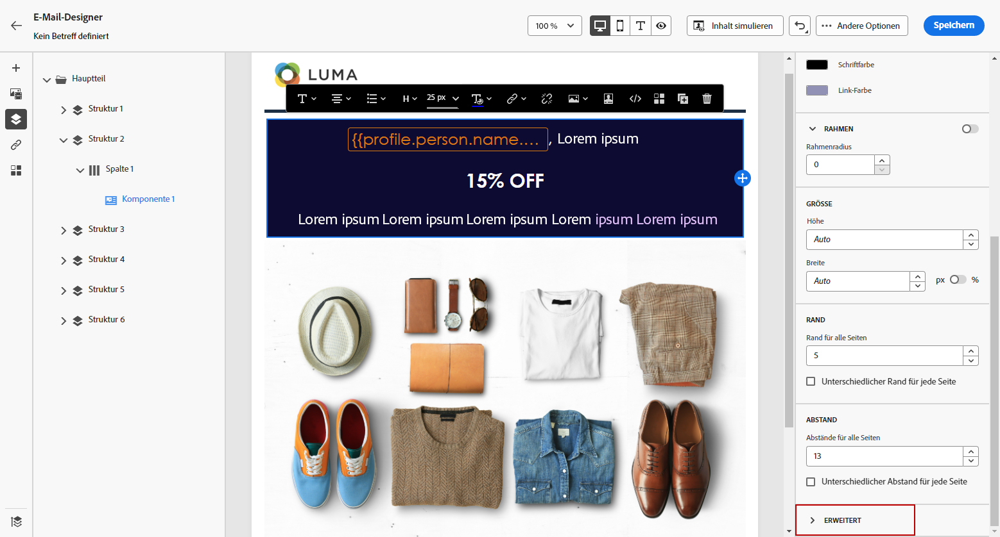

# Hinzufügen von Inline-Stilattributen {#inline-styling}

Wenn Sie in der Benutzeroberfläche von E-Mail-Designer ein Element auswählen und im seitlichen Fenster seine Einstellungen anzeigen, können Sie seine Inline-Attribute und deren Werte ändern.

1. Wählen Sie in Ihrem Inhalt ein Element aus.

1. Suchen Sie auf der Registerkarte **[!UICONTROL Stile]** nach der Einstellung **[!UICONTROL Inline-Stile]** im Dropdown-Menü **[!UICONTROL Erweitert]**.

   

1. Ändern Sie die Werte der vorhandenen Attribute oder fügen Sie mit den Schaltflächen **+** neue hinzu. Sie können alle Attribute und Werte hinzufügen, die CSS-kompatibel sind.

   

Der Stil wird auf das ausgewählte Element angewendet. Wenn für die untergeordneten Elemente keine speziellen Stilattribute definiert sind, wird der Stil des übergeordneten Elements verwendet.
