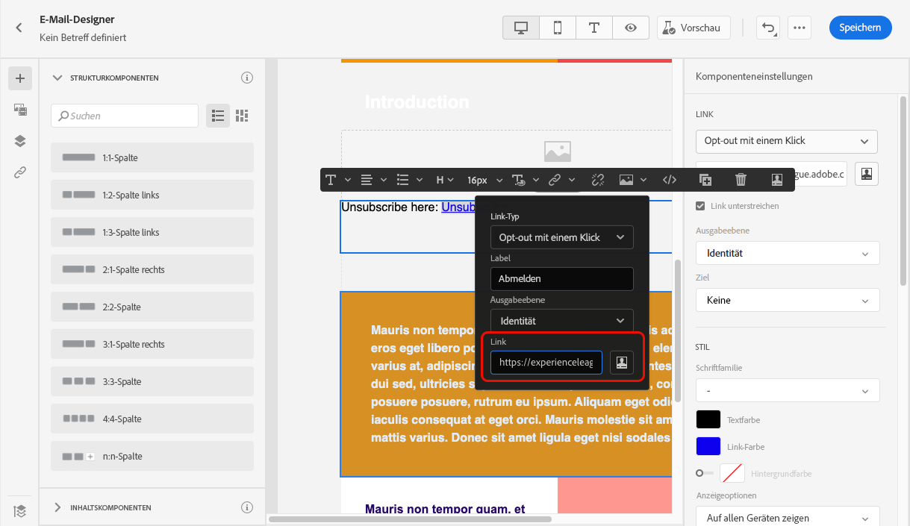

# Abmelden von der Liste{#list-unsubscribe}

<!--Do not modify - Legal Review Done -->

Beim Konfigurieren einer neuen E-Mail-Kanal-Konfiguration wird bei [Auswahl einer Subdomain](email-settings.md#subdomains-and-ip-pools) aus der Liste die Option **[!UICONTROL Abmelden von der Liste aktivieren]** angezeigt.

## Abmelden von der Liste aktivieren {#enable-list-unsubscribe}

Diese Option ist standardmäßig aktiviert, um eine URL zum Abmelden mit einem Klick in die E-Mail-Kopfzeile einzufügen, z. B.:

>[!NOTE]
>
>Wenn Sie diese Option deaktivieren, wird in der E-Mail-Kopfzeile keine URL zum Abmelden mit einem Klick angezeigt.

Die Kopfzeile „Von der Liste abmelden“ bietet zwei Funktionen, die standardmäßig aktiviert sind, sofern Sie nicht eine oder beide Funktionen deaktivieren:

{width="80%"}

* Eine Adresse **[!UICONTROL E-Mail an (abmelden)]**, bei der es sich um die Zieladresse handelt, an die Abmeldeanfragen zur automatischen Verarbeitung weitergeleitet werden.

  In [!DNL Journey Optimizer] ist die Abmelde-E-Mail-Adresse die standardmäßig in der Kanaloberfläche angezeigte Adresse unter **[!UICONTROL E-Mail an (abmelden)]**, basierend auf der [ausgewählten Subdomain](#subdomains-and-ip-pools). <!--With this method, clicking the Unsubscribe link sends a pre-filled email to the unsubscribe address specified in the email header.-->

* Die **[!UICONTROL URL zum Abmelden mit einem Klick]** ist standardmäßig die Ein-Klick-Opt-out-URL der Kopfzeile zum Abmelden von der Liste, die auf der in den Einstellungen der Kanalkonfiguration festgelegten und konfigurierten Subdomain basiert. <!--With this method, clicking the Unsubscribe link directly unsubscribes the user, requiring only a single action to unsubscribe.-->

Die Einverständnisstufe kann aus der Dropdown-Liste **[!UICONTROL Einverständnisstufe]** ausgewählt werden. Sie kann sich auf den Kanal oder die Profilidentität beziehen. Basierend auf dieser Einstellung wird das Einverständnis in [!DNL Adobe Journey Optimizer] entweder auf Kanal- oder ID-Ebene aktualisiert, wenn sich jemand über die URL zum Abmelden von Listen in der Kopfzeile einer E-Mail abmeldet.

Die Funktionen **[!UICONTROL E-Mail an (abmelden)]** und **[!UICONTROL URL zum Abmelden mit einem Klick]** sind optional. 

Wenn Sie nicht die standardmäßig generierte URL zum Abmelden mit einem Klick verwenden möchten, können Sie die Funktion deaktivieren. In einem Szenario, in dem die Option **[!UICONTROL Abmelden von der Liste aktivieren]** aktiviert ist und die Funktion **[!UICONTROL URL zum Abmelden mit einem Klick]** deaktiviert ist und ein [Ausschluss-Link mit einem Klick](../email/email-opt-out.md#one-click-opt-out) zu einer Nachricht hinzugefügt wird, die mit dieser Konfiguration erstellt wurde, nimmt die Option „Abmelde-Link in Kopfzeile“ den Link zum Abmelden mit einem Klick auf, den Sie im Textkörper der E-Mail eingefügt haben, und verwendet ihn als den URL-Wert zum Abmelden mit einem Klick.

>[!NOTE]
>
>Wenn Sie keinen Ein-Klick-Ausschluss-Link in den Nachrichteninhalt einfügen und die standardmäßige **[!UICONTROL URL zum Abmelden mit einem Klick]** in den Einstellungen der Kanalkonfiguration deaktiviert ist, wird keine URL als Teil des Abmelde-Links in der Kopfzeile in die E-Mail-Kopfzeile übernommen.

In [diesem Abschnitt](../email/email-opt-out.md#unsubscribe-header) erfahren Sie mehr über die Verwaltung von Abmeldefunktionen innerhalb Ihrer Nachrichten.

## Externes Verwalten von Abmeldedaten {#custom-managed}

>[!CONTEXTUALHELP]
>id="ajo_email_config_unsubscribe_custom"
>title="Definieren, wie Abmeldedaten verwaltet werden"
>abstract="**Von Adobe verwaltet**: Einverständnisdaten werden von Ihnen innerhalb des Adobe-Systems verwaltet. **Kundenseitig verwaltet**: Einverständnisdaten werden von Ihnen in einem externen System verwaltet. Im Adobe-System erfolgt keine Aktualisierung der Synchronisierung von Einverständnisdaten, sofern dies nicht von Ihnen initiiert wird."

Wählen Sie im Falle einer Einverständnisverwaltung außerhalb von Adobe die Option **[!UICONTROL Kundenseitig verwaltet]** aus, um eine benutzerdefinierte Abmelde-E-Mail-Adresse und Ihre eigene URL zum Abmelden mit einem Klick einzugeben.

{width="80%"}

>[!WARNING]
>
>Wenn Sie die Option **[!UICONTROL Kundenseitig verwaltet]** verwenden, speichert Adobe weder Abmelde- noch Einverständnisdaten. Mit der Option **[!UICONTROL Kundenseitig verwaltet]** entscheiden sich Organisationen für die Verwendung eines externen Systems und sind für die Verwaltung ihrer Einverständnisdaten in diesem externen System verantwortlich. Es erfolgt keine automatische Synchronisierung von Einverständnisdaten zwischen dem externen System und [!DNL Journey Optimizer]. Jede Synchronisierung von Einverständnisdaten, die zur Aktualisierung von Benutzereinverständnisdaten in [!DNL Journey Optimizer] aus dem externen System herangezogen werden, muss von der Organisation als Datenübertragung initiiert werden, um die Einverständnisdaten wieder in [!DNL Journey Optimizer] zu übertragen.

### Konfigurieren des Entschlüsselungs-API {#configure-decrypt-api}

Sollten Sie bei ausgewählter Option **[!UICONTROL Kundenseitig verwaltet]** benutzerdefinierte Endpunkte eingeben und diese in einer Kampagne oder Journey verwenden, fügt [!DNL Journey Optimizer] einige standardmäßige profilspezifische Parameter an das Ereignis zur Einverständnisaktualisierung an, <!--sent to the custom endpoint -->wenn die Empfängerinnen und Empfänger auf den Abmelde-Link klicken.

Diese Parameter werden verschlüsselt an den Endpunkt gesendet. Daher muss das externe Einverständnissystem ein bestimmtes API über [Adobe Developer](https://developer.adobe.com){target="_blank"} implementieren, um die von Adobe gesendeten Parameter zu entschlüsseln.

Der GET-Aufruf zum Abrufen dieser Parameter hängt von der von Ihnen verwendeten Option zum Abmelden von der Liste ab: **[!UICONTROL URL zum Abmelden mit einem Klick]** oder **[!UICONTROL E-Mail an (abmelden)]**.

<!--To configure the API to send back the information to [!DNL Adobe Journey Optimizer] when a recipient has unsubscribed using the List unsubscribe option with custom endpoints, follow the steps below.-->

+++ URL zum Abmelden mit einem Klick

Mit der Option **[!UICONTROL URL zum Abmelden mit einem Klick]** werden Benutzende durch Klicken auf den Abmelde-Link direkt abgemeldet.

Dieser GET-Aufruf sieht wie folgt aus:

Endpunkt: https://platform.adobe.io/journey/imp/consent/decrypt

Abfrageparameter:

* **params**: enthält die verschlüsselte Payload
* **pid**: verschlüsselte Profil-ID

Diese beiden Parameter werden in das Ereignis zur Einverständnisaktualisierung aufgenommen, das an die benutzerdefinierten Endpunkte gesendet wird.

Header-Anforderungen:

* x-api-key
* x-gw-ims-org-id
* Autorisierung (Benutzer-Token Ihres technischen Kontos)

+++

+++ E-Mail an (abmelden)

Mit der Option **[!UICONTROL E-Mail an (abmelden)]** wird durch Klicken auf den Abmelde-Link eine vorausgefüllte E-Mail an die angegebene Abmelde-Adresse gesendet.

Dieser GET-Aufruf sieht wie folgt aus:

Endpunkt: https://platform.adobe.io/journey/imp/consent/decrypt

Abfrageparameter:

* **emailParams**: String, der die Parameter **params** (verschlüsselte Payload) und **pid** (verschlüsselte Profilkennung) enthält.

Die Parameter **params** und **pid** werden in das Ereignis zur Einverständnisaktualisierung aufgenommen, das an die benutzerdefinierten Endpunkte gesendet wird.

Header-Anforderungen:

* x-api-key
* x-gw-ims-org-id
* Autorisierung (Benutzer-Token Ihres technischen Kontos)

+++
