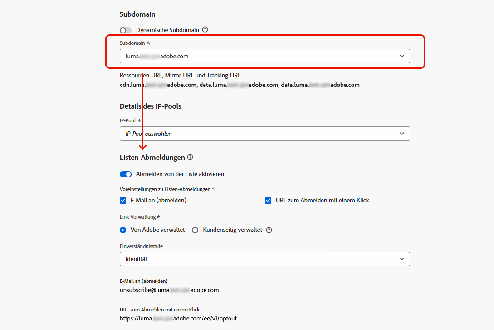

# Abmelden von der Liste{#list-unsubscribe}

<!--Do not modify - Legal Review Done -->

Beim Konfigurieren einer neuen E-Mail-Kanalkonfiguration in [!DNL Adobe Journey Optimizer] wird bei [Auswahl einer Subdomain](email-settings.md#ip-pools) aus der Liste die Option **[!UICONTROL Abmelden von der Liste aktivieren]** angezeigt. Diese ist standardmäßig aktiviert.



Die URL zum Abmelden von einer Liste mit einem Klick ist ein Abmelde-Link oder eine Schaltfläche, der bzw. die neben den Absenderinformationen der E-Mail angezeigt wird und es den Empfängerinnen und Empfängern ermöglicht, sich mit einem Klick von Ihren Mailing-Listen abzumelden. 

Die URL zum Abmelden mit einem Klick zeigt beispielsweise in Gmail einen Link wie diesen an:


>[!IMPORTANT]
>
>Um die URL zum Abmelden mit einem Klick im Header der E-Mail anzuzeigen, muss der E-Mail-Client der Empfängerinnen und Empfänger diese Funktion unterstützen.

Je nach E-Mail-Client und den Abmeldeeinstellungen der E-Mail-Konfiguration kann sich das Klicken auf den Abmelde-Link im Header der E-Mail wie folgt auswirken:

* Wenn die Funktion **E-Mail an (abmelden)** aktiviert ist, wird die Abmeldeanfrage an die Standardadresse zur Abmeldung gesendet, die auf der von Ihnen konfigurierten Subdomain basiert.
* Wenn die Funktion **URL zum Abmelden mit einem Klick** aktiviert ist – oder wenn Sie eine Abmelde-URL in den Inhalt Ihres E-Mail-Textkörpers eingefügt haben – werden Empfängerinnen und Empfänger direkt abgemeldet, und zwar entweder auf Kanal- oder ID-Ebene (je nach Einverständniseinstellungen), wenn sie auf die URL zum Abmelden mit einem Klick (basierend auf der von Ihnen konfigurierten Subdomain) klicken.

>[!NOTE]
>
>In [diesem nachstehenden Abschnitt](#enable-list-unsubscribe) erfahren Sie, wie Sie die Abmeldeeinstellungen verwalten.

Wenn eine Empfängerin oder ein Empfänger auf den Ausschluss-Link klickt, wird die Abmeldeanfrage entsprechend verarbeitet. Das entsprechende Profil wird sofort abgemeldet und diese Auswahl wird in [Experience Platform](https://experienceleague.adobe.com/docs/experience-platform/profile/ui/user-guide.html?lang=de){target="_blank"} aktualisiert. Weitere Informationen zur Verarbeitung von Einverständniserklärungen finden Sie in der [Dokumentation zu Experience Platform](https://experienceleague.adobe.com/docs/experience-platform/landing/governance-privacy-security/consent/adobe/overview.html?lang=de){target="_blank"}.

>[!NOTE]
>
>Mitunter kann es aufgrund der nachgelagerten Datenverarbeitung länger dauern, bis sich Abmeldevorgänge auf Profilebene widerspiegeln. Haben Sie ein wenig Geduld, bis das System aktualisiert wurde.

## Option „Abmelden von der Liste aktivieren“ {#enable-list-unsubscribe}

>[!CONTEXTUALHELP]
>id="ajo_admin_preset_unsubscribe"
>title="Hinzufügen einer Abmelde-URL zu Ihren E-Mails"
>abstract="Aktivieren Sie diese Option, um eine Abmelde-URL automatisch zum E-Mail-Header hinzuzufügen. Sie können auch eine Abmelde-URL in einer Nachricht einrichten, indem Sie einen Ein-Klick-Ausschluss-Link in den Inhalt der E-Mail einfügen."
>additional-url="https://experienceleague.adobe.com/de/docs/journey-optimizer/using/channels/email/email-opt-out#one-click-opt-out" text="Einrichten der Funktion zum Abmelden mit einem Klick über den E-Mail-Inhalt"

Wenn die Option **[!UICONTROL Abmelden von der Liste aktivieren]** aktiviert ist und vom E-Mail-Client der Empfängerinnen und Empfänger unterstützt wird, enthält der Header der E-Mail standardmäßig einen Mailto-Link und/oder eine URL, über die sich Empfängerinnen und Empfänger von Ihrer Mailing-Liste abmelden können.

>[!NOTE]
>
>Wenn Sie diese Option deaktivieren, wird im E-Mail-Header keine URL zum Abmelden mit einem Klick angezeigt.

Die Kopfzeile „Von der Liste abmelden“ bietet zwei Funktionen, die standardmäßig aktiviert sind, sofern Sie nicht eine oder beide Funktionen deaktivieren:

{width="80%"}

* Eine Adresse **[!UICONTROL E-Mail an (abmelden)]**, bei der es sich um die Zieladresse handelt, an die Abmeldeanfragen zur automatischen Verarbeitung weitergeleitet werden. In [!DNL Journey Optimizer] ist die Abmelde-E-Mail-Adresse die standardmäßig in der Kanalkonfiguration angezeigte Adresse unter **[!UICONTROL E-Mail an (abmelden)]**, basierend auf der [ausgewählten Subdomain](email-settings.md#subdomains). <!--With this method, clicking the Unsubscribe link sends a pre-filled email to the unsubscribe address specified in the email header.-->

* Die **[!UICONTROL URL zum Abmelden mit einem Klick]**, die standardmäßig die URL zum Opt-out mit einem Klick des Headers zum Abmelden von der Liste ist, basierend auf der [ausgewählten Subdomain](email-settings.md#subdomains). <!--With this method, clicking the Unsubscribe link directly unsubscribes the user, requiring only a single action to unsubscribe.-->

Die Einverständnisstufe kann aus der Dropdown-Liste **[!UICONTROL Einverständnisstufe]** ausgewählt werden. Sie kann sich auf den Kanal oder die Profilidentität beziehen. Basierend auf dieser Einstellung wird das Einverständnis in [!DNL Adobe Journey Optimizer] entweder auf Kanal- oder ID-Ebene aktualisiert, wenn sich jemand über die URL zum Abmelden von Listen in der Kopfzeile einer E-Mail abmeldet.

## Leitlinien und Empfehlungen {#list-unsubscribe-guardrails}

Die Funktion „URL zum Abmelden mit einem Klick“ ermöglicht es Ihren Empfängerinnen und Empfängern, sich ganz einfach von Ihrer Kommunikation abzumelden. Da jedoch nicht alle E-Mail-Clients diesen Link im E-Mail-Header unterstützen, empfiehlt Adobe, auch einen [Ein-Klick-Opt-out-Link](email-opt-out.md#one-click-opt-out) oder einen [Abmelde-Link](email-opt-out.md#add-unsubscribe-link) in den Textkörper Ihrer E-Mail einzufügen.

Die Funktionen **[!UICONTROL E-Mail an (abmelden)]** und **[!UICONTROL URL zum Abmelden mit einem Klick]** sind optional. 

* Wenn Sie die Option **[!UICONTROL Abmelden von der Liste aktivieren]** in den [E-Mail-Konfigurationseinstellungen](email-settings.md) aktiviert haben, empfehlen wir, beide Methoden zu aktivieren – sowohl **E-Mail an (abmelden)** als auch **URL zum Abmelden mit einem Klick**. Nicht alle E-Mail-Clients unterstützen die HTTP-Methode. Indem wir Ihnen die Mailto-Funktion zum Abmelden von der Liste bereitstellen, die Sie als Alternative auswählen können, kann Ihr Ruf als Absenderin oder Absender besser geschützt werden und all Ihre Empfängerinnen und Empfänger können auf die Abmeldefunktion zugreifen. 

* Wenn Sie die standardmäßig generierte URL zum Abmelden mit einem Klick nicht verwenden möchten, können Sie die Funktion deaktivieren. 

   * In einem Szenario, in dem die Option **[!UICONTROL Abmelden von der Liste aktivieren]** aktiviert ist und die Funktion **[!UICONTROL URL zum Abmelden mit einem Klick]** deaktiviert ist und ein [Ausschluss-Link mit einem Klick](../email/email-opt-out.md#one-click-opt-out) zu einer Nachricht hinzugefügt wird, die mit dieser Konfiguration erstellt wurde, nimmt die Option „Abmelde-Link in Kopfzeile“ den Link zum Abmelden mit einem Klick auf, den Sie im Textkörper der E-Mail eingefügt haben, und verwendet ihn als den URL-Wert zum Abmelden mit einem Klick.

     

   * Wenn Sie keinen Ein-Klick-Ausschluss-Link in den Nachrichteninhalt einfügen und die standardmäßige **[!UICONTROL URL zum Abmelden mit einem Klick]** in den Einstellungen der Kanalkonfiguration deaktiviert ist, wird keine URL als Teil des Abmelde-Links in der Kopfzeile in die E-Mail-Kopfzeile übernommen.

  >[!NOTE]
  >
  >Weitere Informationen zur Verwaltung von Abmeldefunktionen innerhalb Ihrer Nachrichten finden Sie in [diesem Abschnitt](../email/email-opt-out.md#unsubscribe-header).

In [!DNL Journey Optimizer] wird das Einverständnis durch das [Einverständnisschema](https://experienceleague.adobe.com/docs/experience-platform/xdm/field-groups/profile/consents.html?lang=de){target="_blank"} von Experience Platform verarbeitet. Standardmäßig ist der Wert für das Einverständnisfeld leer und gilt als Einverständnis für den Empfang Ihrer Nachrichten. Sie können diesen Standardwert beim Onboarding auf einen der [hier](https://experienceleague.adobe.com/docs/experience-platform/xdm/data-types/consents.html?lang=de#choice-values){target="_blank"} aufgeführten möglichen Werte ändern oder die [Einverständnisrichtlinien](../action/consent.md) verwenden, um die Standardlogik zu überschreiben.

Derzeit hängt [!DNL Journey Optimizer] kein bestimmtes Tag an Abmeldeereignisse an, die durch die Funktion „Abmelden von Liste“ ausgelöst werden. Wenn eine Unterscheidung zwischen Klicks zum Abmelden von einer Liste und anderen Abmeldeaktionen erforderlich ist, müssen Sie das benutzerdefinierte Tagging extern implementieren oder eine externe Landingpage zum Tracking nutzen.

## Externes Verwalten von Abmeldedaten {#custom-managed}

>[!CONTEXTUALHELP]
>id="ajo_email_config_unsubscribe_custom"
>title="Definieren, wie Abmeldedaten verwaltet werden"
>abstract="**Von Adobe verwaltet**: Einverständnisdaten werden von Ihnen innerhalb des Adobe-Systems verwaltet.<br>**Kundenseitig verwaltet**: Einverständnisdaten werden von Ihnen in einem externen System verwaltet. Im Adobe-System erfolgt keine Aktualisierung der Synchronisierung von Einverständnisdaten, sofern dies nicht von Ihnen initiiert wird."

>[!CONTEXTUALHELP]
>id="ajo_email_config_unsubscribe_custom_url"
>title="Eingeben Ihrer eigenen URL zum Abmelden mit einem Klick"
>abstract="Für die **URL zum Abmelden mit einem Klick** muss die POST-Anfragemethode verwendet werden."

Wählen Sie im Falle einer Einverständnisverwaltung außerhalb von Adobe die Option **[!UICONTROL Kundenseitig verwaltet]** aus, um eine benutzerdefinierte Abmelde-E-Mail-Adresse und Ihre eigene URL zum Abmelden mit einem Klick einzugeben.

{width="80%"}

Bei der **[!UICONTROL URL zum Abmelden mit einem Klick]** muss es sich um eine POST-URL handeln.

>[!WARNING]
>
>Wenn Sie die Option **[!UICONTROL Kundenseitig verwaltet]** verwenden, speichert Adobe weder Abmelde- noch Einverständnisdaten. Mit der Option **[!UICONTROL Kundenseitig verwaltet]** entscheiden sich Organisationen für die Verwendung eines externen Systems und sind für die Verwaltung ihrer Einverständnisdaten in diesem externen System verantwortlich. Es erfolgt keine automatische Synchronisierung von Einverständnisdaten zwischen dem externen System und [!DNL Journey Optimizer]. Jede Synchronisierung von Einverständnisdaten, die zur Aktualisierung von Benutzereinverständnisdaten in [!DNL Journey Optimizer] aus dem externen System herangezogen werden, muss von der Organisation als Datenübertragung initiiert werden, um die Einverständnisdaten wieder in [!DNL Journey Optimizer] zu übertragen.

### Anhängen von benutzerdefinierten Attributen an Ihre Endpunkte {#custom-attributes}

Sollten Sie bei ausgewählter Option **[!UICONTROL Kundenseitig verwaltet]** benutzerdefinierte Endpunkte eingeben und diese in einer Kampagne oder Journey verwenden, fügt [!DNL Journey Optimizer] einige standardmäßige profilspezifische Parameter an das Ereignis zur Einverständnisaktualisierung an, <!--sent to the custom endpoint -->wenn die Empfängerinnen und Empfänger auf den Abmelde-Link klicken.

Um Ihre Endpunkte weiter zu personalisieren<!-- (**[!UICONTROL Mailto (unsubscribe)]** and **[!UICONTROL One-click Unsubscribe URL]**)-->, können Sie jetzt benutzerdefinierte Attribute definieren, die an das Einverständnisereignis angehängt werden.

>[!AVAILABILITY]
>
>Diese Funktion ist nur eingeschränkt verfügbar. Wenden Sie sich an den Adobe-Support, um Zugriff zu erhalten.
>
>Für die Option **[!UICONTROL Mailto (unsubscribe)]** müssen Sie die neuen Abfrageparameter verwenden, die im Abschnitt **Mailto (unsubscribe) mit benutzerdefinierten Attributen (Eingeschränkte Verfügbarkeit)** unten beschrieben [&#128279;](#configure-decrypt-api).

Verwenden Sie zum Definieren der benutzerdefinierten Attribute für Ihre Endpunkte den Abschnitt **[!UICONTROL URL-Tracking-Parameter]**. Alle URL-Tracking-Parameter, die Sie im entsprechenden Abschnitt definieren, werden zusätzlich zu den Standardparametern an das Ende Ihrer benutzerdefinierten Endpunkte angehängt. [Informationen dazu, wie Sie benutzerdefiniertes URL-Tracking festlegen](url-tracking.md)

>[!NOTE]
>
>Die Reihenfolge der an die URL angehängten UTM-Parameter ist zufällig und kann nicht gesteuert werden. Wenn Ihr System Parameter in einer bestimmten Reihenfolge benötigt, müssen Sie sie analysieren und auf Ihrer Seite neu anordnen.

### Konfigurieren der Entschlüsselungs-API {#configure-decrypt-api}

Wenn Ihre Empfängerinnen oder Empfänger auf einen benutzerdefinierten Abmelde-Link klicken, werden die an das Einverständnisaktualisierungsereignis angehängten Parameter verschlüsselt an den Endpunkt gesendet. Daher muss das externe Einverständnissystem über [Adobe Developer](https://developer.adobe.com){target="_blank"} eine bestimmte API implementieren, um die von Adobe gesendeten Parameter zu entschlüsseln.

Der GET-Aufruf zum Abrufen dieser Parameter hängt von der von Ihnen verwendeten Option zum Abmelden von der Liste ab: **[!UICONTROL URL zum Abmelden mit einem Klick]** oder **[!UICONTROL E-Mail an (abmelden)]**.

<!--To configure the API to send back the information to [!DNL Adobe Journey Optimizer] when a recipient has unsubscribed using the List unsubscribe option with custom endpoints, follow the steps below.-->

+++ URL zum Abmelden mit einem Klick

Mit der Option **[!UICONTROL URL zum Abmelden mit einem Klick]** werden Benutzende durch Klicken auf den Abmelde-Link direkt abgemeldet.

Dieser GET-Aufruf sieht wie folgt aus:

Endpunkt: https://platform.adobe.io/journey/imp/consent/decrypt

Abfrageparameter:

* **params**: enthält die verschlüsselte Payload
* **pid**: verschlüsselte Profil-ID

Diese beiden Parameter werden in das Ereignis zur Einverständnisaktualisierung aufgenommen, das an die benutzerdefinierten Endpunkte gesendet wird.

Header-Anforderungen:

* x-api-key
* x-gw-ims-org-id
* Autorisierung (Benutzer-Token Ihres technischen Kontos)

Im Folgenden finden Sie Beispielparameter und die Einverständnisantwort:

| Abfrageparameter | Beispiel-Payload |
|---------|----------|
| pid | {<br>&quot;pid&quot;  : &quot;5142733041546020095851529937068211571&quot;,<br>&quot;pns&quot;  : &quot;CRMID&quot;,<br>&quot;e&quot;    : &quot;john@google.com&quot;,<br>&quot;ens&quot;  : &quot;Email&quot;,<br>} |
| params | {<br>&quot;m&quot;  : &quot;messageExecutionId&quot;,<br>&quot;ci&quot;  : &quot;campaignId&quot;,<br>&quot;jv&quot; : &quot;journeyVersionId&quot;,<br>&quot;ja&quot; : &quot;journeyActionId&quot;,<br>&quot;s&quot;  : &quot;sandboxId&quot;,<br>&quot;us&quot; : &quot;unsubscribeScope&quot;<br>} |

Einverständnisantwort:

```
{
    "profileNameSpace": " CRMID ",
    "profileId": "5142733041546020095851529937068211571",
    "emailAddress": "john@google.com",
    "emailNameSpace": "Email",
    "sandboxId": "sandboxId",
    "optOutLevel": "channel",
    "channelType": "email",
    "timestamp": "2024-11-26T14:25:09.316930Z"
    "utm": [
         {
            "utm_source": "AJO",
            "utm_medium": "Email"
        }
    ]
}
```

+++

+++ E-Mail an (abmelden)

Mit der Option **[!UICONTROL E-Mail an (abmelden)]** wird durch Klicken auf den Abmelde-Link eine vorausgefüllte E-Mail an die angegebene Abmelde-Adresse gesendet.

Dieser GET-Aufruf sieht wie folgt aus:

Endpunkt: https://platform.adobe.io/journey/imp/consent/decrypt

Abfrageparameter:

* **emailParams**: String, der die Parameter **params** (verschlüsselte Payload) und **pid** (verschlüsselte Profilkennung) enthält.

Die Parameter **params** und **pid** werden in das Ereignis zur Einverständnisaktualisierung aufgenommen, das an die benutzerdefinierten Endpunkte gesendet wird.

Header-Anforderungen:

* x-api-key
* x-gw-ims-org-id
* Autorisierung (Benutzer-Token Ihres technischen Kontos)

Im Folgenden finden Sie Beispielparameter und die Einverständnisantwort:

| Abfrageparameter | Beispiel-Payload |
|---------|----------|
| emailParams | {<br>&quot;p&quot;  : &quot;profileId&quot;,<br>&quot;pn&quot;  : &quot;profileNamespace&quot;,<br>&quot;en&quot;  : &quot;emailNamespace&quot;,<br>&quot;ci&quot;  : &quot;campaignId&quot;,<br>&quot;jv&quot; : &quot;journeyVersionId&quot;,<br>&quot;ja&quot; : &quot;journeyActionId&quot;,<br>&quot;si&quot;  : &quot;sandboxId&quot;,<br>&quot;us&quot;: &quot;unsubscribeScope&quot;<br>} |

Einverständnisantwort:

```
{
    "profileNameSpace": " CRMID ",
    "profileId": "5142733041546020095851529937068211571",
    "emailAddress": "john@google.com",
    "emailNameSpace": "Email",
    "sandboxId": "sandboxId",
    "optOutLevel": "channel",
    "channelType": "email",
    "timestamp": "2024-11-26T14:25:09.316930Z"
}
```

+++

+++ „E-Mail an (abmelden)“ mit benutzerdefinierten Attributen (eingeschränkte Verfügbarkeit)

Mit der Option **[!UICONTROL E-Mail an (abmelden)]** wird durch Klicken auf den Abmelde-Link eine vorausgefüllte E-Mail an die angegebene Abmelde-Adresse gesendet.

Ab Oktober 2025 können Sie bei Verwendung der Option **[!UICONTROL Kundenseitig verwaltet]** für den Endpunkt **[!UICONTROL E-Mail an (abmelden)]** benutzerdefinierte Attribute definieren, die an das Einverständnisereignis angehängt werden. In diesem Fall müssen Sie die unten beschriebenen Abfrageparameter verwenden.

>[!AVAILABILITY]
>
>Diese Funktion ist nur eingeschränkt verfügbar. Wenden Sie sich an den Adobe-Support, um Zugriff zu erhalten.

Dieser GET-Aufruf sieht wie folgt aus:

Endpunkt: https://platform.adobe.io/journey/imp/consent/decrypt

Abfrageparameter:

* **emailParamsSub**: String, der aus dem Betreff der E-Mail extrahiert wurde, die an der Zieladresse empfangen wurde.

   * Beispiel: *unsubscribev1.abc*

   * Geparster Wert: *v1.abc*

* **emailParamsBody**: String, der aus dem E-Mail-Textkörper (falls vorhanden) im Format *unsubscribev1.xyz* extrahiert wurde.

   * Geparster Wert: *v1.xyz*

API-Beispiel: https://platform.adobe.io/journey/imp/consent/decrypt?emailParamsSub=v1.abc&emailParamsBody=v1.xyz

>[!CAUTION]
>
>Wenn Sie die vorherige Implementierung verwendet haben (z. B.: https://platform.adobe.io/journey/imp/consent/decrypt?emailParams=&lt;v1.xxx>), müssen Sie die neuen Parameter **emailParamsSub** und **emailParamsBody** anstelle von **emailParams** verwenden. Wenden Sie sich an den Adobe-Support, um weitere Informationen zu erhalten.

Die Parameter **emailParamsSub** und **emailParamsBody** werden in das Ereignis der Einverständnisaktualisierung aufgenommen, das an die benutzerdefinierten Endpunkte gesendet wird.

Header-Anforderungen:

* x-api-key
* x-gw-ims-org-id
* Autorisierung (Benutzer-Token Ihres technischen Kontos)

Einverständnisantwort:

```
{
    "profileNameSpace": " CRMID ",
    "profileId": "5142733041546020095851529937068211571",
    "emailAddress": "john@google.com",
    "emailNameSpace": "Email",
    "sandboxId": "sandboxId",
    "optOutLevel": "channel",
    "channelType": "email",
    "timestamp": "2024-11-26T14:25:09.316930Z"
    "utm": [
        {
            "utm_source": "AJO",
            "utm_medium": "Email"
        }
    ]
}
```

+++
