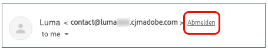
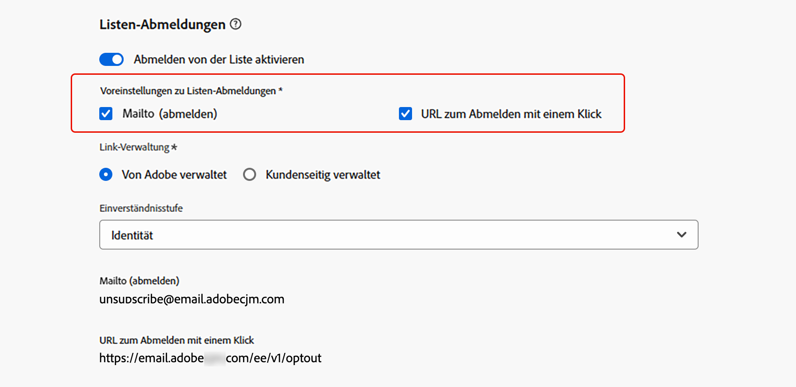

# Abmelden von der Liste{#list-unsubscribe}

<!--Do not modify - Legal Review Done -->

Beim Konfigurieren einer neuen E-Mail-Kanal-Konfiguration wird bei [Auswahl einer Subdomain](email-settings.md#subdomains-and-ip-pools) aus der Liste die Option **[!UICONTROL Listen-Abo aktivieren]** angezeigt.

## Abmelde-Liste aktivieren {#enable-list-unsubscribe}

Diese Option ist standardmäßig aktiviert, um eine URL zum Abmelden mit einem Klick in die E-Mail-Kopfzeile einzufügen, z. B.:

>[!NOTE]
>
>Wenn Sie diese Option deaktivieren, wird in der E-Mail-Kopfzeile keine URL zum Abmelden mit einem Klick angezeigt.

Die Abmelde-Kopfzeile einer Liste bietet zwei Optionen, die standardmäßig aktiviert sind, es sei denn, Sie deaktivieren eine oder beide Optionen:

{width="80%"}

* Eine Adresse **[!UICONTROL E-Mail an (abmelden)]**, bei der es sich um die Zieladresse handelt, an die Abmeldeanfragen zur automatischen Verarbeitung weitergeleitet werden.

  [!DNL Journey Optimizer] ist die Abmelde-E-Mail-Adresse die standardmäßig in der Kanalkonfiguration angezeigte **[!UICONTROL Mailto (unsubscribe]**-Adresse) und basiert auf Ihrer [ausgewählten Subdomain](#subdomains-and-ip-pools). <!--With this method, clicking the Unsubscribe link sends a pre-filled email to the unsubscribe address specified in the email header.-->

* Die **[!UICONTROL 1-Klick-Abmelde-URL]** ist standardmäßig die Kopfzeile der mit einem Klick-Opt-out-URL generierten Abmeldeliste, basierend auf der Subdomain, die Sie in den Kanalkonfigurationseinstellungen festgelegt und konfiguriert haben. <!--With this method, clicking the Unsubscribe link directly unsubscribes the user, requiring only a single action to unsubscribe.-->

Sie können die **[!UICONTROL Einverständnisstufe]** aus der entsprechenden Dropdown-Liste auswählen. Sie kann sich auf den Kanal oder die Profilidentität beziehen. Basierend auf dieser Einstellung wird das Einverständnis in [!DNL Adobe Journey Optimizer] aktualisiert, wenn ein Benutzer sich über die Abmelde-URL der Liste in der Kopfzeile einer E-Mail abmeldet, entweder auf Kanal- oder ID-Ebene.

Die Funktionen **[!UICONTROL E-Mail an (abmelden)]** und **[!UICONTROL URL zum Abmelden mit einem Klick]** sind optional. 

Wenn Sie nicht die standardmäßig generierte URL zum Abmelden mit einem Klick verwenden möchten, können Sie die Funktion deaktivieren. In einem Szenario, in dem die Option **[!UICONTROL Abmelden von der Liste aktivieren]** aktiviert ist und die Funktion **[!UICONTROL URL zum Abmelden mit einem Klick]** deaktiviert ist und ein [Ausschluss-Link mit einem Klick](../email/email-opt-out.md#one-click-opt-out) zu einer Nachricht hinzugefügt wird, die mit dieser Konfiguration erstellt wurde, nimmt die Option „Abmelde-Link in Kopfzeile“ den Link zum Abmelden mit einem Klick auf, den Sie im Textkörper der E-Mail eingefügt haben, und verwendet ihn als den URL-Wert zum Abmelden mit einem Klick.

>[!NOTE]
>
>Wenn Sie keinen Ein-Klick-Ausschluss-Link in den Nachrichteninhalt einfügen und die standardmäßige **[!UICONTROL URL zum Abmelden mit einem Klick]** in den Einstellungen der Kanalkonfiguration deaktiviert ist, wird keine URL als Teil des Abmelde-Links in der Kopfzeile in die E-Mail-Kopfzeile übernommen.

Weitere Informationen zur Verwaltung der Abmeldefunktionen in Ihren Nachrichten finden Sie in [diesem Abschnitt](../email/email-opt-out.md#unsubscribe-header).

## Abmeldedaten extern verwalten {#custom-managed}

>[!CONTEXTUALHELP]
>id="ajo_email_config_unsubscribe_custom"
>title="Definieren, wie Abmeldedaten verwaltet werden"
>abstract="**Adobe verwaltet**: Einverständnisdaten werden von Ihnen innerhalb des Adobe-Systems verwaltet. **Kundenseitig verwaltet**: Einverständnisdaten werden von Ihnen in einem externen System verwaltet und im Adobe-System wird keine Synchronisierung von Einverständnisdaten aktualisiert, es sei denn, sie werden von Ihnen initiiert."

>[!AVAILABILITY]
>
>Diese Funktion wird mit begrenzter Verfügbarkeit (Limited Availability, LA) für eine kleine Gruppe von Kundinnen und Kunden veröffentlicht.

Wenn Sie das Einverständnis außerhalb von Adobe verwalten, wählen Sie die Option **[!UICONTROL Vom Kunden verwaltet]**, um eine benutzerdefinierte Abmelde-E-Mail-Adresse und Ihre eigene Abmelde-URL mit einem Klick einzugeben.

{width="80%"}

>[!WARNING]
>
>Wenn Sie die Option **[!UICONTROL Vom Kunden verwaltet]** verwenden, speichert Adobe keine Abmelde- oder Einverständnisdaten. Mit der Option **[!UICONTROL Vom Kunden verwaltet]** entscheiden sich Unternehmen für die Verwendung eines externen Systems und sind für die Verwaltung ihrer Einverständnisdaten in diesem externen System verantwortlich. Es gibt keine automatische Synchronisierung von Einverständnisdaten zwischen dem externen System und [!DNL Journey Optimizer]. Jede Synchronisierung von Einverständnisdaten, die aus dem externen System zur Aktualisierung von Benutzereinverständnisdaten in [!DNL Journey Optimizer] stammen, muss von der Organisation als Datenübertragung initiiert werden, um die Einverständnisdaten wieder in [!DNL Journey Optimizer] zu übertragen.

### Konfigurieren der Entschlüsselungs-API {#configure-decrypt-api}

Wenn Sie bei ausgewählter Option **[!UICONTROL Vom Kunden verwaltet]** benutzerdefinierte Endpunkte eingeben und in einer Kampagne oder auf einer Journey verwenden, fügt [!DNL Journey Optimizer] einige standardmäßige profilspezifische Parameter an das Einverständnisaktualisierungsereignis an (<!--sent to the custom endpoint --> Ihre Empfänger auf den Abmelde-Link klicken).

Diese Parameter werden verschlüsselt an den Endpunkt gesendet. Daher muss das externe Einverständnissystem eine bestimmte API über [Adobe Developer implementieren](https://developer.adobe.com){target="_blank"} um die von Adobe gesendeten Parameter zu entschlüsseln.

Der GET-Aufruf zum Abrufen dieser Parameter hängt von der von Ihnen verwendeten Option zur Abmeldung von der Liste ab - **[!UICONTROL URL zum Abmelden mit einem Klick]** oder **[!UICONTROL Mailto (Abmelden)]**.

<!--To configure the API to send back the information to [!DNL Adobe Journey Optimizer] when a recipient has unsubscribed using the List unsubscribe option with custom endpoints, follow the steps below.-->

+++ Abmelde-URL mit einem Klick

Mit der Option **[!UICONTROL URL zum Abmelden mit einem Klick]** wird der Benutzer durch Klicken auf den Abmelde-Link direkt abgemeldet.

Der GET-Aufruf lautet wie folgt:

Endpunkt: https://platform.adobe.io/journey/imp/consent/decrypt

Abfrageparameter:

* **params**: enthält die verschlüsselte Payload
* **pid**: verschlüsselte Profil-ID

Diese beiden Parameter werden in das Einverständnisaktualisierungsereignis aufgenommen, das an die benutzerdefinierten Endpunkte gesendet wird.

Header-Anforderungen:

* x-api-key
* x-gw-ims-org-id
* authorization (Benutzer-Token Ihres technischen Accounts)

+++

+++ Mailto (abmelden)

Bei der Option **[!UICONTROL Mailto (unsubscribe)]** wird durch Klicken auf den Abmelde-Link eine vorgefüllte E-Mail an die angegebene Abmelde-Adresse gesendet.

Der GET-Aufruf lautet wie folgt.

Endpunkt: https://platform.adobe.io/journey/imp/consent/decrypt

Abfrageparameter:

* **emailParams**: Zeichenfolge, die die Parameter **params** (verschlüsselte Payload) und **pid** (verschlüsselte Profil-ID) enthält.

Die Parameter **params** und **pid** werden in das Einverständnisaktualisierungsereignis aufgenommen, das an die benutzerdefinierten Endpunkte gesendet wird.

Header-Anforderungen:

* x-api-key
* x-gw-ims-org-id
* authorization (Benutzer-Token Ihres technischen Accounts)

+++
