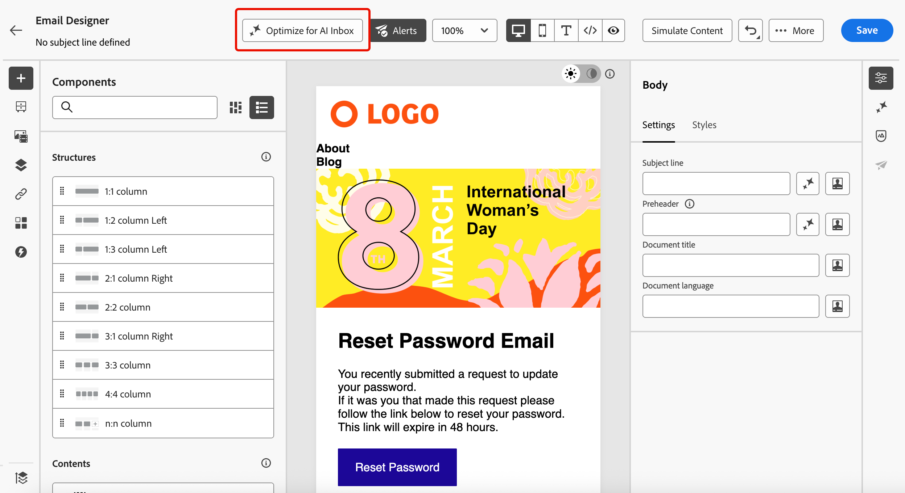
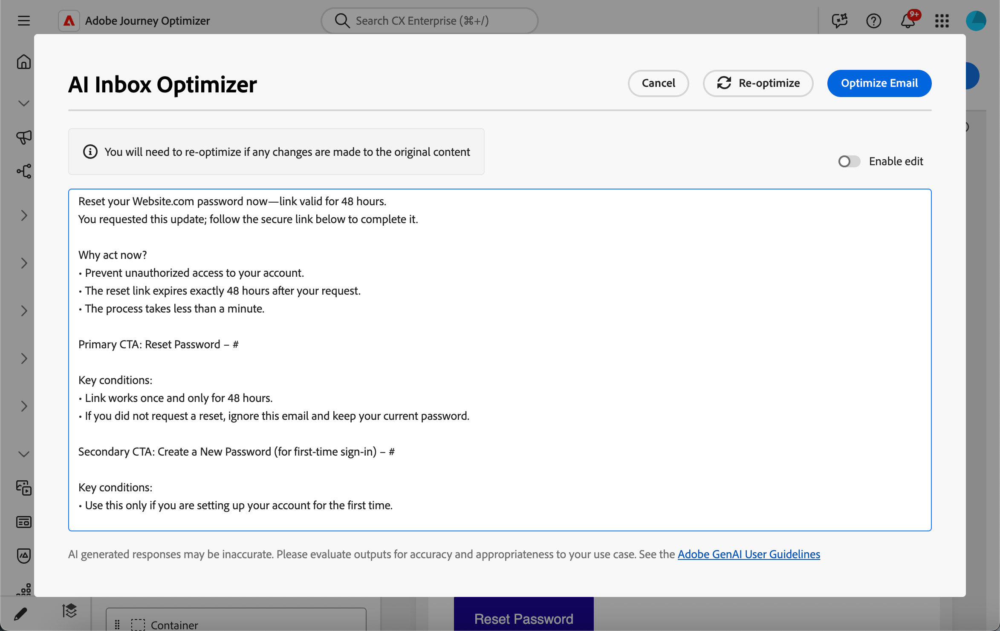
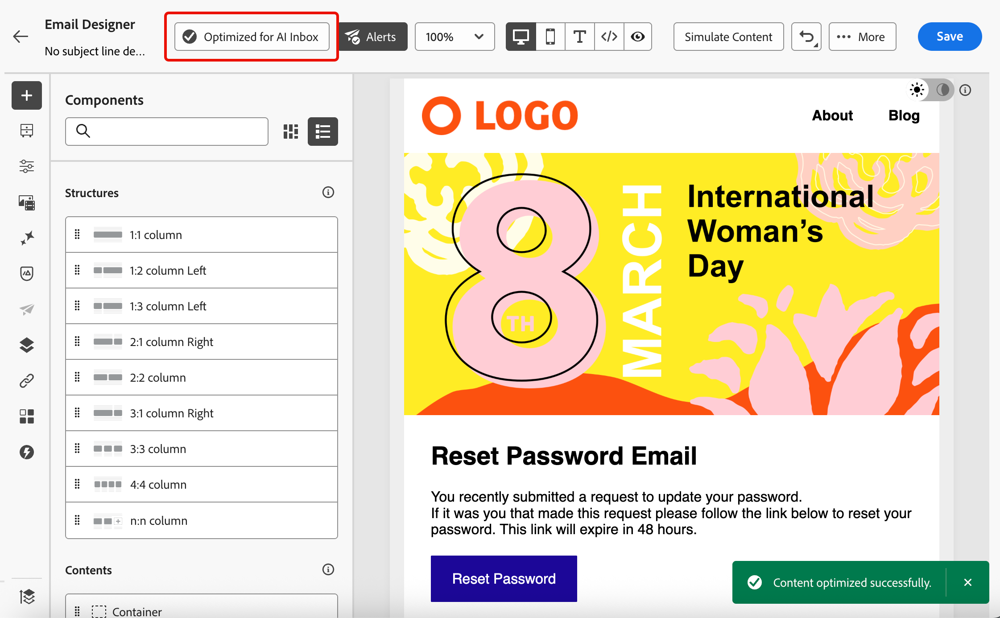

# Optimieren von E-Mails für KI-Posteingänge {#email-text-optimizer}

>[!BEGINSHADEBOX]

**Auf dieser Seite:** Erfahren Sie, wie Sie eine dedizierte Version Ihrer E-Mail in der E-Mail-Designer generieren und verfeinern können, damit KI-unterstützte Posteingangskunden ihre Zusammenfassungen und Antworten in Ihren Angeboten und Aktionsaufrufen verfeinern.

>[!ENDSHADEBOX]

[!DNL Adobe Journey Optimizer] verfügt über eine E-Mail-Kanal-Funktion, mit der Sie eine bestimmte Version Ihrer Nachrichten strukturieren können, um die KI-gestützten Posteingangserlebnisse zu verbessern - z. B. [!DNL Apple Intelligence] und [!DNL Google Gemini] in [!DNL Gmail] -, damit E-Mails anhand Ihres Inhalts präziser beantwortet und mit besseren Ergebnissen zusammengefasst werden können.

Sie können diese Funktion verwenden, um eine dedizierte Version Ihrer Nachrichten zu generieren und zu verfeinern, sodass KI-unterstützte Posteingangserlebnisse mit höherer Wahrscheinlichkeit die Angebote, Aktionsaufrufe und Details, die Sie beabsichtigen, aufdecken, anstatt automatisch generierten Text oder nicht verwandten Kontext zu verdünnen.

<!--
>[!NOTE]
>
>This optimized for AI inboxes text version is not the same as the default or custom plain text version of your messages. [Learn more](text-version-email.md)
-->

## Funktionsweise {#how-it-works}

Zu den typischen Fragen, die Empfangende in KI-unterstützten Posteingängen stellen können, gehören *Worum geht es in dieser E-Mail?* oder *Was sind diese Angebote?*.

* Die Antworten dieser KI-Assistenten können eine kurze Zusammenfassung sein (z. B., dass die Nachricht werblich ist, einen frühzeitigen Zugriff auf VIP und einen Verkauf erwähnt und Links zu Produktkategorien enthält). Sie lassen jedoch die Ziele aus, die dem Marketing-Experten wichtig waren, da die Assistenten aus dem tatsächlich angezeigten Text ableiten - nicht unbedingt aus der ganzen Story, die Sie beabsichtigt hatten.

* Außerdem können die Assistenten proaktiv nach Rabatten oder Coupons im Zusammenhang mit der Marke suchen und diese in die Antwort einfließen lassen, sodass der Benutzer nicht mehr nur das sieht, was Ihre Nachricht tatsächlich versprochen hat. Dieses Verhalten ist für Endbenutzende nützlich, beeinträchtigt aber die Kontrolle für Marketing-Fachleute, die Antworten benötigen, um die tatsächlichen Begriffe beim Versand zu verfolgen.

Um diese Probleme zu vermeiden, erstellt [!DNL Journey Optimizer] eine zusätzliche spezifische Version Ihrer Nachrichten, sodass Coupons, Rabattbereiche, Aktionsaufrufe und andere Prioritäten in einer klaren linearen Kopie im Voraus angezeigt werden. <!--This version is different from the HTML view and default or custom plain text version of your messages.-->

Ziel ist es, dass die KI des Posteingangs Zusammenfassungen und Fragen und Antworten in Ihren definierten Angeboten und Aktionen erstellt, anstatt sich auf einen dünnen Standardtextteil oder auf nicht verwandte Web-Ergebnisse zu stützen.

>[!IMPORTANT]
>
>Das genaue Verhalten der KI-Assistenten hängt vom Posteingangsanbieter und der Modellversion ab. Nachdem Ihre E-Mail zugestellt wurde, können Antworten und Zusammenfassungen, die von externen KI-Clients bereitgestellt werden, falsch, unvollständig oder mit Web-Ergebnissen vermischt sein.
>
>Die Funktion E-Mail für KI-Posteingänge optimieren generiert nur eine dedizierte Version in Journey Optimizer. Es ist nicht garantiert, wie ein Drittanbieterassistent die Nachricht interpretiert oder anzeigt. Erfahren Sie mehr über [Einschränkungen und Risiken der Posteingangshilfe von Drittanbietern](#inbox-ai-risks).

## Empfohlene Anwendungsfälle {#use-cases}

<!--
* **Critical details only in images** — Offers, promo codes, or deadlines shown in banners or graphics are invisible in plain text. Use the optimizer (and manual edits) so the same facts appear as text, improving extraction by AI summaries and text-only clients.
-->

* **Dichte oder fragmentierte Inhalte** - Wenn der Inhalt der E-Mail schwer zu scannen ist, kann die Optimierung eine klarere lineare Erzählung mit expliziten Angeboten und Links erzeugen.

* **Steuern des Posteingangs** - Wenn Sie erwarten, dass Empfänger Assistenten fragen *worum es bei der E-Mail geht* oder *was die Angebote sind*, reduziert eine für KI optimierte Version Teilzusammenfassungen und vermeidet die Abhängigkeit von Web-ergänzten Antworten, die nicht an Ihre genehmigte Kopie gebunden sind.

## Für KI-Posteingangserlebnisse optimieren {#optimize-with-ai}

>[!IMPORTANT]
>
>Bevor Sie diese Funktion verwenden, lesen Sie die entsprechenden [Risiken und Einschränkungen](#inbox-ai-risks).
>
>Um auf diese Funktion zugreifen zu können, müssen Sie einer Benutzervereinbarung zustimmen, die angezeigt wird, wenn Sie Generative AI in [!DNL Journey Optimizer] zum ersten Mal verwenden. Weitere Informationen finden Sie in den [Benutzerrichtlinien für die generative KI von Adobe Experience Cloud](https://www.adobe.com/de/legal/licenses-terms/adobe-gen-ai-user-guidelines.html){target="_blank"}.

Gehen Sie wie folgt vor, um den Inhalt Ihrer E-Mail für KI-Posteingangserlebnisse mit [!DNL Journey Optimizer] zu optimieren.

1. Öffnen Sie Ihre E-Mail in [E-Mail-Designer](content-from-scratch.md) (über eine Kampagne, Journey oder Vorlage, je nach Workflow).

1. Klicken Sie auf **[!UICONTROL Schaltfläche „Für KI-Posteingang optimieren]**, um eine verbesserte Version zu generieren, die wichtige Informationen für das KI-gestützte Lesen und Zusammenfassen hervorhebt.

   {zoomable="yes" width="80%"}

1. Wenn Sie in [!DNL Journey Optimizer] zum ersten Mal generative KI verwenden, werden Sie aufgefordert, der Benutzervereinbarung zuzustimmen. Weitere Informationen finden Sie in den [Benutzerrichtlinien für die generative KI von Adobe](https://www.adobe.com/de/legal/licenses-terms/adobe-gen-ai-user-guidelines.html){target="_blank"}.

   {width=50%}

   Klicken Sie **[!UICONTROL Zustimmen]**, um fortzufahren.

1. Die generierte Version wird im Fenster **[!UICONTROL AI Inbox Optimizer]** angezeigt.

   {zoomable="yes" width="80%"}

   >[!NOTE]
   >
   >Die optimierte Version unterscheidet sich von der HTML- und Textansicht Ihrer E-Mail. Das Design, Layout oder Bilder werden nicht geändert.

1. Um den automatisch generierten Inhalt zu bearbeiten, wählen Sie den Umschalter **[!UICONTROL Bearbeiten aktivieren]** aus und nehmen Sie bei Bedarf manuelle Änderungen vor.

1. Sobald Sie mit Ihrer Version zufrieden sind, klicken Sie zur Bestätigung auf **[!UICONTROL E-Mail]** Optimieren). Sie können auch die Schaltfläche **[!UICONTROL Neu optimieren]** verwenden, um eine neue Version zu generieren.

1. Sie werden zur Ansicht **[!UICONTROL HTML]** umgeleitet und Ihre E-Mail ist jetzt erfolgreich für KI-Posteingänge optimiert. Um erneut auf die optimierte Version zuzugreifen oder sie zu bearbeiten, klicken Sie auf die Schaltfläche **[!UICONTROL Für KI-Posteingang optimiert]**.

   {zoomable="yes" width="80%"}

1. Die optimierte Version wird angezeigt. Sie können **[!UICONTROL Optimierung entfernen]** oder auf **[!UICONTROL Neu optimieren]** klicken, um eine neue Version zu generieren.

   {zoomable="yes" width="80%"}

   >[!NOTE]
   >
   >Wenn Sie Änderungen am ursprünglichen HTML-Inhalt vornehmen, müssen Sie die generierte Version für KI-Posteingänge neu optimieren, damit sie mit dem neuen Inhalt übereinstimmt.

## Risiken und Einschränkungen von Drittanbieter-Posteingang-KI {#inbox-ai-risks}

Mit der Funktion „E-Mail für KI-Posteingänge optimieren“ können Sie eine Version Ihrer E-Mail darauf vorbereiten, wie Postfachanbieter Ihre [!DNL Journey Optimizer] verarbeiten können. Sie kontrolliert nicht die Produkte dieser Anbieter. Nach dem Versand einer Nachricht werden alle KI-Funktionen in [!DNL Gmail], [!DNL Apple] Mail, [!DNL Outlook] oder anderen Clients nach ihren Bedingungen, Modellen und Richtlinien ausgeführt - nicht nach den Richtlinien von Adobe.

* **Unvorhersehbare Präsentation** - Zusammenfassungen, Benachrichtigungs-Blurbs und dialogorientierte Antworten können Angebote, Preise oder Datumsangaben weglassen, Inhalte mit nicht verwandten Web-Ergebnissen zusammenführen oder auf eine Weise umschreiben, die nicht mehr mit Ihrer genehmigten Kopie übereinstimmt. Dieses Verhalten kann sich ändern, wenn Anbieter Modelle oder die Benutzeroberfläche ohne Vorankündigung aktualisieren.

* **Keine Gewähr für Parität mit HTML** - Empfängerinnen und Empfänger, die auf Vorschauen oder Hilfsantworten angewiesen sind, sehen möglicherweise nie Ihr vollständiges HTML-Design, Ihre Bilder oder Ihre rechtlichen Fußzeilen. Was sie glauben, dass die Nachricht „sagt“, kommt möglicherweise nur aus einem kurzen KI-generierten Auszug.

* **Datenschutz, Compliance und Datennutzung** - Die KI des Posteingangs kann Nachrichteninhalte in der Infrastruktur des Anbieters verarbeiten, wobei die Datenschutzrichtlinie, die Aufbewahrung und die regionalen Regeln dieses Anbieters zu beachten sind. Organisationen in regulierten Branchen sollten unabhängig davon, wie die E-Mail in [!DNL Journey Optimizer] verfasst wurde, bewerten, ob die Verwendung solcher Funktionen durch Empfänger ihre Verpflichtungen beeinträchtigt.

* **Marken- und rechtliche Offenlegung** - Falsche oder unvollständige KI-Zusammenfassungen können bei Kunden weiterhin Verwirrung oder Streitigkeiten über Werbeaktionen, Bedingungen oder die Sprache zum Opt-out hervorrufen. [!DNL Journey Optimizer] stellt nicht sicher, dass das Modell eines Drittanbieters die optimierte Version Ihrer E-Mail zuverlässig reproduziert.

* **[!UICONTROL Für KI-Posteingang optimieren]** in [!DNL Journey Optimizer] - Die Steuerung der Bearbeitungszeit in der E-Mail-Designer ist getrennt von den Posteingangsassistenten für Endbenutzer. Generierte Inhalte werden vor dem Versand immer überprüft.

## Verwandte Themen {#related-topics}

* [Erste Schritte mit E-Mail-Design](get-started-email-design.md)
* Allgemeine Informationen zu Adobe-Funktionen finden Sie unter [Erste Schritte mit dem KI-Assistenten zum Erstellen von Inhalten](../content-management/gs-generative.md).
