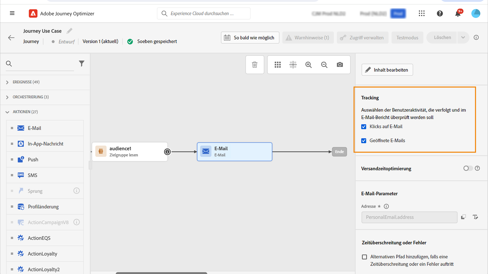
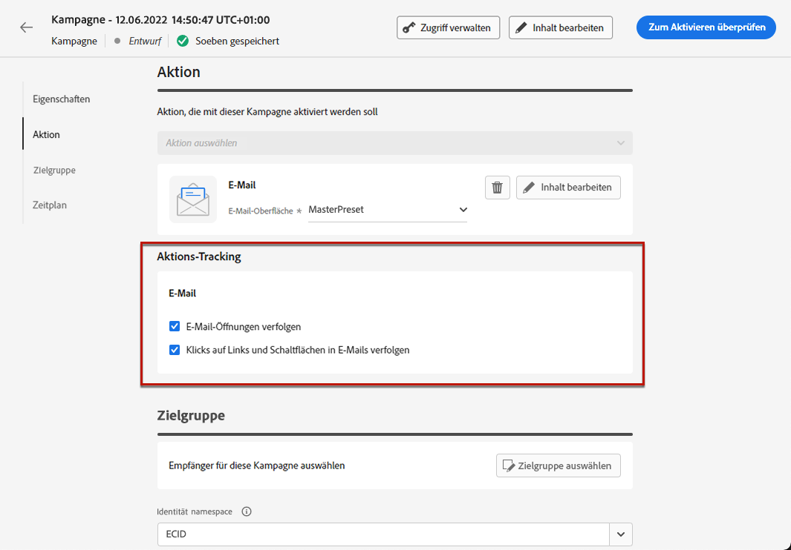
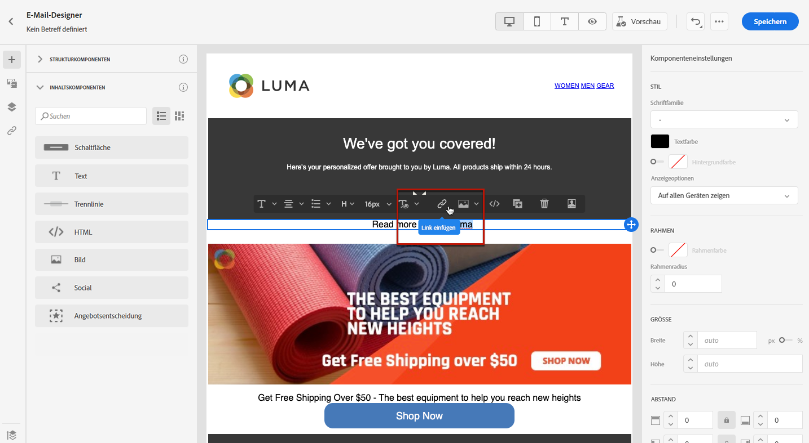
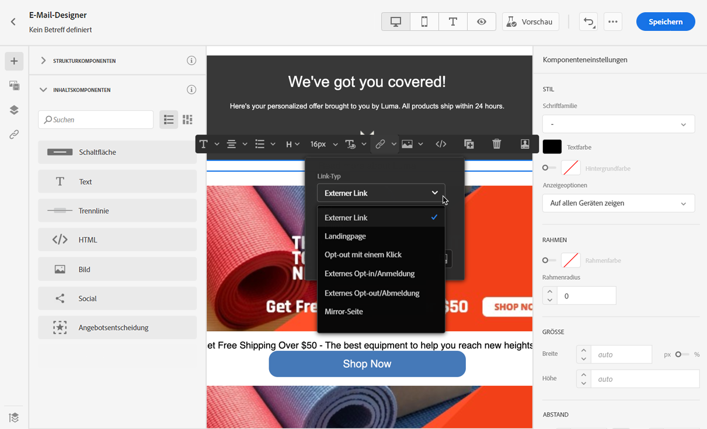
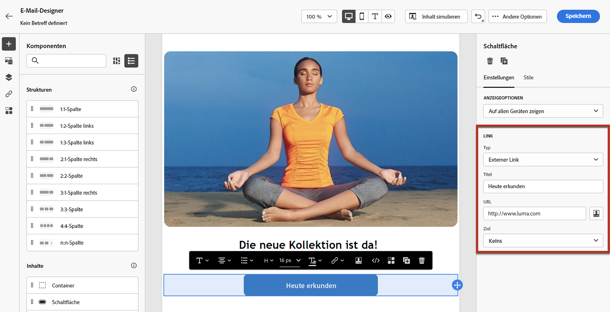
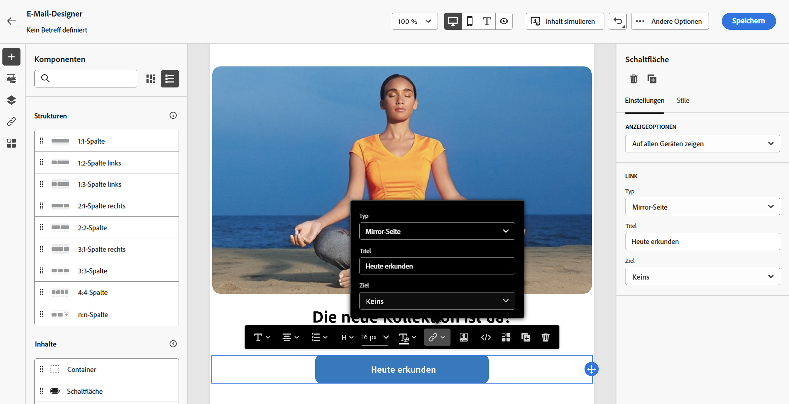
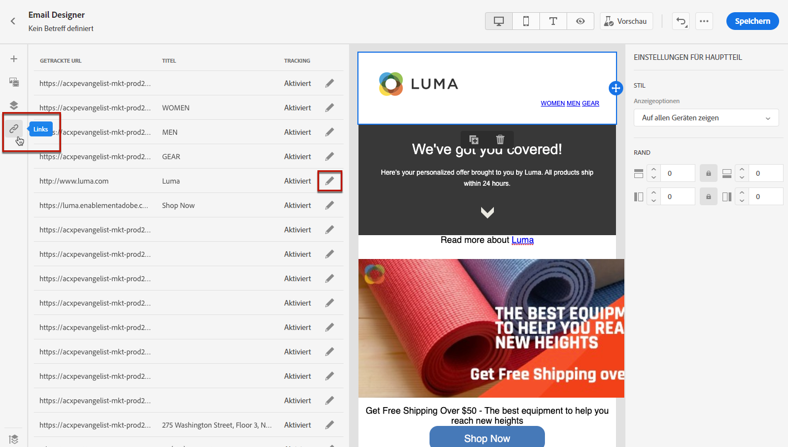
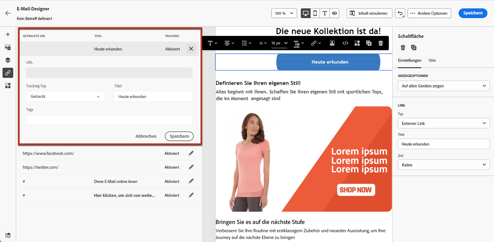

# Hinzufügen von Links und Verfolgen von Nachrichten {#tracking}

Verwenden Sie [!DNL Journey Optimizer], um Links zu Ihrem Inhalt hinzuzufügen und die gesendeten Nachrichten zu verfolgen, um das Verhalten Ihrer Empfänger zu überwachen.

## Tracking aktivieren {#enable-tracking}

Sie können das Tracking einer E-Mail-Nachricht aktivieren, indem Sie die Optionen **[!UICONTROL Geöffnete E-Mails]** und/oder **[!UICONTROL Klick in E-Mail]** markieren, wenn Sie Ihre Nachricht in einer Journey oder Kampagne erstellen.

>[!BEGINTABS]

>[!TAB Aktivieren des Trackings in einer Journey]

>[!TAB Aktivieren des Trackings in einer Kampagne]

>[!ENDTABS]

>[!NOTE]
>
>Beide Optionen sind standardmäßig aktiviert.

Auf diese Weise können Sie das folgende Verhalten Ihrer Empfänger verfolgen:

* **[!UICONTROL Geöffnete E-Mails]**: Nachrichten, die geöffnet wurden.
* **[!UICONTROL Klick in E-Mail]**: Klicks auf Links in einer E-Mail.

## Links einfügen {#insert-links}

Beim Entwerfen einer Nachricht können Sie Links zu Ihren Inhalten hinzufügen.

>[!NOTE]
>
>Wenn das [Tracking aktiviert ist](#enable-tracking), werden alle im Nachrichteninhalt enthaltenen Links verfolgt.

Gehen Sie wie folgt vor, um Links in Ihren E-Mail-Inhalt einzufügen:

1. Wählen Sie zuerst ein Element aus und danach in der dedizierten Symbolleiste die Option **[!UICONTROL Link einfügen]**.

   

1. Wählen Sie den gewünschten Link-Typ aus.

   * **[!UICONTROL Externer Link]**: Fügen Sie einen Link auf eine externe URL ein.

   * **[!UICONTROL Landingpage]**: Fügen Sie einen Link zu einer Landingpage ein. Weiterführende Informationen finden Sie in [diesem Abschnitt](../landing-pages/get-started-lp.md).

   * **[!UICONTROL Opt-out mit einem Klick]**: Einfügen eines Links, mit dem sich Nutzer schnell von Ihren Mitteilungen abmelden können, ohne die Abmeldung bestätigen zu müssen. Weiterführende Informationen finden Sie in [diesem Abschnitt](../privacy/opt-out.md#one-click-opt-out).

   * **[!UICONTROL Externes Opt-in/Abonnement]**: Einfügen eines Links, um den Erhalt von Nachrichten von Ihrer Marke zu akzeptieren.

   * **[!UICONTROL Externes Opt-out/Abmeldung]**: Einfügen eines Links, über den man sich vom Erhalt von Nachrichten Ihrer Marke abmelden kann. Weitere Informationen zur Opt-out-Verwaltung finden Sie in [diesem Abschnitt](../privacy/opt-out.md#opt-out-management).

   * **[!UICONTROL Mirrorseite]**: Fügen Sie einen Link ein, um den E-Mail-Inhalt in einem Webbrowser anzuzeigen. Weiterführende Informationen finden Sie in [diesem Abschnitt](#mirror-page).

   

1. Sie können Ihre Links personalisieren. Weitere Informationen zu personalisierten URLs finden Sie in [diesem Abschnitt](../personalization/personalization-syntax.md#perso-urls).

1. Speichern Sie Ihre Änderungen.

1. Sie können auch nach dem Erstellen des Links noch Änderungen im Bereich der **[!UICONTROL Komponenteneinstellungen]** auf der rechten Seite vornehmen.

   * Sie können den Link bearbeiten und seinen Typ ändern.
   * Sie können durch Aktivieren der entsprechenden Option auswählen, ob der Link unterstrichen werden soll oder nicht.

   

>[!NOTE]
>
>E-Mail-Nachrichten vom Typ Marketing müssen einen [Ausschluss-Link](../privacy/opt-out.md#opt-out-management) enthalten, der für Transaktionsnachrichten nicht erforderlich ist. Die Kategorie der Nachricht (**[!UICONTROL Marketing]** oder **[!UICONTROL Transaktion]**) wird auf Ebene der [Kanaloberfläche](../configuration/channel-surfaces.md#email-type) (d. h. Nachrichtenvoreinstellung) und bei der Erstellung der Nachricht definiert.

## Link zu einer Mirrorseite {#mirror-page}

Bei der Mirrorseite handelt es sich um eine HTML-Seite, auf die online über einen Webbrowser zugegriffen werden kann. Der Inhalt entspricht dem Inhalt Ihrer E-Mail.

Um Ihrer E-Mail einen Link zu einer Mirrorseite hinzuzufügen, fügen Sie [einen Link](#insert-links) ein und wählen Sie **[!UICONTROL Mirrorseite]** als Link-Typ aus.

Die Mirrorseite wird automatisch erstellt.

>[!IMPORTANT]
>
>Links zu Mirror-Seiten werden automatisch generiert und können nicht bearbeitet werden. Sie enthalten alle verschlüsselten personalisierten Daten, die zum Rendern der ursprünglichen E-Mail erforderlich sind. Daher kann die Verwendung personalisierter Attribute mit großen Werten zu langen Mirror-Seiten-URLs führen, was verhindert, dass der Link in Webbrowsern mit einer begrenzten URL-Länge funktioniert.

Wenn die Empfänger nach dem Versand der E-Mail auf den Mirrorseiten-Link klicken, wird der Inhalt der E-Mail in ihrem Standard-Webbrowser angezeigt.

>[!NOTE]
>
>Im [Testversand](preview.md#send-proofs) an die Testprofile ist der Link zur Mirrorseite nicht aktiv. Er wird erst in den endgültigen Nachrichten aktiviert.

Die Aufbewahrungsfrist für eine Mirrorseite beträgt 60 Tage. Nach dieser Frist ist die Mirrorseite nicht mehr verfügbar.

## Tracking verwalten {#manage-tracking}

Mit [E-Mail-Designer](content-from-scratch.md) können Sie die verfolgten URLs verwalten, z. B. den Tracking-Typ für jeden Link bearbeiten.

1. Klicken Sie auf das Symbol **[!UICONTROL Links]** im linken Bereich, um die Liste aller URLs Ihres Inhalts, die verfolgt werden sollen, anzuzeigen.

   Diese Liste bietet einen guten Überblick und ermöglicht das Auffinden aller im E-Mail-Inhalt vorhandenen URLs.

1. Um einen Link zu bearbeiten, wählen Sie das entsprechende Stiftsymbol aus.

   

1. Sie können den **[!UICONTROL Tracking-Typ]** bei Bedarf ändern:

   

   Für jede verfolgte URL können Sie einen der folgenden Tracking-Modi festlegen:

   * **[!UICONTROL Verfolgt]**: Aktiviert das Tracking dieser URL.
   * **[!UICONTROL Opt-out]**: Diese URL wird als Opt-out- oder Abmelde-URL behandelt.
   * **[!UICONTROL Mirrorseite]**: Diese URL wird als Mirror-Seite behandelt.
   * **[!UICONTROL Nie]**: Das Tracking dieser URL wird nie aktiviert. <!--This information is saved: if the URL appears again in a future message, its tracking is automatically deactivated.-->

Das Reporting zu Öffnungen und Klicks ist im [Live-Bericht](../reports/live-report.md) und im [Globalen Bericht](../reports/global-report.md) verfügbar.
