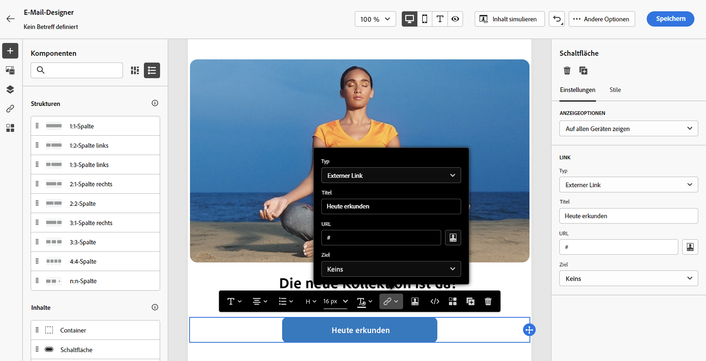

# Links hinzufügen und Nachrichten verfolgen {#tracking}

Verwendung [!DNL Journey Optimizer] um Links zu Ihrem Inhalt hinzuzufügen und die gesendeten Nachrichten zu verfolgen, um das Verhalten Ihrer Empfänger zu überwachen.

## Tracking aktivieren {#enable-tracking}

Sie können das Tracking auf E-Mail-Meldungsebene aktivieren, indem Sie die Option **[!UICONTROL Email opens]** und/oder **[!UICONTROL Click on email]** Optionen beim Erstellen Ihrer Nachricht in einer Journey oder Kampagne.

>[!BEGINTABS]

>[!TAB Tracking in einer Journey aktivieren]

>[!TAB Tracking in einer Kampagne aktivieren]

>[!ENDTABS]

>[!NOTE]
>
>Beide Optionen sind standardmäßig aktiviert.

Auf diese Weise können Sie das Verhalten Ihrer Empfänger verfolgen:

* **[!UICONTROL Email opens]**: Nachrichten, die geöffnet wurden.
* **[!UICONTROL Click on email]**: Klicks auf Links in einer E-Mail.

## Links einfügen {#insert-links}

Beim Erstellen einer Nachricht können Sie Links zu Ihrem Inhalt hinzufügen.

>[!NOTE]
>
>Wann [Tracking ist aktiviert](#enable-tracking), werden alle im Nachrichteninhalt enthaltenen Links verfolgt.

Gehen Sie wie folgt vor, um Links in Ihren E-Mail-Inhalt einzufügen:

1. Element auswählen und auf **[!UICONTROL Insert link]** in der dedizierten Symbolleiste.

   

1. Wählen Sie den Typ des zu erstellenden Links aus:

   * **[!UICONTROL External link]**: Fügen Sie einen Link zu einer externen URL ein.

   * **[!UICONTROL Landing page]**: Fügen Sie einen Link zu einer Landingpage ein. Weitere Informationen finden Sie unter [diesem Abschnitt](../landing-pages/get-started-lp.md)

   * **[!UICONTROL One click Opt-out]**: Fügen Sie einen Link ein, über den sich Benutzer schnell von Ihrer Nachricht abmelden können, ohne sich abmelden zu müssen. Weitere Informationen finden Sie unter [diesem Abschnitt](../privacy/opt-out.md#one-click-opt-out).

   * **[!UICONTROL External Opt-in/Subscription]**: Fügen Sie einen Link ein, um den Erhalt von Nachrichten Ihrer Marke zu akzeptieren.

   * **[!UICONTROL External Opt-out/Unsubscription]**: Fügen Sie einen Link ein, um sich vom Erhalt von Nachrichten Ihrer Marke abzumelden. Erfahren Sie mehr über die Opt-out-Verwaltung in [diesem Abschnitt](../privacy/opt-out.md#opt-out-management).

   * **[!UICONTROL Mirror page]**: Fügen Sie einen Link ein, um den E-Mail-Inhalt in einem Webbrowser anzuzeigen. Weitere Informationen finden Sie unter [diesem Abschnitt](#mirror-page).

   

1. Sie können Ihre Links personalisieren. Weitere Informationen zu personalisierten URLs finden Sie unter [diesem Abschnitt](../personalization/personalization-syntax.md#perso-urls).

1. Speichern Sie Ihre Änderungen.

1. Nachdem der Link erstellt wurde, können Sie ihn dennoch im **[!UICONTROL Component settings]** rechts.

   * Sie können den Link bearbeiten und seinen Typ ändern.
   * Sie können den Link unterstreichen oder nicht, indem Sie die entsprechende Option aktivieren.

   

>[!NOTE]
>
>E-Mail-Nachrichten vom Typ Marketing müssen eine [Ausschluss-Link](../privacy/opt-out.md#opt-out-management), was für Transaktionsnachrichten nicht erforderlich ist. Die Kategorie der Nachricht (**[!UICONTROL Marketing]** oder **[!UICONTROL Transactional]**) definiert wird unter [Kanaloberfläche](../configuration/channel-surfaces.md#email-type) (d. h. Nachrichtenvorgabe) und beim Erstellen der Nachricht.

## Link zu einer Mirrorseite {#mirror-page}

Die Mirrorseite ist eine HTML-Seite, auf die online über einen Webbrowser zugegriffen werden kann. Der Inhalt entspricht dem Inhalt Ihrer E-Mail.

So fügen Sie in Ihrer E-Mail einen Link zu einer Mirrorseite hinzu: [Link einfügen](#insert-links) und wählen Sie **[!UICONTROL Mirror page]** als Typ des Links.

Die Mirrorseite wird automatisch erstellt.

>[!IMPORTANT]
>
>Mirrorseiten-Links werden automatisch generiert und können nicht bearbeitet werden. Sie enthalten alle verschlüsselten personalisierten Daten, die zum Rendern der ursprünglichen E-Mail erforderlich sind. Daher kann die Verwendung personalisierter Attribute mit großen Werten zu langen Mirrorseiten-URLs führen, was verhindert, dass der Link in Webbrowsern mit einer maximalen URL-Länge funktioniert.

Wenn die Empfänger nach dem Versand der E-Mail auf den Mirrorseiten-Link klicken, wird der Inhalt der E-Mail in ihrem Standard-Webbrowser angezeigt.

>[!NOTE]
>
>Im [proof](preview.md#send-proofs) an die Testprofile gesendet wurde, ist der Link zur Mirrorseite nicht aktiv. Sie wird nur in den endgültigen Nachrichten aktiviert.

Die Aufbewahrungsfrist für eine Mirrorseite beträgt 60 Tage. Nach dieser Verzögerung ist die Mirrorseite nicht mehr verfügbar.

## Tracking verwalten {#manage-tracking}

Die [Email Designer](content-from-scratch.md) ermöglicht Ihnen die Verwaltung der getrackten URLs, z. B. die Bearbeitung des Trackingtyps für jeden Link.

1. Klicken Sie auf **[!UICONTROL Links]** im linken Bereich, um die Liste aller getrackten URLs Ihres Inhalts anzuzeigen.

   Diese Liste ermöglicht eine zentrale Ansicht und die Lokalisierung der einzelnen URLs im E-Mail-Inhalt.

1. Um einen Link zu bearbeiten, klicken Sie auf das entsprechende Stiftsymbol.

   

1. Sie können die **[!UICONTROL Tracking Type]** bei Bedarf:

   

   Für jede getrackte URL können Sie den Tracking-Modus auf einen der folgenden Werte einstellen:

   * **[!UICONTROL Tracked]**: Aktiviert das Tracking dieser URL.
   * **[!UICONTROL Opt out]**: Betrachtet diese URL als Ausschluss- oder Abmelde-URL.
   * **[!UICONTROL Mirror page]**: betrachtet diese URL als Mirrorseiten-URL.
   * **[!UICONTROL Never]**: Aktiviert nie das Tracking dieser URL. <!--This information is saved: if the URL appears again in a future message, its tracking is automatically deactivated.-->

Die Berichterstattung über Öffnungen und Klicks ist im [Live-Bericht](../reports/live-report.md) und im [Gesamtbericht](../reports/global-report.md).
