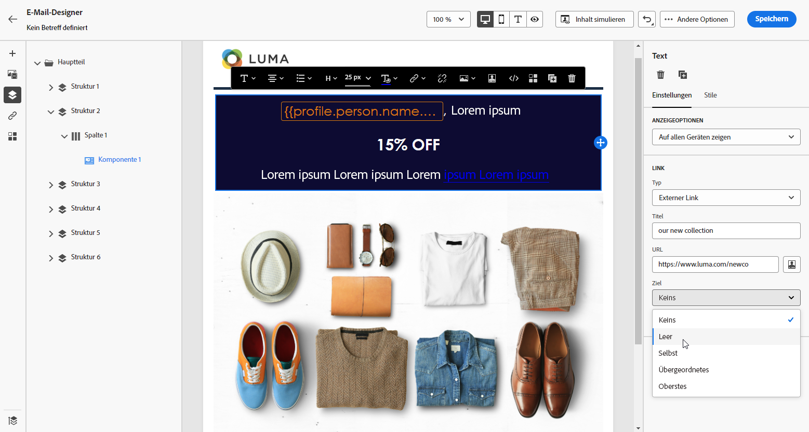

# Hinzufügen von Links und Verfolgen von Nachrichten {#tracking}

Verwenden Sie [!DNL Journey Optimizer], um Links zu Ihrem Inhalt hinzuzufügen und die gesendeten Nachrichten zu verfolgen, um das Verhalten Ihrer Empfänger zu überwachen.

## Tracking aktivieren {#enable-tracking}

Sie können das Tracking von E-Mail-Nachrichten aktivieren, indem Sie die Optionen **[!UICONTROL Geöffnete E-Mails]** und/oder **[!UICONTROL Klick in E-Mail]** markieren, wenn Sie Ihre Nachricht auf einer Journey oder in einer Kampagne erstellen, wie in den folgenden Registerkarten dargestellt:

>[!BEGINTABS]

>[!TAB Aktivieren des Trackings in einer Journey]

>[!TAB Aktivieren des Trackings in einer Kampagne]

>[!ENDTABS]

>[!NOTE]
>
>Beide Optionen sind standardmäßig aktiviert.

Wenn diese Optionen aktiviert sind, verfolgen Sie das Verhalten der Empfänger Ihrer Nachrichten:

* Die Metrik **[!UICONTROL E-Mail-Öffnungen]** überprüft, wie viele Nachrichten geöffnet wurden.
* Die Metrik **[!UICONTROL Klick in E]** Mail) berechnet die Anzahl der Klicks auf Links in einer E-Mail.

## Links einfügen {#insert-links}

Wenn das [Tracking aktiviert ist](#enable-tracking), werden alle im Nachrichteninhalt enthaltenen Links verfolgt.

Gehen Sie wie folgt vor, um Links in Ihren E-Mail-Inhalt einzufügen:

1. Wählen Sie ein Element (Text oder Bild) aus und klicken Sie **[!UICONTROL der kontextuellen Symbolleiste auf]** Link einfügen“.

   

1. Wählen Sie den gewünschten Link-Typ aus.

   * Wählen Sie **[!UICONTROL Externer Link]** aus, um einen Link auf eine externe URL einzufügen.

   * Wählen Sie **[!UICONTROL Landingpage]** aus, um einen Link zu einer Landingpage einzufügen. [Weitere Informationen](../landing-pages/get-started-lp.md)

   * Wählen Sie **[!UICONTROL Opt-out mit einem Klick]**, um einen Link einzufügen, über den sich Benutzer schnell von Ihren Nachrichten abmelden können, ohne die Abmeldung bestätigen zu müssen. [Weitere Informationen](email-opt-out.md#one-click-opt-out).

   * Wählen Sie **[!UICONTROL Externes Opt-in/Abonnement]** aus, um einen Link einzufügen, über den der Erhalt von Nachrichten von Ihrer Marke akzeptiert wird.

   * Wählen Sie **[!UICONTROL Externes Opt-out/Abmeldung]** aus, um einen Link einzufügen, über den man sich vom Erhalt von Nachrichten Ihrer Marke abmelden kann. Weitere Informationen zur Opt-out-Verwaltung finden Sie in [diesem Abschnitt](email-opt-out.md#opt-out-management).

   * Wählen Sie **[!UICONTROL Mirrorseite]** aus, um der E-Mail-Mirrorseite einen Link hinzuzufügen. [Weitere Informationen](#mirror-page)

1. Geben Sie die gewünschte URL in das entsprechende Feld ein oder wählen Sie eine Landingpage aus und definieren Sie die Link-Einstellungen und -Stile. [Weitere Informationen](#adjust-links)

   >[!NOTE]
   >
   >Zum Interpretieren von URLs hält sich [!DNL Journey Optimizer] an die URI-Syntax ([RFC 3986-Standard](https://datatracker.ietf.org/doc/html/rfc3986){target="_blank"}), sodass einige internationale Sonderzeichen in URLs unterbunden werden. Wenn beim Test- oder E-Mail-Versand ein Fehler im Zusammenhang mit einer URL zurückgegeben wird, die zu Ihrem Inhalt hinzugefügt wurde, können Sie für die Zeichenfolge eine URL-Codierung durchführen und so das Problem umgehen.

1. Sie können Ihre Links personalisieren. [Weitere Informationen](../personalization/personalization-syntax.md#perso-urls)

1. Speichern Sie Ihre Änderungen.

1. Sobald der Link erstellt ist, können Sie ihn in den Bereichen **[!UICONTROL Einstellungen]** und **[!UICONTROL Stile]** auf der rechten Seite noch ändern.

   

>[!NOTE]
>
>E-Mail-Nachrichten vom Typ Marketing müssen einen [Ausschluss-Link](../privacy/opt-out.md#opt-out-management) enthalten, der für Transaktionsnachrichten nicht erforderlich ist. Die Nachrichtenkategorie (**[!UICONTROL Marketing]** oder **[!UICONTROL Transaktion]**) wird beim Erstellen der Nachricht in der [Kanalkonfiguration](../configuration/channel-surfaces.md#email-type) definiert.

## Link zu einer Mirrorseite {#mirror-page}

Die Mirrorseite ist eine Online-Version Ihrer E-Mail. Es empfiehlt sich, einen Link zur Mirrorseite hinzuzufügen, um E-Mail-Marketing zu ermöglichen. Benutzerinnen und Benutzer können die Mirrorseite einer E-Mail aufrufen, etwa wenn bei der Anzeige in ihrem Posteingang Rendering-Probleme auftreten oder Bilder beschädigt sind. Es wird außerdem empfohlen, aus Gründen der Barrierefreiheit oder um zum Social Sharing zu ermutigen, eine Online-Version bereitzustellen.

Die von Adobe Journey Optimizer generierte Mirrorseite enthält alle Personalisierungsdaten.

Um Ihrer E-Mail einen Link zu einer Mirrorseite hinzuzufügen, fügen Sie [einen Link](#insert-links) ein und wählen Sie **[!UICONTROL Mirrorseite]** als Link-Typ aus.

Die Mirrorseite wird automatisch erstellt. Wenn die Empfänger nach dem Versand der E-Mail auf den Mirrorseiten-Link klicken, wird der Inhalt der E-Mail in ihrem Standard-Webbrowser angezeigt.

Die Beibehaltungsdauer für eine Mirrorseite beträgt **60 Tage**. Nach dieser Verzögerung ist die Mirrorseite nicht mehr verfügbar.

>[!CAUTION]
>
>* Links zu Mirrorseiten werden automatisch generiert und können nicht bearbeitet werden. Sie enthalten alle verschlüsselten personalisierten Daten, die zum Rendern der ursprünglichen E-Mail erforderlich sind. Daher kann die Verwendung personalisierter Attribute mit großen Werten zu langen Mirrorseiten-URLs führen, was verhindert, dass der Link in Webbrowsern mit einer begrenzten URL-Länge funktioniert.
>
>* Im [Testversand](../content-management/proofs.md) an die Testprofile ist der Link zur Mirrorseite nicht aktiv. Er ist nur in den endgültigen Nachrichten aktiv.

## Link-Erscheinungsbild und Ziel anpassen {#adjust-links}

Sie können Ihre Links anpassen, z. B. unterstreichen, ihre Farbe ändern oder ihre Zielgruppe auswählen.  Diese Änderungen werden in den Bereichen **[!UICONTROL Einstellungen]** und **[!UICONTROL Stile]** im rechten Abschnitt des Inhaltseditors festgelegt.

### Target {#link-target}

Das **target**-Attribut wird verwendet, um zu steuern, wo eine verknüpfte Seite geöffnet wird. Durch Hinzufügen eines Zielattributs in einem Anker-Tag kann angegeben werden, ob der Link in einer neuen Registerkarte, auf derselben Registerkarte oder in einem anderen Frame geöffnet werden soll.

Gehen Sie wie folgt vor, um das Ziel eines Links zu definieren:

1. Wählen Sie in einer **[!UICONTROL Text]**-Komponente, in die ein Link eingefügt ist, Ihren Link aus.

1. Wählen Sie auf **[!UICONTROL Registerkarte]** Einstellungen“ in der Dropdown-Liste **[!UICONTROL Ziel]** aus, wo der Link geöffnet werden soll. Mögliche Werte sind unten aufgeführt:

   * **[!UICONTROL None]**: öffnet den Link in demselben Frame, in dem er angeklickt wurde (Standardwert).
   * **[!UICONTROL Blank]**: öffnet den Link in einem neuen Fenster oder auf einer neuen Registerkarte.
   * **[!UICONTROL Self]**: öffnet den Link in demselben Frame, in dem er angeklickt wurde.
   * **[!UICONTROL Parent]**: öffnet den Link im übergeordneten Frame.
   * **[!UICONTROL Top]**: öffnet den Link im gesamten Fenster.

   

1. Speichern Sie Ihre Änderungen.

### Link unterstreichen {#link-underline}

Aktivieren Sie die **[!UICONTROL Link unterstreichen]**, um den Titel Ihres Links zu unterstreichen.

### Link-Farbe {#link-color}

Um die Farbe Ihres Links zu ändern, klicken Sie auf **[!UICONTROL Link-Farbe]** auf der Registerkarte **[!UICONTROL Stile]**.

## Tracking verwalten {#manage-tracking}

Mit [E-Mail-Designer](content-from-scratch.md) können Sie die verfolgten URLs verwalten, z. B. den Tracking-Typ für jeden Link bearbeiten.

1. Klicken Sie auf das Symbol **[!UICONTROL Links]** im linken Bereich, um die Liste aller URLs Ihres Inhalts, die verfolgt werden sollen, anzuzeigen.

   Diese Liste bietet einen guten Überblick und ermöglicht das Auffinden aller im E-Mail-Inhalt vorhandenen URLs.

1. Um einen Link zu bearbeiten, wählen Sie das entsprechende Stiftsymbol aus.

1. Sie können den **[!UICONTROL Tracking-Typ]** bei Bedarf ändern:

   

   Für jede verfolgte URL können Sie einen der folgenden Tracking-Modi festlegen:

   * **[!UICONTROL Verfolgt]**: Aktiviert das Tracking dieser URL.
   * **[!UICONTROL Opt-out]**: Diese URL wird als Opt-out- oder Abmelde-URL behandelt.
   * **[!UICONTROL Mirrorseite]**: Diese URL wird als Mirror-Seite behandelt.
   * **[!UICONTROL Nie]**: Das Tracking dieser URL wird nie aktiviert.

Reporting zu Öffnungen und Klicks ist im [Live-Bericht](../reports/live-report.md) und im [Customer Journey Analytics-Bericht](../reports/report-gs-cja.md) verfügbar.

## Personalisieren des URL-Trackings {#url-tracking}

Normalerweise wird das [URL-Tracking](email-settings.md#url-tracking) auf Konfigurationsebene verwaltet, Profilattribute werden jedoch nicht unterstützt. Die einzige Möglichkeit hierfür besteht derzeit darin, URLs im E-Mail-Designer zu [personalisieren](../personalization/personalization-syntax.md#perso-urls).

Gehen Sie wie folgt vor, um Ihren Links personalisierte URL-Tracking-Parameter hinzuzufügen.

1. Wählen Sie einen Link aus und klicken Sie in der kontextbezogenen Symbolleiste auf **[!UICONTROL Link einfügen]**.

1. Wählen Sie das Personalisierungssymbol aus. Das Personalisierungssymbol ist nur für folgende Arten von Links verfügbar: **externer Link**, **Abmelde-Link** und **Ausschluss-Link**.

   

1. Fügen Sie den URL-Tracking-Parameter hinzu und wählen Sie im Personalisierungseditor das gewünschte Profilattribut aus.

   

1. Speichern Sie Ihre Änderungen.

1. Wiederholen Sie die obigen Schritte für jeden Link, dem Sie diesen Tracking-Parameter hinzufügen möchten.

Wenn die E-Mail gesendet wird, wird dieser Parameter nun automatisch an das Ende der URL angehängt. Sie können diesen Parameter dann in Web-Analysewerkzeugen oder in Performance-Berichten erfassen.

>[!NOTE]
>
>Um die endgültige URL zu überprüfen, können Sie einen [Testversand durchführen](../content-management/preview-test.md#send-proofs) und auf den Link im E-Mail-Inhalt klicken, sobald Sie die als Testversand vorgesehene Nachricht erhalten haben. Die URL sollte den Tracking-Parameter anzeigen. Im obigen Beispiel lautet die endgültige URL: <https://luma.enablementadobe.com/content/luma/us/en.html?utm_contact=profile.userAccount.contactDetails.homePhone.number>
