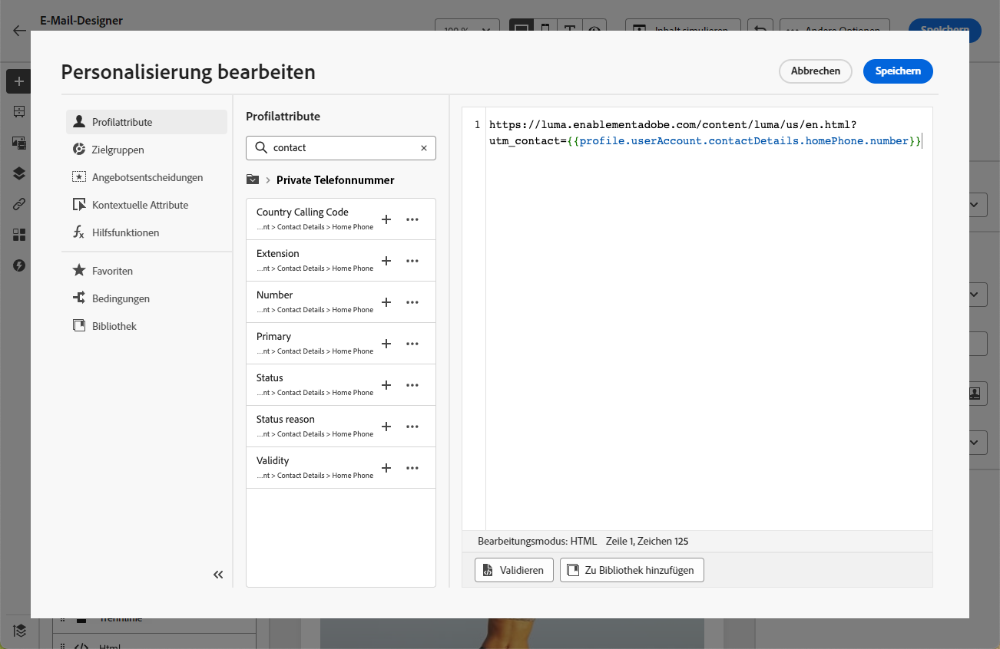

# Hinzufügen von Links und Verfolgen von Nachrichten {#tracking}

Verwenden Sie [!DNL Journey Optimizer], um Links zu Ihrem Inhalt hinzuzufügen und die gesendeten Nachrichten zu verfolgen, um das Verhalten Ihrer Empfänger zu überwachen.

## Tracking aktivieren {#enable-tracking}

Sie können das Tracking einer E-Mail-Nachricht aktivieren, indem Sie die Optionen **[!UICONTROL Geöffnete E-Mails]** und/oder **[!UICONTROL Klick in E-Mail]** markieren, wenn Sie Ihre Nachricht in einer Journey oder Kampagne erstellen.

>[!BEGINTABS]

>[!TAB Aktivieren des Trackings in einer Journey]

>[!TAB Aktivieren des Trackings in einer Kampagne]

>[!ENDTABS]

>[!NOTE]
>
>Beide Optionen sind standardmäßig aktiviert.

Auf diese Weise können Sie das folgende Verhalten Ihrer Empfänger verfolgen:

* **[!UICONTROL Geöffnete E-Mails]**: Nachrichten, die geöffnet wurden.
* **[!UICONTROL Klick in E-Mail]**: Klicks auf Links in einer E-Mail.

## Links einfügen {#insert-links}

Beim Entwerfen einer Nachricht können Sie Links zu Ihren Inhalten hinzufügen.

>[!NOTE]
>
>Wenn das [Tracking aktiviert ist](#enable-tracking), werden alle im Nachrichteninhalt enthaltenen Links verfolgt.

Gehen Sie wie folgt vor, um Links in Ihren E-Mail-Inhalt einzufügen:

1. Wählen Sie zuerst ein Element aus und danach in der kontextuellen Symbolleiste die Option **[!UICONTROL Link einfügen]**.

   

1. Wählen Sie den gewünschten Link-Typ aus.

   * **[!UICONTROL Externer Link]**: Fügen Sie einen Link auf eine externe URL ein.

   * **[!UICONTROL Landingpage]**: Fügen Sie einen Link zu einer Landingpage ein. [Weitere Informationen](../landing-pages/get-started-lp.md)

   * **[!UICONTROL Opt-out mit einem Klick]**: Einfügen eines Links, über den die Nutzerinnen und Nutzer Ihre Nachrichten schnell kündigen können, ohne den Kündigungsvorgang bestätigen zu müssen. [Weitere Informationen](email-opt-out.md#one-click-opt-out).

   * **[!UICONTROL Externes Opt-in/Abonnement]**: Einfügen eines Links, um den Erhalt von Nachrichten von Ihrer Marke zu akzeptieren.

   * **[!UICONTROL Externes Opt-out/Abmeldung]**: Einfügen eines Links, über den man sich vom Erhalt von Nachrichten Ihrer Marke abmelden kann. Weitere Informationen zur Opt-out-Verwaltung finden Sie in [diesem Abschnitt](email-opt-out.md#opt-out-management).

   * **[!UICONTROL Mirrorseite]**: Fügen Sie einen Link hinzu, um den E-Mail-Inhalt in einem Webbrowser anzuzeigen. [Weitere Informationen](#mirror-page)

1. Geben Sie die gewünschte URL in das entsprechende Feld ein oder wählen Sie eine Landingpage aus und definieren Sie die Link-Einstellungen und -Stile. [Weitere Informationen](#adjust-links)

   >[!NOTE]
   >
   >Zum Interpretieren von URLs hält sich [!DNL Journey Optimizer] an die URI-Syntax ([RFC 3986-Standard](https://datatracker.ietf.org/doc/html/rfc3986){target="_blank"}), sodass einige internationale Sonderzeichen in URLs unterbunden werden. Wenn beim Test- oder E-Mail-Versand ein Fehler im Zusammenhang mit einer URL zurückgegeben wird, die zu Ihrem Inhalt hinzugefügt wurde, können Sie für die Zeichenfolge eine URL-Codierung durchführen und so das Problem umgehen.

1. Sie können Ihre Links personalisieren. [Weitere Informationen](../personalization/personalization-syntax.md#perso-urls)

1. Speichern Sie Ihre Änderungen.

1. Sobald der Link erstellt ist, können Sie ihn in den Bereichen **[!UICONTROL Einstellungen]** und **[!UICONTROL Stile]** auf der rechten Seite noch ändern.

   

>[!NOTE]
>
>E-Mail-Nachrichten vom Typ Marketing müssen einen [Ausschluss-Link](../privacy/opt-out.md#opt-out-management) enthalten, der für Transaktionsnachrichten nicht erforderlich ist. Die Nachrichtenkategorie (**[!UICONTROL Marketing]** oder **[!UICONTROL Transaktion]**) wird bei der Erstellung der Nachricht in der [Kanaloberfläche](../configuration/channel-surfaces.md#email-type) definiert.

## Anpassen von Links {#adjust-links}

Sie können Ihre Links mithilfe der Bereiche **[!UICONTROL Einstellungen]** und **[!UICONTROL Stile]** auf der rechten Seite anpassen. Sie können einen Link unterstreichen, seine Farbe ändern und sein Ziel auswählen.

1. Wählen Sie in einer **[!UICONTROL Text]**-Komponente, in die ein Link eingefügt ist, Ihren Link aus.

1. Wählen Sie auf der Registerkarte **[!UICONTROL Einstellungen]** in der Dropdown-Liste **[!UICONTROL Ziel]** aus, wie Ihre Zielgruppe umgeleitet werden soll:

   * **[!UICONTROL None]**: öffnet den Link in demselben Frame, in dem er angeklickt wurde (Standardwert).
   * **[!UICONTROL Blank]**: öffnet den Link in einem neuen Fenster oder auf einer neuen Registerkarte.
   * **[!UICONTROL Self]**: öffnet den Link in demselben Frame, in dem er angeklickt wurde.
   * **[!UICONTROL Parent]**: öffnet den Link im übergeordneten Frame.
   * **[!UICONTROL Top]**: öffnet den Link im gesamten Fenster.

   

1. Markieren Sie **[!UICONTROL Link unterstreichen]**, damit der Titeltext Ihres Links unterstrichen wird.

   

1. Um die Farbe Ihres Links zu ändern, klicken Sie auf **[!UICONTROL Link-Farbe]** auf der Registerkarte **[!UICONTROL Stile]**.

   

1. Speichern Sie Ihre Änderungen.

## Link zu einer Mirrorseite {#mirror-page}

Bei der Mirrorseite handelt es sich um eine HTML-Seite, auf die online über einen Webbrowser zugegriffen werden kann. Der Inhalt entspricht dem Inhalt Ihrer E-Mail.

Um Ihrer E-Mail einen Link zu einer Mirrorseite hinzuzufügen, fügen Sie [einen Link](#insert-links) ein und wählen Sie **[!UICONTROL Mirrorseite]** als Link-Typ aus.

Die Mirrorseite wird automatisch erstellt.

>[!IMPORTANT]
>
>Links zu Mirror-Seiten werden automatisch generiert und können nicht bearbeitet werden. Sie enthalten alle verschlüsselten personalisierten Daten, die zum Rendern der ursprünglichen E-Mail erforderlich sind. Daher kann die Verwendung personalisierter Attribute mit großen Werten zu langen Mirror-Seiten-URLs führen, was verhindert, dass der Link in Webbrowsern mit einer begrenzten URL-Länge funktioniert.

Wenn die Empfänger nach dem Versand der E-Mail auf den Mirrorseiten-Link klicken, wird der Inhalt der E-Mail in ihrem Standard-Webbrowser angezeigt.

>[!NOTE]
>
>Im [Testversand](../content-management/proofs.md) an die Testprofile ist der Link zur Mirrorseite nicht aktiv. Er wird erst in den endgültigen Nachrichten aktiviert.

Die Aufbewahrungsfrist für eine Mirrorseite beträgt 60 Tage. Nach dieser Frist ist die Mirrorseite nicht mehr verfügbar.

## Tracking verwalten {#manage-tracking}

Mit [E-Mail-Designer](content-from-scratch.md) können Sie die verfolgten URLs verwalten, z. B. den Tracking-Typ für jeden Link bearbeiten.

1. Klicken Sie auf das Symbol **[!UICONTROL Links]** im linken Bereich, um die Liste aller URLs Ihres Inhalts, die verfolgt werden sollen, anzuzeigen.

   Diese Liste bietet einen guten Überblick und ermöglicht das Auffinden aller im E-Mail-Inhalt vorhandenen URLs.

1. Um einen Link zu bearbeiten, wählen Sie das entsprechende Stiftsymbol aus.

1. Sie können den **[!UICONTROL Tracking-Typ]** bei Bedarf ändern:

   

   Für jede verfolgte URL können Sie einen der folgenden Tracking-Modi festlegen:

   * **[!UICONTROL Verfolgt]**: Aktiviert das Tracking dieser URL.
   * **[!UICONTROL Opt-out]**: Diese URL wird als Opt-out- oder Abmelde-URL behandelt.
   * **[!UICONTROL Mirrorseite]**: Diese URL wird als Mirror-Seite behandelt.
   * **[!UICONTROL Nie]**: Das Tracking dieser URL wird nie aktiviert. <!--This information is saved: if the URL appears again in a future message, its tracking is automatically deactivated.-->

Das Reporting zu Öffnungen und Klicks ist im [Live-Bericht](../reports/live-report.md) und im [Globalen Bericht](../reports/global-report.md) verfügbar.

## URL-Tracking {#url-tracking}

Normalerweise wird das [URL-Tracking](email-settings.md#url-tracking) auf Oberflächenebene verwaltet, Profilattribute werden jedoch nicht unterstützt. Die einzige Möglichkeit hierfür besteht derzeit darin, URLs im E-Mail-Designer zu [personalisieren](../personalization/personalization-syntax.md#perso-urls).

Gehen Sie wie folgt vor, um Ihren Links personalisierte URL-Tracking-Parameter hinzuzufügen.

1. Wählen Sie einen Link aus und klicken Sie in der kontextbezogenen Symbolleiste auf **[!UICONTROL Link einfügen]**.

1. Wählen Sie das Personalisierungssymbol aus. Das Personalisierungssymbol ist nur für folgende Arten von Links verfügbar: **externer Link**, **Abmelde-Link** und **Ausschluss-Link**.

   

1. Fügen Sie den URL-Tracking-Parameter hinzu und wählen Sie im Ausdruckseditor das gewünschte Profilattribut aus.

   

1. Speichern Sie Ihre Änderungen.

1. Wiederholen Sie die obigen Schritte für jeden Link, dem Sie diesen Tracking-Parameter hinzufügen möchten.

Wenn die E-Mail gesendet wird, wird dieser Parameter nun automatisch an das Ende der URL angehängt. Sie können diesen Parameter dann in Web-Analysewerkzeugen oder in Leistungsberichten erfassen.

>[!NOTE]
>
>Um die endgültige URL zu überprüfen, können Sie einen [Testversand durchführen](../content-management/preview-test.md#send-proofs) und auf den Link im E-Mail-Inhalt klicken, sobald Sie die als Testversand vorgesehene Nachricht erhalten haben. Die URL sollte den Tracking-Parameter anzeigen. Im obigen Beispiel lautet die endgültige URL: <https://luma.enablementadobe.com/content/luma/us/en.html?utm_contact=profile.userAccount.contactDetails.homePhone.number>
