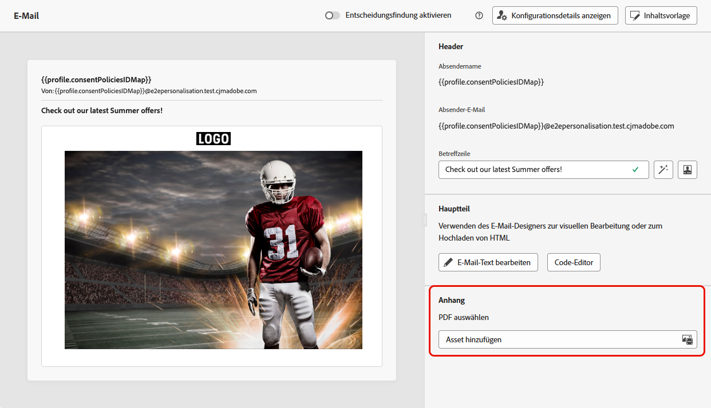
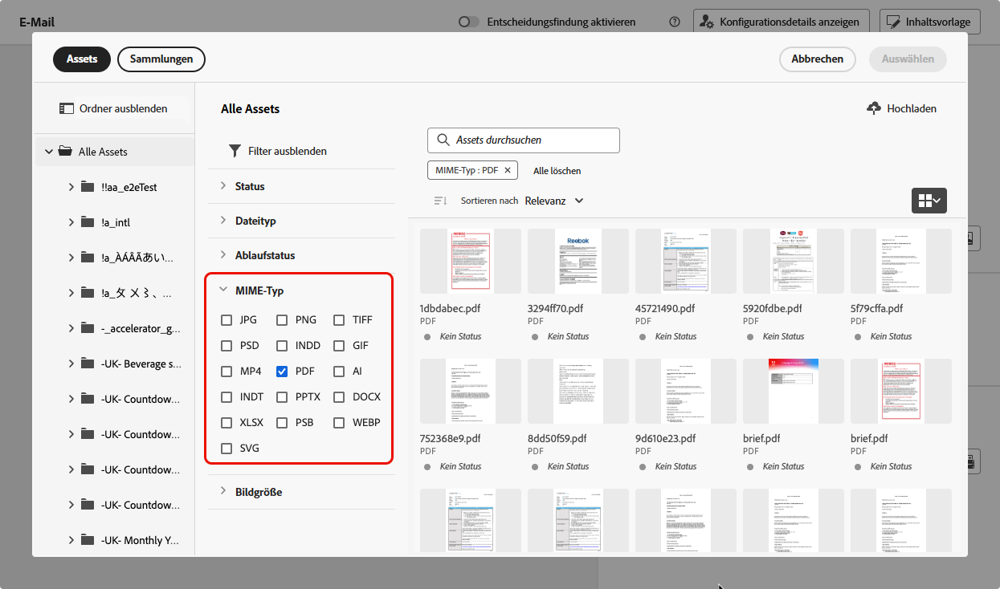
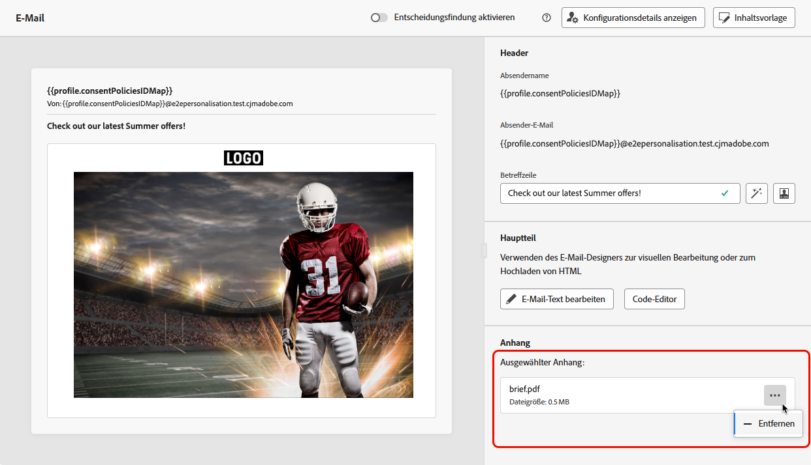

# Anhängen einer PDF-Datei an eine E-Mail {#pdf-attachments}

>[!CONTEXTUALHELP]
>id="ajo_pdf_attachments"
>title="Hinzufügen eines PDF-Anhangs"
>abstract="Wählen Sie eine PDF-Datei aus, die Sie an die E-Mail anhängen möchten. Pro Profil können pro Jahr bis zu 6 Nachrichten mit einem PDF-Anhang gesendet werden. Die maximale Dateigröße pro Anhang beträgt 5 MB. Für zusätzliche Größen oder Volumen können Sie ein Zusatzpaket für Anhänge erwerben. Weitere Informationen erhalten Sie beim Adobe-Support."

Sie können eine statische PDF-Datei an die E-Mail-Nachrichten anhängen, die Sie mit [!DNL Journey Optimizer] senden.

>[!IMPORTANT]
>
>* Pro Profil können pro Jahr bis zu 6 Nachrichten mit einem PDF-Anhang gesendet werden.
>
>* Die maximale Dateigröße pro Anhang beträgt 5 MB.
>
>Für zusätzliche Größen oder Volumen können Sie das Zusatzpaket für PDF-Anhänge erwerben. Weitere Informationen erhalten Sie beim Adobe-Support.

Gehen Sie wie folgt vor, um eine PDF-Datei an eine E-Mail-Nachricht anzuhängen.

1. Erstellen Sie eine E-Mail in einer Journey oder Kampagne. [Weitere Informationen](create-email.md)

1. Wählen Sie auf der Registerkarte **[!UICONTROL Inhalt]** der Journey oder Kampagne im Abschnitt **[!UICONTROL Anhang]** die Option **[!UICONTROL Asset hinzufügen]** aus.

   

1. Das Assets Essentials-Repository wird angezeigt.

   >[!NOTE]
   >
   >Beim Entwerfen von Nachrichten greifen Sie über die Journey Optimizer-Benutzeroberfläche direkt auf das Assets Essentials-Repository zu. Weitere Informationen zur eingebetteten [!DNL Assets Essentials]-Benutzeroberfläche finden Sie in der [Dokumentation zu Experience Manager Assets Essentials](https://experienceleague.adobe.com/docs/experience-manager-assets-essentials/help/introduction.html?lang=de){target="_blank"}.

1. Verwenden Sie den **[!UICONTROL PDF]**-Filter im Abschnitt **[!UICONTROL MIME-Typ]**, um die Auswahl auf das richtige Dateiformat zu beschränken.

   

   >[!NOTE]
   >
   >Für Anlagen ist nur das PDF-Format zulässig.

1. Wählen Sie die gewünschte Datei aus.

   * Sie können jeweils nur eine Datei auswählen.
   * Die maximale Dateigröße pro Anhang beträgt 5 MB.

1. Anschließend werden Name und Größe der ausgewählten Datei im Abschnitt **[!UICONTROL Anlage]** angezeigt.

   Sie können die ausgewählte Datei mithilfe des Symbols „Weitere Aktionen“ neben dem Dateinamen entfernen.

   

>[!NOTE]
>
>Wenn Sie Ihre Nachricht als [Inhaltsvorlage](../content-management/create-content-templates.md) speichern, wird der PDF-Anhang nicht in der Vorlage beibehalten. Wenn Sie eine neue E-Mail aus der gespeicherten Inhaltsvorlage erstellen, müssen Sie also die Datei erneut anhängen.
