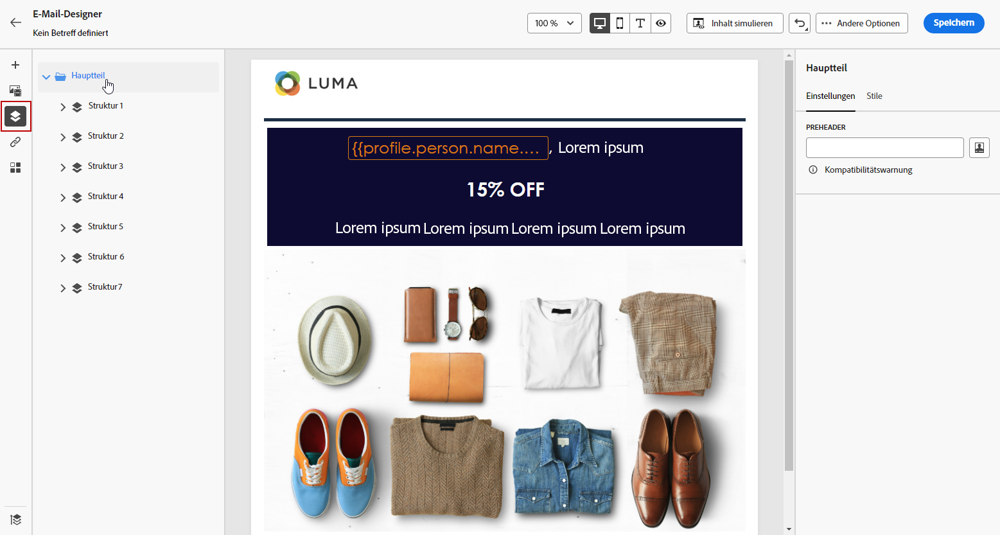
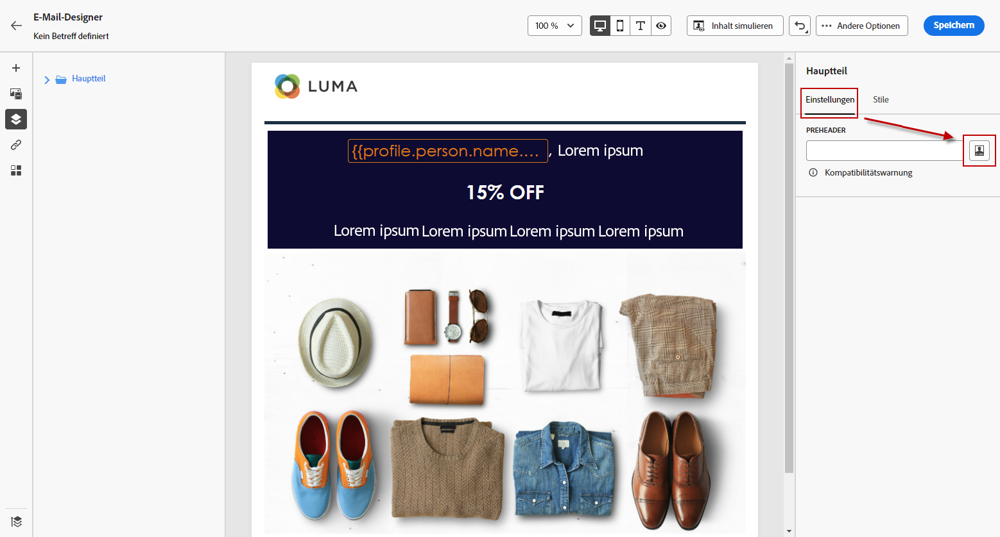
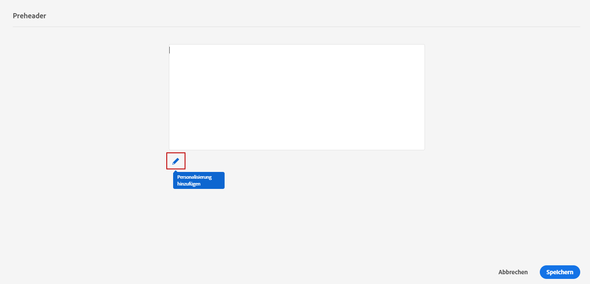
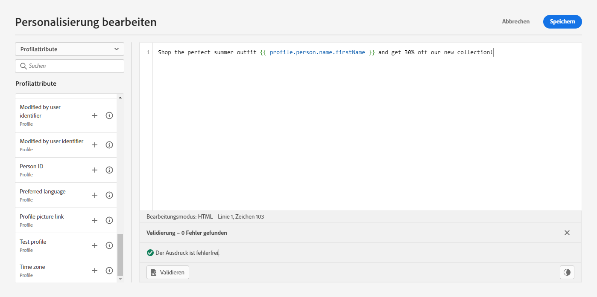

# Hinzufügen eines Preheaders {#preheader}

>[!CONTEXTUALHELP]
>id="ac_edition_preheader"
>title="Hinzufügen eines Preheaders"
>abstract="Ein Preheader ist ein kurzer zusammenfassender Text, der unter der Betreffzeile zu sehen ist, wenn Sie eine E-Mail in Ihrem E-Mail-Programm öffnen. In vielen Fällen bietet er eine kurze Zusammenfassung der E-Mail und besteht normalerweise aus einem Satz."

Ein Preheader ist ein kurzer zusammenfassender Text, der unter der Betreffzeile zu sehen ist, wenn Sie eine E-Mail in Ihrem E-Mail-Programm öffnen.

In vielen Fällen bietet er eine kurze Zusammenfassung der E-Mail und besteht normalerweise aus einem Satz.

>[!NOTE]
>
>Preheader werden nicht von allen E-Mail-Clients unterstützt. Wird der Preheader nicht unterstützt, wird er nicht angezeigt.

Gehen Sie wie folgt vor, um den Preheader einer E-Mail zu definieren:

1. Fügen Sie im E-Mail-Designer mindestens eine **[!UICONTROL Strukturkomponente]** hinzu, um Ihre E-Mail zu entwerfen.

1. Klicken Sie auf das Symbol **[!UICONTROL Navigationsstruktur]** im linken Bereich und wählen Sie **[!UICONTROL Textkörper]**.

   

1. Klicken Sie in **[!UICONTROL Texteinstellungen]** im rechten Bereich auf das Symbol „Bearbeiten“ neben dem Feld **[!UICONTROL Preheader]**, um Inhalte hinzuzufügen.

   

1. Fügen Sie Ihren Preheader hinzu. Sie können ihn weiter personalisieren, indem Sie auf das Symbol **[!UICONTROL Personalisierung hinzufügen]** klicken.

   

1. Im Fenster **[!UICONTROL Personalisierung bearbeiten]** können Sie **[!UICONTROL Inhaltsbausteine]**, **[!UICONTROL dynamische Inhalte]** oder **[!UICONTROL Personalisierungsfelder]** hinzufügen.

1. Klicken Sie auf **[!UICONTROL Validieren]**, um Ihre Personalisierungssyntax zu prüfen.

   

1. Klicken Sie auf **[!UICONTROL Speichern]**.

Ihr Preheader ist jetzt für Ihre E-Mail konfiguriert.
