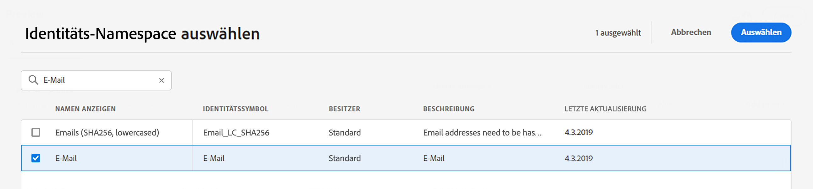
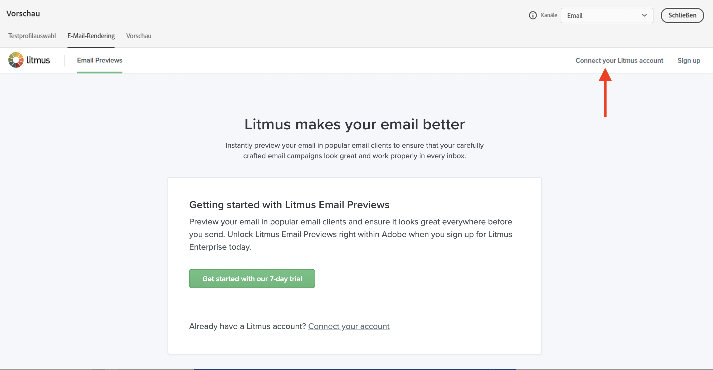

# Vorschau erstellen und Nachrichten testen {#preview-and-proof}

Sobald Ihr E-Mail-Inhalt definiert wurde, können Sie mithilfe von Testprofilen die Vorschau anzeigen und testen. Wenn Sie [personalisierter Inhalt](../personalization/personalize.md)können Sie mithilfe von Testprofildaten überprüfen, wie dieser Inhalt in der Nachricht angezeigt wird.

Um mögliche Fehler in E-Mail-Inhalten oder Personalisierungseinstellungen zu erkennen, senden Sie Testsendungen an Testprofile. Bei jeder Änderung sollte ein Testversand durchgeführt werden, um den aktuellen Inhalt zu validieren.

>[!CAUTION]
>
>Sie benötigen Testprofile, um Ihre Nachrichten in der Vorschau anzeigen und Testsendungen durchführen zu können.
>
>Erfahren Sie, wie Sie in Testprofile erstellen [diese Seite](../segment/creating-test-profiles.md).

Um Ihren E-Mail-Inhalt zu testen, gehen Sie folgendermaßen vor:

* [Testprofile auswählen](#select-test-profiles)
* [Überprüfen der Nachrichtenvorschau](#preview-your-messages)

Anschließend können Sie [Testsendungen durchführen](#send-proofs) zu Ihren Testprofilen hinzufügen.

Darüber hinaus nutzen Sie Ihre **Litmus** Konto [!DNL Journey Optimizer] sofort eine Vorschau Ihrer **E-Mail-Rendering** in beliebten E-Mail-Clients. Sie können dann sicherstellen, dass Ihr E-Mail-Inhalt in jedem Posteingang gut aussieht und ordnungsgemäß funktioniert. Erfahren Sie, wie Sie die Litmus-E-Mail-Vorschau in entsperren [diesem Abschnitt](#email-rendering).

>[!CAUTION]
>
>Bei der Vorschau einer Nachricht oder beim Versand von Testsendungen werden nur Personalisierungsdaten des Profils angezeigt. Personalisierung, die auf Kontextdaten wie Ereignisinformationen basiert, kann nur im Kontext einer Journey getestet werden. Erfahren Sie, wie Sie die Personalisierung testen können in [dieser Anwendungsfall](../personalization/personalization-use-case.md).

➡️ [In diesem Video erfahren Sie, wie Sie Ihre E-Mail in der Vorschau anzeigen und testen können.](#video-preview)

## Testprofile auswählen {#select-test-profiles}

>[!CONTEXTUALHELP]
>id="ac_preview_testprofiles"
>title="Vorschau erstellen und Nachrichten testen"
>abstract="Sobald der Nachrichteninhalt definiert wurde, können Sie mithilfe von Testprofilen die Vorschau anzeigen und testen."
>additional-url="https://experienceleague.adobe.com/docs/journey-optimizer/using/email/preview.html?lang=en#email-rendering" text="E-Mail-Rendering"
>additional-url="https://experienceleague.adobe.com/docs/journey-optimizer/using/email/preview.html?lang=en#preview-email" text="Vorschau"

Verwendung [Testprofile](../segment/creating-test-profiles.md) um zusätzliche Empfänger anzusprechen, die nicht den definierten Targeting-Kriterien entsprechen.

Gehen Sie wie folgt vor, um Testprofile auszuwählen:

1. Im [Inhalt bearbeiten](create-email.md#define-email-content) oder in Email Designer auf das **[!UICONTROL Simulate content]** -Schaltfläche, um auf die Auswahl des Testprofils zuzugreifen.

   

1. Auswählen **[!UICONTROL Manage test profiles]**.

   

1. Wählen Sie den Namespace aus, der zur Identifizierung von Testprofilen verwendet werden soll, indem Sie auf **[!UICONTROL Identity namespace]** Auswahlsymbol.

   

   Weitere Informationen zu Adobe Experience Platform-Identitäts-Namespaces [in diesem Abschnitt](../segment/get-started-identity.md).

   Im folgenden Beispiel verwenden wir die **Email** Namespace.

1. Suchen Sie mithilfe des Suchfelds den Namespace, wählen Sie ihn aus und klicken Sie auf **[!UICONTROL Select]**

   

1. Im **[!UICONTROL Identity value]** Geben Sie den Wert (hier die E-Mail-Adresse) ein, um das Testprofil zu identifizieren, und klicken Sie auf **[!UICONTROL Add profile]**.

   <!---->

1. Wenn Sie Ihrer Nachricht eine Personalisierung hinzugefügt haben, fügen Sie weitere Profile hinzu, damit Sie je nach Profildaten unterschiedliche Varianten der Nachricht testen können. Nach dem Hinzufügen werden Profile unter den ausgewählten Feldern aufgeführt.

   

   Basierend auf den Personalisierungselementen der Nachricht zeigt diese Liste Daten für jedes Testprofil in den zugehörigen Spalten an.

### Email preview {#preview-email}

Einmal [Testprofile](#select-test-profiles) ausgewählt sind, können Sie eine Vorschau Ihres E-Mail-Inhalts anzeigen. Gehen Sie wie folgt vor:

1. Im [Inhalt bearbeiten](create-email.md#define-email-content) oder in Email Designer auf das **[!UICONTROL Simulate content]** Schaltfläche.

1. Wählen Sie ein Testprofil aus. Sie können die in den Spalten verfügbaren Werte überprüfen. Verwenden Sie die Rechts-/Linkspfeile, um Daten zu durchsuchen.

   

   >[!NOTE]
   >
   >Um weitere Testprofile hinzuzufügen, wählen Sie **[!UICONTROL Manage test profiles]**. [Weitere Infos](#select-test-profiles)

1. Klicken Sie auf **[!UICONTROL Select data]** oberhalb der Liste, um Spalten hinzuzufügen oder zu entfernen.

   

   Am Ende der Liste werden die für die aktuelle Nachricht spezifischen Personalisierungsfelder angezeigt. In diesem Beispiel der Profilort, Vorname und Nachname. Wählen Sie diese Felder aus und stellen Sie sicher, dass diese Werte in Ihren Testprofilen enthalten sind.

1. In der Nachrichtenvorschau werden personalisierte Elemente durch die ausgewählten Testprofildaten ersetzt.

   Beispielsweise sind E-Mail-Inhalt und E-Mail-Betreff für diese Nachricht personalisiert:

   

1. Wählen Sie weitere Testprofile aus, um das E-Mail-Rendering für jede Variante Ihrer Nachricht in der Vorschau anzuzeigen.

## Testsendungen durchführen {#send-proofs}

Ein Testversand ist eine spezifische Nachricht, mit der Sie eine Nachricht testen können, bevor Sie sie an die Hauptzielgruppe senden. Die Empfänger des Testversands sind für die Validierung der Nachricht verantwortlich: Rendering, Inhalt, Personalisierungseinstellungen, Konfiguration.

Einmal [Testprofile](#select-test-profiles) ausgewählt sind, können Sie Testsendungen durchführen.

1. Im **[!UICONTROL Simulate]** auf das **[!UICONTROL Send proof]** Schaltfläche.

   

1. Aus dem **[!UICONTROL Send proof]** Fenster, E-Mail-Adresse des Empfängers eingeben und auf **[!UICONTROL Add]** den Testversand an sich selbst oder Mitglieder Ihrer Organisation zu senden.

   Beachten Sie, dass Sie bis zu zehn Empfänger für Ihren Testversand hinzufügen können.

   

1. Wählen Sie anschließend die **Testprofile** , die zur Personalisierung des Nachrichteninhalts verwendet wird.

   Jeder Empfänger des Testversands erhält so viele Nachrichten wie die Anzahl der ausgewählten Testprofile. Wenn Sie beispielsweise fünf Empfänger-E-Mails hinzugefügt und zehn Testprofile ausgewählt haben, senden Sie fünfzig Testversandnachrichten, von denen jeder Empfänger zehn erhält.

1. Sie können der Betreffzeile des Testversands bei Bedarf ein Präfix hinzufügen. Nur alphanumerische Zeichen und Sonderzeichen wie . - _ ( ) [ ] sind als Präfix für die Betreffzeile zulässig.

1. Klicken **[!UICONTROL Send proof]**.

   

1. Zurück im  **[!UICONTROL Simulate]** auf das  **[!UICONTROL View proofs]** -Schaltfläche, um den Status zu überprüfen.

   

Es wird empfohlen, nach jeder Änderung am Nachrichteninhalt Testsendungen durchzuführen.

>[!NOTE]
>
>Im gesendeten Testversand ist der Link zur Mirrorseite nicht aktiv. Sie wird nur in den endgültigen Nachrichten aktiviert.

## E-Mail-Rendering verwenden {#email-rendering}

Sie können Ihre **Litmus** Konto [!DNL Journey Optimizer] sofort eine Vorschau Ihrer **E-Mail-Rendering** in beliebten E-Mail-Clients.

Folgende Voraussetzungen müssen gegeben sein, um auf die E-Mail-Rendering-Funktionen zugreifen zu können:

* Sie haben ein Litmus-Konto
* [Testprofile auswählen](#select-test-profiles)

Gehen Sie dann wie folgt vor:

1. Im [Inhalt bearbeiten](create-email.md#define-email-content) oder in Email Designer auf das **[!UICONTROL Simulate content]** Schaltfläche.

1. Wählen Sie die **[!UICONTROL Render email]** Schaltfläche.

   

1. Klicken **Verbinden Ihres Litmus-Kontos** oben rechts.

   

1. Geben Sie Ihre Anmeldedaten ein und melden Sie sich an.

   

1. Klicken Sie auf **Ausführen eines Tests** Schaltfläche zum Generieren einer E-Mail-Vorschau.

1. Prüfen Sie Ihren E-Mail-Inhalt in bevorzugten Desktop-, Mobile- und Web-basierten Clients.

   

>[!CAUTION]
>
>Wenn Sie **Litmus** -Konto mit [!DNL Journey Optimizer], stimmen Sie zu, dass Testnachrichten an Litmus gesendet werden: Nach dem Versand werden diese E-Mails nicht mehr von Adobe verwaltet. Daher gilt die Litmus-E-Mail-Richtlinie zur Datenaufbewahrung für diese E-Mails, einschließlich der Personalisierungsdaten, die in diese Testnachrichten aufgenommen werden können.

## Anleitungsvideo {#video-preview}

Hier erfahren Sie, wie Sie das E-Mail-Rendering über Postfächer hinweg testen, wie Sie Ihre personalisierten E-Mails mit Testprofilen in der Vorschau anzeigen und Testsendungen durchführen können.

>[!VIDEO](https://video.tv.adobe.com/v/334239?quality=12)
