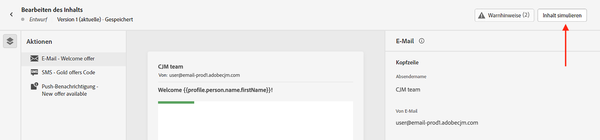
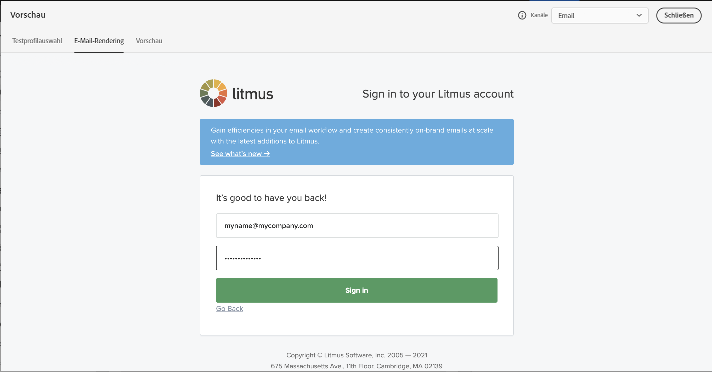

# Nachrichtenvorschau und Testversand {#preview-and-proof}

Sobald Ihr E-Mail-Inhalt definiert wurde, können Sie mithilfe von Testprofilen die Vorschau anzeigen und testen. Wenn Sie [personalisierte Inhalte](../personalization/personalize.md) eingefügt haben, können Sie überprüfen, wie diese Inhalte in der Nachricht angezeigt werden, indem Sie Testprofildaten verwenden.

Um mögliche Fehler in E-Mail-Inhalt oder bei Personalisierungseinstellungen zu erkennen, führen Sie einen Testversand an Testprofile durch. Bei jeder Änderung sollte ein Testversand durchgeführt werden, um den aktuellen Inhalt zu validieren.

>[!CAUTION]
>
>Um Ihre Nachrichten in der Vorschau darzustellen und einen Testversand durchzuführen, benötigen Sie Testprofile.
>
>Auf [dieser Seite](../segment/creating-test-profiles.md) erfahren Sie, wie Sie Testprofile erstellen.

Um Ihren E-Mail-Inhalt zu testen, gehen Sie folgendermaßen vor:

* [Auswählen der Testprofile](#select-test-profiles)
* [Überprüfen der Nachrichtenvorschau](#preview-your-messages)

Anschließend können Sie den [Testversand](#send-proofs) an Ihre Testprofile starten.

Nutzen Sie außerdem Ihr **Litmus**-Konto in [!DNL Journey Optimizer], um Ihr **E-Mail-Rendering** in gängigen E-Mail-Clients zu überprüfen. Auf diese Weise stellen Sie sicher, dass Ihr E-Mail-Inhalt in jedem Posteingang ansprechend aussieht und korrekt funktioniert. In [diesem Abschnitt](#email-rendering) erfahren Sie, wie Sie die Sperre für Litmus-E-Mail-Vorschauen aufheben.

>[!CAUTION]
>
>Bei der Vorschau einer Nachricht oder beim Versand von Testsendungen werden nur Profil-Personalisierungsdaten angezeigt. Personalisierung, die auf Kontextdaten wie Ereignisinformationen basiert, kann nur im Kontext einer Journey getestet werden. In [diesem Anwendungsbeispiel](../personalization/personalization-use-case.md) erfahren Sie, wie Sie die Personalisierung testen können.

➡️ [Erfahren Sie in diesem Video, wie Sie Ihre E-Mail in der Vorschau anzeigen und einen Testversand durchführen können](#video-preview).

## Auswählen der Testprofile {#select-test-profiles}

>[!CONTEXTUALHELP]
>id="ac_preview_testprofiles"
>title="Nachrichtenvorschau und Testversand"
>abstract="Sobald der Inhalt der Nachricht erstellt wurde, können Sie mithilfe von Testprofilen eine Vorschau erstellen und einen Testversand durchführen."
>additional-url="https://experienceleague.adobe.com/docs/journey-optimizer/using/messages/validate/preview.html?lang=de#email-rendering" text="E-Mail-Rendering"
>additional-url="https://experienceleague.adobe.com/docs/journey-optimizer/using/messages/validate/preview.html?lang=de#preview-your-messages" text="Vorschau"

Verwenden Sie [Testprofile](../segment/creating-test-profiles.md), um zusätzliche Empfänger anzusprechen, die nicht den definierten Zielgruppenbestimmungskriterien entsprechen.

Gehen Sie wie folgt vor, um die Testprofile auszuwählen:

1. Im [Inhalt bearbeiten](create-email.md#define-email-content) oder in Email Designer auf das **[!UICONTROL Inhalt simulieren]** -Schaltfläche, um auf die Auswahl des Testprofils zuzugreifen.

   

1. Auswählen **[!UICONTROL Verwalten von Testprofilen]**.

   

1. Wählen Sie den Namespace aus, der zur Identifizierung der Testprofile verwendet werden soll, indem Sie auf das Auswahlsymbol **[!UICONTROL Identitäts-Namespace]** klicken.

   

   Weitere Informationen zu Identitäts-Namespaces von Adobe Experience Platform finden Sie [in diesem Abschnitt](../segment/get-started-identity.md).

   Im folgenden Beispiel verwenden wir den Namespace **E-Mail**.

1. Verwenden Sie das Suchfeld, um den Namespace zu lokalisieren, wählen Sie ihn aus und klicken Sie auf **[!UICONTROL Auswählen]**

   

1. Im **[!UICONTROL Identitätswert]** Geben Sie den Wert (hier die E-Mail-Adresse) ein, um das Testprofil zu identifizieren, und klicken Sie auf **[!UICONTROL Profil hinzufügen]**.

   <!---->

1. Wenn Sie Ihrer Nachricht eine Personalisierung hinzugefügt haben, fügen Sie weitere Profile hinzu, damit Sie je nach Profildaten unterschiedliche Varianten der Nachricht testen können. Nach dem Hinzufügen werden Profile unter den ausgewählten Feldern aufgeführt.

   

   Basierend auf den Personalisierungselementen der Nachricht zeigt diese Liste Daten zu den einzelnen Testprofilen in den entsprechenden Spalten an.

### Vorschau einer E-Mail {#preview-email}

Einmal [Testprofile](#select-test-profiles) ausgewählt sind, können Sie eine Vorschau Ihres E-Mail-Inhalts anzeigen. Führen Sie dazu folgende Schritte durch:

1. Im [Inhalt bearbeiten](create-email.md#define-email-content) oder in Email Designer auf das **[!UICONTROL Inhalt simulieren]** Schaltfläche.

1. Wählen Sie ein Testprofil aus. Überprüfen Sie die in den Spalten aufgeführten Werte. Verwenden Sie die Pfeile nach rechts oder links, um Daten zu durchsuchen.

   

   >[!NOTE]
   >
   >Um weitere Testprofile hinzuzufügen, wählen Sie **[!UICONTROL Verwalten von Testprofilen]**. [Weitere Informationen](#select-test-profiles)

1. Klicken Sie auf das Symbol **[!UICONTROL Daten auswählen]** über der Liste, um Spalten hinzuzufügen oder zu entfernen.

   

   Am Ende der Liste sehen Sie Personalisierungsfelder für die aktuelle Nachricht. Bei diesem Beispiel sind dies Ort, Vorname und Nachname des Profils. Wählen Sie diese Felder aus und stellen Sie sicher, dass diese Werte in Ihren Testprofilen definiert sind.

1. In der Nachrichtenvorschau werden die personalisierten Elemente durch die Daten der ausgewählten Testprofile ersetzt.

   Bei dieser Nachricht werden beispielsweise E-Mail-Inhalt und E-Mail-Betreff personalisiert:

   

1. Wählen Sie für jede Nachrichtenvariante weitere Testprofile zum Rendern von E-Mail-Vorschauen aus.

## Durchführen eines Testversands {#send-proofs}

Ein Testversand dient der Validierung einer Nachricht, bevor sie an die wichtigste Audience gesendet wird. Die Empfänger des Testversands sind für die Überprüfung der Nachricht verantwortlich: Darstellung, Inhalt, Personalisierungseinstellungen, Konfiguration.

Sobald [Testprofile](#select-test-profiles) ausgewählt sind, können Sie den Testversand starten.

1. Im **[!UICONTROL Simulieren]** auf das **[!UICONTROL Testversand durchführen]** Schaltfläche.

   

1. Geben Sie im Fenster **[!UICONTROL Testversand starten]** die E-Mail-Adresse Ihres Empfängers ein und klicken Sie auf **[!UICONTROL Hinzufügen]**, um den Testversand an sich selbst oder Mitglieder Ihrer Organisation zu senden.

   Beachten Sie, dass Sie bis zu zehn Empfänger für Ihren Testversand hinzufügen können.

   

1. Wählen Sie anschließend die **Testprofile**, die zur Personalisierung des Nachrichteninhalts verwendet werden.

   Die Anzahl der Testversandnachrichten, die jeder Empfänger erhält, entspricht der Anzahl der ausgewählten Testprofile. Wenn Sie beispielsweise fünf Empfänger-E-Mails hinzugefügt und zehn Testprofile ausgewählt haben, senden Sie fünfzig Testversandnachrichten, von denen jeder Empfänger zehn erhält.

1. Bei Bedarf können Sie der Betreffzeile des Testversands ein Präfix hinzufügen. Nur alphanumerische Zeichen und Sonderzeichen wie . - _ ( ) [ ] sind als Präfix für die Betreffzeile zulässig.

1. Klicken Sie auf **[!UICONTROL Testversand durchführen]**.

   

1. Zurück im  **[!UICONTROL Simulieren]** auf das  **[!UICONTROL Testsendungen anzeigen]** -Schaltfläche, um den Status zu überprüfen.

   

Es wird empfohlen, nach jeder Änderung am Nachrichteninhalt Testsendungen durchzuführen.

>[!NOTE]
>
>Im gesendeten Testversand ist der Link zur Mirrorseite nicht aktiv. Er wird erst in den endgültigen Nachrichten aktiviert.

## E-Mail-Rendering verwenden {#email-rendering}

Nutzen Sie Ihr **Litmus**-Konto in [!DNL Journey Optimizer], um das **E-Mail-Rendering** in populären E-Mail-Clients zu überprüfen.

Um die Rendering-Funktionen für E-Mails zu nutzen, müssen Sie

* ein Litmus-Konto besitzen
* [Auswählen der Testprofile](#select-test-profiles)

Anschließend gehen Sie wie folgt vor:

1. Im [Inhalt bearbeiten](create-email.md#define-email-content) oder in Email Designer auf das **[!UICONTROL Inhalt simulieren]** Schaltfläche.

1. Wählen Sie die **[!UICONTROL E-Mail rendern]** Schaltfläche.

   

1. Klicken Sie auf **Verbinden Sie Ihr Litmus-Konto** im oberen rechten Bereich.

   

1. Geben Sie Ihre Anmeldedaten ein und melden Sie sich an.

   

1. Klicken Sie auf die Schaltfläche **Test ausführen**, um E-Mail-Vorschauen zu generieren.

1. Prüfen Sie Ihren E-Mail-Inhalt auf gängigen Clients für Desktop, mobile Geräte und Web.

   

>[!CAUTION]
>
>Durch die Verknüpfung Ihres **Litmus**-Kontos mit [!DNL Journey Optimizer] erteilen Sie Ihr Einverständnis, dass Testmeldungen an Litmus gesendet werden: Nach dem Versand werden diese E-Mails nicht mehr von Adobe verwaltet. Dementsprechend gelten für diese E-Mails die Litmus-Richtlinien zur Datenspeicherung, einschließlich der Personalisierungsdaten, die in diesen Testnachrichten enthalten sein können.

## Anleitungsvideo {#video-preview}

Hier erfahren Sie, wie Sie das E-Mail-Rendering über Postfächer hinweg testen, wie Sie Ihre personalisierten E-Mails mit Testprofilen in der Vorschau anzeigen und Testsendungen durchführen können.

>[!VIDEO](https://video.tv.adobe.com/v/334239?quality=12)
