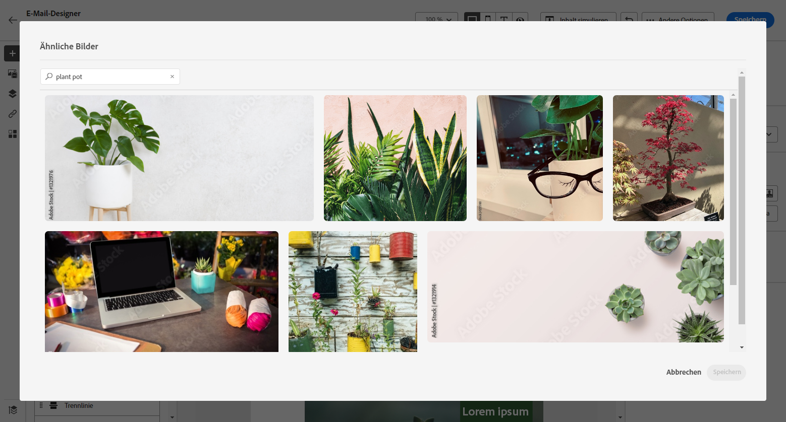
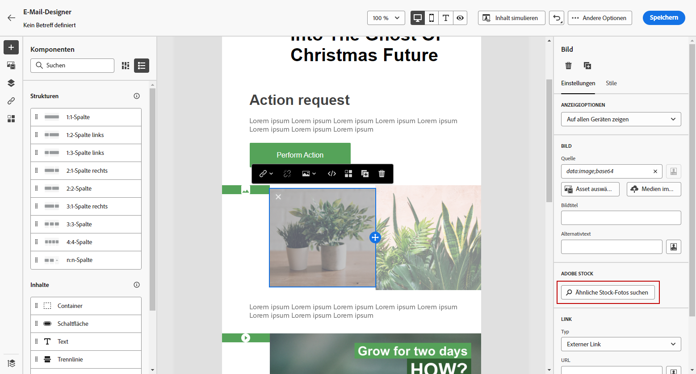
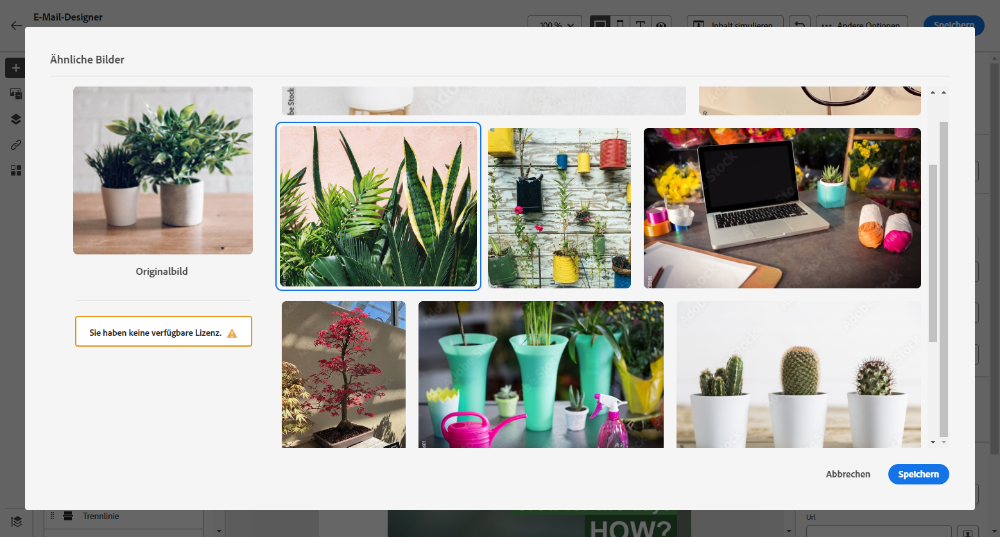
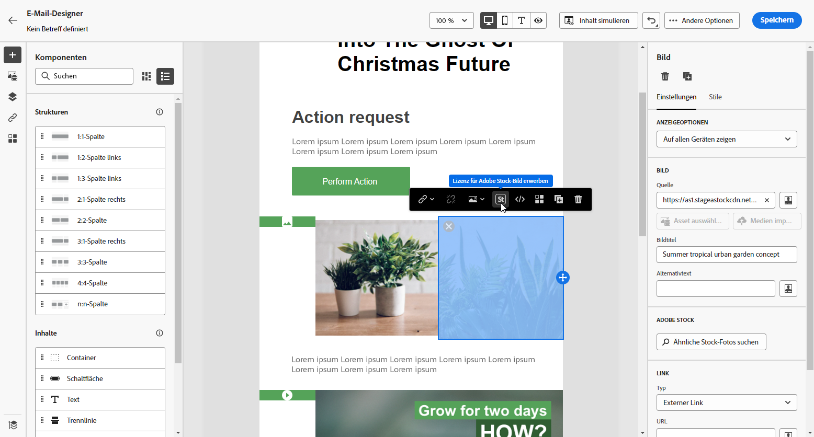
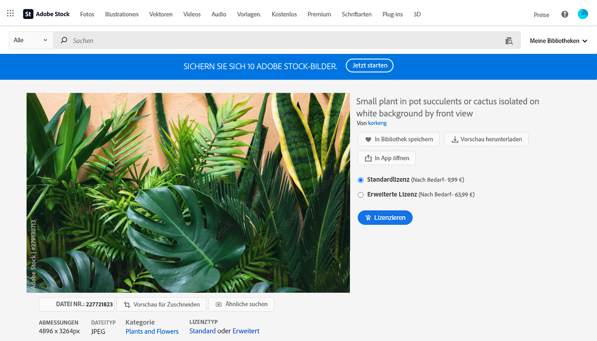
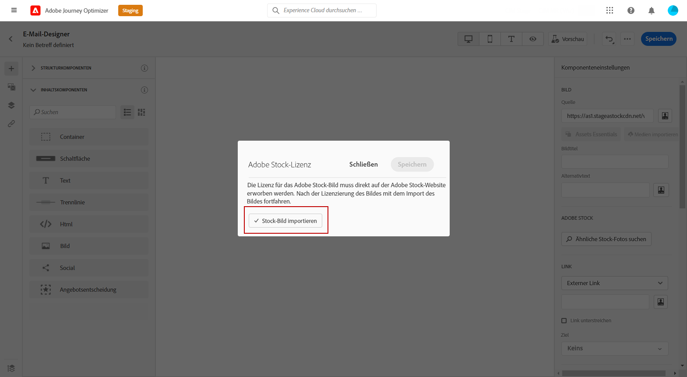

# Arbeiten mit [!DNL Adobe Stock]-Bildern {#stock}

## Erste Schritte mit [!DNL Adobe Stock] {#get-started-stock}

Das Plug-in für die Integration von Email Designer mit [!DNL Adobe Stock] und [!DNL Adobe Journey Optimizer] bietet Kunden und Kundinnen eine einfache Möglichkeit, zur Nachrichtenerstellung durch Bilder zu navigieren, sie zu lizenzieren und sie zu speichern.

[Adobe Stock](https://helpx.adobe.com/stock/get-started.html){target=&quot;_blank&quot;} bietet Zugriff auf Millionen von hochwertigen, kuratierten, lizenzfreien Fotos, Videos, Illustrationen und Vektorgrafiken. Sie können ein Credit-Pack erwerben, um Assets zu lizenzieren, oder nur eine Standard- oder erweiterte Lizenz für das benötigte Asset erwerben. Adobe Stock bietet außerdem eine kostenlose Sammlung von Assets.

Mit [!DNL Adobe Journey Optimizer] können Sie Bilder direkt aus [!DNL Adobe Stock] in Ihre E-Mails hochladen und mit der Option **[!UICONTROL Adobe Stock-Fotos suchen]** zu Ihrem Ordner **[!UICONTROL Assets]** hinzufügen. Darüber hinaus hilft Ihnen die Option **[!UICONTROL Ähnliche Stockfotos suchen]**, Bilder zu finden, die in Inhalt, Farbe und Komposition dem in Ihrem Versand verwendeten Asset entsprechen.

## Berechtigungen{#stock-permissions}

Die Optionen **[!UICONTROL Adobe Stock-Fotos suchen]** und **[!UICONTROL Ähnliches Bild suchen]** stehen Benutzenden zur Verfügung, die Zugriff auf ein AEM Assets Essentials-Produktprofil haben.

Mehr dazu finden Sie in der [Dokumentation zu Assets Essentials](https://experienceleague.adobe.com/docs/experience-manager-assets-essentials/help/get-started-admins/deploy-administer.html?lang=de#add-users-to-essentials){target=&quot;_blank&quot;}.

## Einfügen eines Bildes aus [!DNL Adobe Stock] {#add-stock-image}

Gehen Sie wie folgt vor, um Bilder aus [!DNL Adobe Stock] zu Ihrem Inhalt hinzuzufügen:

1. Ziehen Sie per Drag-and-Drop aus dem Abschnitt **[!UICONTROL Inhaltskomponenten]** des Email Designers ein **Bild** in den Arbeitsbereich.

1. Klicken Sie auf der linken Seite im Email Designer auf **[!UICONTROL Adobe Stock-Fotos suchen]**.

   

1. Blättern Sie in der Bibliothek oder geben Sie einen Begriff in das Suchfeld ein.

   

1. Wählen Sie das gewünschte Bild aus und klicken Sie auf **[!UICONTROL Speichern]**.

   Wenn das ausgewählte Bild nicht lizenziert ist, müssen Sie [die Lizenz abrufen](#license-stock-image).

## Suchen nach ähnlichen Fotos {#similar-stock-image}

Sie können jedes vorhandene Bild in Ihrem E-Mail-Inhalt durch ein Foto aus [!DNL Adobe Stock] ersetzen. Beachten Sie, dass diese Option für alle Bilder verfügbar ist: lizenzierte/unlizenzierte Stock-Bilder und Bilder aus Ihrem Assets-Ordner.

Gehen Sie wie folgt vor, um ähnliche Fotos zu suchen:

1. Wählen Sie das zu ersetzende Bild aus.
1. Klicken Sie auf die Schaltfläche **[!UICONTROL Ähnliche Stock-Fotos suchen]**, um Assets in [!DNL Adobe Stock] anzuzeigen, die mit Inhalt, Farbe und Komposition des Bildes übereinstimmen.

   

1. Wählen Sie das gewünschte Bild aus und klicken Sie auf **[!UICONTROL Speichern]**.

   

   Wenn das ausgewählte Bild nicht lizenziert ist, müssen Sie [die Lizenz abrufen](#license-stock-image).

1. Passen Sie Ihr Bild bei Bedarf über das Menü **[!UICONTROL Komponenteneinstellungen]** an. [Weitere Informationen zu Komponenteneinstellungen](content-components.md).

## Abrufen der Lizenz von [!DNL Adobe Stock] {#license-stock-image}

Wenn Sie bereits über eine Lizenz für Ihr Bild verfügen, wird dies durch das -Symbol dargestellt. Ist dies nicht der Fall, müssen Sie eine Lizenz dafür anfordern.

Gehen Sie wie folgt vor, um Ihr Bild zu lizenzieren und herunterzuladen:

1. Wählen Sie es aus und klicken Sie auf das Symbol **[!UICONTROL Adobe Stock-Bild lizenzieren]**.

   

   Sie werden dann auf die [!DNL Adobe Stock]-Website weitergeleitet, um die Lizenz zu kaufen.

   

1. Sie müssen Ihr Asset auf der [!DNL Adobe Stock]-Website erwerben, damit Sie das Bild herunterladen und das Wasserzeichen entfernen können.

   Dieser Kauf hängt von Ihrem Adobe Stock-Plan oder -Abonnement ab. Beachten Sie, dass Sie, wenn Sie mehrere Adobe Stock-Konten haben, zur zuletzt verwendeten Stock-ID weitergeleitet werden. Vergewissern Sie sich in diesem Fall, dass Sie mit dem richtigen Konto angemeldet sind, bevor Sie Ihr Asset lizenzieren.

   Weitere Informationen zu Adobe Stock-Plänen und -Preisen finden Sie in der [Dokumentation zu Adobe Stock](https://stock.adobe.com/de/plans){target=&quot;_blank&quot;}.

   >[!WARNING]
   > Wird eine E-Mail mit einem nicht lizenzierten Bild versandt, bleibt das Bild in seiner nicht lizenzierten Form mit dem Wasserzeichen erhalten.

1. Sobald der Kauf abgeschlossen ist, können Sie zu Ihrer E-Mail in [!DNL Adobe Journey Optimizer] zurückkehren und **[!UICONTROL Stock-Bild importieren]** auswählen, um das lizenzierte Bild in Ihre Assets zu importieren.

   

1. Wählen Sie aus, in welchem Ordner Sie Ihr Asset speichern möchten. Weiterführende Informationen zu [!DNL Assets Essentials] finden Sie auf dieser [Seite](assets-essentials.md#get-started-assets-essentials).

## Verwandte Themen{#stock-related-topics}

* [Gestalten von E-Mails in Journey Optimizer](get-started-email-design.md)
* [Komponenteneinstellungen für den E-Mail-Entwurf](content-components.md)
* [Adobe Stock – Erste Schritte](https://helpx.adobe.com/stock/get-started.html){target=&quot;_blank&quot;}.

