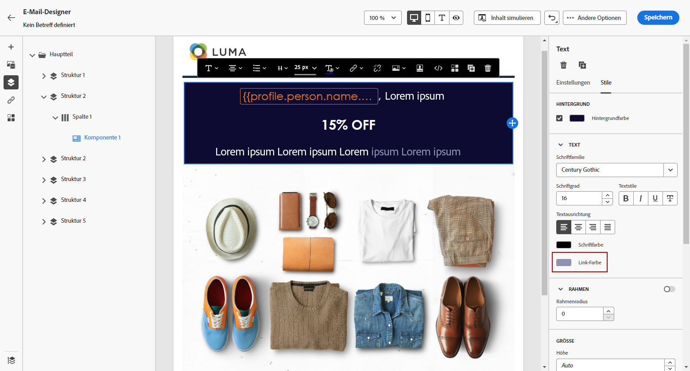

# Definieren eines Stils für Links {#styling-links}

Sie können einen Link unterstreichen und in E-Mail-Designer dessen Farbe und Ziel auswählen.

1. Wählen Sie Ihren Link in einer **[!UICONTROL Textinhaltskomponente]** aus, in die ein Link eingefügt wird.

1. Wählen Sie auf der Registerkarte **[!UICONTROL Einstellungen]** in der Dropdown-Liste **[!UICONTROL Ziel]** aus, wie Ihre Audience umgeleitet werden soll:

   * **[!UICONTROL None]**: öffnet den Link in demselben Frame, in dem er angeklickt wurde (Standardwert).
   * **[!UICONTROL Blank]**: öffnet den Link in einem neuen Fenster oder auf einer neuen Registerkarte.
   * **[!UICONTROL Self]**: öffnet den Link in demselben Frame, in dem er angeklickt wurde.
   * **[!UICONTROL Parent]**: öffnet den Link im übergeordneten Frame.
   * **[!UICONTROL Top]**: öffnet den Link im gesamten Fenster.

   

1. Markieren Sie **[!UICONTROL Link unterstreichen]**, damit der Titeltext Ihres Links unterstrichen wird.

   

1. Um die Farbe Ihres Links zu ändern, klicken Sie auf **[!UICONTROL Link-Farbe]** auf der Registerkarte **[!UICONTROL Stile]**.

   

1. Speichern Sie Ihre Änderungen.
